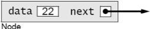
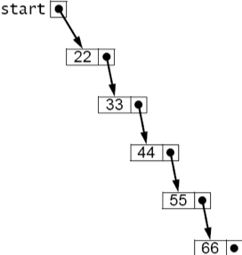
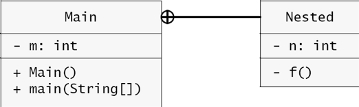
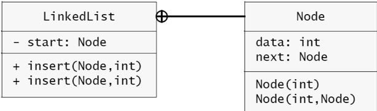

= 연결 데이터 구조

**배열은**

. 졍렬되지 않은 시퀀스에서 잘 작동
. 순서가 거의 변하지 않는 경우에는 순서가 있는 시퀀스에 대해서도 잘 작동
. 빠른 삽입과 삭제를 허용하는 **정렬된 목록 유지에는 부적합**

== 정렬된 배열 유지하기

=== 예제. 정렬된 배열에 삽입하기

* 크기가 정해지지 않은 배열에 n개의 요소가 정렬되어 있을 경우, 새로운 데이터 x 삽입

[source,java]
----
import java.util.Random;

public class Example3_1 {
    static void insert(int[] a, int n, int x) {
        int i = 0;

        while (i < n && a[i] <= x) {
            ++i;
        }

        System.arraycopy(a, i, a, i + 1, n - i);
        a[i] = x;
    }

    public static void main(String[] args) {
        int[] a = new int[10];
        Random random = new Random();

        for (int i = 0; i < a.length; i++) {
            int x = random.nextInt(100);
            System.out.print(toString(a) + " + " + x);
            insert(a, i, x);
            System.out.println(" = " + toString(a));
        }
    }
}

----

. x는 조건에 맞는 자리에 삽입되는가?
. x를 삽입하기 위해 어떠한 일들이 수행되는가?
. 정렬된 배열에 새로운 요소를 넣는다는 것은 시스템 자원 활용에서 어떠한 의미를 가지는가?
. 위 코드는 요소 삽입에 대한 간단한 예를 보여 준 것이다. 코드에서 고려되지 않은 문제점들은?

**System.arraycopy**

* 배열의 특정 위치에서 지정된 갯수만큼을 다른 배열의 지정된 위치로 복사하는 과정 수행

[source,java]
----
System.arraycopy(a, 1, a, 2, 3);
----

[.text-center]
Figure 3.1 Making room for the new element

=== 문제 3-1. arraycopy를 만들어 보자.

System.arraycopy와 동일한 함수를 만들고, 다음의 코드가 정상적으로 수행되는지 확인해 보자.

[source,java]
----
package example;

import java.util.Arrays;

public class Problem3_1 {
    static void arraycopy(int[] src, int srcPos, int[] dest, int destPos, int length) {
        //...
    }

    public static void main(String[] args) {
        int[] a = { 0, 1, 2, 3, 4, 5, 6, 7, 8, 9 };
        int[] b = a.clone();

        System.out.println("a : " + Arrays.toString(a));
        System.out.println("b : " + Arrays.toString(b));
        System.out.println("Arrays.equals(a, b) = " + Arrays.equals(a, b));
        arraycopy(a, 1, a, 3, 5);
        System.arraycopy(b, 1, b, 3, 5);
        System.out.println("a : " + Arrays.toString(a));
        System.out.println("b : " + Arrays.toString(b));
        System.out.println("Arrays.equals(a, b) = " + Arrays.equals(a, b));
        arraycopy(a, 4, a, 1, 5);
        System.arraycopy(b, 4, b, 1, 5);
        System.out.println("a : " + Arrays.toString(a));
        System.out.println("b : " + Arrays.toString(b));
        System.out.println("Arrays.equals(a, b) = " + Arrays.equals(a, b));
    }
}
----

결과는 아래와 같다.

[source,console]
----
a : [0, 1, 2, 3, 4, 5, 6, 7, 8, 9]
b : [0, 1, 2, 3, 4, 5, 6, 7, 8, 9]
Arrays.equals(a, b) = true
a : [0, 1, 2, 1, 2, 3, 4, 5, 8, 9]
b : [0, 1, 2, 1, 2, 3, 4, 5, 8, 9]
Arrays.equals(a, b) = true
a : [0, 2, 3, 4, 5, 8, 4, 5, 8, 9]
b : [0, 2, 3, 4, 5, 8, 4, 5, 8, 9]
Arrays.equals(a, b) = true
----

**고려 사항**

* 원본 배열과 대상 배열이 같은 것인가?
* 원본 배열 내에서만 복사가 이루어 질 경우, 고려해야할 사항은?
** 기존 데이터는 보존이 되는가?
* 동일한 배열에서의 복사에서 순서를 고려하지 않는다면?
+
image::./images/problem3_1_2.svg[align=center]
[.text-center]
**같은 배열에서의 순차적 요소 복사에 따른 오류**
** 앞에서 뒤로? 뒤에서 앞으로?
+

[.text-center]
**같은 배열에서의 순차적 요소 복사**

== 간접 참조

* 배열에서의 데이터 이동 문제 해결을 위해 보조 인덱스 배열 사용

=== 인덱스 배열

* 인덱스를 위한 추가 공간 소모와 코드의 복잡성이 추가되지만, 요소들의 이동을 줄여 효율적일 것으로 예상
* 인덱스를 이용한 배열의 정렬
+
image::./images/figure3_4.svg[Using an index array,align=center]
[.text-center]
**인덱스 배열 사용**

==== 예제 3-2. 인덱스 배열을 작성하고, 테스트해보자.

[source,java]
----
void insert(int x) {
    int i = 0;
    while (i < k.length && k[i] != 0 && a[k[i]] < x) {
        i++;
    }

    if (free < a.length && i < k.length) {
        System.arraycopy(k, i, k, i + 1, length - i);
        a[free] = x;
        k[i] = free++;
        length++;
    }
}
----

. 새로운 요소 추가시 요소 배열의 이동 문제가 개선 되었나?
. 추가되거나 변경된 문제는 없나?

=== 향상된 인덱스 배열

* 인덱스 배열 적용시 요소 이동은 개선
* 요소 배열 a에는 이동이 없지만, 인덱스 배열 k는 이전과 동일하게 이전 문제 발생
* 인덱스 배열 k의 위치는 데이터 배열 a의 위치와 동일하고, k에는 다음 요소의 위치 저장

image::./images/figure3_5.svg[Using an index array,align=center]
[.text-center]
**Figure 3.5 Using an index array**

=== 향상된 인덱스 배열에서의 요소 삽입

* 배열에서 추가될 요소 위치 검색(앞 요소와 다음에 위치할 요소)
* 비워져 있는 데이터 배열에 요소 저장
* 인덱스 배열에서 데이터 배열과 동일한 위치에 다음에 위치할 요소 인덱스 저장
* 검색된 앞 요소의 인덱스 배열 값을 새롭게 추가된 요소의 인덱스로 변경

image::./images/figure3_6.svg[Inserting an element,align=center]
[.text-center]
**Figure 3.6 Inserting an element**

=== 문제  3.2 향상된 인덱스 배열 방식을 이용하는 배열 정렬에서 새로운 요소를 추가해 보자.

* 인덱스 배열에서 새로운 요소가 추가될 위치 검색
** k[i]는 다음 요소의 위치를 나타내며, a[k[i]]가 삽입될 요소보다 큰 수이거나 마지막이 될때까지 검색
* 요소 배열에서 free가 지시하는 위치에 새로운 요소 추가
** 인덱스 배열에서 새로운 요소가 들어가 위치(k[free])에는 k[i]로 대치되고,
** k[i]에는 free 인덱스로 설정됨

결과는 아래와 같다.

[source,console]
----
[] + 21 = [21]
[21] + 20 = [20, 21]
[20, 21] + 13 = [13, 20, 21]
[13, 20, 21] + 21 = [13, 20, 21, 21]
[13, 20, 21, 21] + 83 = [13, 20, 21, 21, 83]
[13, 20, 21, 21, 83] + 19 = [13, 19, 20, 21, 21, 83]
[13, 19, 20, 21, 21, 83] + 69 = [13, 19, 20, 21, 21, 69, 83]
[13, 19, 20, 21, 21, 69, 83] + 21 = [13, 19, 20, 21, 21, 21, 69, 83]
[13, 19, 20, 21, 21, 21, 69, 83] + 50 = [13, 19, 20, 21, 21, 21, 50, 69, 83]
[13, 19, 20, 21, 21, 21, 50, 69, 83] + 69 = [13, 19, 20, 21, 21, 21, 50, 69, 69, 83]
----

== 링크드 노드

* 요소 배열과 인덱스 배열에서 요소와 인덱스는 같은 위치
* 요소와 인덱스를 쌍으로 가질 경우, 배열은 다음과 같이 생성됨.
+

[.text-center]
**같은 배열내에 요소와 인덱스 저장**
* 요소와 인덱스를 같은 배열내에 저장하기 위해서는 클래스 정의
+
[source,java]
----
Node[] a = new Node[size];
----
* Node는 요소와 다음 요소가 있는 node의 인덱스를 쌍으로 가짐

=== Node class

* 가장 간단한 Node 클래스
+
[source,java]
----
class Node {
    int data;
    int next;
}
----
* 노드에 데이터와 다음 데이터를 가지는 노드의 인덱스 포함

==== 문제 3.3 Node class를 이용해 배열을 생성하고, 정렬시 데이터 이동이 최소화되는 배열을 구현하라.

* 문제 3.2와 유사

결과는 다음과 같다.

=== 메모리를 무한 크기의 Node 배열로 본다면?

* 메모리를 무한 크기의 Node 배열로 볼때, 다음 Node를 지시하는 next는 다음 Node의 주소로 볼 수 있음
* 자바에서 reference type은 실제 object가 저장되어 있는 메모리를 지시함
* 그렇다면? next는 다음 Node object를 지시하는 변수가 될 수 있지 않을까?

=== 자기 참조적 노드 클래스(Self-referential Node class)

* 다음 노드의 인덱스 대신 객체 참조
* Node class는 자기 참조적(self-referential )
* Node class에서 저장되는 데이터는 int 이지만, 자바의 특징(Generics)을 이용하면 모든 타입으로 확장 가능

[source,java]
----
class Node {
    int data;
    Node next;

    public Node(int data) {
        this.data = data;
    }
}
----

[.text-center]
**Node object**

==== 연결 리스트 구축하기

[source,java]
----
Node start = new Node(22);
start.next = new Node(33);
start.next.next = new Node(44);
start.next.next.next = new Node(55);
start.next.next.next.next = new Node(66);
----

* 1번 라인에서 생성된 node는 아래 그림과 같음
+

[.text-center]
**Initializing start**
* 2번 라인에서 생성된 node를 첫번째 노드의 next에 연결하면 아래 그림과 같음
+

[.text-center]
**Adding a node**
* 5번 라인까지 수행한 결과는 아래 그림과 같음
+

[.text-center]
**The five-node list**

====  참조를 이용한 연결 리스트 구축

* 앞서는 start를 기준으로 작성한 반면, 참조 변수를 이용해 구

[source,java]
----
start = new Node(22);
Node p=start;성
p.next = new Node(33);
p = p.next;
p.next = new Node(44);
p = p.next;
p.next = new Node(55);
p = p.next;
p.next = new Node(66);
----

=== 반복문을 이용한 구성

[source,java]
----
Node start = new Node(22), p = start;
for (int i=0; i<4; i++) {
    p = p.next = new Node(33+11*i);
}
----

==== 예제 3.3 Node 클래스를 이용해 리스트를 생성하고, 반복문을 이용해 출력해 보자.

[source,java]
----
1	public class TestNode {
2	    public static void main(String[] args) {
3	        Node start = new Node(22);
4	        Node p = start;
5	        for (int i = 1; i < 5; i++) {
6	            p = p.next = new Node(22 + 11*i);
7	        }
8	        for (p = start; p != null; p = p.next)	{
9	            System.out.println(p.data);
10	        }
11	        for (p = start; p != null; p = p.next)	{
12	            System.out.println(p);
13	        }
14	    }
15	}
16
17	class Node {
18	    int data;
19	    Node next;
20	    Node(int data) {
21	        this.data = data;
22	    }
23	}
----

출력은 아래와 같습니다.

[source,console]
----
22
33
44
55
66
Node@7182c1
Node@3f5d07
Node@f4a24a
Node@cac268
Node@a16869
----

== 연결 리스트에 요소 삽입

* Node 클래스를 이용해 리스트 생성
+
image::./images/figure3_17.svg[The five Node objects,align=center]
* 두 개의 생성자를 가진 Node 클래스
+
[source,java]
----
class Node {
    int data;
    Node next;

    Node(int data) {
        this.data = data;
    }

    Node(int data, Node next) {
        this.data = data;
        this.next = next;
    }
}
----
* 두개의 인수를 받는 생성자 호출
+
image::./images/figure3_18.svg[두개의 인수를 받는 생성자 호출,align=center]
* 정수로 이루어진 비어 있지 않은 정렬된 연결 리스트에 삽입
+
[source,java]
----
include::./example/Example3_3.java[lines=18..28]
----
image::./images/figure3_19.svg[Inserting into a nonempty sorted linked list,align=center]
* 새로운 노드 삽입
+
[source,java]
----
Node q = new Node(x); q.next = p.next; p.next = q;
----
image::./images/figure3_20.svg[Inserting the new node in three steps,align=center]
* 새로운 노드 삽입(두개의 인수를 받는 생성자 이용)
+
[source,java]
----
p.next = new Node(x, p.next);
----
* 새로운 요소 삽입시 발생할 수 있는 오류
+
[source,java]
----
insert(start, 20)
----
image::./images/figure3_21.svg[Inserting 20 incorrectly,align=center]
[.text-center]
**Figure 3.21 Inserting 20 incorrectly**

== 리스트의 맨 앞에 삽입하기

* 앞서 코드의 오류
** 아무런 요소가 없는 경우, null 의 next 참조
** 새로운 노드는 첫번째 다음부터 추가 가능

* 시작 노드 변경 필요
** 리스트에 요소가 없을 경우
+
[source,java]
----
start = new Node(x);
----
** 새로운 요소가 가장 앞에 위치해야 할 경우
+
image::./images/figure3_22.svg[Inserting 20 correctly,align=center]

==== 문제 3.4. 리스트에 새로운 요소 삽입시 발생할 수 있는 문제점을 고려하여 insert() 메소드를 수정하고, 테스트하세요.

* 리스트에 처음 요소가 추가되거나, 리스트의 첫번째 요소가 변경될때 start의 변경 필요

[source,java]
----
start = insert(start, x)
----

=== 요소 제거

* 삽입과 유사
* 삭제할 요소를 가지고 있는 노드를 찾아 삭제
* 삭제할 노드 이전 노드와 이후 노드 노드 연결

==== 문제 3.5. 리스트에서 주어진 요소를 찾아 제거할 수 있도록 delete() 메소드를 추가하고, 테스트하세요.

[source,java]
----
Node delete(Node start, int x)
----

== 중첩 클래스

* 다른 클래스의 멤버인 클래스
** Java에서 클래스 멤버는 필드, 생성자, 메서드, 인터페이스 또는 다른 클래스일 수 있음

[.text-center]
**Figure 3.23 Deleting the first element from a sorted linked list**

[.text-center]
**Figure 3.24 Deleting any other element from a sorted linked list**

=== EXAMPLE 3.14 Accessibility from Nested Classes

[source,java]
----
1	public class Main {
2	    private int m = 22;
3
4	    public Main() {
5	        Nested nested = new Nested();
6	        System.out.println("Outside of Nested; nested.n = " + nested.n);
7	        nested.f();
8	    }
9
10	    public static void main(String[] args) {
11	        new Main();
12	    }
13
14	    private class Nested {
15	        private int n = 44;
16
17	        private void f() {
18	            System.out.println("Inside of Nested; m = " + m);
19	        }
20	    }
21	}
----

출력은 아래와 같습니다.

[source,console]
----
Outside of Nested; nested.n = 44
Inside of Nested; m = 22
----

[.text-center]
**Figure 3.25 UML diagram for a nested class**

=== EXAMPLE 3.15 Nesting the Node Class within a LinkedList Class

[source,java]
----
1	public class LinkedList {
2	private Node start;
3
4	public void insert(int x)	{
5	// Insert lines 2-14 of	Example	3.12	on	page	58
6	}
7
8	public void delete(int x)	{
9	// Insert lines 2-18 of	Example	3.13	on	page	59
10	}
11
12	private static class Node	{
13	// Insert lines 2-12 of	Example	3.10	on	page	56
14	}
15	}
----

[.text-center]
**Figure 3.26 A Node class nested within a LinkedList class**

== 복습 문제

1. 배열이 동적으로 정렬된 리스트에 대해 효율적이지 않은 데이터 구조인 이유는 무엇인가요?
2. 인덱스 배열이 무엇인가요?
3. 배열보다 링크드 리스트가 훨씬 더 좋은데, 왜 여전히 배열이 사용될까요?
4. 링크드 리스트의 앞에 삽입하는 것은 다른 곳에 삽입하는 것과는 다르게 처리되어야 하는 이유는 무엇인가요?
5. BigInt 클래스에서 리스트가 역순인 이유는 무엇인가요?

== 문제

1. 배열에서 주어진 요소를 찾아 삭제하는 delete() 메서드를 작성하고, 테스트하세요.
* 이 메서드는 Example 3.1 6의 insert() 메서드와 비슷합니다
+
[source,java]
----
void delete(int[] a, int n, int x)
// 전제조건: 0 <= n < a.length;
// 후제조건: a[0], ..., a[n-1] 중 첫 번째로 나타나는 x가 삭제되었습니다;
----
* 예를 들어,
** 배열 a[]가 {33, 55, 77, 99, 77, 55, 33, 0}이라면
+
[source,java]
----
System.out.println(Arrays.toString(a));
delete(a, 7, 55);
System.out.println(Arrays.toString(a));
----
** 결과는
+
[source,console]
----
[33, 55, 77, 99, 77, 55, 33, 0]
[33, 77, 99, 77, 55, 33, 0, 0]
----
+
{sp}+

2. 리스트의 길이를 구하기 위한 size() 메서드를 작성하고, 테스트하세요.
* 반환값 : 지정된 리스트의 노드 수
+
[source,java]
----
int size(Node list)
----
* 예를 들어,
** 리스트가 {33, 55, 77, 99}인 경우, size(list)는 4 반환
+
{sp}+

3. 정수 리스트의 정수 값을 더해 반환하는 sum() 메서드를 작성하고, 테스트하세요.
* 반환값: 지정된 리스트의 정수들의 합;
+
[source,java]
----
int sum(Node list)
----
* 예를 들어,
** 리스트가 {25, 45, 65, 85}인 경우, sum(list)는 220 반환
+
{sp}+

4. 리스트의 마지막 노드를 삭제하는 removeLast() 메서드를 작성하고, 테스트하세요.
* 리스트의 마지막 노드 삭제
* 단, 리스트에는 적어도 두개의 노드가 존재
+
[source,java]
----
void removeLast(Node list)
----
* 예를 들어,
** 리스트가 {22, 44, 66, 88}인 경우, removeLast(list)는 리스트를 {22, 44, 66}으로 변경
+
{sp}+

5. 리스트를 복제해 새로운 리스트를 생성하는 copy() 메서드를 작성하고, 테스트하세요.
* 반환값
** 지정된 리스트의 복제본인 새로운 리스트
+
[source,java]
----
Node copy(Node list)
----
* 새 리스트는 반드시 원본 리스트와 완전히 독립적이어야 합니다.
** 한 리스트를 변경해도 다른 리스트에는 영향을 미치지 않아야 합니다.
+
{sp}+

6. 리스트의 일부를 복제해 새로운 리스트를 생성하는 sublist() 메서드를 작성하고, 테스트하세요.
* 반환값
** 지정된 리스트에서 p부터 q까지의 노드들을 복사한 새로운 리스트
+
[source,java]
----
Node sublist(Node list, int p, int q)
----
* 부분 복제된 새로운 리스트는 완전히 독립적이어야 합니다.
** 한 리스트를 변경해도 다른 리스트에는 영향을 미치지 않아야 합니다.
* 예를 들어,
** 리스트가 {22, 33, 44, 55, 66, 77, 88, 99}인 경우, sublist(list, 2, 7)는 새 리스트 {44, 55, 66, 77, 88} 반환
+
{sp}+

7. 리스트에 다른 리스트의 요소들을 추가하는 append() 메소드를 작성하고, 테스트하세요.
* list1에 list2 요소들 추가
+
[source,java]
----
void append(Node list1, Node list2)
----
* 전제조건
** list1은 적어도 하나의 노드를 가지고 있어야 함
* 예를 들어,
** list1이 {22, 33, 44, 55}이고, list2가 {66, 77, 88, 99}인 경우, append(list1, list2)는 list1을 {22, 33, 44, 55, 44, 55, 66, 77, 88}으로 변경
+
{sp}+

8. 주어진 두개의 리스트를 합해 새로운 리스트를 생성하는 concat() 메서드를 작성하고, 테스트하세요.
* 반환값
** list1의 복사본 다음에 list2의 복사본이 이어진 새로운 리스트
+
[source,java]
----
Node concat(Node list1, Node list2)
----
* 예를 들어,
** list1이 {22, 33, 44, 55}이고, list2가 {66, 77, 88, 99}인 경우, concat(list1, list2)는 새 리스트 {22, 33, 44, 55, 44, 55, 66, 77, 88} 반환
+
{sp}+

9. 리스트에서 i번째 요소를 변경하는 set() 메서드를 작성하고, 테스트하세요.
* i번째 원소의 값을 x로 대체
+
[source,java]
----
void set(Node list, int i, int x)
----
* 예를 들어,
** 리스트가 {22, 33, 44, 55, 66, 77, 88, 99}인 경우, set(list, 2, 50)는 리스트를 {22, 33, 50, 55, 66, 44, 88, 99}로 변경
+
{sp}+

10. 리스트에서 i번째 요소를 반환하는 get() 메서드를 작성하고, 테스트하세요.
* i번째 node의 요소 반환
+
[source,java]
----
int get(Node list, int i)
----
* 예를 들어,
** 리스트가 {22, 33, 44, 55, 66, 77, 88, 99}인 경우, get(list, 2)는 44 반환 +
+
{sp}+

11. 리스트의 i번째에 새로운 요소를 삽입하는 put() 메서드를 작성하고, 테스트하세요.
* x를 i번째에 삽입
+
[source,java]
----
void put(Node list, int i, int x)
----
* 예를 들어,
** 리스트가 {22, 33, 44, 55, 66, 77, 88, 99}인 경우, put(list, 3, 50)는 리스트를 {22, 33, 44, 50, 55, 66, 44, 88, 99}로 변경
* i가 0이면 첫 번째 노드의 값을 x로 바꾸고, 그 다음 새로운 노드 삽입
+
{sp}+

12. 리스트에서 주어진 i번째 요소와 j번째 요소를 교환하는 swap() 메서드를 작성하고, 테스트하세요.
* i번째 원소와 j번째 원소 교환
+
[source,java]
----
void swap(Node list, int i, int j)
----
* 예를 들어,
** 리스트가 {22, 33, 44, 55, 66, 77, 88, 99}인 경우, swap(list, 2, 5)는 리스트를 {22, 33, 77, 55, 66, 44, 88, 99}로 변경
+
{sp}+

13. 2개의 리스트를 받아 정렬된 새로운 리스트를 생성하는 merged() 메서드를 작성하고, 테스트하세요.
* 전제조건
** list1과 list2 모두 오름차순으로 정렬되어 있어야 함
* 반환값
** list1과 list2의 모든 원소를 오름차순으로 포함한 새로운 리스트
+
[source,java]
----
Node merged(Node list1, Node list2)
----
* 예를 들어,
** list1이 {22, 33, 55, 88}이고, list2가 {44, 66, 77, 99}인 경우, merged(list1, list2)는 새 리스트 {22, 33, 44, 55, 66, 77, 88, 99} 반환
+
{sp}+

14. 리스트의 원소를 이동하는 rotateLeft() 메서드를 작성하고, 테스트하세요.
* 리스트의 첫번째 원소를 마지막으로 이동
+
[source,java]
----
void rotateLeft(Node list)
----
* 예를 들어,
** 리스트가 {22, 33, 44, 55, 66, 77, 88, 99}인 경우, rotateLeft(list)는 리스트를 {33, 44, 55, 66, 77, 88, 99, 22}로 변경합니다.
* 새로운 노드는 생성되지 않습니다.