:stem: latexmath

= Binary Tree(이진 트리)

== 정의

이진 트리의 기본 정의

====
**이진 트리는 비어 있는 집합이거나 T = (x, L, R)인 쌍으로, 여기서 x는 노드이고 L과 R은 서로소인 이진 트리이며, 둘 다 x를 포함하지 않는다.**
====

* 노드 x는 트리 T의 루트
* 서브트리 L과 R은 각각 x를 루트로 하는 T의 왼쪽 서브트리와 오른쪽 서브트리
* 단순히 순서가 있는 2차 트리
** 오른쪽 서브트리가 없는 트리와 왼쪽 서브트리가 없는 트리는 다른 트리

image::./images/unequal_binary_tree.svg[다른 이진 트리,align=center]

이진 트리에 대한 동등하고 비재귀적인 정의

====
**이진 트리는 각 내부 노드가 차수 2를 가진 순서 있는 트리이다.**
====

* 내부 노드가 데이터 보유
* 리프노드는 트리의 구조를 정의하기 위한 용도

image::./images/equal_binary_tree.svg[동일한 이진 트리,align=center]
Figure 11.2 동일한 이진 트리

== 예제 11.1 이진 트리의 특성

image::./images/figure11_3.svg[이진 트리,align=center]

* 크기가 10이고 높이가 3인 이진 트리
* 노드 a는 루트
* 노드 h에서 노드 b로의 경로 길이는 2
* 노드 b는 레벨 1
* 노드 h는 레벨 3
* b는 h의 선조이고, h는 b의 후손
* 음영 처리된 영역은 크기가 6이고 높이가 2인 서브트리
** 서브트리의 루트는 노드 b

== 이진 트리의 개수 세기

* 노드의 개수
* 크기가 3인 모든 이진 트리
+
image::./images/binary_tree_size_3.svg[크기가 3인 5 가지 다른 이진 트리,align=center]
** 높이 2인 4종류, 높이 1인 1종류로 구성
* 크기가 4인 모든 이진 트리
+
image::./images/binary_tree_size_4.svg[크기가 4인 14 가지 다른 이진 트리,align=center]
** 높이 3인 10종류, 높이 2인 4종류로 구성

=== 문제 11.1 크기가 5인 모든 이진 트리를 그리고, 높이별로 몇종류인지 확인해 보자.

== 완전 이진 트리

* 모든 리프노드가 같은 레벨
* 모든 내부 노드가 두 개의 자식을 가짐
* *높이가 h인 완전 이진 트리는 stem:[l = 2^h] 개의 리프노드와 stem:[m = 2^{h} - 1] 개의 내부 노드를 가짐*

image::./images/full_binary_tree.svg[완전 이진 트리,align=center]

== Identity(동일성), Equality(동등성) 및 Isomorphism(동형성)

* 두 객체가 identically equal(항등적 동일)하다면, 그들은 메모리에서 동일한 공간을 차지하므로 동일한 주소를 가지게 됨
** 실제로는 하나의 객체만 있지만 두 가지 다른 이름이 있는 것
** 동일성의 의미는 Java의 동일성 연산자에 반영되어 있음
** 객체에 대한 참조인 x와 y라면, 조건 (x == y)은 x와 y가 모두 같은 객체를 가리킬 때만 true
* 수학에서의 일반적인 동등성 개념은 두 가지가 동일한 값을 가지고 있다는 것
** Java에서는 equals() 메서드를 통해 처리
*** equals() 메서드는 Object 클래스에서 정의되어 모든 클래스에 상속
*** 기본 정의는 x == y와 같음
*** 하위 클래스에서 재정의되어야 하며, 두 객체가 동일하게 동등하다고 판단될 때에도 true 반환

=== 예제 11.1 문자열의 동등성을 확인해 보자.

* 동일한 내용을 갖는 문자열 3개 생성 후 동등성 비교
+
[source,java]
----
public class Example11_1 {
    public static void main(String[] args) {

        String x = "ABCDE";
        String y = new String("ABCDE");
        String z = new String("ABCDE");
        System.out.println("x = " + x);
        System.out.println("x = " + x);
        System.out.println("z = " + z);
        System.out.println("(x == y) = " + (x == y));
        System.out.println("(y == z) = " + (y == z));
        System.out.println("x.equals(y) = " + x.equals(y));
        System.out.println("y.equals(z) = " + y.equals(z));
    }
}
----
* 결과는 아래와 같다.
+
[source, console]
----
x = ABCDE
x = ABCDE
z = ABCDE
(x == y) = false
(y == z) = false
x.equals(y) = true
y.equals(z) = true
----
* 3 객체 x, y, z는 서로 다른 객체
* 서로 다른 메모리 위치를 차지하므로 동일하지 않음
** (x == y)과 (y == z)에서 모두 false
** 그러나 3 객체 모두 동일한 내용을 가지고 있으므로, 수학적으로는 동등하며, x.equals(y)과 y.equals(z)는 true
* Java에서의  동등성과 수학적 동등성의 차이는 참조 변수(즉, 객체에 대해서만)에만 존재
** Primitive 타입에 대해서는 수학적 동등성과 동일함

=== 문제 11.2 두개의 정수 배열에 대한 동등성을 확인하세요.

* 배열의 비교는 Arrays.equals로 가능
* 두 정수 배열은 {22, 44, 88}과 {88, 44, 22}

=== 동형 트리

image::./images/isomorphic_and_nonisomorphic.svg[Isomorphic and Nonisomorphic trees, align=center]

* 순서가 없는 트리로서
** 트리 1과 트리 2는 동형이지만 트리 1과 트리 3은 비동형
* 순서가 있는 트리로서
** 트리 1과 트리 2, 트리 1과 트리 3 모두 비동형

* 이진 트리는 순서가 있는 트리
** 각 노드의 두 자식의 순서는 이진 트리의 구조의 일부
* 따라서, 이진 트리 간의 모든 동형성은 각 노드의 자식의 순서를 보존  필요

=== 동형이 아닌 이진 트리

image::./images/figure11_8.png[Nonisomorphic binary trees, align=center]
Figure 11.8 Nonisomorphic binary trees

그림 11.8에서, 이진 트리 1은 예제 11.8에서와 마찬가지로 순서가 있는 트리가 동형이 아닙니다: 서브트리가 모두 일치하지 않기 때문입니다. 트리 1에서는 루트의 오른쪽 자식이 왼쪽 자식을 가지고 있지만, 트리 2에서는 루트의 오른쪽 자식이 (비어있지 않은) 왼쪽 자식이 없습니다.

== 완전 이진 트리

완전 이진 트리는 전체 이진 트리이거나 아래쪽 레벨의 오른쪽에 누락된 잎이 일부분 있는 경우를 제외하고는 전체적인 이진 트리입니다.

=== 예제 11.10 높이가 3인 완전 이진 트리

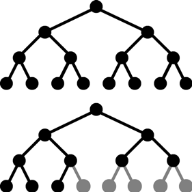
Figure 11.9 완전 이진 트리

그림 11.9에 나와 있는 트리는 완전합니다. 이 트리는 레벨 3에서 오른쪽에 5개의 잎을 추가하여 얻은 전체 이진 트리와 함께 나와 있습니다.

**정리 11.2 높이가 h인 완전 이진 트리에서**

[stem]
++++
h + 1 :: n :: 2^{h+1} - 1 \text { and } h = \lfloor lg n\rfloor
++++

n은 그 노드의 수를 나타냅니다.

=== 예제 11.11 더 완전한 이진 트리

Figure 11.10은 완전한 이진 트리의 세 가지 더 많은 예를 보여줍니다.

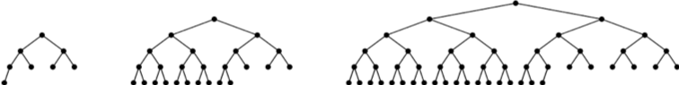
Figure 11.10 완전한 이진 트리

완전한 이진 트리는 보통의 배열을 사용하여 간단하고 자연스러운 방식으로 구현할 수 있기 때문에 중요합니다. 실제로 이진 트리에 대해 자연스러운 매핑이 정의됩니다. 루트에 번호 1을 할당합니다. 어떤 노드에 대해 i가 그 번호이면, 왼쪽 자식에는 stem:[2_{i}]를 할당하고 오른쪽 자식에는 stem:[2_{i+1}]을 할당합니다 (그들이 존재하는 경우). 이렇게 하면 각 노드에 고유한 양의 정수가 할당됩니다. 그런 다음 노드 i에 있는 요소를 a[i]에 저장하면 됩니다. 여기서 a[]는 배열입니다.
완전한 이진 트리는 배열에 저장될 수 있는 간단한 방법 때문에 중요합니다. 이는 Figure 11.11에 나와 있는 것처럼 트리 노드에 대한 인덱스 번호를 수준별로 할당함으로써 달성됩니다. 이 자연스러운 매핑의 아름다움은 노드의 자식 및 부모의 배열 인덱스를 계산하는 간단한 방법입니다.

image::./images/figure11_11.png[The natural mapping of a complete binary tree]
Figure 11.11 The natural mapping of a complete binary tree

**Algorithm 11.1 완전한 이진 트리의 배열로의 자연적 매핑**

배열에 자연적 매핑을 사용하여 저장된 완전한 이진 트리를 탐색하기 위해서:
1. 위치 i에 저장된 노드의 부모는 위치 i/2에 저장됩니다.
2. 위치 i에 저장된 노드의 왼쪽 자식은 위치 stem:[2_{i}]에 저장됩니다.
3. 위치 i에 저장된 노드의 오른쪽 자식은 위치 stem:[2_{i + 1}]에 저장됩니다.

예를 들어, 노드 e는 배열의 인덱스 i = 5에 저장되어 있습니다; 그 부모 노드 b는 인덱스 stem:[i/2 = 5/2 = 2]에 저장되어 있으며, 그 왼쪽 자식 노드 j는 위치 stem:[2i = 2·5 = 10]에 저장되어 있고, 그 오른쪽 자식 노드 k는 인덱스 stem:[2i + 1 = 2·5 + 1 = 11]에 저장되어 있습니다.

형용사 "완전한"의 사용은 이제 명확해야 합니다: 완전한 이진 트리의 정의 속성은 바로 자연적 매핑이 트리 노드를 배열에 "완전히" 저장할 것을 보장하는 조건입니다.

=== 예제 11.12 불완전한 이진 트리

Figure 11.12에는 페이지 201의 예제 11.1에서 나온 불완전한 이진 트리가 나와 있습니다. 해당 노드들의 배열로의 자연적 매핑은 Figure 11.13에 나와 있는 것처럼 몇 가지 공백을 남깁니다.
참고: 어떤 저자들은 완전한 이진 트리를 "거의 완전한 이진 트리"라고 하고 완전한 이진 트리를 "전체 이진 트리"라고 합니다.

image::./images/future11_12.png[A binary tree]
Figure 11.12 A binary tree

image::./images/future11_13.png[The natural mapping of an incomplete binary tree]
Figure 11.13 The natural mapping of an incomplete binary tree

== 이진 트리 순회 알고리즘

일반적인 트리에 사용되는 세 가지 순회 알고리즘(10장 참조)은 이진 트리에도 적용됩니다: 전위 순회, 후위 순회, 그리고 레벨 순서 순회입니다. 게다가, 이진 트리는 네 번째 순회 알고리즘을 지원합니다: 중위 순회입니다. 이 네 가지 순회 알고리즘을 다음에 제시합니다.

**Algorithm 11.2 이진 트리의 레벨 순서 순회**

비어 있지 않은 이진 트리를 순회하기 위해서:

1. 큐를 초기화합니다.
2. 루트를 큐에 인큐합니다.
3. 큐가 비어 있을 때까지 단계 4–7을 반복합니다.
4. 큐에서 노드 x를 디큐합니다.
5. x를 방문합니다.
6. x의 왼쪽 자식이 있다면 그것을 큐에 인큐합니다.
7. x의 오른쪽 자식이 있다면 그것을 큐에 인큐합니다.

=== 예제 11.13 이진 트리의 레벨 순서 순회

페이지 207에 있는 높이가 3인 완전한 이진 트리에서 레벨 순서 순회가 어떻게 보이는지를 보여주는 Figure 11.14를 참조하세요.

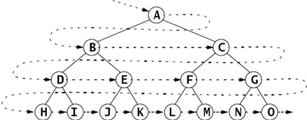
Figure 11.14 The level order traversal of a binary tree

**Algorithm 11.3 이진 트리의 전위 순회**

비어 있지 않은 이진 트리를 순회하기 위해서:
1. 루트를 방문합니다.
2. 왼쪽 서브트리가 비어 있지 않다면, 그것에 대해 전위 순회를 수행합니다.
3. 오른쪽 서브트리가 비어 있지 않다면, 그것에 대해 전위 순회를 수행합니다.

=== 예제 11.14 이진 트리의 전위 순회

페이지 208에 있는 높이가 3인 완전한 이진 트리에서 전위 순회를 보여주는 Figure 11.15를 참조하세요.

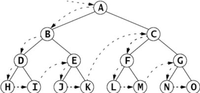
Figure 11.15 The preorder traversal of a binary tree

노드는 **A, B, D, H, I, E, J, K, C, F, L, M, G, N, O** 순서로 방문됩니다.

11.16번 그림은 이진 트리의 전위 순회가 루트에서 시작하여 각 노드를 왼쪽에서 처음 만날 때마다 방문하는 방식을 보여줍니다.

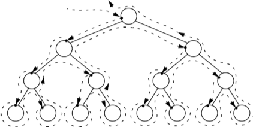
Figure 11.16 The preorder traversal of a binary tree

**알고리즘 11.4 이진 트리의 후위 순회**

비어 있지 않은 이진 트리를 순회하기 위해:

1. 만약 왼쪽 서브트리가 비어 있지 않다면, 왼쪽 서브트리에 대해 후위 순회를 수행합니다.
2. 만약 오른쪽 서브트리가 비어 있지 않다면, 오른쪽 서브트리에 대해 후위 순회를 수행합니다.
3. 루트를 방문합니다.

=== 예제 11.15 이진 트리의 후위 순회

그림 11.17은 높이가 3인 완전한 이진 트리에 대한 후위 순회가 어떻게 보이는지를 보여줍니다.

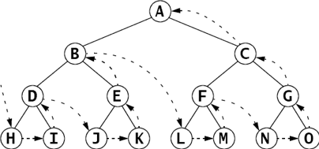
Figure 11.17 The postorder traversal of a binary tree

노드는 **H, I, D, J, K, E, B, L, M, F, N, O, G, C, A** 순서로 방문됩니다.

전위 순회는 루트를 먼저 방문하고 후위 순회는 루트를 마지막에 방문합니다. 이것은 이진 트리에 대한 세 번째 대안을 제안합니다: 두 서브트리의 순회 사이에 루트를 방문하는 것입니다. 이를 중위 순회라고 합니다.

**알고리즘 11.5 이진 트리의 중위 순회**

비어 있지 않은 이진 트리를 순회하기 위해:

1. 만약 왼쪽 서브트리가 비어 있지 않다면, 왼쪽 서브트리에 대해 전위 순회를 수행합니다.
2. 루트를 방문합니다.
3. 만약 오른쪽 서브트리가 비어 있지 않다면, 오른쪽 서브트리에 대해 전위 순회를 수행합니다.

=== 예제 11.16 이진 트리의 중위 순회

그림 11.18은 높이가 3인 완전한 이진 트리에 대한 중위 순회가 어떻게 보이는지를 보여줍니다.

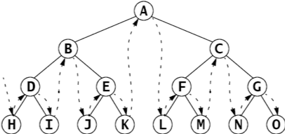
Figure 11.18 The inorder traversal of a binary tree

노드는 **H, D, I, B, J, E, K, A, L, F, M, C, N, G, O** 순서로 방문됩니다.

== 표현 트리

stem:[(5 - x)*y + 6/(x + z)]와 같은 산술 표현식은 산술 연산자 stem:[(+, -, *, /, 등)], 피연산자 stem:[(5, x, y, 6, z, 등)], 및 괄호를 조합하여 구성됩니다. 각 표현식은 표현식 내 연산자의 우선순위에 따라 결정되는 고유한 이진 트리로 나타낼 수 있습니다. 이러한 트리를 표현 트리라고 합니다.

=== 예제 11.17 표현 트리

그림 11.19은 표현식 (5 — x)*y + 6/(x + z)의 표현 트리를 보여줍니다.
다음은 표현 트리를 구축하기 위한 재귀적 알고리즘입니다:

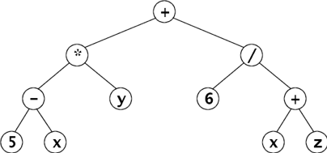
Figure 11.19 An expression tree

**알고리즘 11.6 표현 트리 구축**

주어진 표현식의 표현 트리는 다음 규칙에 따라 재귀적으로 구축할 수 있습니다:

1. 단일 피연산자의 표현 트리는 그것을 포함하는 단일 루트 노드입니다.
2. E1과 E2가 표현 트리 T1과 T2로 나타내어진 표현식이고, op가 연산자라면, 표현식 E1 op E2의 표현 트리는 op를 포함하는 루트 노드와 서브트리 T1과 T2를 가진 트리입니다.

표현식은 트리를 순회하는 알고리즘에 따라 세 가지 표현을 가집니다. 전위 순회는 접두사 표현을, 중위 순회는 중위 표현을, 후위 순회는 접미사 표현을 만듭니다. 접미사 표현은 역 폴란드 표기법 또는 RPN이라고도 합니다. 이는 109페이지에 개요가 나와 있습니다.

=== 예제 11.18 표현식의 세 가지 표현

예제 11.17의 표현식에 대한 세 가지 표현은 다음과 같습니다:

[cols="1,4", frame=none,grid=node]
|===
| Prefix:	|+*-5xy/6+xz
| Infix:	|5-x*y+6/x+z
| Postfix (RPN):  |5x-y*6xz+/+
|===

일반 함수 구문은 접두사 표현을 사용합니다. 예제 11.17의 표현식은 다음과 같이 평가될 수 있습니다:

`sum(product(difference(5, x), y), quotient(6, sum(x, z)))`

일부 과학용 계산기는 RPN을 사용하며, 연산자를 입력하기 전에 두 피연산자를 모두 입력해야 합니다.

다음 알고리즘은 후위 표현으로 된 표현식을 평가하는 데 적용될 수 있습니다.

**알고리즘 11.7 후위 표현으로부터 표현식을 평가하기**

후위 표현으로 나타낸 표현식을 평가하기 위해, 표현을 왼쪽에서 오른쪽으로 스캔합니다:

1. 피연산자를 위한 스택을 생성합니다.
2. 표현의 끝에 도달할 때까지 3~9 단계를 반복합니다.
3. 표현에서 다음 토큰 t를 읽습니다.
4. t가 피연산자이면, 그 값을 스택에 푸시합니다.
5. 그렇지 않으면, 6~9 단계를 수행합니다:
6. 스택에서 a를 팝합니다.
7. 스택에서 b를 팝합니다.
8. c = b t a를 평가합니다.
9. c를 스택에 푸시합니다.
10. 스택의 맨 위 요소를 반환합니다.

=== 예제 11.19 후위 표현으로부터 표현식을 평가하기

그림 11.20은 예제 11.18의 표현식을 x=2, y=3, z=1로 평가하는 과정을 보여줍니다:

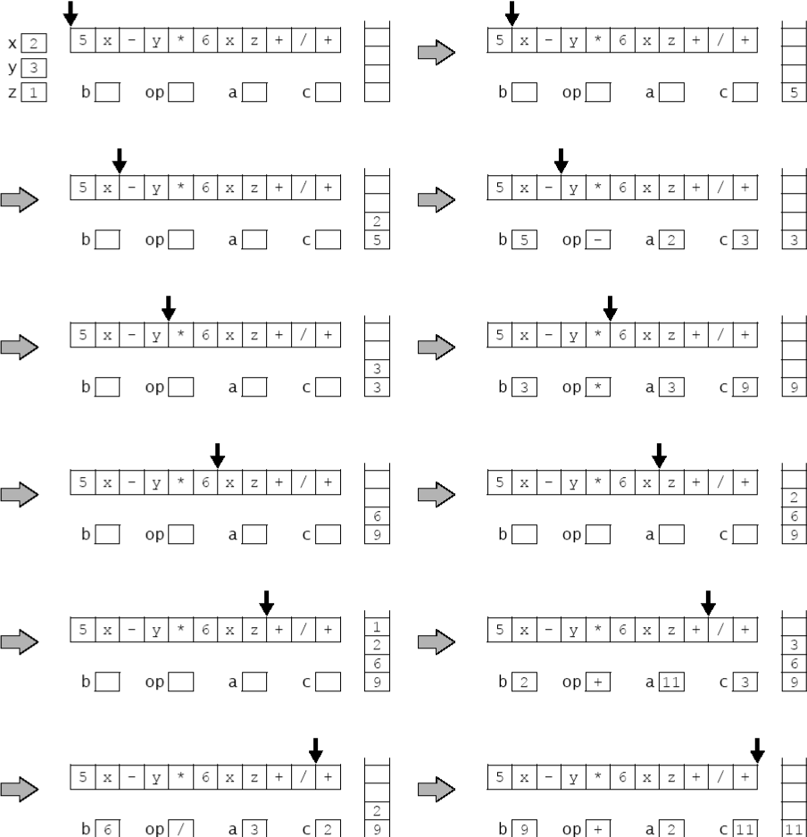
Figure 11.20 Evaluating a postfix expression

== 이진 트리 클래스

다음은 재귀적 정의를 직접 구현한 이진 트리 클래스입니다. (200페이지를 참조하세요.) AbstractCollection 클래스를 확장함으로써, Java Collections Framework와 일관성을 유지합니다. (4장을 참조하세요.)

=== 예제 11.20 이진 트리 클래스

[source,java]
----
1	public class BinaryTree<E> extends AbstractCollection {
2	  protected E root;
3	  protected BinaryTree<E> left, right, parent;
4	  protected int size;
5
6	  public BinaryTree() {
7	  }
8
9	  public BinaryTree(E root) {
10	    this.root = root;
11	    size = 1;
12	  }
13
14	  public BinaryTree(E root, BinaryTree<E> left, BinaryTree<E> right) {
15	    this(root);
16	    if (left != null) {
17	      this.left = left;
18	      left.parent = this;
19	      size += left.size();
20	    }
21	    if (right != null) {
22	      this.right = right;
23	      right.parent = this;
24	      size += right.size();
25	    }
26	  }
27
28	  public boolean equals(Object object) {
29	    if (object == this) {
30	      return true;
31	    } else if (!(object instanceof BinaryTree)) {
32	      return false;
33	    }
34	    BinaryTree that = (BinaryTree)object;
35	    return that.root.equals(this.root)
36	          && that.left.equals(this.left)
37	          && that.right.equals(this.right)
38	          && that.parent.equals(this.parent)
39	         && that.size == this.size;
40	  }
41
42	  public int hashCode() {
43	    return root.hashCode() + left.hashCode() + right.hashCode() + size;
44	  }
45
46	  public int size() {
47	    return size;
48	  }
49
50	  public Iterator iterator() {
51	    return new java.util.Iterator() { // anonymous inner class
52	      private boolean rootDone;
53	      private Iterator lIt, rIt; // child iterators
54	      public boolean hasNext() {
55	        return !rootDone || lIt != null && lIt.hasNext()
56	            || rIt != null && rIt.hasNext();
57	      }
58	      public Object next() {
59	        if (rootDone) {
60	          if (lIt != null && lIt.hasNext()) {
61	            return lIt.next();
62  	        }
63	          if (rIt != null && rIt.hasNext()) {
64	            return rIt.next();
65	          }
66	          return null;
67	        }
68	        if (left != null) {
69	          lIt = left.iterator();
70	        }
71	        if (right != null) {
72	          rIt = right.iterator();
73	        }
74	        rootDone = true;
75	        return root;
76	      }
77	      public void remove() {
78	        throw new UnsupportedOperationException();
79	      }
80	    };
81	  }
82	}
----
java.util.AbstractCollection 클래스는 여기 정의된 네 가지 메서드를 필요로 합니다: equals(), hashCode(), iterator(), size(). 각주:[사실 equals()와 hashCode() 메서드는 Object 클래스에 정의되어 있으므로 재정의할 필요는 없습니다.]

iterator() 메서드는 AbstractCollection 클래스에 정의된 빈 버전을 오버라이드합니다. 이 메서드의 역할은 BinaryTree 객체를 순회할 수 있는 이터레이터 객체를 생성하는 것입니다. 이를 위해, 47번째 줄에 있는 Java의 return new 구문을 사용하여 자체적인 익명 내부 Iterator 클래스를 생성합니다. 이 익명 클래스의 본문은 Iterator() 생성자의 호출 직후 중괄호 사이에 정의됩니다. 이 블록은 실제로 return 문이 끝나는 지점이므로 세미콜론으로 끝나야 합니다. 전체 구조는 메서드 정의처럼 보이지만, 실제로는 return 문 내에 포함된 전체 클래스 정의입니다.

Iterator 객체를 반환하기 위해, 이 익명 클래스는 Iterator 인터페이스를 구현해야 합니다. (77페이지 참조.) 이는 세 가지 메서드의 정의를 요구합니다.

[source,java]
----
public boolean hasNext()	...
public Object next()	...
public void remove()	...
----

이 구현은 재귀적입니다. hasNext() 메서드는 두 서브트리에 있는 이터레이터들의 hasNext() 메서드를 호출하고, next() 메서드는 lIt와 rIt라는 이름의 두 이터레이터들의 next() 메서드를 호출합니다. 다른 로컬 변수는 rootDone이라는 플래그로, 루트 객체가 이터레이터에 의해 방문되었는지 여부를 추적합니다.

hasNext() 메서드는 트리의 세 부분, 즉 루트, 왼쪽 서브트리, 오른쪽 서브트리가 모두 방문되기 전까지는 true를 반환합니다. 이는 lIt와 rIt 이터레이터를 재귀적으로 사용하여 수행됩니다.

next() 메서드도 lIt와 rIt 이터레이터를 재귀적으로 사용합니다. 루트가 이미 방문되었다면, 이터레이터는 왼쪽 서브트리의 다음 노드를 방문하고, 그렇지 않으면 오른쪽 서브트리의 다음 노드를 방문합니다. 루트가 아직 방문되지 않았다면, 이는 해당 서브트리에 대한 이터레이터의 첫 번째 호출이므로, lIt와 rIt 이터레이터를 초기화하고 rootDone 플래그를 설정한 후 루트를 반환합니다.

remove() 메서드는 구현되지 않았습니다. 이는 이진 트리에서 내부 노드를 간단히 제거할 방법이 없기 때문입니다.

=== 예제 11.21 BinaryTree 클래스 테스트

[source,java]
----
1	public class TestBinaryTree {
2	  static public void main(String[] args) {
3	    BinaryTree<String> e = new BinaryTree<String>("E");
4	    BinaryTree<String> g = new BinaryTree<String>("G");
5	    BinaryTree<String> h = new BinaryTree<String>("H");
6	    BinaryTree<String> i = new BinaryTree<String>("I");
7	    BinaryTree<String> d = new BinaryTree<String>("D", null, g);
8	    BinaryTree<String> f = new BinaryTree<String>("F", h, i);
9	    BinaryTree<String> b = new BinaryTree<String>("B", d, e);
10	    BinaryTree<String> c = new BinaryTree<String>("C", f, null);
11	    BinaryTree<String> tree = new BinaryTree<String>("A", b, c);
12	    System.out.printf("tree: %s", tree);
13	  }
14	}
----

The output is:

[source,console]
----
tree: [A, B, D, G, E, C, F, H, I]
----

프로그램은 그림 11.21에 표시된 이진 트리를 생성한 후, AbstractCollection 클래스에서 상속받은 toString() 메서드를 간접적으로 호출합니다.

그림 11.21은 동일한 트리에 대한 두 가지 뷰를 보여줍니다. 더 큰 뷰는 모든 세부 사항을 보여주며, 각 객체 참조를 화살표로 나타냅니다.

image::./images/figure11_21.png[예제 11.21에서 구성된 이진 트리, align=center]
그림 11.21 예제 11.21에서 구성된 이진 트리

BinaryTree 클래스는 AbstractCollection 클래스를 확장함으로써 iterator()와 size() 메서드를 사용하여 정의된 다음 메서드들을 자동으로 상속받습니다:

[srouce,java]
----
public boolean  isEmpty()
public boolean contains(Object object) public Object[] toArray()
public Object[] toArray(Object[] objects) public String	toString()
public boolean  add(Object object)
public boolean addAll(Collection collection) public void	clear()
public boolean containsAll(Collection collection) public boolean remove(Object object)
public boolean removeAll(Collection collection) public boolean  retainAll(Collection collection)
----
그러나 변경 메서드는 add()와 Iterator.remove() 메서드를 호출하여 구현되지 않은 다른 메서드를 호출하기 때문에 UnsupportedOperationException을 throw합니다.

=== 예제 11.22 이진 트리의 contains() 메서드 테스트

이 예제는 예제 11.21의 트리와 동일한 트리를 구성한 다음, 그것과 그 하위 트리에서 contains() 메서드를 테스트합니다.

[source,java]
----
1	public class TestContains {
2	  static public void main(String[] args) {
3	    BinaryTree<String> e = new BinaryTree<String>("E");
4	    BinaryTree<String> g = new BinaryTree<String>("G");
5	    BinaryTree<String> h = new BinaryTree<String>("H");
6	    BinaryTree<String> i = new BinaryTree<String>("I");
7	    BinaryTree<String> d = new BinaryTree<String>("D", null, g);
8	    BinaryTree<String> f = new BinaryTree<String>("F", h, i);
9	    BinaryTree<String> b = new BinaryTree<String>("B", d, e);
10	    BinaryTree<String> c = new BinaryTree<String>("C", f, null);
11	    BinaryTree<String> a = new BinaryTree<String>("A", b, c);
12	    System.out.printf("a: %s%n", a);
13	    System.out.println("a.contains(\"H\") = " + a.contains("H"));
14	    System.out.printf("b: %s%n", b);
15	    System.out.println("b.contains(\"H\") = " + b.contains("H"));
16	    System.out.printf("c: %s%n", c);
17	    System.out.println("c.contains(\"H\") = " + c.contains("H"));
18	  }
19	}
----

The output is:

[source,console]
----
a: [A, B, D, G, E, C, F, H, I]
a.contains("H") = true b: [B, D, G, E]
b.contains("H") = false c: [C, F, H, I]
c.contains("H") = true
----

서브트리 b와 c는 그림 11.22에 표시되어 있습니다. 트리 a에는 요소 H가 포함되어 있습니다. 서브트리 b에는 요소 H가 포함되어 있지 않습니다. 그러나 서브트리 c에는 요소 H가 포함되어 있습니다.

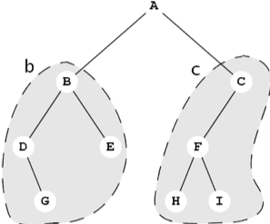
Figure 11.22

== 순회 알고리즘의 구현

iterator() 메서드에서 반환되는 이터레이터는 이진 트리를 순회하기 위해 전위 순회 알고리즘(208페이지의 알고리즘 11.3)을 따릅니다. BinaryTree 클래스의 다음 수정은 네 가지 이진 트리 순회 알고리즘을 모두 구현합니다.

=== 예제 11.23 네 가지 순회 알고리즘 구현

[source,java]
----
1	public class BinaryTree<E> extends AbstractCollection {
2	  // insert lines 2-49 from Example 11.20 on page 212
50	  public Iterator iterator() {
51	    return new PreOrder();
52	  }
53
54	  abstract public class BinaryTreeIterator implements Iterator	{
55	    protected boolean rootDone;
56	    protected Iterator lIt, rIt; // child iterators
57	    public boolean hasNext() {
58	      return !rootDone || lIt != null && lIt.hasNext()
59	            || rIt != null && rIt.hasNext();
60	    }
61	    abstract public Object next();
62	    public void remove() {
63	      throw new UnsupportedOperationException();
64	    }
65	  }
66
67	  public class PreOrder extends BinaryTreeIterator {
68	    public PreOrder() {
69	      if (left != null) {
70	        lIt = left.new PreOrder();
71	      }
72	      if (right != null) {
73	        rIt = right.new PreOrder();
74	      }
75	    }
76	    public Object next() {
77	      if (!rootDone) {
78	        rootDone = true;
79	        return root;
80	      }
81	      if (lIt != null && lIt.hasNext()) {
82	        return lIt.next();
83	      }
84	      if (rIt != null && rIt.hasNext()) {
85	        return rIt.next();
86	      }
87	      return null;
88	    }
89	  }
90
91	  public class InOrder extends BinaryTreeIterator {
92	    public InOrder() {
93	      if (left != null) {
94	        lIt = left.new InOrder();
95	      }
96	      if (right != null) {
97	        rIt = right.new InOrder();
98	      }
99	    }
100	    public Object next() {
101	      if (lIt != null && lIt.hasNext()) {
102	        return lIt.next();
103	      }
104	      if (!rootDone) {
105	        rootDone = true;
106	        return root;
107	      }
108	      if (rIt != null && rIt.hasNext()) {
109	        return rIt.next();
110	      }
111	      return null;
112	    }
113	  }
114
115	  public class PostOrder extends BinaryTreeIterator	{
116	    public PostOrder() {
117	      if (left != null) {
118	        lIt = left.new PostOrder();
119	      }
120	      if (right != null) {
121	        rIt = right.new PostOrder();
122	      }
123	    }
124	    public Object next() {
125	      if (lIt != null && lIt.hasNext()) {
126	        return lIt.next();
127	      }
128	      if (rIt != null && rIt.hasNext()) {
129	        return rIt.next();
130	      }
131	      if (!rootDone) {
132	        rootDone = true;
133	        return root;
134	      }
135		  return null;
136	    }
137	  }
138
139	  public class LevelOrder extends BinaryTreeIterator {
140	    Queue<BinaryTree<E>> queue = new ArrayDeque<BinaryTree<E>>();
141	    public boolean hasNext() {
142	      return (!rootDone || !queue.isEmpty());
143	    }
144	    public Object next() {
145	      if (!rootDone) {
146	        if (left != null) {
147	          queue.add(left);
148	        }
149	        if (right != null) {
150	          queue.add(right);
151	        }
152	        rootDone = true;
153	        return root;
154	      }
155	      if (!queue.isEmpty()) {
156	        BinaryTree<E> tree = queue.remove();
157	        if (tree.left != null) {
158	          queue.add(tree.left);
159	        }
160	        if (tree.right != null) {
161	          queue.add(tree.right);
162	        }
163	        return tree.root;
164	      }
165	      return null;
166	    }
167	  }
168	}
----

64번째 줄에서는 BinaryTreeIterator라는 추상 내부 클래스를 정의합니다. 이 클래스는 네 가지 구체적인 이터레이터 클래스의 기본 클래스로 작동합니다. 이전에 정의된 익명 이터레이터 클래스와 동일한 세 개의 필드(rootDone, rIt, lIt)를 선언합니다.

hasNext() 및 remove() 메서드는 (57번째와 62번째 줄에서) 이전의 익명 이터레이터 클래스에서 추상 Iterator 클래스가 수행한 방식과 동일하게 구현됩니다. 그러나 next() 메서드는 각각의 네 가지 순회 알고리즘에 대해 다른 구현을 가지고 있기 때문에 추상으로 선언됩니다.

PreOrder 클래스는 생성자에서 lIt 및 rIt 이터레이터를 PreOrder 이터레이터로 정의하여 재귀적 순회가 전위 순회 알고리즘을 따르도록 합니다. 해당 알고리즘(208페이지의 알고리즘 11.3)은 먼저 루트를 방문한 다음 같은 알고리즘을 왼쪽 서브트리에 재귀적으로 적용한 후 오른쪽 서브트리에 적용합니다. 77~86번째 줄에서 이를 수행합니다. PreOrder, InOrder 및 PostOrder 클래스 간의 유일한 차이점은 생성자에서 재귀적 rIt 및 lIt 이터레이터의 정의 및 next() 메서드에서 이러한 세 가지 if 문의 순서입니다. InOrder 클래스의 경우 순서가 두 개의 재귀적 순회 사이에서 루트를 방문합니다. PostOrder 클래스의 경우 순서가 두 개의 재귀적 순회 후에 루트를 방문합니다. ("Pre"는 이전을 의미하고, "in"은 사이를 의미하며, "post"는 이후를 의미합니다.)

LevelOrder 순회 클래스는 다른 세 클래스와는 크게 다릅니다. 재귀적이 아니라 큐를 사용합니다. (209페이지의 알고리즘 11.5 참조.)

=== 예제 11.24 순회 알고리즘 테스트

[source,java]
----
1	public class TestIterators {
2	  public static void main(String[] args) {
3	    BinaryTree<String> e = new BinaryTree<String>("E");
4	    BinaryTree<String> g = new BinaryTree<String>("G");
5	    BinaryTree<String> h = new BinaryTree<String>("H");
6	    BinaryTree<String> i = new BinaryTree<String>("I");
7	    BinaryTree<String> d = new BinaryTree<String>("D",null,g);
8	    BinaryTree<String> f = new BinaryTree<String>("F",h,i);
9	    BinaryTree<String> b = new BinaryTree<String>("B",d,e);
10	    BinaryTree<String> c = new BinaryTree<String>("C",f,null);
11	    BinaryTree<String> tree = new BinaryTree<String>("A",b,c);
12	    System.out.println("tree = " + tree);
13	    java.util.Iterator it;
14	    System.out.print("PreOrder Traversal:	");
15	    for (it = tree.new PreOrder(); it.hasNext(); ) {
16	      System.out.print(it.next() + " ");
17	    }
18	    System.out.print("\nInOrder Traversal:	");
19	    for (it = tree.new InOrder(); it.hasNext(); ) {
20	      System.out.print(it.next() + " ");
21	    }
22	    System.out.print("\nPostOrder Traversal: ");
23	    for (it = tree.new PostOrder(); it.hasNext(); ) {
24	      System.out.print(it.next() + " ");
25	    }
26	    System.out.print("\nLevelOrder Traversal: ");
27	    for (it = tree.new LevelOrder(); it.hasNext(); ) {
28	      System.out.print(it.next() + " ");
29	    }
30	    System.out.println();
31	  }
32	}
----

The output is:

[source,console]
----
tree = [A, B, D, G, E, C, F, H, I]
PreOrder Traversal: A B D G E C F H I
InOrder Traversal:  D G B E A H F I C
PostOrder Traversal: G D E B H I F C A
LevelOrder Traversal: A B C D E F G H I
----

네 가지 이터레이터 각각은 자체가 구현하는 알고리즘에 따라 트리를 순회합니다.

== 포레스트

====
포레스트는 서로 겹치지 않는 순서가 지정된 나무들의 시퀀스입니다.
====

=== 예제 11.25 포레스트

그림 11.23은 세 개의 트리로 구성된 포레스트를 보여줍니다.

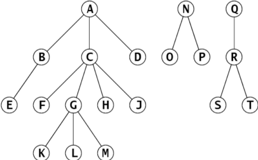
Figure 11.23 A forest

다음 알고리즘은 어떻게 포레스트를 단일 이진 트리로 표현할 수 있는지를 보여줍니다.

**알고리즘 11.8 포레스트의 자연스러운 매핑을 이진 트리로**

1. 첫 번째 트리의 루트를 이진 트리의 루트로 매핑합니다.
2. 노드 X가 X'로 매핑되고 노드 Y가 X의 첫 번째 자식인 경우, Y를 X'의 왼쪽 자식으로 매핑합니다.
3. 노드 X가 X'로 매핑되고 노드 Z가 X의 형제인 경우, Z를 X'의 오른쪽 자식으로 매핑합니다. 트리의 루트 자체도 형제로 간주됩니다.

=== 예제 11.26 포레스트를 이진 트리로 매핑

그림 11.24는 예제 11.25에 표시된 포레스트의 매핑입니다. 예를 들어, 원래의 포레스트에서 C는 가장 오래된 자식 F와 다음 형제 D를 가지고 있습니다. 해당하는 이진 트리에서 C는 왼쪽 자식 F와 오른쪽 자식 D를 가지고 있습니다.

image::./images/figure11_24.png[The natural mapping of a forest into a binary tree]
Figure 11.24 The natural mapping of a forest into a binary tree

== 리뷰 질문

1. 높이 h = 3인 완전 이진 트리의 잎 노드는 몇 개입니까?
2. 높이 h = 3인 완전 이진 트리의 내부 노드는 몇 개입니까?
3. 높이 h = 3인 완전 이진 트리의 노드는 몇 개입니까?
4. 높이 h = 9인 완전 이진 트리의 잎 노드는 몇 개입니까?
5. 높이 h = 9인 완전 이진 트리의 내부 노드는 몇 개입니까?
6. 높이 h = 9인 완전 이진 트리의 노드는 몇 개입니까?
7. 노드가 n = 100개인 이진 트리의 가능한 높이 범위는 무엇입니까?
8. 일반 트리에 대한 중위 순회가 없는 이유는 무엇입니까?
9. 참이거나 거짓:
a. 모든 잎이 동일한 레벨에 있는 경우, 이진 트리는 완전합니다.
b. 이진 트리가 n개의 노드와 높이 h를 가지면, stem:[h \ge \lfloor lg n \rfloor] 입니다.
c. 이진 트리는 깊이 d에서 stem:[2^{d}]개보다 많은 노드를 가질 수 없습니다.
d. 이진 트리의 모든 적절한 서브트리가 완전하면, 트리 자체도 반드시 완전해야 합니다.

