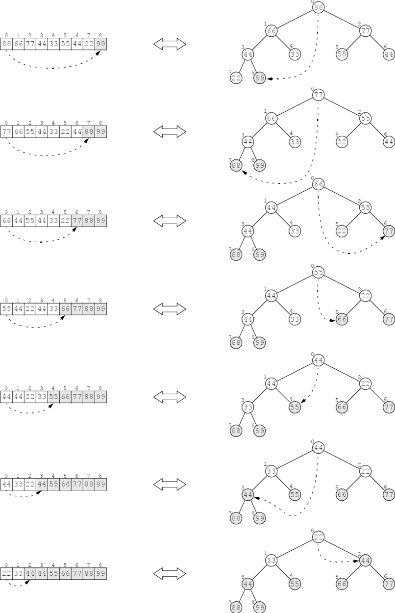
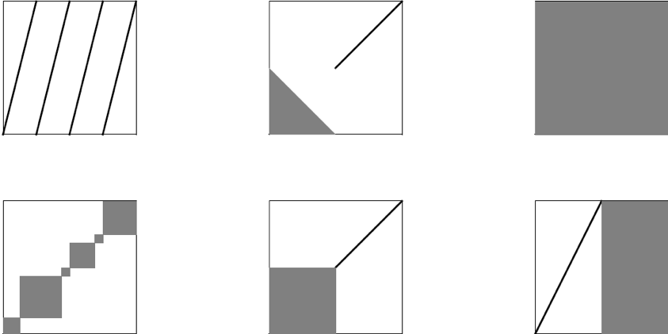

:stem: latexmath

= Sorting(정렬)

* 배열이나 리스트와 같은 선형 데이터 구조를 정렬하는 가장 일반적인 알고리즘 아홉 가지

== 코드 준비

* 이 장의 모든 정렬 알고리즘은 동일한 Java signature(시그니처) 사용
+
[source,java]
----
public static void sort(int[] a)
----
** 정수 배열을 정렬하기 위한 것
** 이를 통해 다른 기본 타입의 배열이나 Comparable 인터페이스를 구현하는 객체 배열을 쉽게 정렬 가능
* 의사 코드와 Java 코드는 전제 조건, 후제 조건, 그리고 루프 불변식을 포함
** 이러한 조건들은 알고리즘의 정확성을 증명
** 복잡성 분석에 사용
* 의사 코드에서는 n개의 요소 시퀀스를 나타내기 위해 stem:[s = \lbrace s_{0}, s_{1}, \ldots, s_{n-1} \rbrace] 표기법 사용
* 표기법 stem:[\lbrace s_{p} \cdots s_{q-1} \rbrace]는 stem:[s_{p}]에서 stem:[s_{q–1}]까지의 요소로 구성된 부분 시퀀스 stem:[\lbrace s_{p}, s_{p+1}, \cdots, s_{q-1} \rbrace] 표시
* Java 코드 주석에서는 이 부분 시퀀스를 stem:[s[p..q)]로 표시
* 예를 들어, stem:[\lbrace s_{3} \cdots s_{7} \rbrace]와 stem:[s[3..8)]는 모두 부분 시퀀스 stem:[\lbrace s_{3}, s_{4}, s_{5}, s_{6}, s_{7}\rbrace] 표시
* 특별히 언급되지 않는 한, "정렬됨"은 시퀀스의 요소가 오름차순 정렬을 의미
** stem:[s_0 \le s_1 \le s_2 \le \ldots \le s_{n-1}].
* 배열을 위한 swap() 메서드
+
[source,java]
----
static void swap(int[] a, int i, int j) {
    // PRECONDITIONS: 0 <= i < a.length; 0 <= j < a.length;
    // POSTCONDITION: a[i] and a[j] are interchanged;
    if (i == j) {
        return;
    }
    int temp=a[j];
    a[j] = a[i];
    a[i] = temp;
}
----
* 배열의 stem:[i]번째와 stem:[j]번째 요소를 단순히 교환
* 선행 조건은 메서드가 호출되기 전에 참이라고 가정되는 조건
* 후행 조건은 선행 조건이 참이었다면 메서드가 호출된 후에 반드시 참이 되는 조건
* 배열을 출력하기 위한 print() 메서드
+
[source,java]
----
static void print(int[] a) {
    for (int ai : a) {
        System.out.printf("%s ", ai);
    }
    System.out.println();
}
----
* Java Arrays.sort() 메서드
** 표준 자바 클래스 라이브러리
** java.util.Arrays 클래스에서 sort() 메서드 정의
** int 배열용 sort() 메서드의 두 가지 시그니처
+
[source,java]
----
public static void sort(int[] a)
public static void sort(int[] a, int p, int q)
----
** Arrays.sort() 메서드 사용하기
+
[source,java]
----
public static void main(String[] args) {
    int[]a={77,44,99,66,33,55,88,22};
    print(a);
    java.util.Arrays.sort(a);
    print(a);
}
----
출력 결과는
+
[source,console]
----
77 44 99 66 33 55 88 22
22 33 44 55 66 77 88 99
----
*** Primitive type 요소의 배열에 대해서는 quick sort(퀵 정렬) 구현
*** Reference tyue 요소의 배열에 대해서는 merge sort(병합 정렬) 구현

== Bubble Sort(버블 정렬)

* n개의 요소가 있는 수열에서 n-1회의 패스 수행
* 각 패스는 배열을 왼쪽에서 오른쪽으로 이동하면서 인접한 요소들을 비교하고, 순서가 잘못된 쌍을 교환
** 이 과정에서 큰 요소들은 점차적으로 오른쪽으로 이동
* 이름은 요소들을 세로 열로 시각화할 때, 각 패스가 탄산 음료의 상승하는 거품처럼 작은 요소들을 튕겨내면서 다음으로 큰 요소를 “거품 내듯이” 올려보내는 것처럼 보이기 때문

**조건**

* 선행 조건
** stem:[s = {s_{0} \cdots s_{n-1}}]는 n개의 순서 값을 갖는 수열
* 후행 조건
** 전체 수열 s가 정렬됨
* 불변 조건
** 부분 수열 stem:[\{s_{i} \dots s_{n–1}\}]가 정렬되어 있으며, stem:[s_i = max\{s_{0} \dots s_{i}\}].

**알고리즘**

1. stem:[i=n-1]부터 1까지 stem:[2-4] 단계 수행
2. stem:[j=0]부터 stem:[i-1]까지 3단계 수행
3. 연속된 두 요소 stem:[s_{j}]와 stem:[s_{j+1}]이 순서에 맞지 않으면, 그들을 교환

=== 문제 14.1 버블 정렬을 작성하고, 테스트하세요.

* 동작 확인을 위한 실행 코드
+
[source,java]
----
public static void main(String[] args) {
    int[] a = new int[10];

    Random random = new Random();

    for (int i = 0; i < a.length; i++) {
        a[i] = random.nextInt(100);
    }

    Utils.print(a);
    sort(a);
    Utils.print(a);
}
----
* 결과는 아래와 같이 출력
+
[source,console]
----
19 74 99 2 1 68 69 60 38 98
1 2 19 38 60 68 69 74 98 99
----

**물음**

* 버블 정렬의 수행 시간을 stem:[O(?)]로 표시하면?

== Selection Sort(선택 정렬)

* 버블 정렬과 유사
* n개의 요소로 이루어진 수열을 n-1번 순회하며 매번 남은 정렬되지 않은 요소 중 가장 큰 값을 올바른 위치로 이동
* 그러나, 이는 가장 큰 값을 찾는 과정에서 어떤 요소도 이동시키지 않기 때문에 버블 정렬보다 효율적
* 가장 큰 값을 찾은 후에는 각 패스마다 딱 한 번의 요소 교환이 이루어짐

**조건**

* 선행 조건
** s = {s0 . . . sn–1}는 n개의 순서 값을 갖는 수열입니다.
* 후행 조건
** 전체 수열 s가 정렬
* 불변 조건
** 부분 수열 stem:[\{s_{i} \dots s_{n-1}\}]는 정렬되어 있으며, stem:[s_{i} = max\{s_{0} \dots s_{i}\}].

**알고리즘**

1. stem:[i=n-1]부터 1까지 stem:[2-4] 단계 수행
2. stem:[\{s_{0} \dots s_{i}\}] 중 가장 큰 요소의 인덱스 stem:[m]를 찾음
3. stem:[s_{i}]와 stem:[s_{m}] 교환

=== 문제 14.2 알고리즘을 보고 선택 정렬을 구현하고, 테스트하세요.

* 테스트를 위한 실행 코드는 버플 정렬과 동일

**물음**

* 선택 정렬의 수행 시간을 stem:[O(?)]로 표시하면?

== Insertion Sort(삽입 정렬)

* n-1번의 패스 수행
* 각 패스에서는 다음 요소를 왼쪽의 부분 배열에 삽입하여 해당 부분 배열을 정렬된 상태로 유지
* 마지막 요소가 이러한 방식으로 "삽입"될 때, 전체 배열 정렬

**조건**

* 선행 조건
** stem:[s = \{s_{0} \dots s_{n–1}\}]은 stem:[n]개의 순서 값을 갖는 수열입니다.
* 후행 조건
** 전체 수열 stem:[s]가 정렬됩니다.
* 불변 조건
** 부분 수열 stem:[\{s_{0} \dots s_{i}\}]은 정렬되어 있습니다.

**알고리즘**

1. stem:[i=1]에서 시작하여 stem:[2-4] 단계를 stem:[n–1]까지 수행
2. 요소 stem:[s_i]를 임시 공간에 보관
3. stem:[s_{j} \ge s_{i}]를 만족하는 가장 작은 인덱스 stem:[j]를 찾음
4. 부분 수열 stem:[\{s_{j} \dots s_{i-1}\}] 을 stem:[\{s_{j+1} \dots s_{i}\}]으로 한 칸씩 이동
5. 보관된 stem:[s_i] 값을 stem:[s_j]로 복사

=== 문제 14.3 알고리즘을 보고 삽입 정렬을 구현하고, 테스트하세요.

* 테스트를 위한 실행 코드는 버플 정렬과 동일

**물음**

* 선택 정렬의 수행 시간을 stem:[O(?)]로 표시하면?
* 정렬되어 있는 수열을 선택 정렬할 경우 수행 시간을 stem:[O(?)]로 표시하면?

== Shell Sort(셸 정렬)

* 수열이 거의 정렬되어 있다면 삽입 정렬이 거의 stem:[O(n)] 시간에 실행
* 셸 정렬은 이 사실을 활용하여 일반적으로 stem:[O(n^{1.5})] 시간보다 빠르게 실행되는 알고리즘
* 셸 정렬은 삽입 정렬을 stem:[\{s_{0}, s_{3}, s_{6}, s_{9}, \dots , s_{n-2}\}]와 stem:[\{s_{1}, s_{4}, s_{7}, s_{10}, \dots , s_{n-1}\}]과 같은 스킵 부분 수열에 반복적으로 적용

**조건**

* 선행 조건
** s = {s0 . . . sn–1}은 n개의 순서 값을 갖는 수열
* 후행 조건
** 전체 수열 s가 정렬

**알고리즘**

1. d=1로 설정
2. stem:[9d > n]이 될 때까지 단계 3을 반복
3. stem:[d=3d+1]로 설정
4. stem:[d = 0]이 될 때까지 단계 5-6을 반복
5. stem:[s]의 각 스킵-d-부분 수열에 삽입 정렬을 적용
6. stem:[d = d/3]으로 설정

* 예를 들어,
** stem:[s]가 stem:[n = 200]개의 요소를 갖고 있다고 가정
** 그러면 단계 2의 루프는 stem:[d]를 1에서 stem:[d = 4, 13], 그리고 40으로 증가
** 단계 4의 루프의 첫 번째 반복에서는 삽입 정렬이 각각 40개의 스킵-40-부분 수열인 stem:[\{s_{0}, s_{40}, s_{80}, s_{120}, s_{160}\}],stem:[\{s_{1}, s_{41}, s_{81}, s_{121}, s_{161}\}], stem:[\{s_{2}, s_{42}, s_{82}, s_{122}, s_{162}\}], stem:[\dots], stem:[\{s_{39}, s_{79}, s_{119}, s_{159}, s_{199}\}]에 적용
** 그런 다음 단계 6에서 d가 13으로 줄어들고, 단계 4의 루프의 두 번째 반복에서는 삽입 정렬이 각각 13개의 스킵-13-부분 수열인 stem:[\{s_{0}, s_{13}, s_{26}, s_{39}, s_{52}, s_{65}, \dots , s_{194}\}], stem:[\{s_{1}, s_{14}, s_{27}, s_{40}, s_{53}, s_{66}, \dots , s_{195}\}], stem:[\dots], stem:[\{s_{12}, s_{25}, s_{38}, s_{51}, s_{64}, s_{77}, \dots , s_{193}\}]에 적용
** 그런 다음 단계 6에서 stem:[d]가 4로 줄어들고, 단계 4의 루프의 세 번째 반복에서는 삽입 정렬이 각각 4개의 스킵-4-부분 수열인 stem:[\{s_{0}, s_{4}, s_{8}, s_{12}, \dots, s_{196}\}, \{s_{1}, s_{5}, s_{9}, s_{13}, \dots , s_{197}\}, \{s_{2}, s_{6}, s_{10}, s_{14}, \dots , s_{198}\}], 그리고 stem:[\{s_{3}, s_{7}, s_{11}, s_{15}, \dots , s_{199}\}]에 적용
** 그런 다음 단계 6에서 stem:[d]가 1로 줄어들고, 단계 4의 루프의 네 번째 반복에서는 삽입 정렬이 전체 시퀀스에 적용됩니다. 이러한 과정 전체에서는 삽입 정렬이 총 58번 적용
** 크기가 stem:[n_1 = 5]인 부분 수열에 40번, 크기가 stem:[n_2 = 15]인 부분 수열에 13번, 크기가 stem:[n_3 = 50]인 부분 수열에 4번, 그리고 크기가 stem:[n_4 = n = 200]인 전체 시퀀스에 1번입니다. +
첫 번째 루프 이후에는 연속하는 부분 수열이 거의 정렬되어 있습니다. 따라서 거기서 필요한 실제 비교 횟수는 n에 가깝습니다. 따라서 실제 비교 횟수는 다음과 같습니다.
+
[stem]
++++
40(n_{1}^{2}) + 13(n_{2}) + 4(n_{3}) + 1(n_{4}) = 40(5^{2}) + 13(15) + 4(50) + 1(200) = 1,595
++++
** 버블 정렬이나 삽입 정렬을 했을때, 40,000보다 훨씬 좋음

=== 문제 14.4 알고리즘을 보고 쉘 정렬을 구현하고, 테스트하세요.

== Merge Sort(병합 정렬)

* 분할 정복 전략을 사용하여 순서 정렬
* 먼저 시퀀스를 단일 요소의 부분 수열로 분할
* 그런 다음 이를 이어붙여 하나의 시퀀스가 재구성될 때까지 부분 수열을 쌍으로 순차적으로 병합
* 각 병합은 순서를 보존하므로 각 병합된 부분 수열은 정렬되고, 마지막 병합이 완료되면 전체 시퀀스가 정렬
* 병합 정렬은 반복적으로 구현할 수 있지만, 자연스럽게 재귀적
** 시퀀스를 두 개로 나누고, 각 절반을 정렬한 다음, 그들을 다시 순서를 보존하면서 병합
** 부분 수열이 단일 요소만 포함할 때 base part

**조건**

* 선행 조건
** s = {sp . . . sq–1}은 q – p개의 순서 값을 갖는 수열
* 후행 조건
** 전체 시퀀스 s가 정렬

**알고리즘**

1. 만약 q-p > 1이면, 단계 2-5를 수행
2. s를 두 개의 부분 수열 stem:[a = \{s_{p} \dots s_{m-1}\}]과 stem:[b = \{s_{m} \dots s_{q-1}\}]으로 나눕니다. 여기서 stem:[m = (q - p)/2]
3. 부분 수열 a 정렬
4. 부분 수열 b 정렬
5. a와 b를 순서를 보존하며 다시 s로 병합

=== 문제 14.5 알고리즘을 보고 병합 정렬을 구현하고, 테스트하세요.

주요한 sort() 메서드는 전체 배열을 정렬하는데, 하위 배열의 시작 인덱스 k와 길이 n을 매개변수로 하여 오버로드된 sort() 메서드를 호출합니다. 이 세 개의 매개변수를 받는 메서드는 하위 배열을 왼쪽 절반과 오른쪽 절반을 따로 정렬한 다음 병합합니다.

merge() 메서드는 두 절반인 a[p..m)과 a[m..q)을 임시 배열에 병합합니다. 여기서 m은 중간 인덱스로 m = p + n/2입니다. while 루프는 각 반복마다 하나의 요소를 복사합니다. 이 때 a[i]와 a[j] 중 작은 요소를 복사합니다. 후위 증가 연산자는 복사된 요소의 인덱스를 자동으로 증가시킵니다. 한쪽 절반의 모든 요소가 복사되면 while 루프가 멈추고, 그 후 모든 요소가 다시 a[]로 복사됩니다.

**병합 정렬은 stem:[O(n \lg n)] 시간에 실행.**

* 일반적으로, 병합 정렬은 배열을 계속 반으로 나누어서 각 조각이 하나의 원소가 될 때까지 반복
* 그리고 나서 각 조각을 쌍으로 병합하여 마지막에 하나의 조각이 남게 됨
* 첫 번째 부분에서의 반복 횟수는 n이 몇 번 반으로 나눠질 수 있는지를 나타냄
** 즉, stem:[\lg n - 1]
* 두 번째 부분은 첫 번째 부분의 반대 과정을 수행함
** 그래서 두 번째 부분도 lg n - 1단계
* 그러므로 전체 알고리즘의 단계 수는 stem:[O(\lg n)]
* 각 단계는 모든 n개의 요소를 비교하여 총 비교 횟수는 stem:[O(n \lg n)]

image::./images/merge_sort.svg[병합 정렬,align=center]

== Quick Sort(퀵 정렬)

* 병합 정렬과 유사
** 재귀적이며,
** 여러 루프를 포함하는 보조 함수가 필요하며
** stem:[O(n \lg n)] 시간에 실행
** 그러나, 대부분의 경우에는 병합 정렬보다 빠름

퀵 정렬은 배열을 단일 요소 x에 의해 분리된 두 조각으로 나누는 방식으로 작동합니다. 이때 x는 왼쪽 조각의 모든 요소보다 크거나 같고, 오른쪽 조각의 모든 요소보다 작거나 같습니다. 이는 단일 요소 x인 피벗 요소라고 하며, 이 요소가 올바른 위치에 있는 것을 보장합니다. 그런 다음 알고리즘은 두 조각에 대해 동일한 방법을 적용하여 진행됩니다. 이는 당연히 재귀적이며 매우 빠릅니다.

**조건**

* 사전 조건
** stem:[s = \{s_{p} . . . s_{q-1}\}]은 stem:[q - p] 개의 서열 값
* 사후 조건
** 전체 시퀀스 s가 정렬
* 불변 조건
** 피벗 요소 stem:[s_{m}]은 올바른 정렬된 위치에 있음

**알고리즘**

1. 만약 q - p > 1이면, 단계 2-4를 수행
2. 파티션 알고리즘을 s에 적용하여 피벗 인덱스 m을 얻음
3. 퀵 정렬을 stem:[{s_{0}, s_{1}, \cdots , s_{m-1}}]에 적용
4. 퀵 정렬을 stem:[{s_{m+1}, s_{i+2}, . . . , s_{n–1}}]에 적용

**조건**

* 사전 조건
** stem:[s = \{s_{p} \cdots s_{q-1}\}]은 stem:[q - p] 개의 서열 값
* 사후 조건
** stem:[m]을 반환
** 여기서 stem:[p \le m \lt q]이고, stem:[s_{i} \le s_{m} \le s_{j}]이며, stem:[p \le i \le m \le j \lt q]임
**알고리즘 14.7 파티션**

1. stem:[x = s_{p}] (피벗 요소) 설정
2. stem:[i = p] 및 stem:[j = q] 설정
3. stem:[i < j]인 동안 단계 4-7을 반복
4. stem:[s_{j} < x] 또는 stem:[j = i]가 될 때까지 stem:[j] 감소
5. stem:[j > i]이면 stem:[s_{j}]를 stem:[s_{i}]로 복사
6. stem:[s_{i}] > x] 또는 stem:[i = j]가 될 때까지 stem:[i] 증가
7. stem:[j > i]이면 stem:[s_{j}]를 stem:[s_{i}]로 복사
8. stem:[x]를 stem:[s_{j}]로 복사

=== 문제 14.6 알고리즘을 보고 퀵 정력을 구현하고, 테스트하세요.

== Heap Sort(힙 정렬)

* 힙은 정의상 부분적으로 정렬되어 있습니다. 왜냐하면 루트부터 리프까지의 선형 문자열이 정렬되어 있기 때문입니다. (Chapter 13 참조) 이것은 _힙 정렬_이라고 불리는 효율적인 일반적인 정렬 알고리즘으로 이어집니다. 모든 정렬 알고리즘과 마찬가지로 이는 배열(또는 벡터)에 적용됩니다. 그러나 배열이 나타내는 기본 힙 구조(이진 트리)가 이 알고리즘을 정의하는 데 사용됩니다.

병합 정렬과 퀵 정렬과 마찬가지로 힙 정렬도 sort() 함수에서 호출되는 보조 함수를 사용합니다. 그리고 병합 정렬과 퀵 정렬과 마찬가지로 힙 정렬도 stem:[O(n \lg n)] 복잡도를 갖습니다. 그러나 병합 정렬과 퀵 정렬과 달리 힙 정렬은 재귀적이지 않습니다.

힙 정렬은 본질적으로 n개의 요소를 힙에 로드한 다음 언로드합니다. 페이지 247의 정리 13.1에 따르면 각 요소를 로드하는 데 stem:[O(\lg n)] 시간이 걸리고 언로드하는 데도 stem:[O(\lg n)] 시간이 걸리므로 stem:[n] 요소에 대한 전체 프로세스는 stem:[O(n \lg n)] 시간에 실행됩니다.

**알고리즘 14.8 힙 정렬**

(사전 조건: stem:[s = \{ s_{0} \cdots s_{n-1} \}]은 n개의 서열 값입니다.) +
(사후 조건: 전체 시퀀스 s가 정렬됩니다.)
+
1. i를 n/2 - 1부터 0까지 수행하도록 단계 2-3을 수행합니다.
2. 힙 정렬 알고리즘을 subsequence stem:[\{s_{i} . . . s_{n-1}\}]에 적용합니다.
3. (불변식: s의 모든 루트에서 리프까지의 경로는 비감소입니다.)
4. i를 n - 1부터 1까지 수행하도록 단계 5-7을 수행합니다.
5. si를 s0과 교환합니다.
6. (불변식: subsequence stem:[\{s_{i} . . . s_{n-1}\}]가 정렬되어 있습니다.)
7. 힙 정렬 알고리즘을 subsequence stem:[\{s_{0} . . . s_{i-1}\}]에 적용합니다.

**알고리즘 14.9 힙 정렬**
(사전 조건: stem:[ss = \{s_{i} \cdots s_{j-1} \}]은 j-i 개의 서열 값의 subsequence이며, 두 개의 subsequence stem:[\{ s_{i+1} \cdots s_{j-1} \}] 및 stem:[\{ s_{i+2} \cdots s_{j-1} \}]가 힙 속성을 갖습니다.) +
(사후 조건: ss 자체가 힙 속성을 갖습니다.)

1. t를 stem:[s_{2i+1}]로 설정합니다.
2. sk를 stem:[max \{s_{2i+1}, s_{2i+2} \}]로 설정합니다. 따라서 stem:[k = 2i+}] 또는 stem:[2i+}]로, 큰 자식의 인덱스입니다.
3. 만약 stem:[t \lt s_{k}]이면 단계 4-6을 수행합니다.
4. stem:[s_{i}]를 stem:[s_{k}]로 설정합니다.
5. i를 k로 설정합니다.
6. 만약 i < n/2이고 stem:[s_{i} < max \{s_{2i+1}, s_{2i+2} \}]이면 단계 1-4를 반복합니다.
7. stem:[s_{k}]를 t로 설정합니다.

이 알고리즘들의 두 가지 측면은 Chapter 12의 방법들과 구분됩니다. 여기서의 힙은 반대 순서로 정렬되어 있으므로 각 루트에서 리프까지의 경로가 내림차순입니다. 또한 이 알고리즘들은 0 기반 색인을 사용합니다. 반대 순서는 heapify가 항상 subsequence의 루트에 가장 큰 요소를 남길 것을 보장합니다. 1 기반 색인 대신 0 기반 색인을 사용함으로써 sort() 메서드가 모든 다른 sort() 메서드와 일관되게 만들지만 코드가 약간 복잡해집니다.

**EXAMPLE 14.10 The Heap Sort**

[source,java]
----
34	public static void sort(int[] a) {
35	    // POSTCONDITION: a[0] <= a[1] <= ... <= a[a.length-1];
36	    int n = a.length;
37	    for (int i = n/2 - 1; i >= 0; i--) {// step 1
38	        heapify(a, i, n);	            // step 2
39	    }
40	    for (int i = n - 1; i > 0; i--) {	// step 4
41	        swap(a, 0, i);	                // step 5
42	        heapify(a, 0, i);	            // step 7
43	    }
44	}
45
46	private static void	heapify(int[] a, int	i, int j)	{
47	    int ai = a[i];	                    //	step	1
48	    while (2*i+1 < j) {
49	        int k = 2*i + 1;
50          if (k + 1 < j && a[k+1] > a[k]) {
51              ++k; // a[k] is the larger child
52	        }
53	        if (ai >= a[k])	{
54	            break;		                //	step	3
55	        }
56	        a[i] = a[k];		            //	step	4
57	        i = k;		                    //	step	5
58	    }
59      a[i] = ai;
60  }	                                    //	step	7
----

The `sort()` 함수는 먼저 배열을 변환하여 그 기본 완전 이진 트리가 힙으로 변환됩니다. 이는 각 비자잘구조에 heapify() 함수를 적용하여 수행됩니다. 비자잘구조(즉, 하나 이상의 요소를 가진 서브트리)는 리프 레벨 위에 뿌리를 둔 서브트리입니다. 배열에서 리프는 위치 a[n/2]부터 a[n]까지에 저장됩니다. 따라서 sort() 함수의 첫 번째 for 루프는 a[n/2-1]부터 a[0] (기본 트리의 루트)까지의 요소에 heapify() 함수를 적용합니다. 결과적으로 해당 트리의 힙 속성을 갖는 배열이 생성됩니다. Figure 14.3에 설명된 것처럼.

Figure 14.3 힙 정렬을 위한 자연 매핑

이제 주요 (두 번째) for 루프는 n-1 반복을 거칩니다. 각 반복에서는 두 가지를 수행합니다. 루트 요소를 a[i]와 교환하고, 그런 다음 요소 a[0..i)의 서브트리에 heapify() 함수를 적용합니다. 이 서브트리는 아직 정렬되지 않은 배열의 일부입니다. 각 반복에서 swap()이 실행되기 전에 하위 배열 a[0..i]은 힙 속성을 갖습니다. 따라서 a[i]는 해당 하위 배열에서 가장 큰 요소입니다. 이것은 swap()이 요소 a[i]를 올바른 위치에 놓는다는 것을 의미합니다.

주요 for 루프의 처음 일곱 반복은 페이지 268의 Figure 14.4의 일곱 개의 그림에서 보여지는 효과를 갖습니다. 배열(및 해당 가상 이진 트리)은 두 부분으로 분할됩니다. 첫 번째 부분은 힙 속성을 갖는 서브배열 a[0..i]이고, 두 번째 부분은 나머지 a[i..n)로 그 요소들이 올바른 위치에 있습니다. 두 번째 부분은 Figure 14.4의 일곱 개의 그림 중 각각에 음영 처리되어 있습니다. 주요 for 루프의 각 반복은 첫 번째 부분의 크기를 감소시키고 두 번째 부분의 크기를 증가시킵니다. 따라서 루프가 완료되면 첫 번째 부분은 비어 있고 두 번째 (정렬된) 부분이 전체 배열을 구성합니다. 이 분석은 다음 정리를 확인합니다.

Figure 14.4 Tracing the heap sort

**정리 14.15 힙 정렬은 정확합니다.**
페이지 277의 문제 14.31을 참조하십시오.

**정리 14.16 힙 정렬은 stem:[O(n \lg n)] 시간에 실행됩니다.**
heapify() 함수 호출은 최대 stem:[\lg n] 단계까지 걸립니다. 왜냐하면 현재 요소에서 리프까지의 경로를 따라만 반복하기 때문입니다. n 요소의 완전 이진 트리에 대한 가장 긴 이러한 경로는 stem:[\lg n]입니다. 첫 번째 for 루프에서 heapify() 함수가 n/2번 호출되고 두 번째 for 루프에서는 n - 1번 호출됩니다. 이것은 stem:[(3n/2) \lg n]보다 작으며 이것은 stem:[n \lg n]에 비례합니다.

정렬 알고리즘을 요소가 무작위로 배열에 스트리밍되고 그런 다음 정렬된 순서로 스트리밍되는 과정에서의 스트림 프로세스로 간주한다면 힙 정렬은 선택 정렬과 삽입 정렬의 극단 사이의 효율적인 중간 지점으로 간주할 수 있습니다. 선택 정렬은 프로세스의 제거 단계에서 모든 정렬을 수행하여 도착한 순서대로 정렬되지 않은 순서로 요소를 저장합니다. 삽입 정렬은 요소가 저장된 정렬된 순서로 배열에서 스트리밍되도록 프로세스의 삽입 단계에서 모든 정렬을 수행합니다. 그러나 힙 정렬은 요소를 힙에 삽입하여 일부 정렬을 수행한 다음 힙에서 요소가 제거됨에 따라 정렬을 마칩니다. 극단 사이의 이 평균에서의 이득은 더 큰 효율성입니다: O(n lg n) 대신에 stem:[O(n^{2})].

**정리 14.17: 비교 정렬의 속도 한계**

**정리 14.17에 의하면, 배열의 요소를 비교하여 배열을 재배열하는 모든 정렬 알고리즘의 최악의 경우 복잡성 함수는 stem:[O(n \lg n)]보다 좋을 수 없습니다**.

크기 n의 배열에 대한 알고리즘의 모든 가능한 결과를 커버하는 결정 트리를 고려해 봅시다. 알고리즘이 배열을 요소별로 비교하여 재배열하기 때문에, 결정 트리의 각 노드는 (a[i] < a[j]) 형태의 조건을 나타냅니다. 이러한 조건마다 두 가지 가능한 결과 (참 또는 거짓)가 있으므로, 결정 트리는 이진 트리입니다. 그리고 트리가 모든 가능한 배열을 커버해야 하기 때문에, 적어도 n!개의 잎이 있어야 합니다. 따라서 페이지 203의 Corollary 11.3에 의하면, 결정 트리의 높이는 적어도 lg(n!)이어야 합니다. 최악의 경우, 알고리즘이 수행하는 비교 횟수는 결정 트리의 높이와 동일합니다. 따라서 알고리즘의 최악의 경우 복잡성 함수는 stem:[O(\lg(n!))]여야 합니다.

이제 Stirling의 공식을 사용하여,

[stem]
++++
n! \approx \sqrt{2n \pi} {\left( {n \over e} \right)}^{n}
++++

또는

[stem]
++++
\log (n!) \approx \log \left( \sqrt {2n \pi} {\left( {n \over e}\right)}^{n} \right) \approx \log (n^{n}) = n \log n
++++

여기서 "log"는 이진 로그 stem:[\log_{2}]를 의미합니다. 따라서 알고리즘의 최악의 경우 복잡성 함수는 stem:[O(n \log n)]이어야 합니다.

정리 14.17은 비교 정렬에만 적용됩니다. _비교 정렬_은 요소의 값을 비교하여 그들의 상대적 위치를 변경하고 그 결과에 따라 요소를 재배열하는 알고리즘입니다. 이전에 설명한 모든 정렬 알고리즘은 비교 정렬입니다. 대조적으로, 다음의 정렬 알고리즘들은 비교 정렬이 아닙니다.

== RADIX 정렬

=== 문제 14.7 알고리즘을 확인하여 RADIX 정렬을 구현하고, 테스트하세요.

=== 문제 14.8 구현된 RADIX 정렬을 이용해 ISBN을 정렬하세요.

== Bucket Sort(버킷 정렬)

* 분배 정렬
* 요소를 어떤 근본적인 기준에 따라 "버킷"으로 분배 한 다음 각 버킷에 다른 정렬 알고리즘 적용
* 모든 버킷 i의 요소가 버킷 i-1의 모든 요소보다 크거나 같고 버킷 i+1의 모든 요소보다 작거나 같다는 점에서 퀵 정렬과 유사
** 퀵 정렬은 시퀀스를 두 개의 버킷으로 분할하는 반면, 버킷 정렬은 시퀀스를 n개의 버킷으로 분할

**조건**
* 사전 조건
** stem:[s = \{ s_{0} \cdots  s_{n-1} \}]은 알려진 최소값 min과 최대값 max를 가진 n개의 서수 값 시퀀스
* 사후 조건
** 시퀀스 s는 정렬

**알고리즘**

1. n 개의 버킷 (컬렉션) 배열 초기화
2. 각 stem:[s_{i}]에 대해 단계 3 반복
3. stem:[s_{i}]를 버킷 j에 삽입
* stem:[j = \lfloor rn \rfloor , r = (s_{i} - min)/(max + 1 – min)]
4. 각 버킷 정렬
5. j를 0부터 n - 1까지 반복
6. 버킷 j의 요소를 s에 순차적으로 다시 추가

=== 문제 14.9 알고리즘을 확인하여 버킷 정렬을 구현하고, 테스트하세요.

=== 문제 14.10 구현된 버킷 정렬을 사용하여 미국 사회 보장 번호 정렬하세요.

* 1000 개의 아홉 자리 식별 번호가 있다고 가정하여,int 형식의 1000 개의 배열을 설정
* 식별 번호를 다음과 같은 공식을 사용하여 분배
** stem:[j =  \lfloor rn \rfloor], stem:[r = (s_{i} - min)/(max + 1 - min) = (s_{i} - 0)/(10^{9} + 1 - 0) \cong s_{i}/10^{9}]
** 식별 번호 666666666은 버킷 번호 stem:[j = \lfloor rn \rfloor =  (666666666/10^{9})(10^{3})   =  666.666666  = 666]에 삽입
** 식별 번호 123456789는 버킷 번호 123에 삽입
** 식별 번호 666543210은 버킷 666에 삽입
+

* 각 버킷 정렬
* 각 버킷의 요소 수는 평균적으로 1이므로 정렬 알고리즘의 선택은 실행 시간에 영향을 미치지 않음
* 마지막으로 요소는 버킷 번호 0부터 순차적으로 s로 복사

**정리**

*  버킷 정렬은 O(n) 시간에 실행

== 검토

1. 왜 버블 정렬이 이렇게 느린가요?
2. 버블 정렬은 n(n - 1)/2 비교를 통해 n 요소를 정렬합니다. 이로부터 그 복잡도 함수가 O(n2)인 이유는 무엇인가요?
3. 왜 O(n) 정렬 알고리즘들 (기수 정렬과 버킷 정렬)은 stem:[O(n \lg n)] 정렬 알고리즘들 (병합 정렬, 퀵 정렬 및 힙 정렬)보다 느린가요?
4. 병합 정렬은 배열을 정렬하기 위해 분할 정복이라고 알려진 일반적인 방법을 적용합니다. 배열을 조각내고 각 조각에 재귀적으로 적용합니다. 이와 같은 방법을 사용하는 다른 정렬 알고리즘은 무엇인가요?
5. 어떤 정렬 알고리즘들이 배열과 같이 연결된 목록에서도 잘 작동하나요?
6. 어떤 정렬 알고리즘들은 최악의 경우 복잡도가 평균 경우와 다른가요?
7. 어떤 정렬 알고리즘들은 최선의 경우 복잡도가 평균 경우와 다른가요?
8. 재귀적 정렬 알고리즘의 비재귀 버전이 보통 더 효율적인 이유는 무엇인가요?
9. 퀵 정렬이 병합 정렬과 어떻게 비슷한가요?
10. 어떤 상황에서 병합 정렬이 다른 두 개의 stem:[O(n \lg n)] 정렬 알고리즘보다 선호될까요?
11. 어떤 상황에서 퀵 정렬은 선택 정렬과 비슷한가요?
12. 어떤 상황에서 퀵 정렬이 다른 두 개의 stem:[O(n \lg n)] 정렬 알고리즘보다 선호될까요?
13. 힙 정렬은 선택 정렬과 삽입 정렬과 어떻게 비슷한가요?
14. Java API는 java.util.Arrays.sort() 메서드를 구현하기 위해 어떤 알고리즘을 사용하나요?
15. 동일한 요소의 순서를 보존하는 정렬 알고리즘을 안정적이라고 합니다. 여기에 속하지 않는 정렬 알고리즘은 어떤 것이 있나요?
16. 이 장에서 개요한 아홉 가지 정렬 알고리즘 중 추가 배열 공간이 필요한 것은 무엇인가요?
17. 이 장에서 개요한 아홉 가지 정렬 알고리즘 중 외부 파일의 레코드에 가장 적합한 것은 무엇인가요?
18. 병합 정렬은 병렬화할 수 있습니다. 이것은 배열의 여러 부분이 병렬로 실행될 수 있고, 다른 부분과 독립적으로 동작할 수 있다는 의미입니다. 여기에 설명된 다른 정렬 알고리즘 중에서 병렬화할 수 있는 것은 무엇인가요?
19. 각 정렬 알고리즘에 대한 Java 애플릿을 가진 웹 사이트를 상상해보세요. 이 애플릿은 배열 a[]의 256개의 임의의 숫자(범위 0.0에서 1.0)에 대한 테스트 실행의 애니메이션을 표시하여 알고리즘의 작동 방식을 보여줍니다. 애니메이션은 알고리즘의 주 루프 각 반복에서 배열의 각 요소에 대한 두 차원 플롯 (x, y)를 표시합니다. 여기서 x = i+1이고 y = a[i]입니다. 다음 여섯 가지 알고리즘 중 하나로 인한 정렬의 절반 정도 진행 상황을 보여주는 Figure 14.7의 각 플롯을 해당하는 정렬 알고리즘과 매칭하십시오:
+
 selection sort
 insertion sort
 merge sort
 quick sort
 heap sort
 radix sort

Figure 14.7 동작하는 정렬 알고리즘

== 문제

. stem:[O(n^{2})] 알고리즘 (예: 버블 정렬, 선택 정렬 또는 삽입 정렬)이 200개의 요소가 있는 배열에서 실행하는 데 3.1 밀리초가 걸린다면, 비슷한 종류의 배열에서 실행되는 데 예상되는 시간은 다음과 같을까요?
   a. 400 개의 요소?
   b. 40,000 개의 요소?
. stem:[O(n \lg n)] 알고리즘 (예: 병합 정렬, 퀵 정렬 또는 힙 정렬)이 200개의 요소가 있는 배열에서 실행하는 데 3.1 밀리초가 걸린다면, 40,000 개의 요소가 있는 비슷한 종류의 배열에서 실행되는 데 예상되는 시간은 어떻게 될까요?
. 삽입 정렬은 이미 정렬된 배열에서 선형 시간에 실행됩니다. 반대로 정렬된 배열에서는 어떻게 실행되나요?
. 버블 정렬은
   a. 이미 정렬된 배열에서는 어떻게 실행되나요?
   b. 배열을 반대로 정렬한 경우에는 어떻게 실행되나요?
. 선택 정렬은
   a. 이미 정렬된 배열에서는 어떻게 실행되나요?
   b. 배열을 반대로 정렬한 경우에는 어떻게 실행되나요?
. 병합 정렬은
   a. 이미 정렬된 배열에서는 어떻게 실행되나요?
   b. 배열을 반대로 정렬한 경우에는 어떻게 실행되나요?
. 퀵 정렬은
   a. 이미 정렬된 배열에서는 어떻게 실행되나요?
   b. 배열을 반대로 정렬한 경우에는 어떻게 실행되나요?
. 힙 정렬은
   a. 이미 정렬된 배열에서는 어떻게 실행되나요?
   b. 배열을 반대로 정렬한 경우에는 어떻게 실행되나요?
. 버블 정렬, 선택 정렬 및 삽입 정렬은 모두 stem:[O(n^{2})] 알고리즘입니다. 이 중 가장 빠르고 가장 느린 것은 각각 무엇인가요?
. 병합 정렬, 퀵 정렬 및 힙 정렬은 모두 stem:[O(n \lg n)] 알고리즘입니다. 이 중 가장 빠르고 가장 느린 것은 각각 무엇인가요?
. 버블 정렬을 수정하여 배열을 내림차순으로 정렬하십시오.
. 셰이커 정렬은 버블 정렬과 동일하지만 배열을 위로 올리고 내리는 것을 번갈아 수행합니다. 셰이커 정렬을 구현하고 직접 삽입 정렬보다 효율적인지 결정하십시오.
. 선택 정렬을 재귀적으로 다시 작성하십시오.
. 삽입 정렬을 수정하여 배열을 간접적으로 정렬하도록 만듭니다. 이를 위해 실제 데이터 요소의 인덱스인 별도의 인덱스 배열이 필요합니다. 간접 정렬은 데이터 배열을 변경하지 않고 인덱스 배열을 재배열합니다.
. 삽입 정렬을 재귀적으로 다시 작성하십시오.
. 퀵 정렬을 수정하여 서브시퀀스의 첫 번째 요소 대신 마지막 요소를 피벗으로 선택하십시오.
. 퀵 소트를 수정하여 피벗을 첫 번째, 중간, 마지막 요소의 중간값으로 선택하도록 합니다.
. 퀵 소트를 수정하여 배열 크기가 8 미만인 경우 삽입 정렬로 되돌아가도록 합니다.
. 힙 소트는 O(n log n) 시간에 실행되지만, 최악의 경우 O(n^2) 시간에 실행되는 퀵 소트보다 항상 선호되지 않는 이유는 무엇일까요?
. 힙 소트는 O(n log n) 시간에 실행되며 추가 배열 공간이 필요하지 않지만, 중복된 배열 공간이 필요한 병합 정렬보다 항상 선호되지 않는 이유는 무엇일까요?
. 다음은 카드 덱을 정렬하는 라스베가스 정렬입니다:
* 카드를 무작위로 섞습니다.
*  덱이 정렬되지 않은 경우 단계 1을 반복합니다. +
이 정렬 알고리즘의 복잡성 함수를 유도하세요.