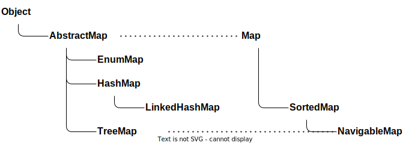

:stem: latexmath

= Hash Tables(해시 테이블)

* 데이터를 효율적으로 관리하는 기술은 컴퓨터 과학에서 전통적으로 중요한 주제
* 데이터를 저장하는 것 외에도 저장소에서 데이터를 효율적으로 복구하는 것도 중요한 관심사
* 특정 데이터 처리를 수행하는 최고의 알고리즘을 사용하더라도 데이터 관리가 최적화되지 않으면 성능 저하
* 배열, 연결 리스트, 트리, 그래프 등 이러한 데이터 구조는 여러 용도에 적합
* 하지만, 저장된 데이터를 찾고 복구하는 데 걸리는 시간 복잡도는 높음

== 1. 해싱

* 가변 길이 입력을 받아 고정 길이 출력 값(해시 코드 또는 해시)을 생성하는 과정
* 해싱 함수는 가변 길이 입력을 해시로 변환하는 역할
* 표준 해시 함수는 없음
** 이는 데이터 입력의 일반적인 기대 특성에 따라 해시 함수를 개발할 수 있음을 의미
* 해싱 메커니즘
+
image:https://www.baeldung.com/wp-content/uploads/sites/4/2022/04/Hashing.png[Hashing]
* 해싱 함수는 가변 길이 입력의 바이트 수를 증가시키거나 감소
** 입력이 해시 코드보다 크면 바이트 수가 감소
** 입력이 해시 코드보다 작으면 바이트 수가 증가
* 비밀번호 저장 및 확인, 메시지 서명 생성, 데이터 관리 구조 제공 등

== 2. 해시 테이블

* 특정 키를 해당 값에 연결하는 데이터 구조
* 일반적으로 데이터를 저장하기 위해 연관 배열로 구현
* 해시 함수는 데이터가 배열의 어느 지점에 저장되어야 하는지(인덱스)를 계산하는 데 사용
* 해시 테이블을 키-값 조회로 이해
** 값(데이터)에 연결된 키가 주어지면 테이블에서 빠른 조회를 통해 해당 값 복구
** 사람의 이름을 키로 활용해 개인 정보와 연결할 수 있는 해시 테이블
* 해시 테이블 개념도
+
image:https://www.baeldung.com/wp-content/uploads/sites/4/2022/04/HashTable3.png[HashTable3]
* 다양한 언어에서 여러 이름으로 사용
** Java의 HashMap
** Python의 dict 클래스
** C++의 map 클래스
** Lisp의 alist
* 시간-공간 트레이드오프의 좋은 예
** 시간이 무한하다면 이진 검색을 통해 특정 데이터 복구
** 공간이 무한하다면 전체 키를 인덱스로 사용하여 데이터를 저장할 수 있는 배열
** 실제 세계에서는 제한된 시간과 공간 내에서 처리

=== 2.1. 해시 테이블의 충돌

* 해시 함수는 가변 길이 키를 고정 길이 인덱스로 매핑하므로 실제로 무한 집합을 유한 집합으로 매핑
** 충돌 발생
** 해시 테이블에서 충돌이란 해시 함수가 여러 키를 동일한 인덱스로 매핑하고 결과적으로 테이블의 동일한 메모리 버킷으로 매핑하는 것
* 충돌을 해결 방안
** Separate Chaining
*** 해시 테이블의 메모리 버킷에 연결 리스트를 지원하여 충돌을 해결
*** 동일한 메모리 버킷으로 매핑된 데이터(키가 동일한 인덱스를 생성)는 연결 리스트에 추가
* Linear Probing
** 열린 주소 지정
** 충돌이 발생하면 데이터 삽입을 위해 다음 사용 가능한 인덱스를 찾아서 해결
* Resize and Copy
** 해시 테이블을 크기를 조정하고 데이터를 다시 배포하는 간단한 기술
** 충돌이 발생할 때 이 과정을 수행하여 즉각적인 충돌 문제를 해결하고 가까운 미래의 다른 충돌을 방지

== 3. 데이터 관리의 복잡성

* 해시 테이블은 데이터 관리 측면에서 훌륭한 구조
* key/value 체계는 직관적이며 다양한 시나리오의 여러 데이터에 잘 맞음
* 해시 테이블에서 데이터 검색, 삽입 및 삭제의 평균 복잡도는 O(1) — 상수 시간
** 평균적으로 단일 해시 테이블 조회가 원하는 메모리 버킷을 찾기에 충분함을 의미
* 최악의 경우는 일반적으로 O(n) — 선형 시간
** 모든 데이터가 동일한 인덱스로 매핑될 때 발생
** 잘 설계된 해시 테이블은 일반적으로 충돌이 적음

=== 3.1. 해시 테이블과 다른 데이터 구조 비교

* 정렬되지 않은 연결 리스트(이중 연결 순환 리스트 구현)
** 연결 리스트에서 특정 요소를 삽입하고 삭제하는 것은 매우 간단 stem:[O(1)]
** 유사하게 삭제할 요소가 주어지면 일정한 시간 내에 연산 수행 stem:[O(1)].
** 특정 요소를 검색하기 위해서는 요소를 찾을때가지 확인해야 하므로 평균 복잡도는 O(n)
* 이진 검색
** 검색 복잡도를 줄일 수 있음
** 그러나 이러한 경우에는 정렬된 연결 리스트가 필요
** 정렬된 연결 리스트에 요소를 삽입하기 위해서는 복잡성 증가
* 정렬된 이중 연결 순환 리스트
** 삽입 정렬 알고리즘으로 리스트를 정렬 상태로 유지하면 삽입 복잡도는 O(n)
** 삭제 복잡도는 여전히 O(1)
** 요소를 찾기 위해 이진 검색을 사용하면 검색 복잡도는 O(log n)
* 삽입, 삭제 및 검색 작업에 대한 정렬되지 않은 리스트, 정렬된 리스트 및 해시 테이블의 평균 시간 복잡도 비교
+
[cols="1,1a,1a,1a"]
|===
| ^s|삽입	^s|삭제	^s|검색
|해시 테이블	^| stem:[\mathcal{O}(1)] ^| stem:[\mathcal{O}(1)] ^| stem:[\mathcal{O}(1)]
|정렬되지 않은 연결 리스트 ^| stem:[\mathcal{O}(1)] ^| stem:[\mathcal{O}(1)] ^| stem:[\mathcal{O}(n)]
|정렬된 연결 리스트 ^|	stem:[\mathcal{O}(n)] ^| stem:[\mathcal{O}(1)] ^| stem:[\mathcal{O}(\log n)]
|===

=== 4. Java에서의 해쉬 테이블

* 모든 인덱스 유형에 의해 직접 접근할 수 있는 컨테이너
* 배열 또는 벡터처럼 작동하지만, 인덱스 변수는 정수일 필요가 없음
* key와 value의 쌍으로 구성
** key
*** 쌍의 첫 번째 구성 요소
*** 테이블의 인덱스로 사용
** value
*** 쌍의 두 번째 구성 요소
*** 조회하는 정보 포함
* 테이블은 맵
** 키가 값으로 매핑되는 것으로 생각할 수 있기 때문
** 수학적 함수처럼 작동
*** f(key) = value
* 두 개의 병렬 배열을 사용하여 구현할 수 있기 때문에 연관 배열이라고도 함
** 한 배열에는 key, 다른 배열에는 value
* Java에서 지원하는 Map 클래스
+

==== 4.1. JAVA Map 인터페이스

Java Collections Framework는 그림 8.1과 같이 Map 인터페이스를 포함합니다. 이는 java.util 패키지에서 다음과 같이 정의됩니다:

[source,java]
----
public interface Map {
    int size();
    boolean isEmpty();
    boolean containsKey(Object key);
    boolean containsValue(Object value);
    Object get(Object key);
    Object put(Object key, Object value);
    Object remove(Object key);
    void putAll(Map map);
    void clear();
    public Set keySet();
    public Collection values();
    public Set entrySet();
    public interface Entry {
        Object getKey();
        Object getValue();
        Object setValue(Object value);
        boolean equals(Object o);
        int hashCode();
    }
    boolean equals(Object o);
    int hashCode();
}
----

==== 4.2. HashMap 클래스

그림 8.1의 클래스 계층 구조에서 볼 수 있듯이, Java는 Map 인터페이스의 네 가지 구현을 정의합니다.

AbstractMap 클래스, HashMap 클래스, TreeMap 클래스, WeakHashMap 클래스.

===== 예제 8.1 HashMap을 이용해 독일어-영어 사전을 만들고, Map에서 정의한 메서드를 이용해 데이터를 확인해 보자.

* 아래의 코드를 입력하고, 실행해 본다.
+
[source,java]
----
public class TestDictionary {
    public static void main(String[] args) {
    Map map = new HashMap();
        map.put("Tag","day");
        map.put("Hut","hat");
        map.put("Uhr","clock");
        map.put("Rad","wheel");
        map.put("Ohr","ear");
        map.put("Tor","gate");
        System.out.println("map=" + map);
        System.out.println("map.size()=" + map.size());
        System.out.println("map.keySet()=" + map.keySet());
        System.out.println("map.values()=" + map.values());
        System.out.println("map.get(\"Uhr\")=" + map.get("Uhr"));
        System.out.println("map.remove(\"Rad\")=" + map.remove("Rad"));
        System.out.println("map.get(\"Rad\")=" + map.get("Rad"));
        System.out.println("map=" + map);
        System.out.println("map.size()=" + map.size());
    }
}
----
* 출력은 다음과 같다
+
[source,console]
----
map={Rad=wheel, Uhr=clock, Ohr=ear, Tor=gate, Hut=hat, Tag=day} map.size()=6
map.keySet()=[Rad, Uhr, Ohr, Tor, Hut, Tag] map.values()=[wheel, clock, ear, gate, hat, day] map.get("Uhr")=clock
map.remove("Rad")=wheel map.get("Rad")=null
map={Uhr=clock, Ohr=ear, Tor=gate, Hut=hat, Tag=day} map.size()=5
----
* put() 메서드는 key/value 쌍을 테이블에 삽입
+
[source,console]
----
map.put("Tag","day");
----
** "Tag"는 key이고 "day"는 value
* HashMap.toString() 메서드를 호출하여 전체 Map 객체 출력
* HashMap.size() 메서드를 호출하여 Map 객체에 등록된 key/value 요소의 갯수 확인
* HashMap.keySet() 메서드를 호출하여 모든 키를 포함하는 Set 객체 반환
* HashMap.values() 메서드를 호출하여 모든 값을 포함하는 Collection 객체 반환
* HashMap.get() 메서드에 key을 주면, key에 해당하는 value 반환
* HashMap.remove() 메서드에 key를 주면, 해당 key/value 요소를 찾아 삭제

===== 예제 8.2 Java HashMap에 key/value 요소를 무작위 순서로 넣고 저장된 결과를 확인해 보자.

* 두 개의 독립적인 HashMap 객체를 만들고 동일한 key/value 쌍을 다른 순서로 저장
+
[source,java]
----
public class TestHashTable {
    public static void main(String[] args) {
        Map map1 = new HashMap();
        map1.put("Tor","gate");
        map1.put("Rad","wheel");
        map1.put("Tag","day");
        map1.put("Uhr","clock");
        map1.put("Hut","hat");
        map1.put("Ohr","ear");
        System.out.println("map1=" + map1);
        Map map2 = new HashMap();
        map2.put("Rad","wheel");
        map2.put("Uhr","clock");
        map2.put("Ohr","ear");
        map2.put("Tag","day");
        map2.put("Tor","gate");
        map2.put("Hut","hat");
        System.out.println("map2=" + map2);
    }
}
----
* 출력은 다음과 같다
+
[source,console]
----
map1={Rad=wheel, Uhr=clock, Ohr=ear, Tor=gate, Hut=hat, Tag=day}
map2={Rad=wheel, Uhr=clock, Ohr=ear, Tor=gate, Hut=hat, Tag=day}
----
* HashMap에 저장된 순서는 두 테이블에서 동일하며, 삽입된 순서와 무관
* Java의 HashMap은 hash table과 같이 동작

==== 4.3. JAVA Hash Code(해시 코드)

* HashMap 테이블에 key/value 쌍이 저장된 순서는 테이블의 용량과 객체의 해시 코드 값에 의해 달라짐
** 모든 객체는 객체에 저장된 실제 데이터에서 계산된 고유 해시 코드를 가짐
** Object.hashCode() 메서드는 각 객체에 대한 해당 코드 반환

===== 예제 8.3 앞에서 사용된 key/value 쌍의 key 값에 대한 고유 해시 코드를 출력해 보자.

* 이전 프로그램에 저장된 문자열 객체의 고유 해시 코드 출력
+
[source,java]
----
public class TestHashCodes {
    public static void main(String[] args) {
        printHashCode("Rad");
        printHashCode("Uhr");
        printHashCode("Ohr");
        printHashCode("Tor");
        printHashCode("Hut");
        printHashCode("Tag");
    }

    private static void printHashCode(String word) {
        System.out.printf("%s: %s%n", word, word.hashCode());
    }
}
----
* 출력은 다음과 같다
+
[source,console]
----
Rad:	81909
Uhr:	85023
Ohr:	79257
Tor:	84279
Hut:	72935
Tag:	83834
----

==== 4.4. Hash Table(해시 테이블)

해시 테이블은 키 값을 사용하여 데이터 값을 저장할 위치를 계산하는 특수 함수를 사용하는 테이블입니다. 이 특수 함수는 테이블의 해시 함수라고 합니다. 조회 시간은 테이블의 크기와 무관하기 때문에 해시 테이블은 매우 빠른 접근 시간을 가집니다.

Java는 java.util 패키

지에 Hashtable 클래스를 정의했습니다. 그러나 이는 사실상 HashMap 클래스로 업그레이드되었습니다. 즉, HashMap 테이블은 Hashtable 객체가 할 수 있는 모든 작업을 수행할 수 있습니다. 또한 HashMap 클래스는 나머지 Java Collections Framework와 더 일관성이 있습니다.
일반적인 해시 테이블은 해시 값으로 인덱싱된 객체 배열처럼 보입니다. 이는 해시 함수의 범위가 배열의 인덱스 값 범위와 일치하도록 관리됩니다. 이는 거의 항상 배열의 크기로 나눈 나머지 연산자를 사용하여 관리됩니다:

그림 8.2 해시 테이블

===== 예제 8.4 크기 11의 해시 테이블에 키 매핑

이 프로그램은 크기 11의 해시 테이블에 저장될 문자열 객체의 해시 코드 값을 출력합니다:

[source,java]
----
public class TestHashing {
    private static final int MASK = 0x7FFFFFFF; // = 2^32-1
    private static final int CAPACITY = 11;
    public static void main(String[] args) {
        printHash("Rad");
        printHash("Uhr");
        printHash("Ohr");
        printHash("Tor");
        printHash("Hut");
        printHash("Tag");
    }

    private static void printHash(String word) {
        System.out.println("hash(" + word + ") = " + hash(word));
    }

    private static int hash(Object object) {
        return (object.hashCode() & MASK) % CAPACITY;
    }
}
----

출력은 다음과 같습니다:

[source,console]
----
hash(Rad)	=	3
hash(Uhr)	=	4
hash(Ohr)	=	2
hash(Tor)	=	8
hash(Hut)	=	5
hash(Tag)	=	3
----

해시 함수 값은 CAPACITY가 11이고 MASK가 2147483647일 때 계산됩니다. 이는 16진수로 0x7FFFFFFF로 표현됩니다. n & MASK 연산은 n이 가진 부호를 단순히 제거합니다. 이는 Java에서 나머지 연산자를 사용하여 배열 인덱스를 계산하기 전에 수행해야 할 올바른 작업입니다. Java는 (C++과 달리) m이 음수인 경우 m % CAPACITY가 음수 결과를 줄 수 있습니다. 따라서 이 예제에서 해시() 함수가 반환하는 값은 0에서 10 범위 내에 보장됩니다.
첫 번째 다섯 개의 문자열은 인덱스 값 3, 4, 2, 8, 5에 해시되므로 해시 테이블의 해당 위치에 저장됩니다. 그러나 여섯 번째 문자열("Tag")도 3으로 해시되어 이미 3번 구성 요소에 저장된 "Rad"와 충돌합니다. 이러한 충돌이 발생할 때 적용되는 가장 일반적인 알고리즘은 단순히 새 항목을 다음 사용 가능한 구성 요소에 넣는 것입니다. 이 예제에서는 구성 요소 6입니다. "Uhr"는 이미 구성 요소 4에 있고 "Hut"는 이미 구성 요소 5에 있기 때문입니다. 이 "충돌 해결" 알고리즘은 선형 조사라고 합니다.
HashMap 클래스는 예제 8.4와 같은 해시 함수를 사용하여 containsKey(), get(), put(), remove(), entrySet() 액세서 메서드를 구현합니다. 초기 해시 테이블 크기는 101로 설정됩니다. 이를 통해 이전 예제에서 여섯 개 문자열이 저장된 순서를 이해할 수 있습니다.

===== 예제 8.5 크기 101의 해시 테이블에 키 매핑

이 프로그램은 예제 8.4와 동일하지만 해시 테이블 CAPACITY가 11 대신 101입니다:

[source,java]
----
public class TestHashing {
    private static final int MASK = 0x7FFFFFFF; // = 2^32-1
    private static final int CAPACITY = 101;

    public static void main(String[] args) {
        printHash("Rad");
        printHash("Uhr");
        printHash("Ohr");
        printHash("Tor");
        printHash("Hut");
        printHash("Tag");
    }

    private static void printHash(String word) {
        System.out.println("hash(" + word + ") = " + hash(word));
    }

    private static int hash(Object object) {
        return (object.hashCode() & MASK) % CAPACITY;
    }
}
----

출력은 다음과 같습니다:

[source,console]
----
hash(Rad)	=	99
hash(Uhr)	=	82
hash(Ohr)	=	73
hash(Tor)	=	45
hash(Hut)	=	13
hash(Tag)	=	4
----

결과는 항목이 액세스되는 순서와 반대로 저장됩니다.

==== 4.5. 해시 테이블 성능

크기가 101인 해시 테이블에 6개의 요소가 있으면 매우 효율적으로 작동합니다. 충돌이 거의 발생하지 않기 때문에 접근 함수들은 즉시 실행되어 상수 시간 O(1)에 작동합니다. 이는 배열과 같은 직접 접근입니다.

그러나 크기가 101이고 요소가 100개인 해시 테이블은 충분히 나쁜 성능을 보일 가능성이 높습니다. 요소를 저장하는 과정에서 많은 충돌이 발생했기 때문에 예를 들어 문자열 "Lob"가 자리를 찾기 위해 60번의 충돌이 발생하면 각각 접근할 때마다 60번의 "탐사(probe)"가 필요합니다. 이러한 성능은 O(n)에 가깝습니다 — 연결 리스트보다 나은 것이 거의 없습니다.

이 문제의 해결책은 해시 테이블이 너무 가득 차지 않도록 하는 것입니다.

이는 테이블이 특정 임계 크기에 도달할 때마다 크기를 조정함으로써 이루어집니다.

가득 찬 정도는 두 매개변수에 따라 달라집니다: 해시 테이블의 크기는 테이블에 있는 요소의 실제 수이고, 테이블의 용량은 그 구성 요소의 수입니다. 이 두 매개변수의 비율을 로드 팩터라고 합니다. 이 절의 첫 번째 예에서 크기는 6이고 용량은 101이므로 로드 팩터는 6/101 = 5.94%입니다. 두 번째 예에서 크기는 100이므로 로드 팩터는 100/101 = 99.01%입니다.

HashMap 클래스는 로드 팩터가 특정 임계값에 도달할 때 자동으로 해시 테이블의 크기를 조정합니다. 이 임계값은 public HashMap(int initialCapacity, float loadFactor) 생성자를 사용하여 해시 테이블을 생성할 때 설정할 수 있습니다. 이 생성자 중 하나의 인수만을 사용하는 경우나 두 인수 모두를 사용하지 않는 경우, 기본 값인 용량 101과 로드 임계값 75%가 사용됩니다.

==== 4.6. 충돌 해결 알고리즘

이전 예에서 사용된 충돌 해결 알고리즘은 선형 탐사(linear probing)라고 합니다. 새 항목이 이미 사용 중인 테이블 구성 요소로 해시되면 알고리즘은 빈 구성 요소가 발견될 때까지 인덱스를 증가시키도록 지정합니다. 이 과정에서 해시 테이블의 처음으로 되돌아갈 수 있습니다.

===== 예제 8.6 선형 탐사

이 프로그램은 예제 8.4의 프로그램을 확장한 것입니다. 각 해시 후 테이블 구성 요소와 해싱 후 로드 팩터를 추적합니다.

[source,java]
----
public class Ex1406
public class TestLinearProbing {
    private static final int MASK = 0x7FFFFFFF; // 2^32-1
    private static final int CAPACITY = 11;
    private static int size = 0;
    private static boolean[] used = new boolean[CAPACITY];

    public static void main(String[] args) {
        printHash("Rad");
        printHash("Uhr");
        printHash("Ohr");
        printHash("Tor");
        printHash("Hut");
        printHash("Tag");
        printHash("Eis");
        printHash("Ast");
        printHash("Zug");
        printHash("Hof");
        printHash("Mal");
    }

    private static void printHash(String word) {
        System.out.printf("hash(%s) = %d, load = %d%%%n",
        word, hash(word), 100*size/CAPACITY);
    }

    private static int hash(Object object) {
        ++size;
        int h = (object.hashCode() & MASK) % CAPACITY;
        while (used[h]) {
            System.out.printf("%d, ", h);
            h = (h+1)%CAPACITY;
        }
        used[h] = true;
        return h;
    }
}
----

출력은 다음과 같습니다:

[source,console]
----
hash(Rad) = 3, load = 9%
hash(Uhr) = 4, load = 18%
hash(Ohr) = 2, load = 27%
hash(Tor) = 8, load = 36%
hash(Hut) = 5, load = 45%
3, 4, 5, hash(Tag) = 6, load = 54%
5, 6, hash(Eis) = 7, load = 63%
3, 4, 5, 6, 7, 8, hash(Ast) = 9, load = 72%
9, hash(Zug) = 10, load = 81%
3, 4, 5, 6, 7, 8, 9, 10, hash(Hof) = 0, load = 90%
2, 3, 4, 5, 6, 7, 8, 9, 10, 0, hash(Mal) = 1, load = 100%
----

size 필드는 테이블에 해싱된 항목의 수를 포함합니다. used[] 배열은 테이블의 사용된 구성 요소를 플래그 처리합니다. printHash() 메서드는 해시 테이블 인덱스와 결과적으로 로드 팩터를 퍼센트로 출력합니다. 선형 탐사가 시작될 때마다 연이은 인덱스 번호 탐사가 출력됩니다.

예제 8.4에서 볼 수 있듯이 "Tag" 삽입 시 충돌이 발생합니다(14번째 줄에서). 이 프로그램은 "Tag"가 인덱스 번호 3, 4, 5에서 세 번의 충돌이 발생한 후에 비어 있는 해시 위치를 인덱스 6에서 찾는 것을 보여줍니다. 이 삽입 후 테이블은 54%로 가득 차 있습니다.
그 이후 각 항목은 모두 충돌합니다. 테이블이 채워짐에 따라 충돌 수가 더 빈번해집니다. 마지막 항목 "Mal"은 10번의 충돌을 갖습니다. 이는 이후 이 항목이 접근될 때마다 이 항목을 찾기 전에 11개의 항목을 모두 탐색해야 함을 의미하며, 이는 명백히 O(n) 과정입니다.

"Mal" 삽입 시 인덱스 "wraparound"에 주목하세요: 2, 3, 4, 5, 6, 7, 8, 9, 10, 0, 1.

선형 탐사보다 성능이 일반적으로 더 좋은 또 다른 충돌 해결 알고리즘은 제곱 탐사(quadratic probing)라고 불립니다. 이 알고리즘은 탐사 중에 항목을 점프하며, 그 결과 사용된 구성 요소가 더 균일하게 분포되어 큰 클러스터를 감소시킵니다. 이로 인해 성능이 개선됩니다.

===== 예제 8.7 제곱 탐사

이 프로그램은 예제 8.6의 프로그램과 동일하지만 수정된 hash() 함수를 사용합니다.

[source,java]
----
public class

 TestQuadraticProbing {
    private static final int MASK = 0x7FFFFFFF; // 2^32-1
    private static final int CAPACITY = 11;
    private static int size = 0;
    private static boolean[] used = new boolean[CAPACITY];

    public static void main(String[] args) {
        printHash("Rad");
        printHash("Uhr");
        printHash("Ohr");
        printHash("Tor");
        printHash("Hut");
        printHash("Tag");
        printHash("Eis");
        printHash("Ast");
        printHash("Zug");
        printHash("Hof");
        printHash("Mal");
    }

    private static void printHash(String word) {
        System.out.printf("hash(%s) = %d, load = %d%%%n",
        word, hash(word), 100*size/CAPACITY);
    }

    private static int hash(Object object) {
        ++size;
        int h = (object.hashCode() & MASK) % CAPACITY;
        if (used[h]) {
            int h0 = h;
            int jump = 1;
            while (used[h]) {
                System.out.printf("%d, ", h);
                h = (h0 + jump*jump)%CAPACITY; // 제곱 증가
                ++jump;
            }
        }
        used[h] = true;
        return h;
    }
}
----

출력은 다음과 같습니다:

[source,console]
----
hash(Rad) = 3, load = 9%
hash(Uhr) = 4, load = 18%
hash(Ohr) = 2, load = 27%
hash(Tor) = 8, load = 36%
hash(Hut) = 5, load = 45%
3, 4, hash(Tag) = 7, load = 54%
5, hash(Eis) = 6, load = 63%
3, 4, 7, hash(Ast) = 1, load = 72%
hash(Zug) = 9, load = 81%
----

여기서 주요 차이점은 충돌이 발생할 때 while 루프 내에서 탐사되는 인덱스 번호의 순서입니다. 선형 탐사 대신 제곱 탐사는 인덱스 3에서 "Ast" 삽입이 충돌할 경우, 선형 탐사는 예제 8.6에서 인덱스 4, 5, 6, 7, 8, 9를 계속 탐사했습니다. 그러나 제곱 탐사에서는 인덱스 3, 4, 7, 1 (= 12 mod 11)만이 연이은 점프 1, 4, 9 (12, 22, 32)을 사용하여 탐사됩니다. 선형 탐사는 50% 더 많은 탐사를 필요로 합니다.

제곱 탐사 알고리즘이 성능이 향상되었지만 그 대가로 더 많은 무한 루프가 발생할 가능성이 더 높습니다. 예제 8.7에서 그런 일이 발생합니다. "Hof" 문자열은 초기에 인덱스 3에 해시됩니다. 선형 탐사 알고리즘은 8번의 충돌 후 인덱스 0에서 빈 셀을 찾았습니다 ( = 11 mod 11). 그러나 제곱 탐사 알고리즘에 의해 이 항목에 사용된 프로브 시퀀스는 "Ast"와 동일합니다: 3, 4, 7, 1, 8, 6, 6, 8 1, 7, 4, 3, 4, . . . . 이는 정지될 수 없는 행동입니다. 이는 81%로 테이블이 가득 차 있지만 삽입이 실패합니다. 선형 탐사에서는 이런 일이 발생하지 않습니다.

==== 4.7. 별도 체인

더 효과적인 충돌 해결 알고리즘을 고안하는 대신, 테이블 구성 요소당 하나 이상의 항목을 허용하여 충돌을 완전히 피할 수 있습니다. 이 방법은 별도 체인(separate chaining)이라고 하며, 다중 항목을 보유하기 위해 연결 리스트("체인")를 사용합니다. 이 문맥에서 구성 요소는 일반적으로 "버킷(bucket)"이라고 불립니다.

===== 예제 8.8 별도 체인

다음은 HashTable 클래스 정의 일부입니다. 별도 체인을 사용합니다.

[source,java]
----
public class HashTable {
    private static final int MASK = 0x7FFFFFFF; // 2^32-1
    private static int capacity = 101;
    private static int size = 0;
    private static float load = 0.75F;
    private static LinkedList[] buckets;

    HashTable() {
        buckets = new LinkedList[capacity];
        for (int i = 0; i < capacity; i++) {
            buckets[i] = new LinkedList();
        }
    }

    HashTable(int capacity, float load) {
        this();
        this.capacity = capacity;
        this.load = load;
    }

    Object put(Object key, Object value) {
        int h = hash(key);
        LinkedList bucket=buckets[h];
        Object oldValue = null;
        for (ListIterator it = bucket.iterator(); it.hasNext(); ) {
            Map.Entry entry = it.next();
            if (entry.getKey().equals(key)) {
                break;
            }
        }
        if (entry.getKey().equals(key)) {
            oldValue = entry.setValue(value);
        } else {
            bucket.add(new Entry(key,value));
        }
        return oldValue;
    }

    // 더 많은 메서드...
}
----

put() 메서드는 두 가지 다른 목적으로 서비스를 제공합니다. 테이블에 이미 주어진 키를 가진 항목이 있으면 해당 항목의 값을 변경합니다. 그렇지 않으면 해당 키/값 쌍을 새로 추가합니다. java.util.HashMap 클래스는 Example 8.8과 유사한 방식으로 별도 체인을 사용합니다.

==== 4.8. 응용

해시 테이블은 시스템 프로그래밍에서 널리 사용됩니다. 또한, 관계형 데이터베이스의 주요 구성 요소입니다.

다음은 응용 프로그래밍 예입니다.

===== 예제 8.9 Concordance

Concordance는 텍스트 문서에서 나타나는 단어 목록과 단어가 나타난 줄 번호를 함께 나열한 목록입니다. 책의 색인과 비슷하지만 페이지 번호 대신 줄 번호를 나열합니다. Concordance는 문서를 분석하여 문서를 직접 읽는 것으로는 알 수 없는 단어 빈도와 관련성을 찾는 데 유용합니다.

다음은 Shakespeare의 연극 줄리어스 시저에서 가져온 이 특정 텍스트를 사용하여 Concordance를 구축하는 프로그램입니다. 생성된 Concordance의 일부는 오른쪽에 표시됩니다.

[source,java]
----
public class Concordance {
    private Map<String,String> map = new HashMap<String,String>();

    public Concordance(String file) {
        int lineNumber = 0;
        try {
            Scanner input = new Scanner(new File(file));
            while (input.hasNextLine()) {
                String line = input.nextLine();
                ++lineNumber;
                StringTokenizer parser = new StringTokenizer(line, ",.;:()-!?' ");
                while (parser.hasMoreTokens()) {
                    String word = parser.nextToken().toUpperCase();
                    String listing = map.get(word);
                    if (listing == null) {
                        listing = "" + lineNumber;
                    } else {
                        listing += ", " + lineNumber;
                    }
                    map.put(word,listing);
                }
            }
            input.close();
        } catch(IOException e) {
            System.out.println(e);
        }
    }

    public void write(String file) {
        try {
            PrintWriter output = new PrintWriter(file);
            for (Map.Entry<String,String> entry : map.entrySet()) {
                output.println(entry);
            }
            output.close();
        } catch(IOException e) {
            System.out.println(e);
        }
    }
}
----

Figure 8.3 Example 8.9에서의 Concordance

해시

 테이블은 line 2에서 정의됩니다. 그 키와 값 필드는 모두 문자열 유형을 갖습니다. line 4의 생성자는 입력 파일의 이름을 인수로 취합니다. 이 생성자는 java.util.Scanner 객체를 사용하여 파일을 한 줄씩 읽습니다. 각 줄은 line 11에 정의된 java.util.StringTokenizer 객체에 의해 구문 분석됩니다. 구문 분석기는 ",.;:()-!?' "의 11개 문자를 구분 기호로 사용합니다. 각 구문 분석된 단어는 해시 테이블의 키로 사용됩니다. 해당 값은 16번 줄과 18번 줄에서 누적된 줄 번호 문자열입니다.

line 29의 write() 메서드는 for-each 루프를 사용하여 concordance를 지정된 파일에 인쇄합니다. line 32에서 맵의 entrySet() 메서드는 Map.Entry<String,String> 유형의 요소 집합을 반환합니다. 이 요소는 해시 테이블에 저장된 키/값 쌍입니다. 각 키는 입력 파일의 단어이고 그 항목은 텍스트에서 그 단어가 나타난 줄 번호의 목록입니다.

다음은 테스트 프로그램입니다.

[source,java]
----
public class TestConcordance {
    public static final String PATH = "B:\\DSWJ2\\src\\ch08\\ex09\\";
    public static final String IN_FILE = "Shakespeare.txt";
    public static final String OUT_FILE = "Shakespeare.out";

    public static void main(String[] args) {
        Concordance c = new Concordance(PATH+IN_FILE);
        c.write(PATH+OUT_FILE);
    }
}
----

예제 8.9의 프로그램에서 출력은 해시 테이블의 중요한 기능을 보여줍니다: 그 내용은 정렬되어 있지 않습니다. Concordance의 알파벳 순 출력을 얻으려면 정렬해야 합니다.

==== 4.9. TreeMap 클래스

TreeMap 클래스는 AbstractMap 클래스를 확장하고 SortedMap 인터페이스를 구현합니다. 그 이름은 해시 테이블 대신 이진 검색 트리를 백업 구조로 사용하기 때문에 트리 맵이라고 불립니다.

Figure 8.4 Example 8.10에서 정렬된 Concordance

그러나 여전히 키/값 항목의 맵입니다. 이진 검색 트리 구조로, O(1) 액세스 시간을 포기하지만 그 키는 정렬됩니다.

===ß== 예제 8.10 정렬된 Concordance

Example 8.9의 Concordance 클래스에서 line 2의 HashMap을 TreeMap으로 교체하면 정렬된 concordance를 얻을 수 있습니다:

[source,java]
----
private Map<String,String> map = new HashMap<String,String>();
----

동일한 테스트 프로그램에서 생성된 출력의 일부는 Figure 8.4에 표시됩니다.