= Linked Data Structures

Arrays work well for unordered sequences, and even for ordered sequences if they don’t change much. But if you want to maintain an ordered list that allows quick insertions and deletions, you should use a linked data structure. This chapter shows how to do that.

== MAINTAINING AN ORDERED ARRAY

Chapter 2 outlines how the binary search can find elements very quickly in an array that is sorted. This suggests that we should keep our arrays in sorted order. But inserting new elements in an ordered array is difficult. The main problem is that we have to shift all the larger elements forward to make room for the new element to be placed in its correct ordered position. This can be done by the insert() method shown in Example 3.1.

=== EXAMPLE 3.1 Inserting into an Ordered Array

[source,java]
----
1	void insert(int[] a, int n, int x) {
2	    // preconditions: a[0] <= ... <= a[n-1], and n < a.length;
3	    // postconditions: a[0] <= ... <= a[n], and x is among them;
4	    int i = 0;
5	    while (i < n && a[i] <= x) {
6	        ++i;
7	    }
8	    System.arraycopy(a, i, a, i+1, n-i); // copies a[i..n) into a[i+1..n+1)
9	    a[i] = x;
10	}
----

The insert() method takes three arguments: the array a[], the number n of elements that are already sorted in the array, and the new element x to be inserted among them. The preconditions at line 2 specify that the first n elements of the array are in ascending order and that the array has room for at least one more element. The postconditions at line 3 specify that the array is still in ascending order and that x has been successfully inserted among them.

The code at lines 4–7 searches the array for the correct position for x to be inserted. It should be the smallest index i for which a[i] > x. For example, if x = 50 for the array shown in Figure 3.1, then the correct position for x is at index i = 1, because a[0] <= x < a[1].

After the correct position i has been located for x, the insert() method shifts the elements that are greater than x one position to the right. This is accomplished by the call

[source,java]
----
System.arraycopy(a, i, a, i+1, n-i);
----

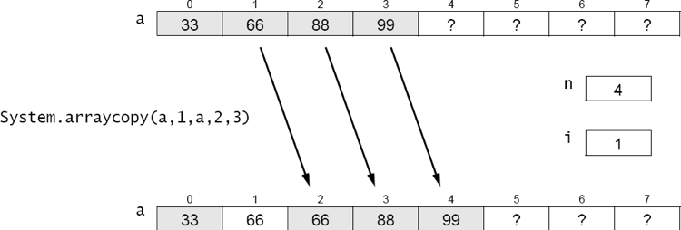
Figure 3.1 Making room for the new element

at line 8. The arraycopy() method is a static method in the System class. It is usually the most efficient way to copy elements between arrays or within a single array. Its five arguments are: the source array, the index of the first element to be copied from the source array, the destination array, the index in the destination array where the first element is to be copied, and the number of elements to be copied. If n = 4 and i = 1, as shown in Figure 3.1, then the call is

[source,java]
----
System.arraycopy(a, 1, a, 2, 3);
----

This shifts elements {a[1], a[2], a[3]} = {66, 88, 99} into elements {a[2], a[3], a[4]}.
Finally, x is inserted into a[i] at line 9, as shown in Figure 3.2.

image::./images/figure3_2.png[Copying x into its correct position]
Figure 3.2 Copying x into its correct position

The insert() method may have to move a lot of data. For example, if n = 1000 and x is less than all of those elements, then the method will move all 1000 elements. On average, inserting into a sorted array of n elements will move n/2 elements. So this is a (n) operation.

Deleting an element is simply the reverse of the insertion process. It too will have to move n/2 elements, on average. So deletion is also a (n) operation.

== INDIRECT REFERENCE

One solution to the data movement problem that is intrinsic to dynamic ordered arrays is to use an auxiliary index array to keep track of where the elements actually are. This solution requires more space (a second array) and makes the code a bit more complicated. But it elimi- nates the need to move the elements. It allows the elements to be stored at an arbitrary position in the array, using the auxiliary index array to locate them for ordered access.

The main idea is shown in Figure 3.3. The elements {22, 33, 44, 55, 66} are kept in arbitrary positions in the array a[], and their order is determined by some auxiliary mechanism.

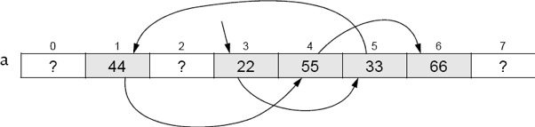
Figure 3.3 Referring to the order of the array elements

Each element is kept in a numbered component: 22 is in component 3, 33 is in component 5, 44 is in component 1, and so on. So if we save the order of the index numbers (3, 5, 1, 4, 6), then we can access the elements in order: a[3] followed by a[5] followed by a[1], and so forth.

An index array is an array whose elements are index values for another array. By storing the index numbers 3, 5, 1, 4, 6 in an index array k[] (shown in Figure 3.4), we can use them to access the data elements 22, 33, 44, 55, 66 in order.

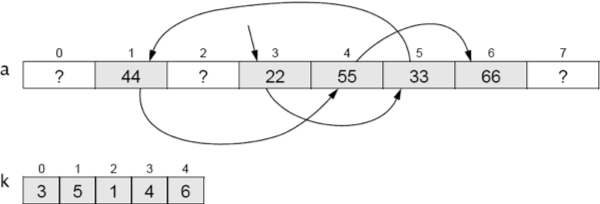
Figure 3.4 Using an index array

Now this may be an improvement, but it is not optimal. The reason we wanted to allow the element to be stored in arbitrary positions in the first place was to simplify the insertion and deletion operations. We wanted to avoid having to shift segments of a[] back and forth. But the solution shown in Figure 3.4 merely transfers that obligation from a[] to k[]. If we had to insert the element 50, we could put it at position a[0] or a[2] or any place after a[6], but we would then have to insert its index into the index array k[] between k[2] and k[3] to keep track of the order of the elements.

A better solution is to use the same array positions in the index array k[] as we are using in the data array a[]. Since the index array is keeping track of the correct order of the index numbers of the data elements, it can be used to do the same for the index numbers themselves.

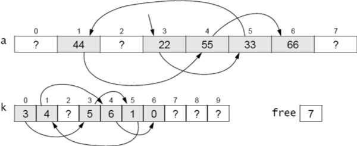
Figure 3.5 Using an index array

In Figure 3.5, the index array k[] keeps track of the order of the elements in a[]. The starting index 3 is stored in k[0]. That begins the chain of indexes: k[0] = 3, k[3] = 5, k[5] = 1, k[1] = 4, k[4] = 6, k[6] = 0. The index 0 signals the end of the ordered sequence. The index sequence 0, 3, 5, 1, 4, 6 gives us the data elements in order: a[3] = 22, a[5] = 33, a[1] = 44, a[4] = 55, a[6] = 66.

The extra variable free, shown Figure 3.5, saves the index of a free location in both the index array k[] and the data array a[]. The value 7 means that k[7] and a[7] should be used next.

The implementation of an index array solves the problem of having to shift segments of array elements back and forth during deletions and insertions. For example, to insert x = 50 in Figure 3.5, we first traverse the sequence to find the index i of the largest element that is less than x: i = 1. Then just follow these three steps:

[source,java]
----
a[free] = x;	// put x into the next free position
k[free] = k[i]; // store the next index in that position in k[]
k[i] = free++;	// store the index of x in k[] and increment free
----

The results are shown in Figure 3.6.

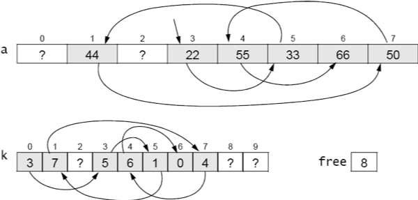
Figure 3.6 Inserting an element

The Java code for this algorithm is shown in Example 3.2. This improves the insert() method shown in Example 3.2, because its only data movement is the actual insertion of x into the array a[] at line 5.

=== EXAMPLE 3.2 Inserting into an Array that Is Indirectly Ordered

[source,java]
----
1	void insert(int x) {
2	    int i=0;
3	    while (k[i] != 0 && a[k[i]] < x) {
4	        i = k[i];
5	    }
6	    a[free] = x;
7	    k[free] = k[i];
8	    k[i] = free++;
9	}
----

The while loop at lines 3–5 is similar to the while loop at lines 5–7 in Example 3.1 on page 46: it finds the first index i for which a[k[i]] > x. At line 6, x is inserted in the next free location in the array a[]. At line 7, the index of the next location after x is stored in k[free]. At line 8, the index of x is copied into k[i], and then free is incremented to the index of the next free location.
Note that this code assumes that the array is large enough to accommodate all elements that might be inserted. In practice, we would probably include a resize() method.

== LINKED NODES

The values of the index array k[] in Figure 3.6 are used as locators, addressing the actual data array a[]. We don’t really need a separate array for them. Their relative positions in the index array match the positions of the corresponding data elements. So we can combine them into a single array of data-address pairs, as shown in Figure 3.7:

image::./images/fiture3_7.png[Storing the indexes with their elements in the same array]
Figure 3.7 Storing the indexes with their elements in the same array

In this version, the array a[] would be defined as shown in Example 3.7.

[source,java]
----
Node[] a = new Node[size];
----

where Node would now be a separate class, defined like this:

[source,java]
----
class Node {
    int data;
    int next;
}
----

This makes the array a[] a little more complex, but it eliminates the need for an auxiliary array altogether.

Fortunately, Java allows an even better solution, one that allows us to eliminate both arrays! Taking an object-oriented point of view, we see in Figure 3.8 a sequence of Node objects. Each object contains a data element and the address of the next object in the sequence. In Java, objects are directly accessed by their addresses. That’s what an object reference is: the address of where the object is stored in memory. So by reinterpreting the meaning of “address,” as a memory address (i.e., object reference) instead of an array index, we can simplify the structure to the one shown in Figure 3.8. Here, the arrows represent object references (i.e., memory addresses).

image::./images/figure3_8.png[Using objects for the elemtns and their references]
Figure 3.8 Using objects for the elements and their references

Now, instead of an array a[], we need only keep track of the single start reference. The Java runtime system does all the rest of the bookkeeping. The code is given in Example 3.3.

== EXAMPLE 3.3 A Node Class

[source,java]
----
1	class Node {
2	    int data;
3	    Node next;
4
5	    Node(int data) {
6	        this.data = data;
7	    }
8	}
----

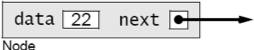
Figure 3.9 A Node object

Notice that the Node class is now _self-referential_: Its next field is declared to have type Node. Each Node object contains a field that is a reference to a Node object.

The other field in the Node class is its data field, declared at line 2 here to be an int. Of course in general this field could be any type we want—whatever type values we have to store in the list.

The Node class in Example 3.3 also includes a one-argument constructor, at line 5. Note that, since we have explicitly defined a constructor that takes at least one argument, the compiler will not implicitly define a no-argument constructor. Therefore, since we have not explicitly defined a no-argument constructor, none will exist. That means that the only way a Node object can be created is with the one-argument constructor (at line 5); that is, we must provide a data value for each new Node object that we create.

Figure 3.9 shows a typical Node object. Its data field contains the integer 22, and its next field contains a reference to another Node object (not shown). Although it is common to use an arrow like this to represent an object reference, it is good to keep in mind that the actual value of the reference is the memory address of the object to which it refers. In other programming languages, such variables are called pointers; hence their common depiction as arrows.

Recall that in Java each reference variable either locates an object or is null. The value null means that the variable does not refer to any object. The memory address that is stored in a null reference variable is 0x0 (the hexadecimal value 0); no object is ever stored at that address. Figure 3.10 shows a Node object whose next field is null.

Example 3.4 shows how the five-element list could be built.

=== EXAMPLE 3.4 Constructing a Linked List

[source,java]
----
1	Node start = new Node(22);
2	start.next = new Node(33);
3	start.next.next = new Node(44);
4	start.next.next.next = new Node(55);
5	start.next.next.next.next = new Node(66);
----

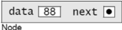
Figure 3.10 Another Node object

image::./images/figure3_11.png[Initializing start]
Figure 3.11 Initializing start

At line 1, we create a node containing the data value 22 and initialize our start variable to it. The result is shown in Figure 3.11. Note that the start variable is merely a reference to the Node object. Also note that the next reference in the Node object is null, indicated by the black dot with no arrow emanating from it. The node’s next field is null because the constructor (defined at line 5 in Example 3.3 on page 50) does not initialize it. In Java, every class field that is an object reference (i.e., its type is either a class or an interface) is automatically initialized to null, unless it is initialized by its constructor to some existing object.

In the figures that follow, each Node object is shown as a box with two parts: the left side contains the integer data, and the right side contains the next reference. This simply abbreviates the versions shown in Figure 3.9.

Continuing the code in Example 3.4, at line 2, the start node’s next field is assigned to a new Node object containing the data 33.

Now the list has two nodes, as shown in Figure 3.12.

image::./images/figure3_12.png[Adding a node]
Figure 3.12 Adding a node

The next node is added to the end of the list at line 3. To do that, we have to assign it to the next field of the node that contains 33. But the only node to which we have external access (i.e., the only node that has a variable name) is the first node. Its name is start. So we have to use the expression start.next.next to refer to the next field of the node that contains 33.

Similarly, the fourth node is added at line 4 using the expression start.next.next.next, and the fifth node is added at line 5 using the expression start.next.next.next.next. That finally gives us the five-node list shown in Figure 3.13.

image::./images/figure3_13.png[The five-node list]
Figure 3.13 The five-node list

The code in Example 3.4 is clumsy and unsuited for generalization. Obviously, if we wanted to build a linked list of 50 nodes, this approach would be unworkable. The solution is to use a local reference variable that can “walk through” the list, locating one node after the other and thereby giving local access to the nodes.

Traditionally, the variable p (for “pointer”) is used for this purpose. Since it will refer to individual nodes, it should be declared to be a Node reference, like this:

[source,java]
----
Node p;
----

And since our only access to the nodes is from the start node, we should initialize p like this:
[source,java]
----
Node p=start;
----

This is shown in Figure 3.14. Then the assignment
[source,java]
----
p = p.next;
----

will advance the locator variable p to the next node, as shown in Figure 3.15. This same assignment can thus be executed as many times as is needed to advance through the linked list.

[cols="1a,1a", frame=none, grid=none]
|===
|
|
|Figure 3.14 Initializing p at the start node
|Figure 3.15 Advancing p to the second node
|===

Example 3.5 shows how we could have used this technique to build the linked list in the first place.

=== EXAMPLE 3.5 Constructing a Linked List

[source,java]
----
1	start = new Node(22);
2	Node p=start;
3	p.next = new Node(33);
4	p = p.next;
5	p.next = new Node(44);
6	p = p.next;
7	p.next = new Node(55);
8	p = p.next;
9	p.next = new Node(66);
----

This code may not seem much better than the other version in Example 3.4. But one big advange is that it is easily managed within a loop. For example, the same list can be built with the three lines of code in Example 3.6.

=== EXAMPLE 3.6 Using a for Loop

[source,java]
----
1	Node start = new Node(22), p = start;
2	for (int i=0; i<4; i++) {
3	    p = p.next = new Node(33+11*i);
4	}
----

Obviously, this form could just as easily build a linked list of 50 nodes. Each step in the execution of this code is shown in Figure 3.16.The reference variable p is analogous to an array index i: It advances through the nodes of a linked list just as i advances through the elements of an array. Consequently, it is natural to use p in a for loop, just as we would use the array index i. For example, compare Example 3.7 with Example 3.8.

image::./images/figure3_16.png[Trace of Example 3.6]
Figure 3.16 Trace of Example 3.6

=== EXAMPLE 3.7 Using a for Loop to Print a Linked List

[source,java]
----
1	for (Node p = start; p != null; p = p.next) {
2	    System.out.println(p.data);
3	}
----

=== EXAMPLE 3.8 Using a for Loop to Print an Array

[source,java]
----
1	for (int i=0; i < n; i++) {
2	    System.out.println(a[i]);
3	}
----

In both listings, the for loop prints one element on each iteration. The for statement has a three-part control mechanism. The first part declares the control variable (p for the list, i for the array) and initializes it to the first element:

[source,java]
----
Node p=start int i=0
----

The second part gives the continuation condition, asserting that there are more elements:

[source,java]
----
p != null i < n
----

The third part gives the update expression, advancing the control variable to the next element:

[source,java]
----
p = p.next
i++
----

In each of these parts, the two versions are analogous.

Example 3.9 shows a test driver for a simple external Node class.

=== EXAMPLE 3.9 Testing the Node Class

[source,java]
----
1	public class TestNode {
2	    public static void main(String[] args) {
3	        Node start = new Node(22);
4	        Node p = start;
5	        for (int i = 1; i < 5; i++) {
6	            p = p.next = new Node(22 + 11*i);
7	        }
8	        for (p = start; p != null; p = p.next)	{
9	            System.out.println(p.data);
10	        }
11	        for (p = start; p != null; p = p.next)	{
12	            System.out.println(p);
13	        }
14	    }
15	}
16
17	class Node {
18	    int data;
19	    Node next;
20	    Node(int data) {
21	        this.data = data;
22	    }
23	}
----

The output is:

[source,console]
----
22
33
44
55
66
Node@7182c1
Node@3f5d07
Node@f4a24a
Node@cac268
Node@a16869
----
The first node is constructed at line 3. Then the for loop at lines 5–7 constructs the other four nodes.

The second for loop at lines 8–10 prints the node data in the first five lines of output. The third for loop at lines 11–13 gives the actual memory addresses of the five Node objects.

When you use an object reference like p in a string expression such as

[source,java]
----
System.out.println(p);
----

the system automatically invokes that object’s toString() method. Unless it has been overridden, the version of the toString() method that is defined in the Object class will execute, as it did in the program in Example 3.9. The string returned by that version merely contains the object’s type (Node) followed by the @ sign and the memory address of the object (7182c1). So the last five lines of output report that the five Node objects are stored at the (hexadecimal) memory addresses 0x7182c1, 0x3f5d07, 0xf4a24a, 0xcac268, and 0xa16869. These then are the actual values stored in the reference variables start, start.next, start.next.next, start.next.next.next, and start.next.next.next.next.

You can see from Figure 3.17 why we usually draw linked lists using arrows to represent the Node references. Showing the actual memory address values instead requires more effort to see which node references which. Moreover, those memory address values are runtime dependent: They will be different on different computers, and maybe even on the same computer at different times.

One final note: At line 6 we use the chained assignment

[source,java]
----
p = p.next = new Node(22+11*i);
----

It is important to remember the order of operations in such a statement. Here, the first thing that happens is the evaluation of the expression 22 + 11*i. When i is 1, that evaluates to 33; when i is 4, it evaluates to 66. After the value is obtained, it is passed to the Node class constructor at line 5 of Example 3.3 on page 50. That constructs a node with that value in its data field and null in its next field. The constructor returns a reference to the Node object. It is that reference that is assigned first to p.next, and then to p. The key is that the assignments are made from right to left. So we know that p is not updated until after its next field is. So, first the next field is set to point to the new node, and then the loop control variable p is advanced to that next node.

== INSERTING AN ELEMENT INTO A LINKED LIST

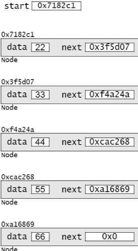
Figure 3.17 The five Node objects

Recall how new elements were inserted into the linked list that was built in Figure 3.16 on page 53. To simplify the process, we add a two-argument constructor to our Node class, as shown in Example 3.10 on page 56. This allows us to create the node and insert it all at once.

Figure 3.18 illustrates the invocation of the two-argument Node constructor. It shows next as a reference to a Node object and x as an int with value 50. Passing these two arguments to the constructor creates a new Node object that contains 50 and whose next field points to the same object that the given next pointer points to. The constructor then returns a reference to the new Node object, which is assigned to q.

The code for inserting an element into a nonempty linked list is given in Example 3.11. To appreciate its simplicity, compare it with the equivalent method in Example 3.2 on page 49.

=== EXAMPLE 3.10 A Node Class with Two Constructors

[source,java]
----
1	class Node {
2	    int data;
3	    Node next;
4
5	    Node(int data) {
6	        this.data = data;
7	    }
8
9	    Node(int data, Node next) {
10	        this.data = data;
11	        this.next = next;
12	    }
13	}
----

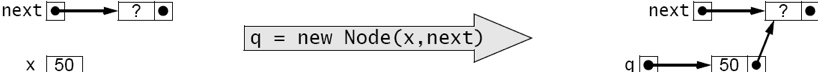
Figure 3.18 Invoking the two-argument Node constructor

The insertion has two steps: (1) find the list node p that should precede the new node; (2) create and attach the new node.

=== EXAMPLE 3.11 Inserting into a Nonempty Sorted Linked List of Integers

[source,java]
----
1	void insert(Node start, int x) {
2	    // PRECONDITIONS: the list is in ascending order, and x > start.data;
3	    // POSTCONDITIONS: the list is in ascending order, and it contains x;
4	    Node p = start;
5	    while (p.next != null) {
6	        if (p.next.data > x) break;
7	        p = p.next;
8	    }
9	    p.next = new Node(x,p.next);
10	}
----

The first step is done by the loop at lines 5–8. The variable p is declared at line 4 to be a reference to Node objects. It is initialized to point to the start node, which contains 22 in Figure 3.19. The loop control condition (p.next != null) at line 5 will allow the loop to iterate until p points to the last element in the list. At that point, p.next will be null, stopping the loop. But inside the loop, at line 6, the condition (p.next.data > x) will stop the loop prematurely, before p reaches any nodes that should come after the new node. This is how the list remains in ascending order: New elements are always inserted between the elements that are less than it and those that are greater than it.

The assignment p = p.next at line 7 is the standard mechanism for traversing a linked list. On each iteration of the while loop, this assignment moves p to point to the next node in the list.

The actual insertion is done by the statement at line 9. The expression new Node(x,p.next) creates the new node and initializes its two fields, as we saw previously in Figure 3.18. In that version, it assigned the new node’s reference to q. The statement at line 7 assigns it to p.next instead. This changes the next pointer of the p node (the node containing 44): it was pointing to the node containing 55; now it points to the new node that contains 50.

image::./images/figure3_19.png[Inserting into a nonempty sorted linked list]
Figure 3.19 Inserting into a nonempty sorted linked list

image::./images/figure3_20.png[Inserting the new node in three steps]
Figure 3.20 Inserting the new node in three steps

This second stage of the insertion could be done by several separate statements, like this:

[source,java]
----
Node q = new Node(x); q.next = p.next; p.next = q;
----

These separate steps are illustrated Figure 3.20. Once we understand this process, we might as well use the power of Java and write it in the single statement

[source,java]
----
p.next = new Node(x, p.next);
----
without the clutter of the extra variable q.

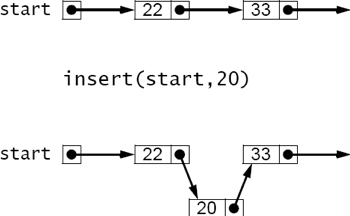
Figure 3.21 Inserting 20 incorrectly

== INSERTING AT THE FRONT OF THE LIST

The insert() method in Example 3.11 on page 56 includes the extra precondition that x be greater than the first element in the list (start.data). To see why that precondition is needed, look at what the method would do if x were 20 instead of 50. In that case, the break condition at line 6 would be true on the first iteration of the while loop, leaving p pointing at the start node when the new node gets inserted at line 9. The result, as shown in Figure 3.21 on page 57, is that 20 gets inserted between 22 and 33, instead of where it belongs at the front of the list. The problem is that we lack a node to precede the new one.

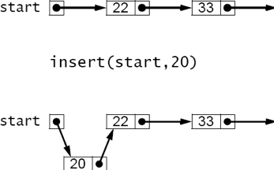
Figure 3.22 Inserting 20 correctly

One way to solve this problem is to restructure the linked list itself so that it maintains a “dummy” head node that precedes the first real data node. This uses a little extra space, but it allows the insert() method in Example 3.11 to work for all cases.

The other solution is to modify the insert() method in Example 3.11 so that it handles this special case separately. This is done in Example 3.12 and illustrated in Figure 3.22. There are two situations in which the insert should be done at the front of the list: if the list is empty or if the new element is less than the first element of the list. Both conditions are handled at line 4. In the first case, we could simply reset start to a new node containing x, like this:

[source,java]
----
start = new Node(x);
----
using the one-arg constructor. In the second case, we also have to assign the new node to start, but we also have to connect it to the rest of the list. But the only reference we have to the beginning of the list is start itself, so we would have to hold that reference in a temporary variable before reassigning start to the new node.

=== EXAMPLE 3.12 Linked List Insertion

[source,java]
----
1	Node insert(Node start, int x) {
2	    // precondition: the list is in ascending order;
3	    // postconditions: the list is in ascending order, and it contains x;
4	    if (start == null || start.data > x) {
5	        start = new Node(x,start);
6	        return start;
7	    }
8	    Node p=start;
9	    while (p.next != null) {
10	        if (p.next.data > x) break;
11	        p = p.next;
12	    }
13	    p.next = new Node(x,p.next);
14	    return start;
15	}
----

Using the two-argument constructor obviates the need for that extra temporary assignment:

[source,java]
----
start = new Node(x,start);
----

Moreover, it also handles the first case, where the list was empty, because in that case, start is null, and passing null to the second parameter is equivalent to using the one-arg constructor:

[source,java]
----
start = new Node(x, null); // equivalent
start = new Node(x);	// equivalent
----

So once again, the two-argument constructor provides the best solution.
Note that unlike the simpler version in Example 3.11, the complete insert() method in Example 3.12 has to return the start node reference, because that reference may be changed at line 5.

== DELETING FROM A SORTED LINKED LIST

Implementing an ordered list with a linked structure makes insertion far more efficient because it eliminates the need to shift elements. The same is true for deletion.

Like the insert() method, the delete() method has two main parts:
(1) find the element;
(2) delete it. It also handles the special case at the front of the list separately. Example 3.13 shows the delete() method.

=== EXAMPLE 3.13 Linked List Deletion

[source,java]
----
1	Node delete(Node start, int x) {
2	    // precondition: the list is in ascending order;
3	    // postconditions: the list is in ascending order, and if it did
4	    // contains x, then the first occurrence of x has been deleted;
5	    if (start == null || start.data > x) { // x is not in the list
6	        return start;
7	    } else if (start.data == x) {	// x is the first element in the list
8	        return start.next;
9	    }
10	    for (Node p = start; p.next != null; p = p.next) {
11	        if (p.next.data > x) {
12	            break;	// x is not in the list
13	        } else if (p.next.data == x) {	// x is in the p.next node
14	            p.next = p.next.next;	// delete it
15	            break;
16	        }
17	    }
18	    return start;
19	}
----

If the list is empty, then start == null and nothing has to be done. Also, if the first element is greater than x, then since the list is sorted, all the elements must be greater than x, so x is not in the list. Both of these cases are handled first at line 5.

If the first element in the list equals x, then it is deleted at line 8. This is done by returning start.next to start, as shown in Figure 3.23. If no other reference is pointing to the original start node, then it will be deleted by the Java “garbage collector.”

If the first element of the list is less than x, then the for loop at line 10 searches for the first element that is greater than or equal to x. If it finds one greater, then the method breaks at line 12 and returns without changing the list. If it finds an element equal to x, then it deletes it at line 14. This is illustrated in Figure 3.24.

== NESTED CLASSES

In Java, a class member may be a field, a constructor, a method, an interface, or another class.
A class that is a member of another class is called a nested class.

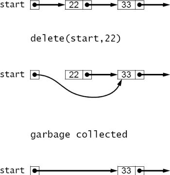
Figure 3.23 Deleting the first element from a sorted linked list

image::./images/figure3_24.png[Deleting any other element from a sorted linked list]
Figure 3.24 Deleting any other element from a sorted linked list

If the only place where a class Y will be used is within another class X, then class Y should be nested within class X. This is an important example of the information hiding principle that we have applied in other contexts.

If X is any type (class or interface) and Y is any other type nested within X, then every member of X is accessible from Y and every member of Y is accessible from X. This is illustrated in Example 3.14.

The Main class in Example 3.14 has a private nested class named Nested. Both classes have a private int field. Main declares and initializes m at line 2; Nested declares and initializes n at line 15. The Nested class also defines a private method f() at line 17.

=== EXAMPLE 3.14 Accessibility from Nested Classes

[source,java]
----
1	public class Main {
2	private int m = 22;
3
4	public Main() {
5	Nested nested = new Nested();
6	System.out.println("Outside of Nested; nested.n = " + nested.n);
7	nested.f();
8	}
9
10	public static void main(String[] args) {
11	new Main();
12	}
13
14	private class Nested {
15	private int n = 44;
16
17	private void f() {
18	System.out.println("Inside of Nested; m = " + m);
19	}
20	}
21	}
----

The output is:

[source,console]
----
Outside of Nested; nested.n = 44
Inside of Nested; m = 22
----

The main() method invokes the Main() constructor at line 11. That instantiates the Nested class at line 5. The private field n of the Nested class is accessed at line 6, and the private method f() of the Nested class is accessed at line 7. This shows that private members of a nested class are accessible from its enclosing class. Symmetrically, the private members of the enclosing class are accessible from within its nested class, as demonstrated by line 18.

The UML symbol for the nesting of one class inside another uses a circle with a plus sign inside in place of the arrowhead, as shown in Figure 3.25.

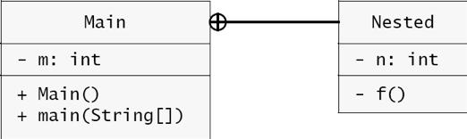
Figure 3.25 UML diagram for a nested class

Since all members of a private nested class are still accessible from anywhere else in the enclosing class, those members are usually declared without any access modifier (private, protected, or public), for simplicity.

Normally, a nested class should be declared static unless its instances need to access nonstatic members of its enclosing class. (A nested class that is nonstatic is called an inner class.)

The Node class defined in Example 3.10 on page 56 is used only within the context of the linked lists that are being implemented. So it should be nested inside its List class. Moreover, since nodes have no need to access List methods or fields, the Node class should be declared as a static nested class. This is done at line 12 in Example 3.15 and is illustrated in Figure 3.26.

=== EXAMPLE 3.15 Nesting the Node Class within a LinkedList Class

[source,java]
----
1	public class LinkedList {
2	private Node start;
3
4	public void insert(int x)	{
5	// Insert lines 2-14 of	Example	3.12	on	page	58
6	}
7
8	public void delete(int x)	{
9	// Insert lines 2-18 of	Example	3.13	on	page	59
10	}
11
12	private static class Node	{
13	// Insert lines 2-12 of	Example	3.10	on	page	56
14	}
15	}
----

Hiding the Node class within the LinkedList class encapsulates the LinkedList class, making it self- contained and concealing its implementation details. A developer could change the implementation without having to modify any code outside of that class.

image::./images/fiture3_26.png[A Node class nested within a LinkedList class]
Figure 3.26 A Node class nested within a LinkedList class

== Review Questions

1. Why is an array such an inefficient data structure for a dynamic sorted list?
2. What is an index array?
3. If linked lists are so much better than arrays, why are arrays used at all?
4. Why does insertion at the front of a linked list have to be done differently from insertion else- where?
5. Why are the lists backwards in the BigInt class?

== Problems

1. Write and test this method, similar to the insert() method in Example 3.1 6:
+
[source,java]
----
void delete(int[] a, int n, int x)
// precondition: 0 <= n < a.length;
// postconditions: the first occurrence of x among
{a[0], ..., a[n-1]} has been deleted;
----
For example, if a[] is the array {33, 55, 77, 99, 77, 55, 33, 0}, then delete(a, 6, 55) will change a[] to {33, 77, 99, 77, 55, 33, 0, 0}.
2. Write and test this method:
+
[source,java]
----
int size(Node list)
// returns: the number of nodes in the specified list;
----
For example, if list is {33, 55, 77, 99}, then size(list) will return 4.
3. Write and test this method:
+
[source,java]
----
int sum(Node list)
// returns: the sum of the integers in the specified list;
----
For example, if list is {25, 45, 65, 85}, then sum(list) will return 220.
4. Write and test this method:
+
[source,java]
----
void removeLast(Node list)
// precondition: the specified list has at least two nodes;
// postcondition: the last node in the list has been deleted;
----
For example, if list is {22, 44, 66, 88}, then removeLast(list) will change it to {22, 44, 66}.
5. Write and test this method:
+
[source,java]
----
Node copy(Node list)
// returns: a new list that is a duplicate of the specified list;
----
Note that the new list must be completely independent of the specified list. Changing one list should have no effect upon the other.
6. Write and test this method:
+
[source,java]
----
Node sublist(Node list, int p, int q)
// returns: a new list that contains copies of the q-p nodes of the
//  specified list, starting with node number p (starting with 0);
----
For example, if list is {22, 33, 44, 55, 66, 77, 88, 99}, then sublist(list, 2, 7) will return the new list {44, 55, 66, 77, 88}. Note that the two lists must be completely indepen- dent of each other. Changing one list should have no effect upon the other.
7. Write and test this method:
+
[source,java]
----
void append(Node list1, Node list2)
// precondition: list1 has at least one node;
// postcondition: list1 has list2 appended to it;
----
For example, if list1 is {22, 33, 44, 55} and list2 is {66, 77, 88, 99}, then
append(list1, list2) will change list1 to {22, 33, 44, 55, 44, 55, 66, 77, 88}. Note that no new nodes are created by this method.
8. Write and test this method:
+
[source,java]
----
Node concat(Node list1, Node list2)
// returns: a new list that contains a copy of list1, followed by
//	a copy of list2;
----
For example, if list1 is {22, 33, 44, 55} and list2 is {66, 77, 88, 99}, then
concat(list1, list2) will return the new list {22, 33, 44, 55, 44, 55, 66, 77, 88}. Note that the three lists should be completely independent of each other. Changing one list should have no effect upon the others.
9. Write and test this method:
+
[source,java]
----
void set(Node list, int i, int x)
// replaces the value of element number i with x;
----
For example, if list is {22, 33, 44, 55, 66, 77, 88, 99}, then set(list, 2, 50) will change list to {22, 33, 50, 55, 66, 44, 88, 99}.
10. Write and test this method:
+
[source,java]
----
int get(Node list, int i)
// returns the value of element number i;
----
For example, if list is {22, 33, 44, 55, 66, 77, 88, 99}, then get(list, 2) will return 44.
11. Write and test this method:
+
[source,java]
----
void put(Node list, int i, int x)
// inserts x as element number i;
----
For example, if list is {22, 33, 44, 55, 66, 77, 88, 99}, then put(list, 3, 50) will change list to {22, 33, 44, 50, 55, 66, 44, 88, 99}. Hint: if i = 0, replace the value of the first node with x, and insert a new node immediately after it that contains the previous fist value.
12. Write and test this method:
+
[source,java]
----
void swap(Node list, int i, int j)
// swaps the ith element with the jth element;
----
For example, if list is {22, 33, 44, 55, 66, 77, 88, 99}, then swap(list, 2, 5) will change list to {22, 33, 77, 55, 66, 44, 88, 99}.
13. Write and test this method:
+
[source,java]
----
Node merged(Node list1, Node list2)
// precondition: list1 and list2 are both in ascending order;
// returns: a new list that contains all the elements of list1 and
//	list2 in ascending order;
----
For example, if list1 is {22, 33, 55, 88} and list2 is {44, 66, 77, 99}, then
merged(list1, list2) will return the new list {22, 33, 44, 55, 66, 77, 88, 99}. Note that the three lists should be completely independent of each other. Changing one list should have no effect upon the others.
14. Write and test this method:
+
[source,java]
----
void rotateLeft(Node list)
// moves the first element of the specified list to its end;
----
For example, if list is {22, 33, 44, 55, 66, 77, 88, 99}, then rotateLeft(list) will
change list to {33, 44, 55, 66, 77, 88, 99, 22}. Note that no new nodes are created by this method.
