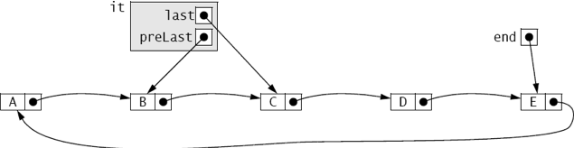
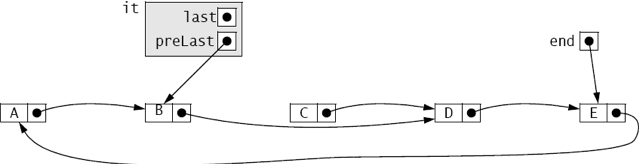
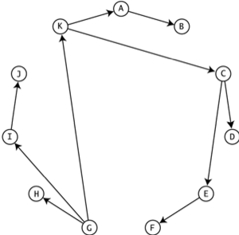

:stem: latexmath

= Lists

A list is a collection of elements that are accessible sequentially: the first element, followed by the second element, followed by the third element, and so on. This is called sequential access or linked access (as opposed to direct or indexed access). A good example is a line of train cars on a track: To get to the fourth car from the first car, you have to go through the second and third cars in that order. This example also illustrates how insertions and deletions are managed in a list. The only changes needed are to the two cars that are adjacent to location where the insertion or deletion is made. None of the other cars is affected.

== THE JCF List INTERFACE

The List interface specified by the Java Collections Framework is outlined on page 85. It adds 10 methods to the 15 methods specified by the Collection interface that it extends.

From the JCF inheritance hierarchy shown in Figure 4.1 on page 70, you can see that the Queue, Deque, and Set interfaces all extend the List interface. Consequently, all of the List, Queue, Deque, and Set classes implement the List interface. This includes the concrete classes outlined in Chapter 4: ArrayList, Vector, LinkedList, PriorityQueue, ArrayDeque, EnumSet, HashSet, LinkedHashSet, and TreeSet.

As Table 4.1 on page 70 shows, the JCF provides both linked and indexed implementations of the List interface: the LinkedList class uses sequential access, while the ArrayList class provides direct access.

=== EXAMPLE 7.1 Testing a List Class

This program illustrates some of the methods specified by the List interface:

[source,java]
----
1	public class TestStringList {
2	    public static void main(String[] args) {
3	        List<String> list = new ArrayList<String>();
4	        Collections.addAll(list, "GB", "DE", "FR", "ES");
5	        System.out.println(list);
6	        list.add(3, "DE");
7	        System.out.println(list);
8	        System.out.println("list.get(3): " + list.get(3));
9	        System.out.println("list.indexOf(\"DE\"): " + list.indexOf("DE"));
10	        System.out.println("list.indexOf(\"IE\"): " + list.indexOf("IE"));
11	        System.out.println("list.subList(1, 5): " + list.subList(1, 5));
12	        list.remove("DE");
13	        System.out.println(list);
14	    }
15	}
----

The output is:

[source,console]
----
[GB, DE, FR, ES]
[GB, DE, FR, DE, ES]
list.get(3): DE
list.indexOf("DE"): 1
list.indexOf("IE"): -1
list.subList(1, 5): [DE, FR, DE, ES]
[GB, FR, DE, ES]
----

The list object is created at line 3 as an ArrayList of String objects. It uses the static addAll() method of the Collections class at line 4 to load four strings into it. The two-argument add() method is tested at line 6, inserting the string "DE" as element number 2. Note that, unlike sets, lists allow duplicate elements.

At line 8, the get() method is used to obtain element number 3. Lines 9–10 illustrate the indexOf() method, returning the index number of the specified element. Note that it returns the index of the first occurrence of the element; DE occurs at both index 1 and index 3.

The call list.subList(1, 5) at line 11 returns the sublist of elements indexed from 1 up to (but not including) 5. As long as the two indexes are in range, the size of the sublist will always be their difference; in this case, 5 – 1 = 4 elements.

At line 12, the call list.remove("DE") removes the first occurrence of DE.

== THE RANGE-VIEW OPERATION sublist()

The sublist() method illustrated in Example 7.1 is far more powerful than what that example suggests. It provides a “view” into its list, against which other List methods may be applied. When used in the chained-invocation mode, like this

[source,java]
----
list.sublist(1, 5).get(2)
----
it allows the attached method to apply to the list itself while restricting its context to the sublist. Thus, that call, for example, would return element number 2 of the sublist, which is actually element number 3 of the list itself.

=== EXAMPLE 7.2 Using the sublist() Method as a Range-View Operation

[source,java]
----
1	public class TestSubList {
2	    public static void main(String[] args) {
3	        List<String> list = new ArrayList<String>();
4	        Collections.addAll(list,  "A","B","C","D","E","F","G","H","I","J");
5	        System.out.println(list);
6	        System.out.println("list.subList(3,8): " + list.subList(3,8));
7	        System.out.println("list.subList(3,8).get(2): "
8	                + list.subList(3,8).get(2));
9	        System.out.println("list.subList(3,8).set(2,\"B\"):");
10	        list.subList(3,8).set(2, "B");
11	        System.out.println(list);
12	        System.out.println("list.indexOf(\"B\"): " + list.indexOf("B"));
13	        System.out.println("list.subList(3,8).indexOf(\"B\"): "
14	                + list.subList(3,8).indexOf("B"));
15	        System.out.println(list);
16	        System.out.println("Collections.reverse(list.subList(3,8)):");
17	        Collections.reverse(list.subList(3,8));
18	        System.out.println(list);
19	        System.out.println("Collections.rotate(list.subList(3,8), 2):");
20	        Collections.rotate(list.subList(3,8), 2);
21	        System.out.println(list);
22	        System.out.println("Collections.fill(list.subList(3,8), \"X\"):");
23	        Collections.fill(list.subList(3,8), "X");
24	        System.out.println(list);
25	        list.subList(3,8).clear();
26	        System.out.println(list);
27	    }
28	}
----

The output is:

[source,java]
----
[A, B, C, D, E, F, G, H, I, J]
list.subList(3,8): [D, E, F, G, H]
list.subList(3,8).get(2): F
list.subList(3,8).set(2,"B"):
[A, B, C, D, E, B, G, H, I, J]
list.indexOf("B"): 1
list.subList(3,8).indexOf("B"): 2
[A, B, C, D, E, B, G, H, I, J]
Collections.reverse(list.subList(3,8)):
[A, B, C, H, G, B, E, D, I, J]
Collections.rotate(list.subList(3,8), 2):
[A, B, C, E, D, H, G, B, I, J]
Collections.fill(list.subList(3,8), "X"):
[A, B, C, X, X, X, X, X, I, J] [A, B, C, I, J]
----

The call list.subList(3,8) at line 6 returns the sublist [D, E, F, G, H].

The call list.subList(3,8).get(2) at line 8 returns F, which is element number 2 in that sublist. The call list.subList(3,8).set(2,"B") at line 10 replaces that element with B in the list.

The call list.indexOf("B") at line 12 returns 1 because the first B in the list is element number 1.

The call list.subList(3,8).indexOf("B") at line 14 returns 2 because the first B in that sublist is element number 2 of the sublist.

The call Collections.reverse(list.subList(3,8)) at line 17 reverses the five-element sublist

[D,E,B,G,H] within the original list, changing [A,B,C,D,E,B,G,H,I,J] to [A,B,C,H,G,B,E,D,I,J].

The call Collections.rotate(list.subList(3,8),2) at line 20 rotates the five-element sublist

[H,G,B,E,D] to [E,D,H,G,B], changing the whole list to [A,B,C,E,D,H,G,B,I,J].

The call Collections.fill(list.subList(3,8),"X") at line 23 replaces the five-element sublist

[E,D,H,G,B] to [X,X,X,X,X], changing the whole list to [A,B,C,X,X,X,X,X,I,J].

The call list.subList(3,8).clear() at line 25 deletes the five-element sublist [X,X,X,X,X] from the list, changing it to [A,B,C,I,J].

== LIST ITERATORS

Collection iterators are outlined on page 77. The JCF defines the ListIterator interface as an extension of the Iterator interface. It specifies an additional six methods that reflect the bidirectional nature of a list iterator. All nine methods are shown in Figure 7.1 on page 135.

The standard way to obtain a list iterator on a list is to invoke its listIterator() method, just as invoking its iterator() method returns an ordinary (unidirectional) iterator.

=== EXAMPLE 7.3 Using the sublist() Method as a Range-View Operation

[source,java]
----
1	public class TestSubList {
2	    public static void main(String[] args) {
3	        List<String> list = new ArrayList<String>();
4	        Collections.addAll(list,  "A","B","C","D","E","F","G","H");
5	        System.out.println(list);
6		    ListIterator<String> it = list.listIterator();
7		    System.out.println("it.nextIndex(): " + it.nextIndex());
8		    System.out.println("it.next(): " + it.next());
9		    System.out.println("it.previousIndex(): " + it.previousIndex());
10		    System.out.println("it.nextIndex(): " + it.nextIndex());
11		    System.out.println("it.next(): " + it.next());
12		    System.out.println("it.next(): " + it.next());
13		    System.out.println("it.previous(): " + it.previous());
14		    System.out.println("it.previousIndex(): " + it.previousIndex());
15		    System.out.println("it.nextIndex(): " + it.nextIndex());
16		    System.out.println("it.previous(): " + it.previous());
17		    System.out.println("it.next(): " + it.next());
18		    System.out.println("it.next(): " + it.next());
19		    System.out.println("it.next(): " + it.next());
20		    System.out.println("it.add(\"X\"):");
21		    it.add("X");
22		    System.out.println(list);
23		    System.out.println("it.next(): " + it.next());
24		    System.out.println("it.set(\"Y\"):");
25		    it.set("Y");
26		    System.out.println(list);
27		    System.out.println("it.next(): " + it.next());
28		    System.out.println("it.remove():");
29		    it.remove();
30		    System.out.println("it.next(): " + it.next());
31		    System.out.println(list);
32	    }
33	}
----

The output is:

[source,console]
----
[A, B, C, D, E, F, G, H]
it.nextIndex(): 0
it.next(): A
it.previousIndex(): 0
it.nextIndex(): 1
it.next(): B
it.next(): C
it.previous(): C
it.previousIndex(): 1
it.nextIndex(): 2
it.previous(): B
it.next(): B
it.next(): C
it.next(): D
it.add("X"):
[A, B, C, D, X, E, F, G, H]
it.next(): E
it.set("Y"):
[A, B, C, D, X, Y, F, G, H]
it.next(): F
it.remove():
it.next(): G
[A, B, C, D, X, Y, G, H]
----

image::./images/figure7_1.png[Methods specified by the java.util.ListIterator interface]
Figure 7.1 Methods specified by the java.util.ListIterator interface

The output shows the effects of the nine ListIterator methods. At lines 7 and 10, the nextIndex() method returns the index number of the iterator’s current element: first 0, and then 1. Similarly, the previousIndex() method returns the index number of the iterator’s previous element. The next() and previous() methods move the iterator up and down the list. At line 21, the add() method inserts a new element X immediately after that last element referenced by the next() method, which was D. At line 25, the set() method changes the last element referenced by the next() method, from E to Y. At line 29, the remove() method deletes the last element referenced by the next() method, which was F.

Like a finger tracing through some text, an iterator is an object bound to a collection that moves independently of other iterators on the same collection.

=== EXAMPLE 7.4 Using Several ListIterator Objects Iterating on the Same List Object

This program illustrates some of the methods that are specific to the ArrayList class:

[source,java]
----
1	public class TestingSeveralIterators {
2	     public static void main(String[] args) {
3	        List<String> list = new ArrayList<String>();
4	        Collections.addAll(list, "A", "B", "C", "D");
5	        System.out.println(list);
6	        ListIterator<String> it1 = list.listIterator();
7	        System.out.println("it1.next(): " + it1.next());
8	        System.out.println("it1.next(): " + it1.next());
9	        System.out.println("it1.next(): " + it1.next());
10	        System.out.println("it1.add(\"X\"):");
11	        it1.add("X");
12	        System.out.println(list);
13		    ListIterator<String> it2 = list.listIterator();
14		    System.out.println("it2.next(): " + it2.next());
15		System.out.println("it2.next(): " + it2.next());
16		System.out.println("it2.set(\"Y\"):");
17		it2.set("Y");
18		System.out.println(list);
19		ListIterator<String> it3 = list.listIterator();
20		System.out.println("it3.next(): " + it3.next());
21		System.out.println("it3.next(): " + it3.next());
22		System.out.println("it3.next(): " + it3.next());
23		System.out.println("it3.next(): " + it3.next());
24		System.out.println("it1.previous(): " + it1.previous());
25		System.out.println("it1.previous(): " + it1.previous());
26		System.out.println("it1.previous(): " + it1.previous());
27	}
28	}
----

The output is:

[source,java]
----
[A, B, C, D]
it1.next(): A
it1.next(): B
it1.next(): C
it1.add("X"):
[A, B, C, X, D]
it2.next(): A
it2.next(): B
it2.set("Y"):
[A, Y, C, X, D]
it3.next(): A
it3.next(): Y
it3.next(): C
it3.next(): X
it1.previous(): X
it1.previous(): C
it1.previous(): Y
----

The first iterator it1 advances past the first three elements and then inserts X between C and D at line 11. The second iterator it2 advances past the first two elements and then changes B and Y at line 17. The third iterator it3 advances past the first four elements, including the changed element Y and the inserted element X. Finally, the first iterator it1 backs up over the previous three elements, including the inserted element X and the changed element Y.

=== OTHER LIST TYPES

The JCF defines a concrete LinkedList class. (See page 86.) But that may not be exactly what you need for certain applications. In those cases, the AbstractList class can be extended to obtain a custom-made list class that is consistent with the JCF.

=== EXAMPLE 7.5 A Ring Class

This defines a list class that uses a circular, singly linked list. It is similar to the LinkedList class, except that the next() method is able to wrap around from the end of the list to the beginning, thus forming a circle or “ring.”

[source,java]
----
1	public class Ring<E> extends AbstractList<E> implements List<E> {
2	    private Node<E> end;
3	    private int size;
4
5	    public boolean add(E element) {
6	        if (size == 0) {
7	            end = new Node<E>(element, null);
8	            end.next = end;
9	        } else {
10	            end = end.next = new Node<E>(element, end.next);
11	        }
12	        ++size;
13	        return true;
14	    }
15
16	    public E get(int index) {
17	        if (index < 0 || index >= size) {
18	            throw new IndexOutOfBoundsException();
19	        }
20	        Node<E> p = end.next;
21	        for (int i=0; i<index; i++) {
22	            p = p.next;
23	        }
24	        return p.element;
25	    }
26
27	    public Iterator<E> iterator() {
28	        return new RingIterator();
29	    }
30
31	    public String toString() {
32	        Node<E> p = end.next;
33	        StringBuilder buf = new StringBuilder("[" + p.element);
34	        while (p != end) {
35	            p = p.next;
36	            buf.append(", " + p.element);
37	        }
38	        buf.append("]");
39	        return buf.toString();
40	    }
41
42	    public int size() {
43	        return size;
44	    }
45
46	    private class RingIterator implements Iterator<E> {
47	        private Node<E> last;
48	        private Node<E> preLast = end;
49
50	        public boolean hasNext() {
51	            return size > 0;
52	        }
53
54	        public E next() {
55	            if (last == null) {
56	                last = preLast.next;
57	            } else {
58	                preLast = last;
59	                last = last.next;
60	            }
61	            return last.element;
62	        }
63
64	        public void remove() {
65	            if (last == null) {
66	                throw new IllegalStateException();
67	            }
68	            if (size == 1) {
69	                end = preLast = null;
70	            } else {
71	                preLast.next = last.next;
72	            }
73	            if (last == end) {
74	                end = preLast;
75	            }
76	            last = null;
77	            --size;
78	        }
79	    }
80
81	    private static class Node<E> {
82	        E element;
83	        Node<E> next;
84
85	        Node(E element, Node<E> next) {
86	            this.element = element;
87	            this.next = next;
88	        }
89	    }
90	}
----

The class defines nine members: the two fields: end and size; the five methods: add(), get(), iterator(), size(), and toString(); and the two classes: RingIterator and Node. The RingIterator class extends the Iterator class to support the iterator() method. Instances of the Node class are used to hold the list’s data and to maintain their links.

The AbstractList class, which this Ring class extends, requires only its get() and size() methods to be overridden. For our specific purposes, we also override the add(), iterator(), and toString() methods. We plan to use this class to solve the Josephus problem (in Example 7.6), and for that we’ll need to add elements to the ring, iterate around the ring, and print the ring.

The end field references the node that references the “beginning” node in the list, that is, it points to the beginning of the list. Since we are using only one link per node (a “singly linked list”), we have to have direct access to the predecessor of any node that might have to be deleted. The end reference is null when the list is empty.

The size field keeps count of how many elements are in the list. Initially 0, it is incremented in the add() method (line 12), decremented in the iterator’s remove() method (line 77), and returned in the size() method (line 43).

The add() method invokes the Node class’s constructor (lines 7 and 10) to create a new node for the specified element. If the list is empty, it sets its end field to a single node that points to itself. Otherwise, the new node is inserted immediately after the end node, and then the new reference is set to that new node. This way, new elements are always added to the “end” of the ring. (See Figure 7.2.)

The get() method is required by the AbstractList class. It uses a reference pointer p at line 20 to count the specified number of nodes to return access to the element with the specified index number.

image::./images/figure7_2.png[]
Figure 7.2 The end reference in the Ring class

The iterator() method uses the RingIterator constructor at line 28 to return an iterator on the ring. The RingIterator class has two fields, both Node references. The last field points to the last node

accessed by the iterator’s next() method. It will be null initially and immediately after each call to the iterator’s remove() method. The preLast field points to the node that points to the last node. It is used by the remove() method.

The iterator’s hasNext() method returns true at line 51, unless the list is empty. In a circular list, every element has a next element.

The next() method serves two purposes. If called immediately after a call to remove(), then it resets the last field (line 56), which the remove() method leaves null. Otherwise, it simply advances the preLast and last pointers (lines 58–59).

The purpose of the remove() method at line 64 is to delete the last element accessed by the next() method. Normally, it does that simply by resetting one link—the preceding node’s next field (line 71). But it also has several special cases to handle. If its invocation does not immediately follow a call to next(), then it’s in an illegal state, and thus throws an IllegalStateException at line 66. If the list has only one element, then removing it should leave the list in its original empty state by nullifying its preLast field (line 69). In that case, the Ring class’s end field is also nullified. If the element being deleted is the one referenced by the Ring class’s end field, then that field is reset to the element’s predecessor at line 74. Finally, last is nullified at line 76 to mark the fact that the next() method was not the last one called in the iterator.

Figure 7.3 The last and preLast references in the RingIterator class

Figure 7.3 illustrates how the last and preLast pointers work in an iterator on a Ring list. This shows the state of the list immediately after a call to next() has returned the element C. An immediate call to remove() would delete the C node by resetting the B node’s next reference to point to the D node, as shown in Figure 7.4.

Figure 7.4 After a call to it.remove()

Note the efficiency of this operation: To delete C, only one link has to be reset, and one link is nullified.

== APPLICATION: THE JOSEPHUS PROBLEM

This problem is based upon a report by the historian Joseph ben Matthias (Josephus) on the outcome of a suicide pact that he had made between himself and 40 soldiers as they were besieged by superior Roman forces in 67 A.D. Josephus proposed that each man slay his neighbor. This scheme necessarily leaves one to kill himself. Josephus cleverly contrived to be that one, thus surviving to tell the tale.

The solution to the problem is generated by the Josephus program in Example 7.6. It uses the Ring class from Example 7.5 on page 136.

=== EXAMPLE 7.6 The Josephus Problem

[source,java]
----
1	public class Josephus {
2	    public static final int SOLDIERS = 8;
3	    public static final String ALPHA = "ABCDEFGHIJKLMNOPQRSTUVWXYZ";
4
5	    public static void main(String[] args) {
6	        Ring<String> ring = new Ring<String>();
7	        for (int i=0; i<SOLDIERS; i++) {
8	            ring.add(ALPHA.substring(i, i+1));
9	        }
10	        System.out.println(ring);
11	        Iterator<String> it = ring.iterator();
12	        String killer = it.next();
13	        while (ring.size() > 1) {
14	            String victim = it.next();
15	            System.out.println(killer + " killed " + victim);
16	            it.remove();
17	            killer = it.next();
18	        }
19	        System.out.println("The lone survivor is " + it.next());
20	    }
21	}
----

[cols="1a,1a", frame=none,grid=none]
|===
|
Here is the output from a run for 11 soldiers:

[source,console]
----
[A, B, C, D, E, F, G, H, I, J, K]
A killed B
C killed D
E killed F
G killed H
I killed J
K killed A
C killed E
G killed I
K killed C
G killed K
The lone survivor is G
----
|

Figure 7.5 The solution to the Josephus problem
|===

This output shows the solution, which is illustrated in Figure 7.5.
The Ring list is instantiated at line 6 and loaded at lines 7–9. The iterator it is obtained from the iterator() method at line 11. After advancing past A at line 12, it advances past B at line 14, removes B at line 16, and then advances past C at line 17. The while loop continues until only one soldier remains. Each iteration advances it past two elements, naming them killer and victim, and removes the victim node.

== APPLICATION: A Polynomial CLASS

A polynomial is a mathematical function of the form:
[stem]
++++
p(x) = a_{0} x^{n} + a_{1} x^{n-1} + a_{2} x^{n-2} + • • • + a_{n i1} x + a_{n}
++++

The greatest exponent, n, is called the degree of the polynomial. For example, stem:[p(x) = 7x^{4} - 2] is a polynomial of degree 4. The simplest polynomials are _constant polynomials_ such as stem:[p(x) = 6] (degree 0) and _linear polynomials_ such as stem:[p(x) = 9x + 6] (degree 1). The unique _zero polynomial_ stem:[p(x) = 0] is defined to have degree –1. In this section we present a Polynomial class whose instances represent mathematical polynomials and which supports the usual algebraic operations on polynomials.

A polynomial can be regarded as a sum of distinct terms. A term is a mathematical function of the form stem:[t(x) = cx^e], where c is any real number and e is any nonnegative integer. The number c is called the coefficient, and the number e is called the exponent.

To define a class whose objects represent polynomials, we use a linked list of Term objects. For example, the polynomial stem:[p(x) = 3x^{2} - 2x + 5] could be represented as a list of three elements, where the first element represents the term stem:[3x^{2}], the second element represents the term stem:[-2x], and the third element represents the (constant) term 5.

=== EXAMPLE 7.7 A Polynomial Class

[source,java]
----
1	public class Polynomial {
2	    private List<Term> list = new LinkedList<Term>();
3	    public static final Polynomial ZERO = new Polynomial();
4
5	    private Polynomial() { // default constructor
6	    }
7
8	    public Polynomial(double coef, int exp) {
9	        if (coef != 0.0) {
10	            list.add(new Term(coef, exp));
11	        }
12	    }
13
14	    public Polynomial(Polynomial p) { // copy constructor
15	        for (Term term : p.list) {
16	            this.list.add(new Term(term));
17	        }
18	    }
19
20	    public Polynomial(double... a) {
21	        for (int i=0; i<a.length; i++) {
22	            if (a[i] != 0.0) {
23	                list.add(new Term(a[i], i));
24	            }
25	        }
26	    }
27
28	    public int degree() {
29	        if (list.isEmpty()) {
30	            return -1;
31	        } else {
32	            return list.get(list.size()-1).exp;
33	        }
34	    }
35
36	    public boolean isZero() {
37	        return list.isEmpty();
38	    }
39
40	    public Polynomial plus(Polynomial p) {
41	        if (this.isZero()) {
42	            return new Polynomial(p);
43	        }
44	        if (p.isZero()) {
45	            return new Polynomial(this);
46	        }
47	        Polynomial q = new Polynomial();
48	        ListIterator<Term> it = list.listIterator();
49	        ListIterator<Term> itp = p.list.listIterator();
50	        while (it.hasNext() && itp.hasNext()) {
51	            Term term = it.next();
52	            Term pTerm = itp.next();
53	            if (term.exp < pTerm.exp) {
54	                q.list.add(new Term(term));
55	                itp.previous();
56	            } else if (term.exp == pTerm.exp) {
57	                q.list.add(new Term(term.coef + pTerm.coef, term.exp));
58	            } else { // (term.exp > pTerm.exp)
59	                q.list.add(new Term(pTerm));
60	                it.previous();
61	            }
62	        }
63	        while (it.hasNext()) {
64	            q.list.add(new Term(it.next()));
65	        }
66	        while (itp.hasNext()) {
67	            q.list.add(new Term(itp.next()));
68	        }
69	        return q;
70	    }
71
72	    public String toString() {
73	        if (this.isZero()) {
74	            return "0";
75	        }
76	        Iterator<Term> it = list.iterator();
77	        StringBuilder buf = new StringBuilder();
78	        boolean isFirstTerm = true;
79	        while (it.hasNext()) {
80	            Term term = it.next();
81	            double c = term.coef;
82	            int e = term.exp;
83	            if (isFirstTerm) {
84	                buf.append(String.format("%.2f", c));
85	                isFirstTerm = false;
86	            } else {
87	                if (term.coef < 0) {
88	                    buf.append(String.format(" - %.2f", -c));
89	                } else {
90	                    buf.append(String.format(" + %.2f", c));
91	                }
92		        }
93		        if (e == 1) {
94		            buf.append("x");
95		        } else if (e > 1) {
96		            buf.append("x^" + e);
97		        }
98		    }
99		    return buf.toString();
100		}
101
102		private static class Term {
103		    private double coef;
104		    private int exp;
105
106		    public Term(double coef, int exp) {
107		        if (coef == 0.0 || exp < 0) {
108		            throw new IllegalArgumentException();
109		        }
110		        this.coef = coef;
111		        this.exp = exp;
112		    }
113
114		    public Term(Term that) { // copy constructor
115		        this(that.coef, that.exp);
116		    }
117		}
118	}
----

Instead of using _inheritance_ by extending a List class, this Polynomial class uses composition, declaring a list field at line 2. This design gives the user more control over the class by limiting it to only those methods actually defined in the class. Of course, those methods are mostly implemented by means of List methods. The list backing structure is declared to be a LinkedList<Term> collection. So each element of the list is a Term object. The list stores the polynomial’s nonzero terms in increasing order of their exponents.

The Term class is defined as an inner class at lines 102–117, that is, a static member class. It has two fields, coef and exp (for the coefficient and the exponent of the term), and two constructors. The second constructor (line 114) is a copy constructor, creating a duplicate of the term passed to it. It uses the this keyword to invoke the two-argument constructor defined at line 106.

The Polynomial class has four constructors and four methods. The default constructor (also called the “no-arg constructor”) defined at line 8 is declared to be private. This prevents it from being used outside of its class. Its purpose is to construct the Polynomial object that represents the zero polynomial, and it is invoked at line 3 to do that. To ensure that that object is unique, we prevent it from being constructed anywhere else.

The constructor at line 8 creates a Polynomial object that represents a single term, such as stem:[88.8x^{44}].

The constructor at line 14 is a copy constructor, which duplicates the object passed to it. The constructor at line 20 uses the Java “var-args” syntax to allow a variable number of arguments, in this case of type double. This is the same as a single argument of type double[]. That constructor creates a polynomial

whose coefficients are the nonzero values in the array, each one generating a term of the form cnxn, where stem:[c_{n} = a[n]]. For example, the array {4, 0, 7, 0, 0, 0, 3} would produce the Polynomial object that represents stem:[4 + 7x^{2} + 3x^{6}].

The degree() method at line 28 returns the polynomial’s highest exponent. Since the terms are maintained in the list in increasing order of their exponents, the degree of the polynomial is the simply the exp field of the last element in the list. That element has index list.size()-1, so the expression at line 32 does the job.

The plus() method at line 40 returns a new object that represents the sum of the implicit argument (this) and the explicit argument (p). That result, instantiated as q at line 44, is built by means of the three while loops ate lines 50–68. The first loop repeatedly compares the exponents of a term from each polynomial (this and p), duplicates the one with the smaller exponent, and adds it to q. If the two terms are equal, then their coefficients are added (at line 57) to form the new term. The loops use iterators to traverse the two lists. Since the term whose coefficient was not yet used has to be accessed again on the next iteration, its iterator has to be backed up (at lines 55 and 60). Consequently, we need the bidirectional iterators provided by the listIterator() method.

The toString() method uses a unidirectional iterator to traverse the list at line 80 to generate a string representation of the Polynomial object.

=== EXAMPLE 7.8 Testing the Polynomial Class

[source,java]
----
1	public class TestPolynomial {
2	    public static void main(String[] args) {
3	        Polynomial p = new Polynomial(3, -8, 0, 0, 2, 1);
4	        Polynomial q = new Polynomial(0, 5, 6, 9);
5	        System.out.println("p: " + p);
6	        System.out.println("p.degree(): " + p.degree());
7	        System.out.println("q: " + q);
8	        System.out.println("q.degree(): " + q.degree());
9		    System.out.println("p.plus(q): " + p.plus(q));
10		    System.out.println("q.plus(p): " + q.plus(p));
11		    System.out.println("p.plus(q).degree(): " + p.plus(q).degree());
12		    Polynomial z = new Polynomial(0);
13		    System.out.println("z: " + z);
14		    System.out.println("z.degree(): " + z.degree());
15		    System.out.println("p.plus(z): " + p.plus(z));
16		    System.out.println("z.plus(p): " + z.plus(p));
17		    System.out.println("p:	" + p);
18		    Polynomial t = new Polynomial(8.88, 44);
19		    System.out.println("t: " + t);
20		    System.out.println("t.degree(): " + t.degree());
21	    }
22	}
----

The output is:

[source,console]
----
p: 3.00 - 8.00x + 2.00x^4 + 1.00x^5
p.degree(): 5
q: 5.00x + 6.00x^2 + 9.00x^3
q.degree(): 3
p.plus(q): 3.00 - 3.00x + 6.00x^2 + 9.00x^3 + 2.00x^4 + 1.00x^5 q.plus(p): 3.00 - 3.00x + 6.00x^2 + 9.00x^3 + 2.00x^4 + 1.00x^5
p.plus(q).degree(): 5
z: 0
z.degree(): -1
p.plus(z): 3.00 - 8.00x + 2.00x^4 + 1.00x^5 z.plus(p): 3.00 - 8.00x + 2.00x^4 + 1.00x^5 p:    3.00 - 8.00x + 2.00x^4 + 1.00x^5 t: 8.88x^44
t.degree(): 44
----

The var-args constructor is tested at lines 3–4, and the two-argument constructor is tested at line 18. The other testing includes checking (at lines 9–10) that the plus() method is commutative: p + q = q + p, and (at lines 14–16) that the zero polynomial z satisfies the defining condition p + z = z + p = p.

