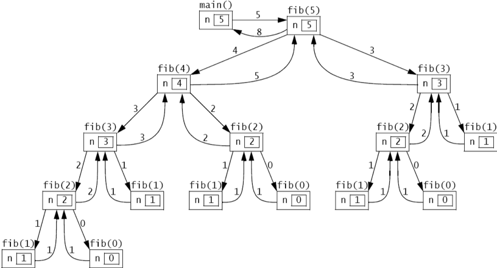
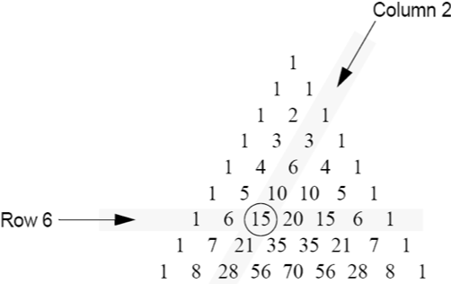
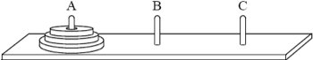
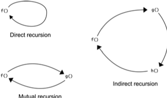
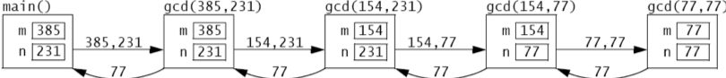
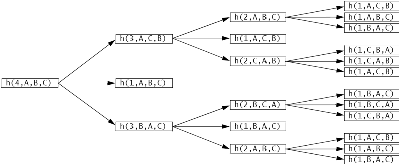

:stem: latexmath

= Recursion

A _recursive_ function is one that calls itself. This powerful technique produces repetition without using loops (e.g., while loops or for loops). Thus it can produce substantial results from very little code. Recursion allows elegantly simple solutions to difficult problems. But it can also be misused, producing inefficient code. Recursive code is usually produced from recursive algorithms.

== SIMPLE RECURSIVE FUNCTIONS

=== EXAMPLE 9.1 The Factorial Function

[cols="3a,1a",frame=none,grid=none]
|===
|
The factorial function is defined mathematically by

[stem]
++++
n!=
\begin{cases}
1, & \mbox{if }n = 0 \\
n(n-1)!, & \mbox{if }n \gt 0
\end{cases}
++++

This is a recursive definition because the factorial “recurs” on the right side of the equation. The function is defined in terms of itself.
The first 10 values of the factorial function are shown in Table 9.1. The first value, 0!, is defined by the upper half of the definition: 0! = 1 (for n = 0). All the rest of the values are defined by the lower half of the definition:

For n = 1, 1! = n! = n(n - 1)! = 1(1 - 1)! = 1(0)! = 1(1) = 1.

For n = 2, 2! = n! = n(n - 1)! = 2(2 - 1)! = 2(1)! = 2(1) = 2.

For n = 3, 3! = n! = n(n - 1)! = 3(3 - 1)! = 3(2)! = 3(2) = 6.

For n = 4, 4! = n! = n(n - 1)! = 4(4 - 1)! = 4(3)! = 4(6) = 24.

For n = 5, 5! = n! = n(n - 1)! = 5(5 - 1)! = 5(4)! = 5(24) = 120.

Notice how rapidly this function grows.
|
[cols="1a,3a"]
!===
^!n ^!n\!
>!0 >!1
>!1 >!1
>!2 >!2
>!3 >!6
>!4 >!24
>!5 >!120
>!6 >!720
>!7 >!5,040
>!8 >!40,310
>!9 >!362,880
!===
Table 9.1 Factorials
|===

=== EXAMPLE 9.2 Recursive Implementation of the Factorial Function

When a function is defined recursively, its implementation is usually a direct translation of its recursive definition. The two parts of the recursive definition of the factorial function translate directly into two Java statements:

[source,java]
----
1	public static int f(int n) {
2	if (n==0) {
3	return 1;	// basis
4	}
5	return n*f(n-1); // recursive part
6	}
----

Here is a simple test driver for the factorial method:

[source,java]
----
1	public static void main(String[] args) {
2	    for (int n=0; n<10; n++) {
3	        System.out.println("f("+n+") = "+f(n));
4	    }
5	}
----

It prints the same values as shown in Table 9.1.

=== EXAMPLE 9.3 Iterative Implementation of the Factorial Function

The factorial function is also easy to implement iteratively:
[source,java]
----
1	public static int f(int n) {
2	    int f = 1;
3	    for (int i = 2; i <= n; i++) {
4	        f *= i;
5	    }
6	    return f;
7	}
----

Note that the function header is identical to that used in Example 9.2; only the body is different. This allows us to use the same test driver for both implementations. The output should be the same.

== BASIS AND RECURSIVE PARTS

To work correctly, every recursive function must have a basis and a recursive part. The basis is what stops the recursion. The recursive part is where the function calls itself.

=== EXAMPLE 9.4 The Basis and Recursive Parts of the Factorial Function

In the Java method that implements the factorial function in Example 9.2, the basis and the recursive parts are labeled with comments. The recursive part invokes the method, passing a smaller value of n. So start- ing with a positive value like 5, the values on the successive invocations will be 4, 3, 2, 1, and 0. When 0 is passed, the basis executes, thereby stopping the recursion and beginning the chain of returns, returning 1, 1, 2, 6, 24, and finally 120.

=== EXAMPLE 9.5 The Fibonacci Numbers

[cols="3a,1a", frame=none,grid=node]
|===
|
The Fibonacci numbers are 1, 1, 2, 3, 5, 8, 13, 21, 34, 55, …. Each number after the second is the sum of the two preceding numbers. This is a naturally recursive definition:

[stem]
+++
F_{n}=
\begin{cases}
0, & \mbox{if }n=0 \\
1, & \mbox{if }n=1 \\
F_{n-1} + F_{n-2}, & \mbox{if }n \gt 1
\end{cases}
+++

The first 15 values of the Fibonacci sequence are shown in Table 9.2.

The first two values, F0 and F1, are defined by the first two parts of the definition: F0 = 0 (for n = 0) and F1 = 1 (for n = 1). These two parts form the basis of the recursion. All the other values are defined by the recursive part of the definition:
|
[cols="1a,1a"]
!===
^!n ^!stem:[F_{n}]
>!0 >! 0
>!1 >! 1
>!2 >! 1
>!3 >! 2
>!4 >! 3
>!5 >! 5
>!6 >! 8
>!7 >! 13
>!8 >! 21
>!9 >! 34
>!10 >! 55
>!11 >! 89
>!12 >! 144
>!13 >! 233
>!14 >! 377
!===

Table 9.2 Fibonacci numbers
|===

For n = 2, F2 = Fn = Fn –1 + Fn –2 = F(2) –1 + F(2) –2 = F1 + F0 = 1 + 0 = 1.

For n = 3, F3 = Fn = Fn –1 + Fn –2 = F(3) –1 + F(3) –2 = F2 + F1 = 1 + 1 = 2.

For n = 4, F4 = Fn = Fn –1 + Fn –2 = F(4) –1 + F(4) –2 = F3 + F2 = 2 + 1 = 3.

For n = 5, F5 = Fn = Fn –1 + Fn –2 = F(5) –1 + F(5) –2 = F4 + F3 = 3 + 2 = 5.

For n = 6, F6 = Fn = Fn –1 + Fn –2 = F(6) –1 + F(6) –2 = F5 + F4 = 5 + 3 = 8.

For n = 7, F7 = Fn = Fn –1 + Fn –2 = F(7) –1 + F(7) –2 = F6 + F5 = 8 + 5 = 13.

=== EXAMPLE 9.6 Recursive Implementation of the Fibonacci Function

[source,java]
----
1	public static int fib(int n) {
2	if (n < 2) {
3	return n;	// basis
4	}
5	return fib(n-1) + fib(n-2); // recursive part
6	}
----

Here is a simple test driver for the Fibonacci method:

[source,java]
----
1	public static void main(String[] args) {
2		for (int n = 0; n < 16; n++) {
3		System.out.println("fib(" + n + ") = " + fib(n));
4		}
5	}
----

It prints the same values as shown in Table 9.2.

== TRACING A RECURSIVE CALL

Hand tracing the execution of a method usually helps clarify it.

=== EXAMPLE 9.7 Tracing the Recursive Factorial Function

Here is a trace of the call f(5) to the recursive factorial function defined in Example 9.2:

image::./iamges/figure9_1.png[Tracing the recursive factorial function]
Figure 9.1 Tracing the recursive factorial function

The call originates in the main() function, passing 5 to the f() function. There, the value of the parameter n is 5, so it calls f(4), passing 4 to the f() function. There the value of the parameter n is 4, so it calls f(3), passing 3 to the f() function. This process continues (recursively) until the call f(1) is made from within the call f(2). There, the value of the parameter n is 1, so it returns 1 immediately, without making any more calls. Then the call f(2) returns 2*1 = 2 to the call f(3). Then the call f(3) returns 3*2 = 6 to the call f(4). Then the call f(4) returns 4*6 = 24 to the call f(5). Finally, the call f(5) returns the value 120 to main().

The trace in Example 9.7 shows that the call f(n) to the recursive implementation of the factorial function will generate n – 1 recursive calls. This is clearly very inefficient compared to the iterative implementation shown in Example 9.3.

=== EXAMPLE 9.8 Tracing the Recursive Fibonacci Function

The Fibonacci function (Example 9.6) is more heavily recursive than the factorial function (Example 9.2) because it includes two recursive calls. The consequences can be seen from the trace of the call fib(5), shown in Figure 9.2 on page 168. The call originates in the main() function, passing 5 to the fib() function. There, the value of the parameter n is 5, so it calls fib(4) and fib(3), passing 4 and 3, respectively. Each of these calls then makes two more recursive calls, continuing down to the basis calls f(1) and f(0). Each of these basis calls returns 1. The recursive calls then return the sum of the two values returned to them, ultimately resulting in the value 8 being returned to main().

Figure 9.2 Tracing the recursive Fibonacci function

== THE RECURSIVE BINARY SEARCH

The nonrecursive binary search algorithm is given on page 31. It uses the divide-and-conquer strategy, each time splitting the sequence in half and continuing the search on one half. This is naturally recursive.

=== EXAMPLE 9.9 The Recursive Binary Search

Here is the _recursive binary search algorithm_:

(Precondition: stem:[s = \{ s_{0}, s_{1}, \cdots , s_{n-1}\}] is a sorted sequence of n ordinal values of the same type as x.)

(Postcondition: either the index i is returned where stem:[s_{i} = x], or -1 is returned.)

1.	If the sequence is empty, return –1.
2.	Let stem:[s_i] be the middle element of the sequence.
3.	If stem:[s_{i} = x], return its index i .
4.	If stem:[s_{i} < x], apply the algorithm on the subsequence that lies above stem:[s_i].
5.	Apply the algorithm on the subsequence of s that lies below si. It is implemented in Example 9.10.

**The recursive binary search runs in stem:[O(\lg n)] time**. The running time is proportional to the number of recursive calls made. Each call processes a subsequence that is half as long as the previous one. So the number of recursive calls is the same as the number of times that stem:[n] can be divided in two, namely stem:[\lg n].

=== EXAMPLE 9.10 Testing the Recursive Binary Search

[source,java]
----
1	public class TestBinarySearch {
2	public static void main(String[] args) {
3	int[] a = {22, 33, 44, 55, 66, 77, 88, 99};
4	print(a);
5	System.out.println("search(a, 44): " + search(a, 44));
6	System.out.println("search(a, 50): " + search(a, 50));
7	System.out.println("search(a, 77): " + search(a, 77));
8	System.out.println("search(a, 100): " + search(a, 100));
9	}
10
11	public static void print(int[] a) {
12	System.out.printf("{%d", a[0]);
13	for (int i = 1; i < a.length; i++) {
14	System.out.printf(", %d", a[i]);
15	}
16	System.out.println("}");
17	}
18
19	public static int search(int[] a, int x) {
20	return search(a, 0, a.length-1, x);
21	}
22
23	public static int search(int[] a, int lo, int hi, int x) {
24	// PRECONDITION:	a[0] <= a[1] <= ... <= a[a.length-1];
25	// POSTCONDITIONS: returns i;
26	//	if i >= 0, then a[i] == x; otherwise i == -1;
27	if (lo > hi) {
28	return -1; // basis
29	}
30	int i = (lo + hi)/2;
31	if (a[i] == x) {
32	return i;
33	} else if (a[i] < x) {
34	return search(a, i+1, hi, x);
35	} else {
36	return search(a, lo, i-1, x);
37	}
38	}
39	}
----

The output is:

[source,console]
----
{22, 33, 44, 55, 66, 77, 88, 99}
search(a, 44): 2
search(a, 50): -1
search(a, 77): 5
search(a, 100): -1
----

The search() method returns the index of the target x: search(a, 44) returns 2 because a[2] = 44 and search(a, 77) returns 5 because a[5] = 77. The method returns –1 when the target is not in the array: search(a, 50) returns –1 because 50 is not in the array.

== BINOMIAL COEFFICIENTS

The binomial coefficients are the coefficients that result from the expansion of a binomial expression of the form (x + 1)n. For example,

[stem]
++++
{(x + 1)}^{6} = x^{6} + 6x^{5} + 15x^{4} + 20x^{3} + 15x^{2} + 6 x + 1
++++

The seven coefficients generated here are 1, 6, 15, 20, 15, 6, and 1.

The French mathematician Blaise Pascal (1623–1662) discovered a recursive relationship among the binomial coefficients. By arranging them in a triangle, he found that each interior number is the sum of the two directly above it. (See Figure 9.3.) For example, 15 = 5 + 10.

Let stem:[c(n,k)] denote the coefficient in row number n and column number k (counting from 0). For example, c(6,2) = 15. Then Pascal’s recurrence relation can be expressed as

[stem]
++++
c(n, k) = c(n–1, k–1) + c(n–1, k), for 0 < k < n
++++
For example, when n = 6 and k = 2, c(6,2) = c(5,1) + c(5,2).

=== EXAMPLE 9.11 Recursive Implementation of the Binomial Coefficient Function

[source,java]
----
1	public static	int c(int n, int k) {
2	    if (k==0 ||	k==n) {
3	        return 1;	// basis
4	    }
5	    return c(n-1,k-1) + c(n-1,k); // recursion
6	}
----

The basis for the recursion covers the left and right sides of the triangle, where k = 0 and where k = n.

Figure 9.3 Pascal’s triangle

The binomial coefficients are the same as the combination numbers used in combinatorial mathematics and computed explicitly by the formula

[stem]
++++
c(n,k) = {{n!} \over {k!(n-k)!}} = \left({n \over 1} \right)\left({{n-1} \over 2} \right)\left({{n-2} \over 3}\right)\cdots \left({{n-k+1} \over k}\right)
++++

In this context, the combination is often written stem:[c(n,k) = {n \choose k}] and is pronounced “n choose k.”

For example, “8 choose 3” is stem:[{8 \choose 3} = (8/1)(7/2)(6/3) = 56].

=== EXAMPLE 9.12 Iterative Implementation of the Binomial Coefficient Function

This version implements the explicit formula given above. The expression on the right consists of k factors, so it is computed by a loop iterating k times:

[source,java]
----
1	public static int c(int n, int k) {
2	    if (n < 2 || k == 0 || k == n) {
3	        return 1;
4	    }
5	    int c = 1;
6	    for (int j = 1; j <= k; j++) {
7	        c = c*(n-j+1)/j;
8	    }
9	    return c;
10	}
----

== THE EUCLIDEAN ALGORITHM

[cols="2a,1a", frame=none, grid=none]
|===
|
The _Euclidean Algorithm_ computes the greatest common divisor of two positive integers. Appearing as Proposition 2 in Book VII of Euclid’s Elements (c. 300 B.C.), it is probably the oldest recursive algorithm. As originally formulated by Euclid, it says to subtract repeatedly the smaller number n from the larger number m until the resulting difference d is smaller than n. Then repeat the same steps with d in place of n and with n in place of m. Continue until the two numbers are equal. Then that number will be the greatest common divisor of the original two numbers.
Figure 9.4 applies this algorithm to find the greatest common divisor of 494 and 130 to be 26. This is correct because stem:[494 = 26 \cdot 19] and stem:[130 = 26 \cdot 5].
|

Figure 9.4 The Euclidean algorithm
|===

=== EXAMPLE 9.13 Recursive Implementation of the Euclidean Algorithm

Each step in the algorithm simply subtracts the smaller number from the larger. This is done recursively by calling either gcd(m,n-m) or gcd(m-n,n):

[source,java]
----
1	public static int gcd(int m, int n) {
2	    if (m==n) {
3	        return n;	// basis
4	    } else if (m<n) {
5	        return gcd(m,n-m);	// recursion
6	    } else {
7	        return gcd(m-n,n);	// recursion
8	    }
9	}
----

For example, the call gcd(494,130) makes the recursive call gcd(364,130), which makes the recursive call gcd(234,130), which makes the recursive call gcd(104,130), which makes the recur- sive call gcd(104,26), which makes the recursive call gcd(78,26), which makes the recursive call gcd(52,26), which makes the recursive call gcd(26,26), which returns 26. The value 26 is then successively returned all the way back up the chain to the original call gcd(494,130), which returns it to its caller.

== INDUCTIVE PROOF OF CORRECTNESS

Recursive functions are usually proved correct by the principle of _mathematical induction_. This principle states that an infinite sequence of propositions can be proved to be true by verifying that (i) the first statement is true, and (ii) the truth of every other statement in the sequence can be derived from the assumption that its preceding statements are true. Part (i) is called the basis step and part (ii) is called the _inductive step_. The assumption that the preceding statements are true is called the _inductive hypothesis_.

**The recursive factorial function is correct**. To prove this fact, we first verify the basis. The call f(0) returns the correct value 1 because of the first part:

[source,java]
----
if (n < 2) {
    return 1;
}
----

Next, we assume that the function returns the correct value for all integers less than some n > 0.

Then the second part

[source,java]
----
return n*f(n-1);
----

will return the correct value n! because (by the inductive hypothesis) the call f(n-1) will return (n – 1)! and n! = n•(n – 1).

Note that we are using the “strong” principle of mathematical induction here (also called the _second principle of mathematical induction_). In this version, the inductive hypothesis allows us to assume that all the preceding statements are true. In the “weak” (or “first”) principle, we are allowed to assume that only the single preceding statement is true. But since these two principles are equivalent (i.e., they are both valid methods of proof), it is usually better to apply strong induction.

**The Euclidean algorithm is correct**. We can use (strong) induction to prove this fact. (See page 322.) If m and n are equal, then that number is their greatest common divisor. So the function returns the correct value in that case because of the part

[source,java]
----
if (m == n) {
    return n;
}
----

If m and n are not equal, then the function returns either gcd(m,n-m) or gcd(m-n,n). To see that this too is the correct value, we need only realize that all three pairs (m,n), (m,n-m), and (m-n,n) will always have the same greatest common divisor. This fact is a theorem from number theory.

== COMPLEXITY ANALYSIS

The complexity analysis of a recursive algorithm depends upon the solubility of its recurrence relation. The general technique is to let stem:[T(n)] be the number of steps required to carry out the algorithm on a problem of size n. The recursive part of the algorithm translates into a recurrence relation on stem:[T(n)]. Its solution is then the complexity function for the algorithm.

**The recursive factorial function runs in stem:[O(n)] time**. Let stem:[T(n)] be the number of recursive calls made from the initial call f(n) to the function in Example 9.2 on page 165. Then T(0) = T(1) = 0, because if n < 2, no recursive calls are made. If n > 1, then the line
+
[source,java]
----
return n*f(n-1);
----
executes, making the recursive call f(n-1). Then the total number of recursive calls is 1 plus the number of calls that are made from f(n-1). That translates into the recurrence relation
+
[source,java]
----
T(n) = 1 + T(n – 1)
----
The solution to this recurrence is
+
[source,java]
----
T(n) = n – 1, for n > 0
----
This conclusion is obtained in two stages: First we _find_ the solution; then we use induction to _prove_ that it is correct. The simplest technique for finding the solution to a recurrence relation is to make a table of values and look for a pattern. This recurrence relation says that each value of T(n) is 1 more than the previous value. So the solution f(n) = n – 1 is pretty obvious.

Now to prove that stem:[T(n) = n -1] for all n > 0, let f(n) = n – 1 and apply the (weak) principle of mathematical induction. The basis case is where n = 1. In that case, T(n) = T(1) = 0 and f(n) = f(1) = (1) - 1 = 0. For the inductive step, we assume that T(n) = f(n) for some n > 0 and then deduce from that assumption that T(n +1) = f(n +1):
+
[stem]
++++
T(n +1) = 1 + T(n) = 1 + f (n) = 1 + (n – 1) = n
f(n +1) = (n +1) – 1 = n
++++
That completes the proof.

Now that we have determined that the complexity function for this recursive implementation of the factorial function T(n) = n – 1, we can conclude that this implementation “will run in O(n) time.” This means that its execution time will be proportional to the size of its argument n. If it takes 3 milliseconds to compute 8!, then it should take about 6 milliseconds to compute 16!.

== DYNAMIC PROGRAMMING

In most cases, recursion is very inefficient because of its frequent function calls. So an itera- tive implementation may be better if it is not too complex. Another alternative is to implement the recurrence relation by storing previously computed values in an array instead of recomputing them with recursive function calls. This method is called _dynamic programming_.

=== EXAMPLE 9.14 Dynamic Programming Implementation of the Fibonacci Function

[source,java]
----
1	public static int fib(int n) {
2	    if (n < 2) {
3	        return n;
4	    }
5	    int[] f = new int[n];
6	    f[0] = 0;
7	    f[1] = 1;
8	    for (int i=2; i<n; i++) {	// store the Fibonacci numbers
9	        f[i] = f[i-1] + f[i-2];
10	    }
11	    return f[n-1] + f[n-2];
12	}
----

This implementation uses a dynamic array f[] of n integers to store the first n Fibonacci numbers.

== THE TOWERS OF HANOI

We have seen important examples of functions that are more naturally defined and more easily understood by using recursion. For some problems, recursion is the only reasonable method of solution.

Figure 9.5 The Towers of Hanoi puzzle

The Towers of Hanoi puzzle is a classic example of a problem whose solution demands recursion. The game consists of a board with three vertical pegs labeled A, B, and C, and a sequence of n disks with holes in their centers. (See Figure 9.5.) The radii of the disks are in an arithmetic progression (e.g., 5cm, 6cm, 7cm, 8cm, . . .) and are mounted on peg A. The rule is that no disk may be above a smaller disk on the same peg. The objective of the game is to move all the disks from peg A to peg C, one disk at a time, without violating the rule.

The general solution to the Towers of Hanoi game is naturally recursive:

• Part I: Move the smaller n–1 disks from peg A to peg B.
• Part II: Move the remaining disk from peg A to peg C.
• Part III: Move the smaller n–1 disks from peg B to peg C.

The first and third steps are recursive: Apply the complete solution to n–1 disks. The basis to this recursive solution is the case where n = 0. In that case, do nothing.

The solution for the case of n = 1 disk is:

1. Move the disk from peg A to peg C.

The solution for the case of n = 2 disks is:
1.kMove the top disk from peg A to peg B.
2. Move the second disk from peg A to peg C.
3. Move the top disk from peg B to peg C.

The solution for the case of n = 3 disks is:
1. Move the top disk from peg A to peg C.
2. Move the second disk from peg A to peg B.
3. Move the top disk from peg C to peg B.
4. Move the remaining disk from peg A to peg C.
5. Move the top disk from peg B to peg A.
6. Move the second disk from peg B to peg C.
7. Move the top disk from peg A to peg C.

Here, steps 1–3 constitute Part I of the general solution, step 4 constitutes Part II, and steps 5–7 constitute Part III.

Since the general recursive solution requires the substitution of different peg labels, it is better to use variables. Then, naming this three-step algorithm hanoi(n, x, y, z), it becomes:

•	Part I: Move the smaller n–1 disks from peg x to peg z.
•	Part II: Move the remaining disk from peg x to peg y.
•	Part III: Move the smaller n–1 disks from peg z to peg y. The general solution is implemented in Example 9.15.

=== EXAMPLE 9.15 The Towers of Hanoi

This program prints the solution to the Towers of Hanoi problem of moving three disks from peg A to peg C via peg B:

[source,java]
----
1	public class TestHanoiTowers {
2	public static void main(String[] args) {
3	HanoiTowers(3, 'A', 'B', 'C');
4	}
5
6	public static void HanoiTowers(int n, char x, char y, char z) {
7	if (n==1) {	// basis
8	System.out.printf("Move top disk from peg %c to peg %c.%n", x, z);
9			} else {
10			HanoiTowers(n-1, x, z, y);	//	recursion
11			HanoiTowers(1, x, y, z);	//	recursion
12			HanoiTowers(n-1, y, x, z);	//	recursion
13			}
14		}
15	}
----

The output is:

[source,console]
----
Move top disk from peg A to peg C.
Move top disk from peg A to peg B.
Move top disk from peg C to peg B.
Move top disk from peg A to peg C.
Move top disk from peg B to peg A.
Move top disk from peg B to peg C.
Move top disk from peg A to peg C.
----

To solve the problem for three disks, the call at line 3 passes 3 to n, 'A' to x, 'B' to y, and 'C' to z.

Since n > 1, line 10 executes next, passing 2 to n, 'A' to x, 'B' to z, and 'C' to y. Again, since n > 1, line 10 executes next, passing 1 to n, 'A' to x, 'B' to y, and 'C' to z. In that call, n = 1, so line 8 executes, printing the first line of output:
[source,console]
----
Move top disk from peg A to peg C.
----
That call returns to where the previous call left off at line 10, proceeding to line 11, where n = 2, x = 'A', y = 'C', and z = 'B'. That prints the second line of output:
[source,console]
----
Move top disk from peg A to peg B.
----
Then line 12 executes, this time passing 1 to n, 'C' to x, 'A' to y, and 'B' to z. In that call, n = 1 again, so line 8 executes, printing the third line of output:
[source,console]
----
Move top disk from peg C to peg B.
----
That call returns to where the second recursive call had left off at line 12. Since that is the last execut- able statement in the method, it also returns, back to where the first recursive call had left off at line 10. So it proceeds to line 11 with n = 3, x = 'A', y = 'B', and z = 'C'. That prints the fourth line of output:
[source,console]
----
Move top disk from peg A to peg C.
----
Then line 12 executes, passing 2 to n, 'B' to x, 'A' to y, and 'C' to z.
That call, HanoiTowers(2, 'B', 'A', 'C'), recursively moves the stack of two disks from peg B to to peg C via peg A and generates the last three lines of output:
source,console]
----
Move top disk from peg B to peg A.
Move top disk from peg B to peg C.
Move top disk from peg A to peg C.
----
Since the previous four moves had already transferred the largest disk from peg A to peg C, this completes the task.

== MUTUAL RECURSION

When a function calls itself, it is called _direct recursion_. Another form of recursion is when a function calls other functions that call other functions that eventually call the original function. This is called _indirect recursion_. Its most common form is when two functions call each other. This is called _mutual recursion_. (See Figure 9.6.)

Figure 9.6 Types of recursion

=== EXAMPLE 9.16 The Sine and Cosine Functions Computed by Mutual Recursion

The sine and cosine functions from trigonometry can be defined in several different ways, and there are several different algorithms for computing their values. The simplest (although not the most efficient) is via mutual recursion. It is based upon the identities:
[stem]
++++
sin2\theta = 2sin\theta cos\theta
cos2\theta = 1 - 2{(sin\theta )}^{2}
++++

and the two Taylor polynomials:

[stem]
++++
sin x \approx x - x^{3}/6
cos x \approx 1 – x^{2}/2
++++

which are close approximations for small values of x.

[source,java]
----
1	public class TestMutualRecursion {
2	    public static void main(String[] args) {
3	        String fmt1 = "%18s%18s%18s%n";
4	        String fmt2 = "%18.13f%18.13f%18.13f%n";
5	        System.out.printf(fmt1, "s(x)	", "Math.sin(x) ", "error	");
6	        for (double x = 0.0; x < 1.0; x += 0.1) {
7	            System.out.printf(fmt2, s(x), Math.sin(x), Math.sin(x) - s(x));
8	        }
9	        System.out.printf(fmt1, "c(x)	", "Math.cos(x) ", "error	");
10	        for (double x = 0.0; x < 1.0; x += 0.1) {
11	            System.out.printf(fmt2, c(x), Math.cos(x), c(x) - Math.cos(x));
12	        }
13	    }
14
15	    public static double s(double x) {
16	        if (-0.005 < x && x < 0.005) {
17	            return x - x*x*x/6;	// basis
18	        }
19	        return 2*s(x/2)*c(x/2); // recursion
20	    }
21
22	    public static double c(double x) {
23	        if (-0.005 < x && x < 0.005) {
24	            return 1.0 - x*x/2;	// basis
25	        }
26	        return 1 - 2*s(x/2)*s(x/2); // recursion
27	    }
28	}
----

The output is:

[source,console]
----
s(x)	Math.sin(x)	error
0.0000000000000	0.0000000000000	0.0000000000000
0.0998334166464	0.0998334166468	0.0000000000005
0.1986693307941	0.1986693307951	0.0000000000009
0.2955202066544	0.2955202066613	0.0000000000069
0.3894183423069	0.3894183423087	0.0000000000018
0.4794255385991	0.4794255386042	0.0000000000051
0.5646424733831	0.5646424733950	0.0000000000120
0.6442176872362	0.6442176872377	0.0000000000015
0.7173560908969	0.7173560908995	0.0000000000027
0.7833269096232	0.7833269096275	0.0000000000043
0.8414709848016	0.8414709848079	0.0000000000063
c(x)	Math.cos(x)	error
1.0000000000000	1.0000000000000	0.0000000000000
0.9950041652781	0.9950041652780	0.0000000000000
0.9800665778414	0.9800665778412	0.0000000000002
0.9553364891277	0.9553364891256	0.0000000000021
0.9210609940036	0.9210609940029	0.0000000000007
0.8775825618932	0.8775825618904	0.0000000000028
0.8253356149179	0.8253356149097	0.0000000000082
0.7648421872857	0.7648421872845	0.0000000000013
0.6967067093499	0.6967067093472	0.0000000000027
0.6216099682760	0.6216099682707	0.0000000000054
0.5403023058779	0.5403023058681	0.0000000000098
----

This works because on each recursive call x is divided by 2, and eventually it reaches the basis criterion (-0.005 < x && x < 0.005), which stops the recursion.

== Review Questions

1. A recursive function must have two parts: its basis and its recursive part. Explain what each of these is and why it is essential to recursion.
2. How many recursive calls will the call f(10) to the recursive factorial function (Example 9.2 on page 165) generate?
3. How many recursive calls will the call fib(6) to the recursive Fibonacci function (Example 9.6 on page 167) generate?
4. What are the advantages and disadvantages of implementing a recursive solution instead of an iterative solution?
5. What is the difference between direct recursion and indirect recursion?

== Problems

1. Write and test a recursive function that returns the sum of the squares of the first n positive integers.
2. Write and test a recursive function that returns the sum of the first n powers of a base b.
3. Write and test a recursive function that returns the sum of the first n elements of an array.
4. Write and test a recursive function that returns the maximum among the first n elements of an array.
5. Write and test a recursive function that returns the maximum among the first n elements of an array, using at most lg n recursive calls.
6. Write and test a recursive function that returns the power xn.
7. Write and test a recursive function that returns the power xn, using at most stem:[2 \lg n] recursive calls.
8. Write and test a recursive function that returns the integer binary logarithm of an integer n
(i.e., the number of times n can be divided by 2).
9. Write and test a recursive boolean function that determines whether a string is a palindrome. (A palindrome is a string of characters that is the same as the string obtained from it by reversing its letters.)
10. Write and test a recursive function that returns a string that contains the binary representation of a positive integer.
11. Write and test a recursive function that returns a string that contains the hexadecimal repre- sentation of a positive integer.
12. Write and test a recursive function that prints all the permutations of the first n characters of a string. For example, the call print("ABC",3) would print
ABC ACB BAC BCA CBA CAB
13. Implement the Fibonacci function iteratively (without using an array).
14. Implement the recursive Ackermann function:
A(0, n) = n + 1
A(m, 0) = A(m – 1, 1), if m > 0
A(m, n) = A(m – 1, A(m, n – 1)), if m > 0 and n > 0
15. Prove Pascal’s recurrence relation (page 170).
16. Trace the recursive implementation of the Euclidean Algorithm (Example 9.13 on page 171) on the call gcd(385, 231).
17. Implement the Euclidean Algorithm (page 171) iteratively.
18. Implement the recursive Euclidean Algorithm using the integer remainder operator % instead of repeated subtraction.
19. Implement the Euclidean Algorithm iteratively using the integer remainder operator %
instead of repeated subtraction.
20. Use mathematical induction to prove that the recursive implementation of the Fibonacci function (Example 9.6 on page 167) is correct.
21. Use mathematical induction to prove that the recursive function in Problem 9.4 is correct.
22. Use mathematical induction to prove that the recursive function in Problem 9.5 is correct.
23. Use mathematical induction to prove that the recursive function in Problem 9.8 is correct.
24. Use mathematical induction to prove that the recursive function in Problem 9.12 is correct.
25. The computable domain of a function is the set of inputs for which the function can produce correct results. Determine empirically the computable domain of the factorial function imple- mented in Example 9.2 on page 165.
26. Determine empirically the computable domain of the sum(b,n) function implemented in Problem 9.2 on page 177, using b = 2.
27. Determine empirically the computable domain of the Fibonacci function implemented in Example 9.3 on page 166.
28. Determine empirically the computable domain of the recursive binomial coefficient function (Example 9.11 on page 170).
29. The Towers of Hanoi program performs 7 disk moves for 3 disks. How many disk moves are performed for:
a.. 5 disks?
b.. 6 disks?
c.. n disks?
30. Prove the formula that you derived in previous problem.
31. Determine empirically the computable domain of the Ackermann function (Problem 9.14).
32. Show the recursive call tree for the call hanoi(4,'A','B','C') in Example 9.15 on page 174.
33. Modify the program in Example 9.16 on page 175 so that the results are more accurate by narrowing the bases so that recursion continues until | x | < 0.00005.
34. Modify the program in Example 9.16 on page 175 so that the results are obtained in fewer iterations by using the more accurate Taylor approximations
+
[stem]
++++
\sin x \approx x - x^{3}/6 + x^{5}/120\\
\cos x \approx 1 - x^{2}/2 + x^{4}/24
++++
35. Use these formulas to implement the hyperbolic sine and hyperbolic cosine functions recursively:
+
[stem]
++++
sinh2x = 2sinhx cosh x \\
cosh2x = 1 + 2(sinhx)^{2}\\
sin x \approx x + x^{3}/6\\
cos x \approx 1 + x^{2}/2
++++
Compare your results with the corresponding values of the Math.sinh() and Math.cosh()
methods.
36. Use these trigonometric formulas to implement the tangent function recursively:
+
[stem]
++++
tan2 \theta = 2tan \theta /(1 - tan^{2}\theta )
tan x \approx x + x^{3}/3
++++
Compare your results with the corresponding values of the Math.tan() method.
37. Implement a recursive function that evaluates a polynomial stem:[a_{0} + a_{1} x + a_{2} x^{2} + • • • + a_{3} x^{3}], where the stem:[n+1] coefficients stem:[a_{i}] are passed to the function in an array along with the degree stem:[n].

== Answers to Review Questions

1. The basis of a recursive function is its starting point in its definition and its final step when it is being called recursively; it is what stops the recursion. The recursive part of a recursive function is the assignment that includes the function on the right side of the assignment operator, causing the function to call itself; it is what produces the repetition. For example, in the factorial function, the basis is n! = 1 if n = 0, and the recursive part is n! = n (n – 1) if n > 0.
2. The call factorial(10) will generate 10 recursive calls.
3. The call f(6) to the Fibonacci function will generate 14 + 8 = 22 recursive calls because it calls f(5)
and f(4), which generate 14 and 8 recursive calls, respectively.
4. A recursive solution is often easier to understand than its equivalent iterative solution. But recursion usually runs more slowly than iteration.
5. Direct recursion is where a function calls itself. Indirect recursion is where a group of functions call each other.

== Solutions to Problems

1. A recursive function that returns the sum of the first n squares:
+
[source,java]
----
int sum(int n) {
    if (n == 0) {
        return 0; // basis
    }
    return sum(n-1) + n*n; // recursion
}
----
2. A recursive function that returns the sum of the first n powers of a base b:
+
[source,java]
----
double sum(double b, int n) {
    if (n == 0) {
        return 1; // basis
    }
    return 1 + b*sum(b,n-1); // recursion
}
----
Note that this solution implements Horner’s method: 1 + b*(1 + b*(1 + b*(1 + • • • + b))).
3. A recursive function that returns the sum of the first n elements of an array:
+
[source,java]
----
double sum(double[] a, int n) {
    if (n == 0) {
        return 0.0; // basis
    }
    return sum(a,n-1) + a[n-1]; // recursion
}
----
4. A recursive function that returns the maximum among the first n elements of an array:
+
[source,java]
----
double max(double[] a, int n) {
    if (n == 1) {
        return a[0]; // basis
    }
    double m = max(a,n-1); // recursion
    if (a[n-1] > m) {
        return a[n-1];
    } else {
        return m;
    }
}
----
5. A recursive function that returns the maximum among the first n elements of an array and makes no more than lgn recursive calls:
+
[source,java]
----
double max(double[] a, int lo, int hi) {
    if (lo >= hi) {
        return a[lo];
    }
    int mid = (lo + hi)/2; // middle index
    double m1 = max(a, lo, mid); // recursion on a[lo..mid]
    double m2 = max(a, mid + 1, hi); // recursion on a[mid+1..hi]
    return (m1>m2? m1: m2);	// maximum of {m1,m2}
}
----
6. A recursive function that returns the power xn:
+
[source,java]
----
double pow(double x, int n) { if (n == 0) {
return 1.0;. // basis
}
return x*pow(x,n-1); // recursion
}
----
7. A recursive function that returns the power xn and makes no more than lgn recursive calls:
+
[source,java]
----
double pow(double x, int n) {
    if (n == 0) {
        return 1.0; // basis
    }
    double p = pow(x,n/2);
    if (n%2 == 0) {
        return p*p; // recursion (n even)
    } else {
        return x*p*p; // recursion (n odd)
    }
}
----
8. A recursive function that returns the integer binary logarithm of n:
+
[source,java]
----
int lg(int n) {
    if (n == 1) {
        return 0; // basis
    }
    return 1 + lg(n/2); // recursion
}
----
9. A recursive function that determines whether a string is a palindrome:
+
[source,java]
----
boolean isPalindrome(String s) {
    int len = s.length();
    if (len < 2) {
        return true;    // basis
    } else if (s.charAt(0) != s.charAt(len-1))
        return false; // basis
    } else if (len == 2) {
        return true;
    } else {            // basis
        return isPalindrome(s.substring(1,len-1)); // recursion
    }
}
----
10. A recursive function that converts decimal to binary:
+
[source,java]
----
String binary(int n) {
    String s;
    if (n%2 == 0) {
        s = "0";
    } else {
        s = "1";
    }
    if (n < 2) {
        return s; // basis
    }
    return binary(n/2) + s; // recursion
}
----
11. A recursive function that converts decimal to hexadecimal:
+
[source,java]
----
String hexadecimal(int n) {
    if (n < 16) {
        return Integer.toString(n%16)
    }
    return hexadecimal(n/16) + s; // recursion
}
----
12. A recursive function that prints permutations:
+
[source,java]
----
void print(String str) {
    print("",str);
}

void print(String left, String right) {
    int n = right.length();
    if (n == 0) {
        return;
    } else if (n == 1) {
        System.out.println(left+right);
        return;
    }
    StringBuilder buf = new StringBuilder(right);
    for (int i = 0; i < n; i++) {
        char temp = s.charAt(i);
        s.setCharAt(i, s.charAt(0));
        s.setCharAt(0, temp);
        print(left+temp, s.substring(1, n));
    }
}
----
13. Iterative implementation of the Fibonacci function:
+
[source,java]
----
int fib(int n) {
    if (n < 2) {
        return n;
    }
    int f0 = 0, f1 = 1, f = f0+f1;
    for (int i = 2; i < n; i++) {
        f0 = f1; f1 = f;
        f = f0 + f1;
    }
    return f;
}
----
14. The Ackermann function:
+
[source,java]
----
int ackermann(int m, int n) { if (m == 0) {
return n + 1;. // basis
} else if (n == 0) {
return ackermann(m - 1, 1);. // basis
} else {
return ackermann(m - 1, ackermann(m, n - 1)); // recursion
}
----
15. Consider the relationship stem:[c(8,3) = 56 = 35 + 21 = c(7,3) + c(7,2)] from the expansion of stem:[(x + 1)^{8}]:
+
[stem]
++++
\begin{align*}
(x + 1)^{8} &= (x + 1)(x + 1)^{7}\\
&= (x + 1)(x^{7} + 7x^{6} + 21x^{5} + 35x^{4} + 35x^{3} + 21x^{2} + 7x + 1)\\
&= x^{8} + 7x^{7} + 21x^{6} + 35x^{5} + 35x^{4} + 21x^{3} + 7x^{2} + x + x^{7} + 7x^{6} + 21x^{5} + 35x^{4} + 35x^{3} + 21x^{2} + 7x + 1\\
&= x^{8} + 8x^{7} + 28x^{6} + 56x^{5} + 70x^{4} + 56x^{3} + 28x^{2} + 7x + 1
\end{align*}
++++
The coefficient c (8,3) is for the stem:[x^{5}] term, which is stem:[35x^{5} + 21x^{5} = 56x^{5}]. The sum stem:[35x^{5} + 21x^{5}] came from stem:[(x)(35x^{4})] and stem:[(1)(21x^{5})]. So those coefficients are 35 = c (7,3) and 21 = c (7,2).
+
The general proof is based upon the same argument: stem:[c (n,k)] is the coefficient of the term stem:[x^{k}] in the expansion of stem:[{(x + 1)}^{n}]. Since stem:[{(x + 1)}^{n} = (x + 1){(x + 1)}^{n} -1], that term comes from the sum stem:[(x)(c (n - 1, k - 1) {x}^{k} -1) + (1)(c (n - 1, k){x}^{k}) = (c (n - 1, k - 1) + c(n - 1, k)){x}^{k}]
+
Therefore stem:[c (n, k) = c(n - 1, k - 1) + c (n - 1, k)].
16. Figure 9.7 shows the trace of the call gcd(616, 231):
+

Figure 9.7 Tracing the Euclidean algorithm
17. Iterative implementation of the Euclidean algorithm:
+
[source,java]
----
int gcd(int m, int n) {
    while (m != n) {    // INVARIANT: gcd(m,n)
        if (m < n) {
            n -= m;
        } else {
            m -= n;
        }
    }
return n;
}
----
18. Recursive implementation of the Euclidean algorithm using the remainder operator:
+
[source,java]
----
int gcd(int m, int n) {
    if (m == 0) {
        return n;. // basis
    } else if (n == 0) {
        return m;. // basis
    } else if (m < n) {
        return gcd(m, n%m);. // recursion
    } else {
        return gcd(m%n, n);. // recursion
    }
}
----
19. Iterative implementation of the Euclidean algorithm using the remainder operator:
+
[source,java]
----
int gcd(int m, int n) {
    while (n > 0) {. // INVARIANT: gcd(m,n) int r = m%n;
        m = n;
        n = r;
    }
    return m;
}
----
20. To prove that the recursive implementation of the Fibonacci function is correct, first verify the basis.
The calls fib(0) and fib(1) return the correct values 0 and 1 because of the first line
+
[source,java]
----
if (n < 2) {
    return n;
}
----
Next, we assume that the function returns the correct value for all integers less than some n > 1. Then the second line
+
[source,java]
----
return fib(n-1) + fib(n-2);
----
will return the correct value because (by the inductive hypothesis) the calls fib(n-1) and fib(n-2) return the correct values for stem:[F_{n -1}] and stem:[F_{n -2}], respectively, and stem:[F_{n} = F_{n -1} + F_{n -2}] by definition. Note that the basis here requires the verification of the first two steps in the sequence because the recurrence relation stem:[F_{n} = F_{n –1} + F_{n –2}] applies only for n > 1.
21. If n = 1, then the basis executes, returning a[0] which is the maximum element because it is the only element. If n > 1, then the function correctly computes the maximum m of the first n–1 elements (by the inductive hypothesis). If the condition (a[n-1] > m) is true, then that element a[n-1] is returned, and it is the largest because it is larger than m, which is larger than all the others. On the other hand, if the condition (a[n-1] > m) is false, then m is returned, and that is the largest because it is not smaller than a[m-1], and it is the largest among all the others.
22. If n = 1, then the basis executes, returning a[0] which is the maximum element because it is the only element. If n > 1, then the function correctly computes the maxima m1 and m2 of the first and second halves of the array (by the inductive hypothesis). One of these two numbers is the correct maximum for the entire array. The larger is returned.
23. If n = 1, then the basis executes, returning 0, which is the number of times n can be divided by 2. If n > 1, then the function correctly computes the number of times n/2 can be divided by 2 (by the inductive hypothesis). This is 1 less than the number of times n can be divided by 2, so the value returned, stem:[1 + \lg(n/2)], is correct.
24. First, we prove the conjecture that the call print(left, right) will print n! distinct strings, all having the same prefix string left, where n = right.length(). If n = 1, the method prints left+right and returns; that is 1! (distinct) string. Assume that when right.length() = n – 1, the call print(left,right) prints (n – 1)! distinct strings all having the same left prefix string. Then, when right.length() = n, the for loop makes n calls of the form print(left+temp,ss), where temp is a distinct character and ss = s.substring(1,n). Since the length of s.substring(1,n) is n – 1, each of those calls will print (n – 1)! distinct strings all having the same left+temp prefix string.
Therefore, the loop will print (n)(n – 1)! distinct strings all having the same left prefix string. This proves the conjecture by mathematical induction. Now it follows from that conjecture that the call print(str) will print n! distinct permutations of the characters in the string str, where n is its length. Since that is precisely the total number of permutations that the string has, it follows that the method is correct.
25. For the factorial function implemented in Example 9.2 on page 165, integer overflow occurs on the return type long with n = 13 on the author’s computer. So the computable domain for this function is stem:[0::n::12].
26. For the sum(b,n) function implemented in Problem 9.2 on page 177 with b = 2, floating point over- flow occurs on the return type double with n = 1,023 on the author’s computer. So the computable domain for this function is stem:[0::n::1,022].
27. For the Fibonacci function implemented in Example 9.6 on page 167, the overhead from the recursive calls degrades the run-time performance noticeably after n = 36 on the author’s computer. So the computable domain for this function is about stem:[0::n::40].
28. For the binomial coefficient function implemented in Example 9.7 on page 167, the overhead from the recursive calls degrades the run-time performance noticeably after n = 25 on the author’s computer. So the computable domain for this function is about sem:[0::n::30].
29. The Towers of Hanoi program performs:
 . 31 moves for 5 disks
 . 63 moves for 6 disks
 . 2n – 1 moves for n disks
30. To prove that the Towers of Hanoi program performs stem:[2^{n} - 1] disk moves for n disks, use mathematical induction. The basis is established in Example 9.15 on page 174. To move n + 1 disks, it takes stem:[2^{n} - 1] moves to move all but the last disk to peg B (by the inductive hypothesis). Then it takes 1 move to move the last disk to peg C, and stem:[2^{n} - 1] more moves to move the rest of the disks from peg B to peg C on top of that last disk. The total is stem:[(2^{n} - 1) + 1 + (2^{n} - 1) = 2^{n+1} - 1].
31. For the Ackermann function implemented in Problem 9.14 on page 178, exceptions are thrown for m = 17 when n = 2, for m = 5 when n = 3, for m = 4 when n = 4, and for m = 3 when n = 5. So the computable domain for this function is restricted to stem:[0 ::m::16] when n = 2, to stem:[0::m::4] when n = 3, to stem:[0::m::3] when n = 4, and to stem:[0::m::2] when n = 5.
32. The call tree for Example 9.15 on page 174 is:
+

Figure 9.8 Call tree
33. These are more accurate recursive implementation of the sine and cosine functions:
+
[source,java]
----
public static double s(double x) {
    if (Math.abs(x) < 0.00005) {
        return x - x*x*x/6;. // basis
    }
    return 2*s(x/2)*c(x/2); // recursion
}

public static double c(double x) {
    if (Math.abs(x) < 0.00005) {
        return 1.0 - x*x/2;. // basis
    }
    return 1 - 2*s(x/2)*s(x/2); // recursion
}
----
34. These are faster converging implementation of the sine and cosine functions:
+
[source,java]
----
public static double s(double x) {
    if (-0.005 < x && x < 0.005) {
        return x - x*x*x/6 + x*x*x*x*x/120;. // basis
    }
    return 2*s(x/2)*c(x/2); // recursion
}

public static double c(double x) {
    if (-0.005 < x && x < 0.005) {
        return 1.0 - x*x/2 + x*x*x*x*x/24;. // basis
    }
    return 1 - 2*s(x/2)*s(x/2); // recursion
}
----
35. These are mutually recursive implementations of the hyperbolic sine and cosine functions:
+
[source,java]
----
public static double s(double x) {
    if (-0.005 < x && x < 0.005) {
        return x + x*x*x/6;. // basis
    }
    return 2*s(x/2)*c(x/2); // recursion
}

public static double c(double x) {
    if (-0.005 < x && x < 0.005) {
        return 1.0 + x*x/2;. // basis
    }
    return 1 + 2*s(x/2)*s(x/2); // recursion
}
----
36. This is a recursive implementation of the tangent function:
+
[source,java]
----
public static double t(double x) {
    if (Math.abs(x) < 0.5e-10) {
        return x + x*x/3 + x*x*x*x/5; // basis
    }
    double tx2 = t(x/2);
    return 2*tx2/(1 - tx2*tx2);. // recursion
}
----
37. This is a recursive evaluation of a polynomial function:
+
[source,java]
----
public static double p(double[] a, double x) {
    // returns a[0] + a[1]*x + a[2]*x*x + ... return p(a, x, 0);
}

private static double p(double[] a, double x, int k) {
// returns a[k] + a[k+1]*x + a[k+2]*x*x + ...
    if (k == a.length) {
        return 0.0;. // basis
    }
    return a[k] + x*p(a, x, k+1); // recursion
}
----