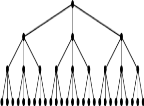
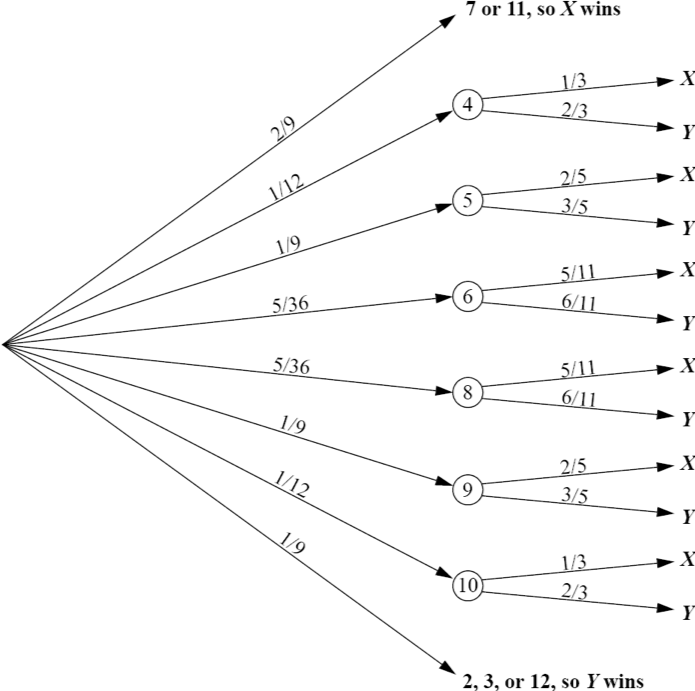
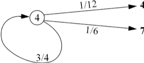
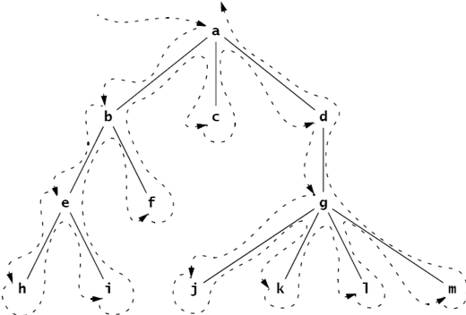
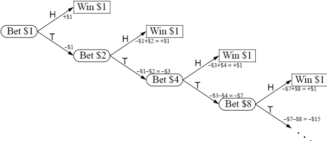
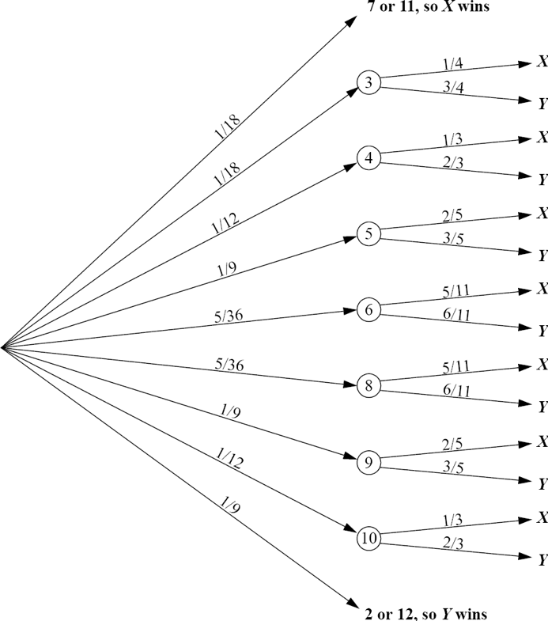
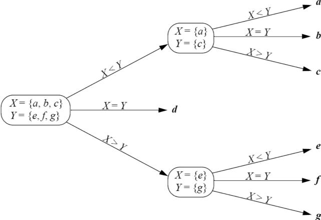

:stem: latexmath

= Trees

A tree is a nonlinear data structure that models a hierarchical organization. The characteristic features are that each element may have several successors (called its “children”) and every element except one (called the “root”) has a unique predecessor (called its “parent”). Trees are common in computer science: Computer file systems are trees, the inheritance structure for Java classes is a tree, the run-time system of method invocations during the execution of a Java program is a tree, the classification of Java types is a tree, and the actual syntactical definition of the Java programming language itself forms a tree.

== TREE DEFINITIONS

Here is the recursive definition of an (unordered) tree:

====
**A tree is a pair (r, S), where r is a node and S is a set of disjoint trees, none of which contains r.**
====

The node r is called the root of the tree T, and the elements of the set S are called its subtrees. The set S, of course, may be empty. The restriction that none of the subtrees contains the root applies recursively: r cannot be in any subtree or in any subtree of any subtree.
Note that this definition specifies that the second component of a tree be a set of subtrees. So the order of the subtrees is irrelevant. Also note that a set may be empty, so (r, ) qualifies as a tree. This is called a singleton tree. But the empty set itself does not qualify as an unordered tree.

== EXAMPLE 10.1 Equal Unordered Trees

The two trees shown in Figure 10.1 are equal. The tree on the left has root a and two subtrees B and C, where stem:[B= (b, 0)], stem:[C = (c, {D})], and D is the subtree stem:[D = (d, 0)]. The tree on the right has the same root a and the same set of subtrees stem:[{B, C} = {C, B}], so stem:[(a, {B, C}) = (a, {C, B})].

image::./images/figure10_1.png[Equal trees,align=center]
Figure 10.1 Equal trees

The elements of a tree are called its _nodes_. Technically, each node is an element of only one subtree, namely the tree of which it is the root. But indirectly, trees consist of nested subtrees, and each node is considered to be an element of every tree in which it is nested. So a, b, c, and d are all considered to be nodes of the tree A shown Figure 10.2. Similarly, c and d are both nodes of the tree C.

The size of a tree is the number of nodes it contains. So the tree A shown in Figure 10.2 has size 4, and C has size 2. A tree of size 1 is called a _singleton_. The trees B and D shown here are singletons.
If stem:[T = (x, S) ]is a tree, then x is the root of T and S is its set of subtrees stem:[S = {T_{1}, T_{2}, \cdots, T_{n}}]. Each subtree stem:[T_j] is itself a tree with its own root stem:[r_j] . In this case, we call the node r the _parent_ of each node stem:[r_j], and we call the stem:[r_j] the _children_ of r. In general, we say that two nodes are adjacent if one is the parent of the other.
A node with no children is called a leaf. A node with at least one child is called an _internal node_.

image::./images/figure10_2.png[Subtrees,align=center]
Figure 10.2 Subtrees

A path in a tree is a sequence of nodes stem:[(x_{0}, x_{1}, x_{2}, \cdots, x_{m})] wherein the nodes of each pair with adjacent subscripts stem:[(x_{i-1}, x_{i})] are adjacent nodes. For example, (a, b, c, d) is a path in the tree shown above, but (a, d, b, c) is not. The _length_ of a path is the number m of its adjacent pairs.
It follows from the definition that trees are _acyclic_, that is, no path can contain the same node more than once.
A _root path_ for a node stem:[x_{0}] in a tree is a path stem:[(x_{0}, x_{1}, x_{2}, \cdots, x_{m})] where xm is the root of the tree. A root path for a leaf node is called a leaf-to-root path.

== Theorem 10.1 Every node in a tree has a unique root path.

For a proof, see Problem 10.1 on page 194.

The depth of a node in a tree is the length of its root path. Of course, the depth of the root in any tree is 0. We also refer to the depth of a subtree in a tree, meaning the depth of its root.
A level in a tree is the set of all nodes at a given depth.
The height of a tree is the greatest depth among all of its nodes. By definition, the height of a singleton is 0, and the height of the empty tree is –1. For example, the tree A, shown in Figure 10.2, has height 2. Its subtree C has height 1, and its two subtrees B and D each have height 0.
A node y is said to be an ancestor of another node x if it is on x’s root path. Note that the root of a tree is an ancestor of every other node in the tree.
A node x is said to be a descendant of another node y if y is an ancestor of x. For each node y in a tree, the set consisting of y and all its descendants form the subtree rooted at y. If S is a subtree of T, then we say that T is a supertree of S.
The path length of a tree is the sum of the lengths of all paths from its root. This is the same as the weighted sum, adding each level times the number of nodes on that level. The path length of the tree shown here is 1-3 + 2-4 + 3-8 = 35.

=== EXAMPLE 10.2 Properties of a Tree

The root of the tree shown in Figure 10.3 is node a. The six nodes a, b, c, e, f, and h are all internal nodes. The other nine nodes are leaves. The path (l,
h, c, a) is a leaf-to-root path. Its length is 3. Node b has depth 1, and node m has depth 3. Level 2 consists of nodes e, f, g, and h. The height of the tree is 3. Nodes a, c, and h are all ancestors of node l. Node k is a descendant of node c but not of node b. The

subtree rooted at b consists of nodes b, e, i, and j.

Figure 10.3 A leaf-to-root path

The degree of a node is the number of its children. In Example 10.2, b has degree 1, d has degree 0, and h has degree 5.
The order of a tree is the maximum degree among all of its nodes.
A tree is said to be full if all of its internal nodes have the same degree and all of its leaves are at the same level. The tree shown in Figure 10.4 is a full tree of degree 3. Note that it has a total of 40 nodes.

image::./images/figure10_4.png[A full tree,align=center]
Figure 10.4 A full tree

**Theorem 10.2 The full tree of order d and height h has stem:[{d^{h+1} - 1} \over {d-1}] nodes.**

For a proof, see Problem 10.1 on page 194.

**Corollary 10.1 The height of a full tree of order d and size n is stem:[h = \log_{d} (nd - n + 1) - 1].**

**Corollary 10.2 The number of nodes in any tree of height h is at most stem:[ {d^{h + 1} – 1} \over {d-1}] where d is the maximum degree among its nodes.**

== DECISION TREES

A _decision tree_ is a tree diagram that summarizes all the different possible stages of a process that solves a problem by means of a sequence of decisions. Each internal node is labeled with a question, each arc is labeled with an answer to its question, and each leaf node is labeled with the solution to the problem.

=== EXAMPLE 10.3 Finding the Counterfeit Coin

Five coins that appear identical are to be tested to determine which one of them is counterfeit. The only feature that distinguishes the counterfeit coin is that it weighs less than the legitimate coins. The only available test is to weigh one subset of the coins against another. How should the subsets be chosen to find the counterfeit?

image::./images/figure10_5.png[A decision tree,align=center]

In the decision tree shown in Figure 10.5, the symbol ~ means to compare the weights of the two operands. So, for example, stem:[{a, b} ~ {d, e}] means to weight coins stem:[a] and stem:[b] against coins stem:[d] and stem:[e].

== TRANSITION DIAGRAMS

A _transition diagram_ is a tree or graph (see Chapter 15) whose internal nodes represent differ- ent states or situations that may occur during a multistage process. As in a decision tree, each leaf represents a different outcome from the process. Each branch is labeled with the conditional probability that the resulting child event will occur, given that the parent event has occurred.

=== EXAMPLE 10.4 The Game of Craps

The game of craps is a dice game played by two players, X and Y. First X tosses the pair of dice. If the sum of the dice is 7 or 11, X wins the game. If the sum is 2, 3, or 12, Y wins. Otherwise, the sum is desig- nated as the “point,” to be matched by another toss. So if neither player has won on the first toss, then the dice are tossed repeatedly until either the point comes up or a 7 comes up. If a 7 comes up first, Y wins. Otherwise, X wins when the point comes up.
The transition diagram shown in Figure 10.6 models the game of craps.

Figure 10.6 A decision tree for the game of craps

When a pair of dice is tossed, there are 36 possible outcomes (6 outcomes on the first die, and 6 outcomes on the second for each outcome on the first die). Of those 36 outcomes, 1 will produce a sum of 2 (1 + 1), 2 will produce a sum of 3 (1 + 2 or 2 + 1), and 1 will produce a sum of 12 (6 + 6). So there are a total of 4 chances out of 36 of the event “2, 3, or 12” happening. That’s a probability of 4/36 = 1/9. Similarly, there are 6 ways that a sum of 7 will occur and 2 ways that a sum of 11 will occur, so the proba- bility of the event “7 or 11” is 8/36 = 2/9. The other probabilities on the first level of the tree are computed similarly.
To see how the probabilities are computed for the second level of the tree, consider the case where the point is 4. If the next toss comes up 4, X wins. If it comes up 7, Y wins. Otherwise, that step is repeated. The transition diagram shown in Figure 10.7 summarizes those three possibilities. The probabilities 1/12, 1/6, and 3/4 are computed as shown in the transition diagram in Figure 10.7:

[stem]
++++
\begin{align*}
&P(4) = 3/36 = 1/12\\
&P(7) = 6/36 = 1/3\\
&P(2,3,5,6,8,9,10,11, or 12) = 27/36 = 3/4\
\end{align*}
++++

Figure 10.7 The game of craps

So once the point 4 has been established on the first toss, X has a probability of 1/12 of winning on the second toss and a probability of 3/4 of getting to the third toss. So once the point 4 has been established on the first toss, X has a probability of (3/4)(1/12) of winning on the third toss and a probability of (3/4)(3/4) of getting to the fourth toss. Similarly, once the point 4 has been established on the first toss, X has a probability of (3/4)(1/12) + (3/4)(3/4)(1/12) of winning on the fourth toss, and so on. Summing these partial probabilities, we find that once the point 4 has been established on the first toss, the probability that X wins on any toss thereafter is

[stem]
++++
\begin{align*}
P_4 &= {1 \over 2} + ({3 \over 4}){1 \over 12}
+ {{({3 \over 4})}^2}{1 \over 12}
+ {{({3 \over 4})}^3}{1 \over 12}
+ {{({3 \over 4})}^4}{1 \over 12}
+ {{({3 \over 4})}^5}{1 \over 12}
+ \cdots\\
&= {{1 \over 12} \over {1 - {3 \over 4}}}\\
&= {{1 \over 12} \over {1 \over 4}}\\
&= {1 \over 3}
\end{align*}
++++

This calculation applies the formula for geometric series. (See page 323.)
If the probability is 1/3 that X wins once the point 4 has been established on the first toss, the probabil- ity that Y wins at that point must be 2/3. The other probabilities at the second level are computed similarly.
Now we can calculate the probability that X wins the game from the main transition diagram:

So the probability that X wins is 49.29 percent, and the probability that Y wins is 50.71 percent.

[stem]
++++
\begin{align*}
P &= {2 \over 9} + {1 \over 12}{(P_{4})}
+ {1 \over 9}{(P_{5})}
+ {5 \over 36}{(P_{6})}
+ {5 \over 36}{(P_{8})}
+ {1 \over 9}{(P_{9})}
+ {1 \over 12}{(P_{10})}\\
&= {2 \over 9} + {1 \over 12}{({1 \over 3})}
+ {1 \over 9}{({2 \over 5})}
+ {5 \over 36}{({5 \over 11})}
+ {5 \over 36}{({5 \over 11})}
+ {1 \over 9}{({2 \over 5})}
+ {1 \over 12}{({1 \over 3})}\\
&= {244 \over 495}
\end{align*}
++++

A stochastic process is a process that can be analyzed by a transition diagram, that is, it can be decomposed into sequences of events whose conditional probabilities can be computed. The game of craps is actually an infinite stochastic process since there is no limit to the number of events that could occur. As with the analysis in Example 10.4, most infinite stochastic processes can be reformulated into an equivalent finite stochastic process that is amenable to (finite) computers.
Note that, unlike other tree models, decision trees and transition trees are usually drawn from left to right to suggest the time-dependent movement from one node to the next.

== ORDERED TREES

Here is the recursive definition of an ordered tree:
====
**An ordered tree is either the empty set or a pair T = (r, S), where r is a node and S is a sequence of disjoint ordered trees, none of which contains r.**
====

The node r is called the root of the tree T, and the elements of the sequence S are its subtrees. The sequence S of course may be empty, in which case T is a singleton. The restriction that none of the subtrees contains the root applies recursively: x cannot be in any subtree, or in any subtree of any subtree, and so on.
Note that this definition is the same as that for unordered trees except for the facts that the subtrees are in a sequence instead of a set and an ordered tree may be empty. Consequently, if two unordered trees have the same subsets, then they are equal; but as ordered trees, they won’t be equal unless their equal subtrees are in the same order. Also subtrees of an ordered set may be empty.

=== EXAMPLE 10.5 Unequal Ordered Trees

The two trees shown in Figure 10.8 are not equal as ordered trees.

image::./images/figure10_8.png[Unequal ordered trees]
Figure 10.8 Unequal ordered trees

The ordered tree on the left has root node a and subtree sequence stem:[( (b, 0), (c, (d, 0) ) )]. The ordered

tree on the right has root node a and subtree sequence stem:[( (c, (d, 0) ), (b, 0) )]. These two subtree

sequences have the same elements, but not in the same order. Thus the two ordered trees are not the same.
Strict adherence to the definition reveals a subtlety often missed, as illustrated by the next example.

=== EXAMPLE 10.6 Unequal Ordered Trees

The two trees stem:[T1 = (a, (B, C))] and stem:[T2 = (a, (B, \phi, C))] are not the same ordered trees, even though they would probably both be drawn the same, as shown in Figure 10.9.

image::./images/figure10_9.png[A tree,align=center]
Figure 10.9 A tree

All the terminology for unordered trees applies the same way to ordered trees. In addition, we can also refer to the first child and the last child of a node in an ordered tree. It is sometimes useful to think analogously of a human genealogical tree, where the children are ordered by age: oldest first and youngest last.

== TRAVERSAL ALGORITHMS

A traversal algorithm is a method for processing a data structure that applies a given operation to each element of the structure. For example, if the operation is to print the contents of the element, then the traversal would print every element in the structure. The process of applying the operation to an element is called visiting the element. So executing the traversal algorithm causes each element in the structure to be visited. The order in which the elements are visited depends upon which traversal algorithm is used. There are three common algorithms for travers- ing a general tree.
The level order traversal algorithm visits the root, then visits each element on the first level, then visits each element on the second level, and so forth, each time visiting all the elements on one level before going down to the next level. If the tree is drawn in the usual manner with its root at the top and leaves near the bottom, then the level order pattern is the same left-to-right top-to-bottom pattern that you follow to read English text.

=== EXAMPLE 10.7 The Level Order Traversal

The level order traversal of the tree shown in Figure 10.10 would visit the nodes in the following order: **a, b, c, d, e, f, g, h, i, j, k, l, m**.

image::./images/figure10_10.png[A level order traversal,align=center]
Figure 10.10 A level order traversal

=== Algorithm 10.1 The Level Order Traversal of an Ordered Tree

To traverse a nonempty ordered tree:
1.	Initialize a queue.
2.	Enqueue the root.
3.	Repeat steps 4-7 until the queue is empty.
4.	Dequeue node x from the queue.
5.	Visit x.
6.	Enqueue all the children of x in order.

The _preorder traversal_ algorithm visits the root first and then does a preorder traversal recur- sively to each subtree in order.

=== EXAMPLE 10.8 The Preorder Traversal

The preorder traversal of the tree shown in Figure 10.11 would visit the nodes in this order: **a, b, e, h, i, f, c, d, g, j, k, l, m**.

Figure 10.11 A preorder traversal

Note that the preorder traversal of a tree can be obtained by circumnavigating the tree, begin- ning at the root and visiting each node the first time it is encountered on the left.

=== Algorithm 10.2 The Preorder Traversal of an Ordered Tree

To traverse a nonempty ordered tree:

1. Visit the root.
2. Do a recursive preorder traversal of each subtree in order.

The postorder traversal algorithm does a postorder traversal recursively to each subtree before visiting the root.

=== EXAMPLE 10.9 The Postorder Traversal

The postorder traversal of the tree shown in Figure 10.12 would visit the nodes in the following order: **h, i, e, f, b, c, j, k, l, m, g, d, a**.

=== Algorithm 10.3 The Postorder Traversal of an Ordered Tree

To traverse a nonempty ordered tree:

1. Do a recursive preorder traversal of each subtree in order.
2. Visit the root.

image::./images/figure10_12.png[A Tree, align=center]
Figure 10.12 A tree

Note that the level order and the preorder traversals always visit the root of each subtree first before visit- ing its other nodes. The postorder traversal always visits the root of each subtree last after visiting all of its other nodes. Also, the preorder traversal always visits the right-most node last, while the postorder traversal always visits the left-most node first.
The preorder and postorder traversals are recursive. They also can be implemented iteratively using a stack. The level order traversal is implemented iteratively using a queue.

== Review Questions

1. All the classes in Java form a single tree, called the Java inheritance tree.
a. What is the size of the Java inheritance tree in Java 1.3?
b. What is the root of the tree?
c. What kind of node is a final class in the Java inheritance tree?
2. True or false:
a. The depth of a node in a tree is equal to the number of its ancestors.
b. The size of a subtree is equal to the number of descendants of the root of the subtree.
c. If x is a descendant of y, then the depth of x is greater than the depth of y.
d. If the depth of x is greater than the depth of y, then x is a descendant of y.
e. A tree is a singleton if and only if its root is a leaf.
f. Every leaf of a subtree is also a leaf of its supertree.
g. The root of a subtree is also the root of its supertree.
h. The number of ancestors of a node equals its depth.
i. If R is a subtree of S and S is a subtree of T, then R is a subtree of T.
j. A node is a leaf if and only if it has degree 0.
k. In any tree, the number of internal nodes must be less than the number of leaf nodes.
l. A tree is full if and only if all of its leaves are at the same level.
m. Every subtree of a full binary tree is full.
n. Every subtree of a complete binary tree is complete.
3. For the tree shown in Figure 10.13, find:
a. all ancestors of node F
b. all descendants of node F
c. all nodes in the subtree rooted at F
d. all leaf nodes
4. For each of the five trees shown in Figure 10.14 on page 195, list the leaf nodes, the children of node C, the depth of node F, all the nodes at level 3, the height, and the order of the tree.
5. How many nodes are in the full tree of:
a. order 3 and height 4?
b. order 4 and height 3?
c. order 10 and height 4?
d. order 4 and height 10?
6. Give the order of visitation of the tree shown in Example 10.2 on page 187 using the:
a. level order traversal
b. preorder traversal
c. postorder traversal
+
Figure 10.13 A tree
+
Figure 10.14 A tree
+
7. Which traversals always visit:
a. the root first?
b. the left-most node first?
c. the root last?
d. the right-most node last?
8. The level order traversal follows the pattern as reading a page of English text: left-to-right, row-by-row. Which traversal algorithm follows the pattern of reading vertical columns from left to right?
9. Which traversal algorithm is used in the call tree for the solution to Problem 9.32 on page 184?

=== Problems

1. Prove Theorem 10.1 on page 187.
2. Prove Theorem 10.2 on page 188.
3. Prove Corollary 10.1 on page 188.
4. Prove Corollary 10.2 on page 188.
5. Derive the formula for the path length of a full tree of order d and height h.
6. The St. Petersburg Paradox is a betting strategy that seems to guarantee a win. It can be applied to any binomial game in which a win or lose are equally likely on each trial and in which the amount bet on each trial may vary. For example, in a coin-flipping game, bettors may bet any number of dollars on each flip, and they will win what they bet if a head comes up, and they will lose what they bet if a tail comes up. The St. Petersburg strategy is to con- tinue playing until a head comes up, and to double your bet each time it doesn’t. For exam- ple, the sequence of tosses is {T, T, T, H}, then the bettor will have bet $1 and lost, then $2 and lost, then $4 and lost, then $8 and won, ending up with a net win of –$1 + –$2 + –$4 + $8 = $1. Since a head has to come up eventually, the bettor is guaranteed to win $1, no matter how many coin flips it takes. Draw the transition diagram for this strategy showing the bettor’s winnings at each stage of play. Then explain the flaw in this strategy.
7. Some people play the game of craps allowing 3 to be a possible point. In this version, player Y wins on the first toss only if it comes up 2 or 12. Use a transition diagram to analyze this version of the game and compute the probability that X wins.
8. Seven coins that appear identical are to be tested to determine which one of them is counter- feit. The only feature that distinguishes the counterfeit coin is that it weighs less than the legitimate coins. The only available test is to weigh one subset of the coins against another. How should the subsets be chosen to find the counterfeit? (See Example 10.3 on page 188.)

=== Answers to Review Questions

1. In the Java inheritance tree:
a. The size of the tree in Java 1.3 is 1730.
b. The Object class is at the root of the tree.
c. A final class is a leaf node in the Java inheritance tree.
2.
a. True.
b. False: It’s one more because the root of the subtree is in the subtree but is not a descendant of itself.
c. True
d. False
e. True
f. True
g. False
h. True
i. True
j. True
k. False
l. False
m. True
n. True
3.
a. The leaf nodes are L, M, N, H, O, P, Q; the children of node C are G and H; node F has depth 2; the nodes at 3 three are L, M, N, O, P, and Q; the height of the tree is 3; the order of the tree is 4.
b. The leaf nodes are C, E, G, O, P, Q, R, and S; node C has no children; node F has depth 2; the nodes at level 3 are L, M, N, and O; the height of the tree is 4; the order of the tree is 4.
c. The leaf nodes are C, E, G, J, L, N, O, P, W, Y, and Z; node C has no children; node F has depth 2; the nodes at level 3 are H, J, and K; the height of the tree is 9; the order of the tree is 3.
d. The leaf nodes are G, H, K, L, N, O, P, Q, R, S, and T; the only child node C has is node E; node F has depth 3; the nodes at level 3 are F, G, H, and J; the height of the tree is 5; the order is 5.
e. The leaf nodes are D, E, L, N, P, Q, R, S, and T; node C has no children; node F has depth 1; the nodes at level 3 are K, L, M, N, and O; the height of the tree is 4; the order of the tree is 5.
4.
a. The ancestors of F are C and A
b.The descendants of F are I, K, and L.
c.The nodes in the subtree rooted at F are F, I, K, and L.
d.The leaf nodes are D, H, J, K, and L.
5.
a. (35 – 1)/2 = 121 nodes
b. (44 – 1)/3 = 85 nodes
c. (105 – 1)/9 = 11,111 nodes
d. (411 – 1)/3 = 1,398,101 nodes
6.
a. Level order: a, b, c, d, e, f, g, h, i, j, k, l, m, n, o.
b..Preorder: a, b, e, i, j, c, f, k, g, h, l, m, n, o, d.
c..Postorder: i, j, e, b, k, f, g, l, m, n, o, h, c, d, a.
7.
a. The level order and the preorder traversals always visit the root first.
b. The postorder traversal always visits the left-most node first.
c. The postorder traversal always visits the root last.
d. The preorder traversal always visits the right-most node last.
8. The preorder traversal follows the pattern of reading by column from left to right.
9. The preorder traversal is used in Problem 9.32 on page 184.

==== Solutions to Problems

1. Proof of Theorem 10.1 on page 187:
+
If there were no path from a given node x to the root of the tree, then the definition of tree would be violated, because to be an element of the tree, x must be the root of some subtree. If there were more than one path from x back to the root, then x would be an element of more than one distinct subtree. That also violates the definition of tree, which requires subtrees to be disjoint.
2. Proof of Theorem 10.2 on page 188:
+
If the tree is empty, then its height is h = –1 and the number of nodes n = 0. In that case, the formula is correct: stem:[n = (d^{(h)+1}-1)/(d-1) = (d^{(-1)+1}–1)/(d-1) = (d^{0-1})/(d-1) = (1-1)/(d-1) = 0].
If the tree is a singleton, then its height is h = 0 and the number of nodes n = 1. In that case, the formula is again correct: stem:[n = (d^{(h)+1}-1)/(d-1) = (d^{(0)+1}-1)/(d-1) = (d-1)/(d-1) = 1].
Now assume that the formula is correct for any full tree of height stem:[h-1], where stem:[h \ge 0]. Let stem:[T] be the full tree of height stem:[h]. Then by definition, stem:[T] consists of a root node and a set of d subtrees. And since stem:[T] is full, each of its d subtrees has height stem:[h-1]. Therefore, by the inductive hypothesis, the number of nodes in each subtree is stem:[n_{S} = (d^{(h-1)+1}-1)/(d-1) = (d^{h}-1)/(d-1)]. Thus, the total number of nodes in T is

[stem]
++++
\begin{align*}
n &= 1 + (d)(n_{S})\\
&=	1 + {d\left({{d^{h} - 1} \over {d - 1}}\right)}\\
&= {{d - 1} \over {d - 1}} + {{d^{h+1}-d} \over {d-1}}\\
&= {{d^{h+1}-1} \over {d-1}}
\end{align*}
++++
+
Thus, by the Principle of Mathematical Induction (see page 321), the formula must be correct for all full trees of any height.
3. Proof of Corollary 10.1 on page 188:
+
This proof is purely algebraic:
+
[stem]
++++
\begin{align*}
n &= {{d^{h+1}-1} \over {d-1}}\\
n(d-1) &= d^{h+1}-1\\
d^{h+1} &= n(d-1) + 1\\
&= nd - n + 1\\
h+1 &= log_{d}(nd -n+1)\\
h &= log_{d}(nd-n+1)-1
\end{align*}
++++
4. Proof of Corollary 10.2 on page 188:
+
Let T be a tree of any order d and any height h. Then T can be embedded into the full tree of the same degree and height. That full tree has exactly stem:[{d^{h+1}-1} \over {d-1}] nodes, so its subtree T has at most that many nodes.
5. The path length of a full tree of order d and height stem:[h] is stem:[{{d} \over (d-1)^2} [hd^{h+1} - {h+1}d + 1]. For example, the path length of the full tree on Figure 10.4 on page 188 is 102.
6. The tree diagram analysis of the St. Petersburg Paradox is shown in Figure 10.15. The flaw in this strategy is that there is a distinct possibility (i.e., a positive probability) that enough tails could come
up in a row to make the required bet exceed the bettor’s stake. After n successive tails, the bettor must bet $2n. For example, if 20 tails come up in a row, the next bet will have to be more than a million dol- lars!
+

Figure 10.15 Analysis of the St. Petersburg Paradox
7. The decision tree for the version of craps where 3 can be a point is shown in Figure 10.16. The proba- bility that X wins this version is 0.5068 or 50.68 percent.
8. The decision tree in Figure 10.17 shows all possible outcomes from the algorithm that solves the 7- coin problem.

Figure 10.16 Decision tree for a craps game

Figure 10.17 Decision tree for the 7-coin problem
