:stem: latexmath

= Binary Trees

== DEFINITIONS

Here is the recursive definition of a binary tree:

====
**A binary tree is either the empty set or a triple T = (x , L, R ), where x is a node and L and R are disjoint binary trees, neither of which contains x**.
====

The node x is called the root of the tree T, and the subtrees L and R are called the left subtree and the right subtree of T rooted at x.
Comparing this definition with the one on page 186, it is easy to see that a binary tree is just an ordered tree of order 2. But be aware that an empty left subtree is different from an empty right subtree. (See Example 10.5 on page 191.) Consequently, the two binary trees shown Figure 11.1 are not the same.

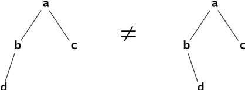
Figure 11.1 Unequal binary trees

Here is an equivalent, nonrecursive definition for binary trees:
A binary tree is an ordered tree in which every internal node has degree 2.
In this simpler definition, the leaf nodes are regarded as dummy nodes whose only purpose is to define the structure of the tree. In applications, the internal nodes would hold data, while the leaf nodes would be either identical empty nodes, a single empty node, or just the null reference. This may seem inefficient and

more complex, but it is usually easier to implement. In Figure 11.2, the dummy leaf nodes in the tree on the right are shown as asterisks.

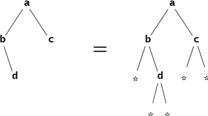
Figure 11.2 Equal binary trees

Except where noted, in this book we adhere to the first definition for binary trees. So some internal nodes may have only one child, either a left child or a right child.
The definitions of the terms size, path, length of a path, depth of a node, level, height, interior node, ancestor, descendant, subtree, and supertree are the same for binary trees as for general trees. (See page 186.)

== EXAMPLE 11.1 Characteristics of a Binary Tree

Figure 11.3 shows a binary tree of size 10 and height 3. Node a is its root. The path from node h to node b has length 2. Node b is at level 1, and node h is at level 3. b is an ancestor of h, and h is a descendant of b. The part in the shaded region is a subtree of size 6 and height 2. Its root is node b.

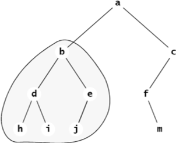
Figure 11.3 A binary tree

== COUNTING BINARY TREES

EXAMPLE 11.2 All the Binary Trees of Size 3

There are five different binary trees of size n = 3, as shown in Figure 11.4.

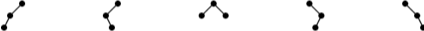
Figure 11.4 The five different binary trees of size 3

Four have height 2, and the other one has height 1.

== EXAMPLE 11.3 All the Binary Trees of Size 4

There are 14 different binary trees of size n = 4, as shown in Figure 11.5.

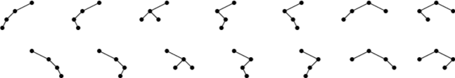
Figure 11.5 The 14 different binary trees of size 4

Ten have height 3, and the other four have height 2.

== EXAMPLE 11.4 All the Binary Trees of Size 5

To find all the binary trees of size 5, apply the recursive definition for binary trees. If t is a binary tree of size 5, then it must consist of a root node together with two subtrees the sum of whose sizes equals 4. There are four possibilities: The left subtree contains either 4, 3, 2, 1, or 0 nodes.
First count all the binary trees of size 5 whose left subtree has size 4. From Example 11.3, we see that there are 14 different possibilities for that left subtree. But for each of those 14 choices, there are no other options because the right subtree must be empty. Therefore, there are 14 different binary trees of size 5 whose left subtree has size 4.
Next, count all the binary trees of size 5 whose left subtree has size 3. From Example 11.2, we see that there are five different possibilities for that left subtree. But for each of those five choices, there are no other options because the right subtree must be a singleton. Therefore, there are five different binary trees of size 5 whose left subtree has size 3.
Next, count all the binary trees of size 5 whose left subtree has size 2. There are only two different possibilities for that left subtree. But for each of those two choices, we have the same two different possi- bilities for the right subtree because it also must have size 2. Therefore, there are stem:[2 \times 2 = 4] different binary trees of size 5 whose left subtree has size 2.
By similar reasoning, we find that there are five different binary trees of size 5 whose left subtree has size 1, and there are 14 different binary trees of size 5 whose left subtree has size 0. Therefore, the total number of different binary trees of size 5 is 14 + 5 + 4 + 5 + 14 = 42.

== FULL BINARY TREES

A binary tree is said to be full if all its leaves are at the same level and every interior node has two children.
EXAMPLE 11.5 The Full Binary Tree of Height 3
The tree shown in Figure 11.6 is the full binary tree of height 3. Note that it has 15 nodes: 7 interior nodes and 8 leaves.

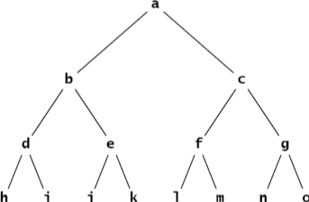
Figure 11.6 A full binary tree of height 3

**Theorem 11.1 The full binary tree of height h has stem:[l = 2^h] leaves and stem:[m = 2^{h} – 1] internal nodes**.

**Proof**: The full binary tree of height h = 0 is a single leaf node, so it has n = 1 node, which is a leaf. Therefore, since stem:[2^{h} = 1 = 20 - 1 = 1 - 1 = 0], and stem:[2^{h} = 20 = 1], the formulas are correct for the case where stem:[h = 0]. More generally, let stem:[h > 0] and assume (the inductive hypothesis) that the formulas are true for all full binary trees of height less than h. Then consider a full binary tree of height stem:[h]. Each of its subtrees has height stem:[h - 1], so we apply the formulas to them: stem:[l_{L} = l_{R} = 2^{h-1}] and stem:[m_{L} = m_{R} = 2^{h-1} - 1]. (These are the number of leaves in the left subtree, the number of leaves in the right subtree, the number of internal nodes in the left subtree, and the number of internal nodes in the right subtree, respectively.) Then
[stem]
++++
l = l_{L} + l_{R} = 2^{h-1} + 2^{h-1} = 2·2^{h-1} = 2h
++++
and

[stem]
++++
m = m_L + m_R + 1 = (2^{h-1} - 1) + (2^{h-1} - 1) + 1 = 2·2^{h-1} - 1 = 2^{I} - 1
++++

Therefore, by the (Second) Principle of Mathematical Induction, the formulas must be true for full binary trees of any height stem:[h >0].
By simply adding the formulas for m and l, we obtain the first corollary.
**Corollary 11.1 The full binary tree of height h has a total of stem:[n = 2^{h+1} - 1] nodes**.
By solving the formula stem:[n = 2^{h+1} - 1] for h, we obtain this corollary:
**Corollary 11.2 The full binary tree with n nodes has height stem:[h = lg(n+1) – 1]**.
Note that the formula in Corollary 11.2 is correct even in the special case where stem:[n = 0]: The empty binary tree has height stem:[h = \lg(n+1) - 1 = \lg(0+1) - 1 = \lg(1) - 1 = 0 - 1 = -1].

The next corollary applies Corollary 11.1 together with the fact that the full binary tree of height h has more nodes than any other binary tree of height h.

**Corollary 11.3 In any binary tree of height h,**
[stem]
++++
h + 1 \le n \le 2^{h+1} - 1 \text { and } \lfloor \lg n\rfloor \le h \le n-1
++++
**where n is the number of its nodes.**

== IDENTITY, EQUALITY, AND ISOMORPHISM

In a computer, two objects are identically equal if they occupy the same space in memory, so they have the same address. In other words, there really only one object, but with two different names. That meaning of equality is reflected in Java by the equality operator. If x and y are refer- ences to objects, then the condition (x == y) will be true only if x and y both refer to the same object.

But the normal concept of equality in mathematics is that the two things have the same value. This distinction is handled in Java by the equals() method, defined in the Object class (see Chapter 4) and thus inherited by every class. As defined there, it has the same effect as the equals operator: x.equals(y) means x == y. But that equals() method is intended to be overridden in subclasses so that it will return true not only when the two objects are identically equal, but also when they are separate objects that are “the same” in whatever sense the class designer intends. For example, x.equals(y) could be defined to be true for distinct instances x and y of Point class if they have the same coordinates.

=== EXAMPLE 11.6 Testing Equality of Strings
[source,java]
----
1	public class TestStringEquality {
2	  static public void main(String[] args) {

3		String x = new String("ABCDE");
4		String y = new String("ABCDE");
5		System.out.println("x = " + x);
6		System.out.println("y = " + y);
7		System.out.println("(x == y) = " + (x == y));
8		System.out.println("x.equals(y) = " + x.equals(y));
9	  }
10	}
----

The output is:

[source, console]
----
x = ABCDE
y = ABCDE
(x == y) = false
x.equals(y) = true
----

Here, the two objects x and y (or, more precisely, the two objects that are referenced by the reference variables x and y) are different objects, occupying different memory locations, so they are not identically equal: (x == y) evaluates to false at line 7. But they do both have the same contents, so they are mathematically equal, and x.equals(y) evaluates to true at line 8.

The distinction between identical equality and mathematical equality exists in Java only for reference variables (i.e., only for objects). For all variables of primitive types, the equality opera- tor tests for mathematical equality.

Data structures have both content and structure. So it is possible for two data structures to have equal contents (i.e., have the same contents) but be organized differently. For example, two arrays could both contain the three numbers 22, 44, and 88, but in different orders.

=== EXAMPLE 11.7 Testing Equality of Arrays

[source,java]
----
1	public class TestArraysEquality {
2	  public static void main(String[] args) {
3	    int[] x = { 22, 44, 88 };
4	   int[] y = { 88, 44, 22 };
5	   ch02.ex02.DuplicatingArrays.print(x);
6	   ch02.ex02.DuplicatingArrays.print(y);
7	   System.out.println("Arrays.equals(x, y) = " + Arrays.equals(x,	y));
8	    Arrays.sort(x);
9	    Arrays.sort(y);
10	    ch02.ex02.DuplicatingArrays.print(x);
11	    ch02.ex02.DuplicatingArrays.print(y);
12      System.out.println("Arrays.equals(x, y) = " + Arrays.equals(x,	y));
13	  }
14	}
----

The output it:

[source,console]
----
{22, 44, 88}
	{88, 44, 22}
	Arrays.equals(x,	y)	=	false
	{22, 44, 88}
	{22, 44, 88}
	Arrays.equals(x,	y)	=	true
----

This shows that the java.util.Arrays.equal() method requires not only the same contents for arrays to be equal, but also in the same order, as would be expected.

Equality is a weaker relation than identity: Identical objects are always equal, but equal objects may not be identical; they could be distinct. Equality of data structures means the same structure and the same contents in the same order.

A weaker kind of reflexive relation is isomorphism. Two data structures are isomorphic if they have the same structure. This concept is used when the “data” part of the data structure is irrelevant.

Two arrays are isomorphic if they have the same length.

Two trees are isomorphic if one tree can be rearranged to match the other. More formally, T1 is isomorphic to T2 (sometimes written T1  T2) if there is a one-to-one mapping (an isomorphism) between them that preserves parent-child relationship between all nodes.

=== EXAMPLE 11.8 Isomorphic Trees

As unordered trees, Tree 1 and Tree 2 in Figure 11.7 are isomorphic, but not equal.

However, Tree 3 is not isomorphic to either of the other two trees because it has only three leaves; the other two trees each have four leaves:Tthat’s a different structure. That distinction leads fairly easily to a formal deduction that there is no isomorphism between Tree 1 and Tree 3.

As ordered trees, Tree 1 is not isomorphic to Tree 2 because their roots’ left-most subtrees have differ- ent sizes. The left-most subtree in Tree 1 has three nodes, while that of Tree 2 has only two nodes. That distinction also leads fairly easily to a formal deduction that no isomorphism between Tree 1 and Tree 2 can exist.

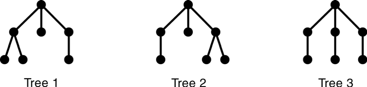

Figure 11.7 Isomorphic and nonisomorphic trees

Binary trees are ordered trees. The order of the two children at each node is part of the struc- ture of the binary tree.
Binary trees are ordered trees. So any isomorphism between binary trees must preserve the order of each node’s children.

=== EXAMPLE 11.9 Nonisomorphic Binary Trees

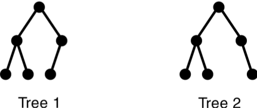
Figure 11.8 Nonisomorphic binary trees

In Figure 11.8, Binary Tree 1 is not isomorphic to Binary Tree 2, for the same reason that the ordered trees in Example 11.8 are not isomorphic: The subtrees don’t all match, as ordered trees. In Tree 1, the root’s right child has a left child; but in Tree 1, the root’s right child has no (nonempty) left child.

== COMPLETE BINARY TREES

A complete binary tree is either a full binary tree or one that is full except for a segment of missing leaves on the right side of the bottom level.

=== EXAMPLE 11.10 A Complete Binary Tree of Height 3

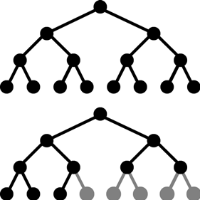
Figure 11.9 Complete binary trees

The tree shown in Figure 11.9 is complete. It is shown together with the full binary tree from which it was obtained by adding five leaves on the right at level 3.

**Theorem 11.2 In a complete binary tree of height h**,
[stem]
++++
h + 1 :: n :: 2^{h+1} - 1 \text { and } h = \lfloor lg n\rfloor
++++

where n is the number of its nodes.

=== EXAMPLE 11.11 More Complete Binary Trees

Figure 11.10 shows three more examples of complete binary trees.

image::./images/figure11_10.png[Complete binary trees]
Figure 11.10 Complete binary trees

Complete binary trees are important because they have a simple and natural implementation using ordinary arrays. The natural mapping is actually defined for any binary tree: Assign the number 1 to the root; for any node, if i is its number, then assign stem:[2_{i}] to its left child and stem:[2_{i+1}] to its right child (if they exist). This assigns a unique positive integer to each node. Then simply store the element at node i in a[i], where a[] is an array.
Complete binary trees are important because of the simple way in which they can be stored in an array. This is achieved by assigning index numbers to the tree nodes by level, as shown in Figure 11.11. The beauty in this natural mapping is the simple way that it allows the array indexes of the children and parent of a node to be computed.

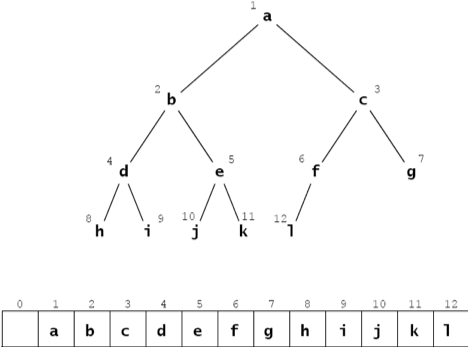
Figure 11.11 The natural mapping of a complete binary tree

**Algorithm 11.1 The Natural Mapping of a Complete Binary Tree into an Array**

To navigate about a complete binary tree stored by its natural mapping in an array:
1. The parent of the node stored at location i is stored at location i/2.
2. The left child of the node stored at location i is stored at location stem:[2_{i}].
3. The right child of the node stored at location i is stored at location stem:[2_{i + 1}].

For example, node e is stored at index i = 5 in the array; its parent node b is stored at index stem:[i/2 = 5/2 = 2], its left child node j is stored at location stem:[2i = 2·5 = 10], and its right child node k is stored at index stem:[2i + 1 = 2·5 + 1 = 11].

The use of the adjective “complete” should now be clear: The defining property for complete binary trees is precisely the condition that guarantees that the natural mapping will store the tree nodes “completely” in an array with no gaps.

=== EXAMPLE 11.12 An Incomplete Binary Tree

Figure 11.12 shows the incomplete binary tree from Example 11.1 on page 201. The natural mapping of its nodes into an array leaves some gaps, as shown in Figure 11.13.
Note: Some authors use the term “almost complete binary tree” for a complete binary tree and the term “complete binary tree” for a full binary tree.

image::./images/future11_12.png[A binary tree]
Figure 11.12 A binary tree

image::./images/future11_13.png[The natural mapping of an incomplete binary tree]
Figure 11.13 The natural mapping of an incomplete binary tree

== BINARY TREE TRAVERSAL ALGORITHMS

The three traversal algorithms that are used for general trees (see Chapter 10) apply to binary trees as well: the preorder traversal, the postorder traversal, and the level order traversal. In addition, binary trees support a fourth traversal algorithm: the inorder traversal. These four traversal algorithms are given next.

**Algorithm 11.2 The Level Order Traversal of a Binary Tree**

To traverse a nonempty binary tree:

1. Initialize a queue.
2. Enqueue the root.
3. Repeat steps 4–7 until the queue is empty.
4. Dequeue a node x from the queue.
5. Visit x.
6. Enqueue the left child of x if it exists.
7. Enqueue the right child of x if it exists.

=== EXAMPLE 11.13 The Level Order Traversal of a Binary Tree

Figure 11.14 on page 207 shows how the level order traversal looks on the full binary tree of height 3.

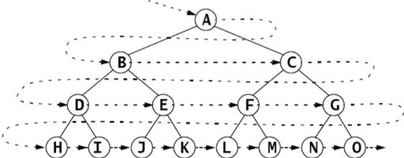
Figure 11.14 The level order traversal of a binary tree

The nodes are visited in the order **A, B, C, D, E, F, G, H, I, J, K, L, M, N, O**.

**Algorithm 11.3 The Preorder Traversal of a Binary Tree**

To traverse a nonempty binary tree:
1. Visit the root.
2. If the left subtree is nonempty, do a preorder traversal on it.
3. If the right subtree is nonempty, do a preorder traversal on it.

=== EXAMPLE 11.14 The Preorder Traversal of a Binary Tree

Figure 11.15 on page 208 shows the preorder traversal on the full binary tree of height 3.

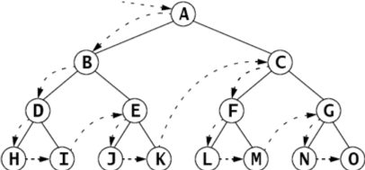
Figure 11.15 The preorder traversal of a binary tree

The nodes are visited in the order **A, B, D, H, I, E, J, K, C, F, L, M, G, N, O.**

Figure 11.16 shows how the preorder traversal of a binary tree can be obtained by circumnav- igating the tree, beginning at the root and visiting each node the first time it is encountered on the left:

image::./images/figure11_16.png[The preorder traversal of a binary tree,align=center]
Figure 11.16 The preorder traversal of a binary tree

**Algorithm 11.4 The Postorder Traversal of a Binary Tree**

To traverse a nonempty binary tree:

1. If the left subtree is nonempty, do a postorder traversal on it.
2. If the right subtree is nonempty, do a postorder traversal on it.
3. Visit the root.

=== EXAMPLE 11.15 The Postorder Traversal of a Binary Tree

Figure 11.17 shows the postorder traversal looks on the full binary tree of height 3.

image::./images/figure11_17.png[The postorder traversal of a binary tree,align=center]
Figure 11.17 The postorder traversal of a binary tree

The nodes are visited in the order H, I, D, J, K, E, B, L, M, F, N, O, G, C, A.

The preorder traversal visits the root first and the postorder traversal visits the root last. This suggests a third alternative for binary trees: Visit the root in between the traversals of the two subtrees. That is called the inorder traversal.

**Algorithm 11.5 The Inorder Traversal of a Binary Tree**

To traverse a nonempty binary tree:

1. If the left subtree is nonempty, do a preorder traversal on it.
2. Visit the root.
3. If the right subtree is nonempty, do a preorder traversal on it.

=== EXAMPLE 11.16 The Inorder Traversal of a Binary Tree

Figure 11.18 shows how the inorder traversal looks on the full binary tree of height 3.

image::./images/figure11_18.png[The inorder traversal of a binary tree]
Figure 11.18 The inorder traversal of a binary tree

The nodes are visited in the order H, D, I, B, J, E, K, A, L, F, M, C, N, G, O.

== EXPRESSION TREES

An arithmetic expression such as stem:[(5 - x)*y + 6/(x + z)] is a combination of arithmetic operators stem:[(+, -, *, /, etc.)], operands stem:[(5, x, y, 6, z, etc.)], and parentheses to override the precedence of operations. Each expression can be represented by a unique binary tree whose structure is determined by the precedence of operations in the expression. Such a tree is called an expression tree.

=== EXAMPLE 11.17 An Expression Tree

Figure 11.19 shows the expression tree for the expression (5 — x)*y + 6/(x + z).
Here is a recursive algorithm for building an expression tree:

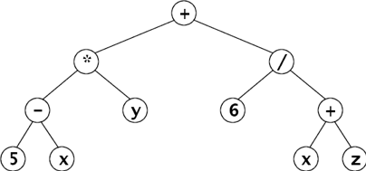
Figure 11.19 An expression tree

**Algorithm 11.6 Build an Expression Tree**

The expression tree for a given expression can be built recursively from the following rules:

1. The expression tree for a single operand is a single root node that contains it.
2. If E1 and E2 are expressions represented by expression trees T1 and T2 , and if op is an operator, then the expression tree for the expression E1 op E2 is the tree with root node containing op and subtrees T1 and T2 .

An expression has three representations, depending upon which traversal algorithm is used to traverse its tree. The preorder traversal produces the prefix representation, the inorder traversal produces the infix representation, and the postorder traversal produces the postfix representation of the expression. The postfix representation is also called reverse Polish notation or RPN. These are outlined on page 109.

=== EXAMPLE 11.18 The Three Representations of an Expression

The three representations for the expression in Example 11.17 are:

[cols="1,4", frame=none,grid=node]
|===
| Prefix:	|+*-5xy/6+xz
| Infix:	|5-x*y+6/x+z
| Postfix (RPN):  |5x-y*6xz+/+
|===

Ordinary function syntax uses the prefix representation. The expression in Example 11.17 could be evaluated as

sum(product(difference(5, x), y), quotient(6, sum(x, z)))

Some scientific calculators use RPN, requiring both operands to be entered before the operator.

The next algorithm can be applied to a postfix expression to obtain its value.

***Algorithm 11.7 Evaluating an Expression from Its Postfix Representation**

To evaluate an expression represented in postfix, scan the representation from left to right:

1. Create a stack for operands.
2. Repeat steps 3–9 until the end of representation is reached.
3. Read the next token t from the representation.
4. If it is an operand, push its value onto the stack.
5. Otherwise, do steps 6–9:
6. Pop a from the stack.
7. Pop b from the stack.
8. Evaluate c = a t b.
9. Push c onto the stack.
10. Return the top element on the stack.

=== EXAMPLE 11.19 Evaluating an Expression from Its Postfix Representation

Figure 11.20 shows the evaluation of the expression in Example 11.18 using 2 for x, 3 for y, and 1 for z:

image::./images/figure11_20.png[Evaluating a postfix expression]
Figure 11.20 Evaluating a postfix expression

== A BinaryTree CLASS

Here is a class for binary trees that directly implements the recursive definition. (See page 200.) By extending the AbstractCollection class, it remains consistent with the Java Collections Framework. (See Chapter 4.)

=== EXAMPLE 11.20 A BinaryTree Class

[source,java]
----
1	public class BinaryTree<E> extends AbstractCollection {
2	  protected E root;
3	  protected BinaryTree<E> left, right, parent;
4	  protected int size;
5
6	  public BinaryTree() {
7	  }
8
9	  public BinaryTree(E root) {
10	    this.root = root;
11	    size = 1;
12	  }
13
14	  public BinaryTree(E root, BinaryTree<E> left, BinaryTree<E> right) {
15	    this(root);
16	    if (left != null) {
17	      this.left = left;
18	      left.parent = this;
19	      size += left.size();
20	    }
21	    if (right != null) {
22	      this.right = right;
23	      right.parent = this;
24	      size += right.size();
25	    }
26	  }
27
28	  public boolean equals(Object object) {
29	    if (object == this) {
30	      return true;
31	    } else if (!(object instanceof BinaryTree)) {
32	      return false;
33	    }
34	    BinaryTree that = (BinaryTree)object;
35	    return that.root.equals(this.root)
36	          && that.left.equals(this.left)
37	          && that.right.equals(this.right)
38	          && that.parent.equals(this.parent)
39	         && that.size == this.size;
40	  }
41
42	  public int hashCode() {
43	    return root.hashCode() + left.hashCode() + right.hashCode() + size;
44	  }
45
46	  public int size() {
47	    return size;
48	  }
49
50	  public Iterator iterator() {
51	    return new java.util.Iterator() { // anonymous inner class
52	      private boolean rootDone;
53	      private Iterator lIt, rIt; // child iterators
54	      public boolean hasNext() {
55	        return !rootDone || lIt != null && lIt.hasNext()
56	            || rIt != null && rIt.hasNext();
57	      }
58	      public Object next() {
59	        if (rootDone) {
60	          if (lIt != null && lIt.hasNext()) {
61	            return lIt.next();
62  	        }
63	          if (rIt != null && rIt.hasNext()) {
64	            return rIt.next();
65	          }
66	          return null;
67	        }
68	        if (left != null) {
69	          lIt = left.iterator();
70	        }
71	        if (right != null) {
72	          rIt = right.iterator();
73	        }
74	        rootDone = true;
75	        return root;
76	      }
77	      public void remove() {
78	        throw new UnsupportedOperationException();
79	      }
80	    };
81	  }
82	}
----

The java.util.AbstractCollection class requires the four methods that are defined here: equals(), hashCode(), iterator(), and size().footnote:[Actually, the equals() and hashCode() methods are defined in the Object class and do not have to be overridden.]

The iterator() method overrides the empty version that is defined in the AbstractCollection class. Its job is to build an iterator object that can traverse its BinaryTree object. To do that, it creates its own anonymous inner Iterator class using the Java return new construct at line 47. The body of this anonymous class is defined between the braces that immediately follow the invocation of the constructor Iterator(). Note that this block must be followed by a semicolon because it is actually the end of the return statement. The complete construct looks like a method definition, but it is not. It really is a complete class definition embedded within a return statement.

To return an Iterator object, this anonymous class must implement the Iterator interface. (See page 77.) This requires definitions for the three methods

[source,java]
----
public boolean hasNext()	...
public Object next()	...
public void remove()	...
----

This implementation is recursive. The hasNext() method invokes the hasNext() methods of iterators on the two subtrees, and the next() method invokes the next() methods of those two iterators, named lIt and rIt. The other local variable is a flag named rootDone that keeps track of whether the root object has been visited yet by the iterator.

The hasNext() method returns true unless all three parts of the tree have been visited: the root, the left subtree, and the right subtree. It does that by using the lIt and rIt iterators recursively.

The next() method also uses the lIt and rIt iterators recursively. If the root has already been visited, then the iterator visits the next node in the left subtree if there are any, and otherwise visits the next node in the right subtree if there are any. If the root has not yet been visited, then this must be the first call to the iterator on that particular subtree, so it initializes the lIt and rIt iterators, sets the rootDone flag, and returns the root.

The remove() method is not implemented because there is no simple way to remove an internal node from a binary tree.

=== EXAMPLE 11.21 Testing the BinaryTree Class

[source,java]
----
1	public class TestBinaryTree {
2	  static public void main(String[] args) {
3	    BinaryTree<String> e = new BinaryTree<String>("E");
4	    BinaryTree<String> g = new BinaryTree<String>("G");
5	    BinaryTree<String> h = new BinaryTree<String>("H");
6	    BinaryTree<String> i = new BinaryTree<String>("I");
7	    BinaryTree<String> d = new BinaryTree<String>("D", null, g);
8	    BinaryTree<String> f = new BinaryTree<String>("F", h, i);
9	    BinaryTree<String> b = new BinaryTree<String>("B", d, e);
10	    BinaryTree<String> c = new BinaryTree<String>("C", f, null);
11	    BinaryTree<String> tree = new BinaryTree<String>("A", b, c);
12	    System.out.printf("tree: %s", tree);
13	  }
14	}
----

The output is:

[source,console]
----
tree: [A, B, D, G, E, C, F, H, I]
----

The program creates the binary tree shown in Figure 11.21 and then indirectly invokes its toString() method that it inherits from the AbstractCollections class.

Figure 11.21 shows two views of the same tree. The larger view shows all the details, representing each object reference with an arrow.

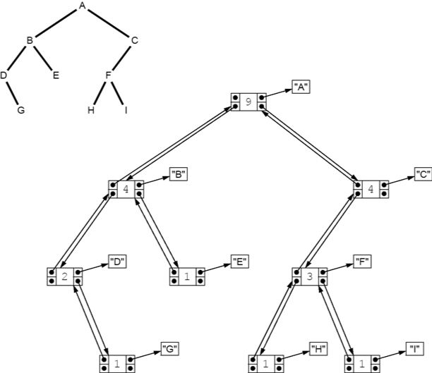
Figure 11.21 The binary tree constructed in Example 11.21

By extending the AbstractCollection class, the BinaryTree class automatically inherits these methods that are defined by using the iterator() and size() methods:

[srouce,java]
----
public boolean  isEmpty()
public boolean contains(Object object) public Object[] toArray()
public Object[] toArray(Object[] objects) public String	toString()
public boolean  add(Object object)
public boolean addAll(Collection collection) public void	clear()
public boolean containsAll(Collection collection) public boolean remove(Object object)
public boolean removeAll(Collection collection) public boolean  retainAll(Collection collection)
----

However, the mutating methods will throw an UnsupportedOperationException because they  invoke  other  methods  that  are  not  implemented,  namely  the  add() and  the Iterator.remove() methods.

=== EXAMPLE 11.22 Testing the contains() Method on a Binary Tree

This example builds the same tree as the one in Example 11.21 and then tests the contains() method on it and its subtrees:

[source,java]
----
1	public class TestContains {
2	  static public void main(String[] args) {
3	    BinaryTree<String> e = new BinaryTree<String>("E");
4	    BinaryTree<String> g = new BinaryTree<String>("G");
5	    BinaryTree<String> h = new BinaryTree<String>("H");
6	    BinaryTree<String> i = new BinaryTree<String>("I");
7	    BinaryTree<String> d = new BinaryTree<String>("D", null, g);
8	    BinaryTree<String> f = new BinaryTree<String>("F", h, i);
9	    BinaryTree<String> b = new BinaryTree<String>("B", d, e);
10	    BinaryTree<String> c = new BinaryTree<String>("C", f, null);
11	    BinaryTree<String> a = new BinaryTree<String>("A", b, c);
12	    System.out.printf("a: %s%n", a);
13	    System.out.println("a.contains(\"H\") = " + a.contains("H"));
14	    System.out.printf("b: %s%n", b);
15	    System.out.println("b.contains(\"H\") = " + b.contains("H"));
16	    System.out.printf("c: %s%n", c);
17	    System.out.println("c.contains(\"H\") = " + c.contains("H"));
18	  }
19	}
----

The output is:

[source,console]
----
a: [A, B, D, G, E, C, F, H, I]
a.contains("H") = true b: [B, D, G, E]
b.contains("H") = false c: [C, F, H, I]
c.contains("H") = true
----

The subtrees b and c are shown in Figure 11.22. The tree a contains the element H. The subtree b does not contain the element H. The subtree c does contain the element H.

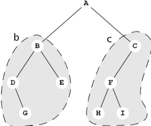
Figure 11.22

== IMPLEMENTATIONS OF THE TRAVERSAL ALGORITHMS

The iterator that is returned by the iterator() method follows the preorder traversal algorithm (Algorithm 11.3 on page 208) to traverse the binary tree. The following modification of the BinaryTree class implements all four of the binary tree traversal algorithms.

=== EXAMPLE 11.23 Implementing the Four Traversal Algorithms

[source,java]
----
1	public class BinaryTree<E> extends AbstractCollection {
2	  // insert lines 2-49 from Example 11.20 on page 212
50	  public Iterator iterator() {
51	    return new PreOrder();
52	  }
53
54	  abstract public class BinaryTreeIterator implements Iterator	{
55	    protected boolean rootDone;
56	    protected Iterator lIt, rIt; // child iterators
57	    public boolean hasNext() {
58	      return !rootDone || lIt != null && lIt.hasNext()
59	            || rIt != null && rIt.hasNext();
60	    }
61	    abstract public Object next();
62	    public void remove() {
63	      throw new UnsupportedOperationException();
64	    }
65	  }
66
67	  public class PreOrder extends BinaryTreeIterator {
68	    public PreOrder() {
69	      if (left != null) {
70	        lIt = left.new PreOrder();
71	      }
72	      if (right != null) {
73	        rIt = right.new PreOrder();
74	      }
75	    }
76	    public Object next() {
77	      if (!rootDone) {
78	        rootDone = true;
79	        return root;
80	      }
81	      if (lIt != null && lIt.hasNext()) {
82	        return lIt.next();
83	      }
84	      if (rIt != null && rIt.hasNext()) {
85	        return rIt.next();
86	      }
87	      return null;
88	    }
89	  }
90
91	  public class InOrder extends BinaryTreeIterator {
92	    public InOrder() {
93	      if (left != null) {
94	        lIt = left.new InOrder();
95	      }
96	      if (right != null) {
97	        rIt = right.new InOrder();
98	      }
99	    }
100	    public Object next() {
101	      if (lIt != null && lIt.hasNext()) {
102	        return lIt.next();
103	      }
104	      if (!rootDone) {
105	        rootDone = true;
106	        return root;
107	      }
108	      if (rIt != null && rIt.hasNext()) {
109	        return rIt.next();
110	      }
111	      return null;
112	    }
113	  }
114
115	  public class PostOrder extends BinaryTreeIterator	{
116	    public PostOrder() {
117	      if (left != null) {
118	        lIt = left.new PostOrder();
119	      }
120	      if (right != null) {
121	        rIt = right.new PostOrder();
122	      }
123	    }
124	    public Object next() {
125	      if (lIt != null && lIt.hasNext()) {
126	        return lIt.next();
127	      }
128	      if (rIt != null && rIt.hasNext()) {
129	        return rIt.next();
130	      }
131	      if (!rootDone) {
132	        rootDone = true;
133	        return root;
134	      }
135		  return null;
136	    }
137	  }
138
139	  public class LevelOrder extends BinaryTreeIterator {
140	    Queue<BinaryTree<E>> queue = new ArrayDeque<BinaryTree<E>>();
141	    public boolean hasNext() {
142	      return (!rootDone || !queue.isEmpty());
143	    }
144	    public Object next() {
145	      if (!rootDone) {
146	        if (left != null) {
147	          queue.add(left);
148	        }
149	        if (right != null) {
150	          queue.add(right);
151	        }
152	        rootDone = true;
153	        return root;
154	      }
155	      if (!queue.isEmpty()) {
156	        BinaryTree<E> tree = queue.remove();
157	        if (tree.left != null) {
158	          queue.add(tree.left);
159	        }
160	        if (tree.right != null) {
161	          queue.add(tree.right);
162	        }
163	        return tree.root;
164	      }
165	      return null;
166	    }
167	  }
168	}
----

At line 64 we define an abstract inner class named BinaryTreeIterator. This serves as a base class for all four of the concrete iterator classes. It declares the same three fields (rootDone, rIt, and lIt) as the anonymous iterator class defined previously.

The hasNext() and remove() methods are implemented (at lines 57 and 62) the same way the abstract Iterator class was done in the anonymous iterator class. But the next() method is declared abstract because each of the four traversal algorithms has a different implementation of it.

The PreOrder class defines the lIt and rIt iterators to be PreOrder iterators in its constructor to ensure that the recursive traversal follows the preorder traversal algorithm. That algorithm (Algorithm 11.3 on page 208) says to visit the root first, and then apply the same algorithm recursively to the left subtree and then to the right subtree. The three if statements do that at lies 77–86. The only differences between the PreOrder, InOrder, and PostOrder classes are their definitions of the recursive rIt and lIt iterators in the constructors and the order of those three if statements in the next() methods. For the InOrder class, the order visits the root between the two recursive traversals. For the PostOrder class, the order visits the root after the two recursive traversals. (“Pre” means before, “in” means between, and “post” means after.)

The LevelOrder traversal class is significantly different from the other three. Instead of being recur- sive, it uses a queue. (See Algorithm 11.5 on page 209.)

=== EXAMPLE 11.24 Testing the Traversal Algorithms

[source,java]
----
1	public class TestIterators {
2	  public static void main(String[] args) {
3	    BinaryTree<String> e = new BinaryTree<String>("E");
4	    BinaryTree<String> g = new BinaryTree<String>("G");
5	    BinaryTree<String> h = new BinaryTree<String>("H");
6	    BinaryTree<String> i = new BinaryTree<String>("I");
7	    BinaryTree<String> d = new BinaryTree<String>("D",null,g);
8	    BinaryTree<String> f = new BinaryTree<String>("F",h,i);
9	    BinaryTree<String> b = new BinaryTree<String>("B",d,e);
10	    BinaryTree<String> c = new BinaryTree<String>("C",f,null);
11	    BinaryTree<String> tree = new BinaryTree<String>("A",b,c);
12	    System.out.println("tree = " + tree);
13	    java.util.Iterator it;
14	    System.out.print("PreOrder Traversal:	");
15	    for (it = tree.new PreOrder(); it.hasNext(); ) {
16	      System.out.print(it.next() + " ");
17	    }
18	    System.out.print("\nInOrder Traversal:	");
19	    for (it = tree.new InOrder(); it.hasNext(); ) {
20	      System.out.print(it.next() + " ");
21	    }
22	    System.out.print("\nPostOrder Traversal: ");
23	    for (it = tree.new PostOrder(); it.hasNext(); ) {
24	      System.out.print(it.next() + " ");
25	    }
26	    System.out.print("\nLevelOrder Traversal: ");
27	    for (it = tree.new LevelOrder(); it.hasNext(); ) {
28	      System.out.print(it.next() + " ");
29	    }
30	    System.out.println();
31	  }
32	}
----

The output is:

[source,console]
----
tree = [A, B, D, G, E, C, F, H, I]
PreOrder Traversal: A B D G E C F H I
InOrder Traversal:  D G B E A H F I C
PostOrder Traversal: G D E B H I F C A
LevelOrder Traversal: A B C D E F G H I
----

Each of the four iterators traverses the tree according to the algorithm that it implements.

== FORESTS

====
A forest is a sequence of disjoint ordered trees.
====

=== EXAMPLE 11.25 A Forest

Figure 11.23 shows a forest that consists of three trees.

image::./images/figure11_23.png[A forest]
Figure 11.23 A forest

The following algorithm shows how a forest can be represented by a single binary tree.

**Algorithm 11.8 The Natural Mapping of a Forest into a Binary Tree**

1. Map the root of the first tree into the root of the binary tree.
2. If node X maps into X' and node Y is the first child of X, then map Y into the left child of X'.
3. If node X maps into X' and node Z is the sibling of X, then map Z into the right child of X'. The roots of the trees themselves are considered siblings.

=== EXAMPLE 11.26 Mapping a Forest into a Binary Tree

Figure 11.24 is the mapping of the forest shown in Example 11.25. For example, in the original forest, C
has oldest child F and next sibling D. In the corresponding binary tree, C has left child F and right child D.

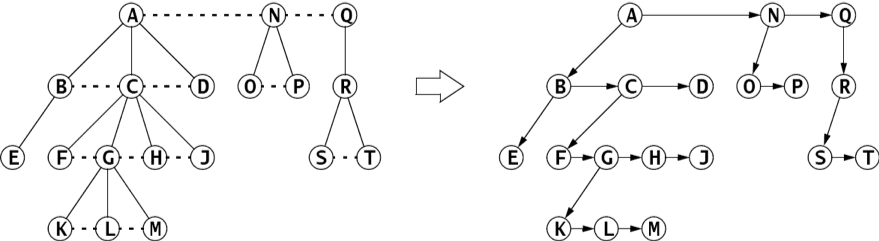
Figure 11.24 The natural mapping of a forest into a binary tree

== Review Questions

1. How many leaf nodes does the full binary tree of height h = 3 have?
2. How many internal nodes does the full binary tree of height h = 3 have?
3. How many nodes does the full binary tree of height h = 3 have?
4. How many leaf nodes does a full binary tree of height h = 9 have?
5. How many internal nodes does a full binary tree of height h = 9 have?
6. How many nodes does a full binary tree of height h = 9 have?
7. What is the range of possible heights of a binary tree with n = 100 nodes?
8. Why is there no inorder traversal for general trees?
9. True or false:
a. If all of its leaves are at the same level, then the binary tree is full.
b. If the binary tree has n nodes and height h, then stem:[h \ge \lfloor lg n \rfloor].
c. A binary tree cannot have more than stem:[2^{d}] nodes at depth d.
d. If every proper subtree of a binary tree is full, then the tree itself must also be full.

== Problems

1. For each of the binary trees in Figure 11.25 on page 221, draw the equivalent version that sat- isfies the second definition, namely that every internal node has two children.
2. Give the order of visitation of the binary tree shown in Figure 11.26 using the specified tra- versal algorithm:
a. the level order traversal
b. the preorder traversal
c. the inorder traversal
d. the postorder traversal
+
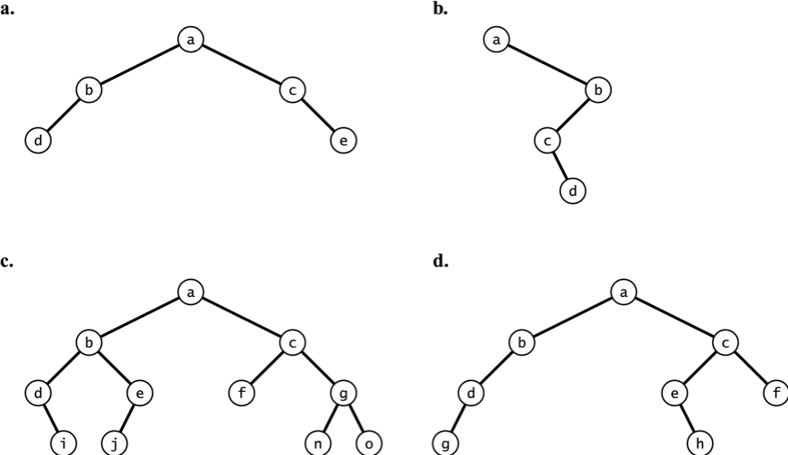
Figure 11.25 Binary trees
+
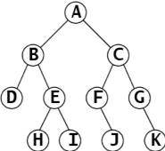
Figure 11.26 A binary tree
+
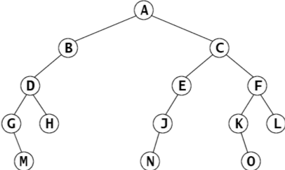
Figure 11.27 A binary tree
3. Give the order of visitation of the binary tree of size 10 shown in Example 11.1 on page 201 using:
a. the level order traversal
b. the preorder traversal
c. the inorder traversal
d. the postorder traversal
4. Give the order of visitation of the binary tree shown in Figure 11.27 using:
a. the level order traversal
b. the preorder traversal
c. the inorder traversal
d. the postorder traversal
5. Show the array that is obtained by using the natural mapping to store the binary tree shown in Problem 11.1.
6. Show the array that is obtained by using the natural mapping to store the binary tree shown in Example 11.1 on page 201.
7. Show the array that is obtained by using the natural mapping to store the binary tree shown in Problem 11.4.
8. If the nodes of a binary tree are numbered according to their natural mapping, and the visit operation prints the node’s number, which traversal algorithm will print the numbers in order?
9. Draw the expression tree for a*(b + c)*(d*e + f).
10. Write the prefix and the postfix representations for the expression in Problem 11.8.
11. Draw the expression tree for each of the prefix expressions given in Problem 5.2 on page 111.
12. Draw the expression tree for each of the infix expressions given in Problem 5.4 on page 111.
13. Draw the expression tree for each of the postfix expressions given in Problem 5.6 on page 111.
14. Draw the expression tree for the expression a*(b + c)*(d*e + f).
15. What are the bounds on the number n of nodes in a binary tree of height 4?
16. What are the bounds on the height h of a binary tree with 7 nodes?
17. What form does the highest binary tree have for a given number of nodes?
18. What form does the lowest binary tree (i.e., the least height) have for a given number of nodes?
19. Verify the recursive definition of binary trees (page 200) for the binary tree shown in Figure 11.28.
20. Draw all 42 binary trees of size n = 5.
21. How many different binary trees of size n = 6 are there?
22. Derive a recurrence relation for the number f(n) of binary trees of size n.
+
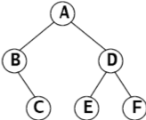
Figure 11.28 A binary tree
23. Show that, for all n  8, the function f(n) derived in Problem 11.22 produces the same sequence as the following explicit formula
+
[stem]
++++
f(n) = {{\begin{pmatrix}2n\\n\end{pmatrix}} \over {n+1}} = {{(2n)!} \over {n!(n+1)!}}{{(2n)(2n-1)(2n-2) \cdots (2n+3)(2n+2)} \over {(n)(n-1)(n-2)(n-3) \cdots (2)(1)}}
++++
For example,
+
[stem]
++++
f(4) = {{\begin{pmatrix}8\\4\end{pmatrix}} \over {5}} = {{(8)!} \over {4!5!}}{{(8)(7)(6)} \over {(4)(3)(2)(1)}} = {(8)(7)} \over {4} = 14
++++
24. Prove Corollary 11.3 on page 203.
25. Prove Theorem 11.2 on page 205.
26. Draw the forest that is represented by the binary tree shown in Figure 11.29.
27.	Derive an explicit formula for the number f(h) of complete binary trees of height h.
28. Derive an explicit formula for the number f(h) of full binary trees of height h.
29. Implement the each of the following methods for the
BinaryTree class:
a. public int leaves();
// returns the number of leaves in this tree
b. public int height();
// returns the height of this tree
c. public int level(Object object);
// returns -1 if the given object is not in this tree;
// otherwise, returns its level in this tree;
d.	public void reflect();
// swaps the children of each node in this tree
e.	public void defoliate();
// removes all the leaves from this tree
+
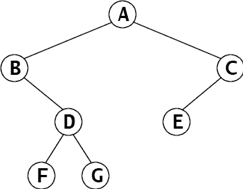
Figure 11.29 A binary tree

== Answers to Review Questions

1. The full binary tree of height 3 has l = 23 = 8 leaves.
2. The full binary tree of height 3 has m = 23 – 1 = 7 internal nodes.
3. The full binary tree of height 3 has n = 23+1 – 1 = 24– 1 = 16 – 1 = 15 nodes.
4. The full binary tree of height 9 has l = 29 = 512 leaves.
5. The full binary tree of height 9 has m = 29 – 1 = 512 – 1 = 511 internal nodes.
6. The full binary tree of height 9 has n = 29+1 – 1 = 210 – 1 = 1024 – 1 = 1023 nodes.
7. By Corollary 11.3, in any binary tree: stem:[\lfloor \lg n \rfloor \le h \le n-1]. Thus in a binary tree with 100 nodes stem:[\lfloor \lg 100 \rfloor \ge h \ge 100-1 = 99]. Since stem:[\lfloor \lg 100 \rfloor = \lfloor ( \log 100)/( \log 2 )\rfloor = \lfloor 6.6 \rfloor = 6], it follows that the height must be between 6 and 99, inclusive: stem:[6 \le h \le 99].
8. The inorder traversal algorithm for binary trees recursively visits the root in between traversing the left and right subtrees. This presumes the existence of exactly two (possibly empty) subtrees at every (nonempty) node. In general trees, a node may have any number of subtrees, so there is no simple algorithmic way to generalize the inorder traversal.
9. *
a. True
b. True
c. True
d. False

== Solutions to Problems

1. The equivalent trees are shown in Figure 11.30.
+
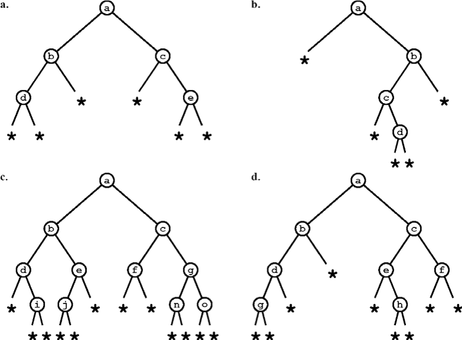
Figure 11.30 Binary trees
2. The order of visitation in the binary tree traversal:
a. Level order: A, B, C, D, E, F, G, H, I, J, K
b. Preorder: A, B, D, E, H, I, C, F, J, G, K
c. Inorder: D, B, H, E, I, A, F, J, C, G, K
d. Postorder: D, H, I, E, B, J, F, K, G, C, A
3. The order of visitation in the binary tree traversal:
a. Level order traversal: A, B, C, D, E, F, H, I, J, M
b. Preorder traversal: A, B, D, H, I, E, J, C, F, M
c. Inorder traversal: H, D, I, B, J, E, A, F, M, C
d. Postorder traversal: H, I, D, J, E, B, M, F, C, A
4. The order of visitation in the binary tree traversal:
a. Level order traversal: A, B, C, D, E, F, G, H, J, K, L, M, N, O
b. Preorder traversal: A, B, D, G, M, H, C, E, J, N, F, K, O, L
c. Inorder traversal: G, M, D, H, B, A, N, J, E, C, K, O, F, L
d. Postorder traversal: M, G, H, D, B, N, J, E, O, K, L, F, C, A
5. The natural mapping of the specified binary tree is shown in Figure 11.31.
+
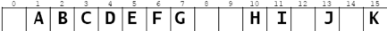
Figure 11.31 An array
6. The natural mapping of the specified binary tree is shown in Figure 11.32.
+
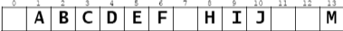
Figure 11.32 An array
7. The natural mapping of the specified binary tree is shown in Figure 11.33.
+
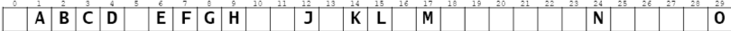
Figure 11.33 An array
8. The level order traversal will print the numbers from the natural mapping in order.
9. The expression tree for a*(b + c)*(d*e + f) is shown in Figure 11.34.
+
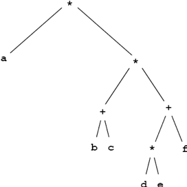
Figure 11.34 A binary tree
10. The prefix expression is \*a*+bc+\*def. The postfix expression is *abc+de*f+**.
11. Figure 11.35 shows the expression tree for each of the prefix expressions given in Problem 5.2 on page 111.
+
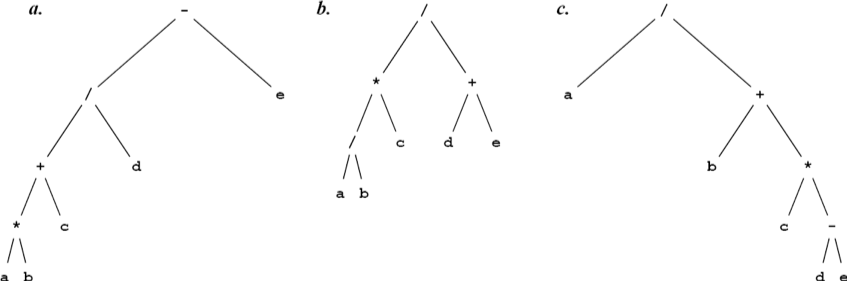
Figure 11.35 Prefix expression trees
12. Figure 11.36 shows the expression tree for each of the infix expressions given in Problem 5.4 on page 111.
+
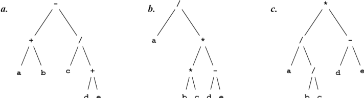
Figure 11.36 Infix expression trees
13. Figure 11.37 shows the expression tree for each of the postfix expressions given in Problem 5.6 on page 111.
+
image::./iumages/figure11_37.png[Postfix expression trees]
Figure 11.37 Postfix expression trees
14.	Figure 11.38 shows the expression tree for a\*(b + c)*(d*e + f) is:
+
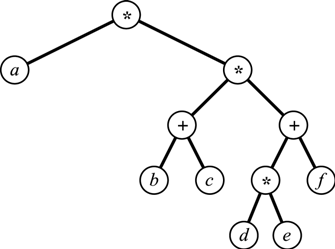
Figure 11.38 An expression tree
15.	In a binary tree of height stem:[h = 4, 5 \le n \le 31].
16.	In a binary tree with n = 7 nodes, stem:[2 \le h \le 6].
17.	For a given number of nodes, the highest binary tree is a linear sequence.
18.	For a given number of nodes, the lowest binary tree is a complete binary tree.
19.	To verify the recursive definition for the given tree, we first note that the leaves C, E, and F are binary trees because every singleton satisfies the recursive definition for binary trees because its left and right subtrees are both empty (and therefore binary trees). Next, it follows that the subtree rooted at B is a binary tree because it is a triplet stem:[(X,L,R)] where stem:[X = B, L = \phi], and R = C. Similarly, it follows that the subtree rooted at D is a binary tree because it is a triplet stem:[(X,L,R)] where stem:[X = D], stem:[L = E], and stem:[R = F]. Finally, it follows that the entire tree satisfies the recursive definition because it is a triplet stem:[(X,L,R)] where stem:[X = A], stem:[L] is the binary tree rooted at stem:[B], and stem:[L] is the binary tree rooted at stem:[D].
20.	Figure 11.39 on page 227 shows all 42 different binary trees of size stem:[n = 5].
21.	There are 132 different binary trees of size 6: stem:[1 \cdot 42 + 1 \cdot 14 + 2 \cdot 5 + 5 \cdot 2 + 14 \cdot 1 + 42 \cdot 1 = 132].
22.	A nonempty binary tree consists of a root X, a left subtree L, and a right subtree R. Let n be the size of the binary tree, let stem:[n_{L} = |L| = \text { the size of } L], and stem:[n_{R} = |R| = \text { the size of } R]. Then stem:[n = 1 + n_{L} + n_{R}] . So there are only n different possible values for the pair stem:[(n_{L} , n_{R} ): (0, n-1), (1, n-2), ..., (n-1,0)]. For example, if stem:[n = 6] (as in Problem 11.21), the only possibilities are (0,5), (1,4), (2,3), (3,2), (4,1), or (5,0). In the
(0, n–1) case, L is empty and stem:[|R| = n-1]; there are stem:[f(0) \cdot f(n-1)] different binary trees in that case. In the (1, n-2) case, L is a singleton and stem:[|R| = n-2]; there are stem:[f(1) \cdot f(n-2)] different binary trees in that case. The same principle applies to each case. Therefore the total number of different binary trees of size n is stem:[f(n) = 1 \cdot f(n-1) + 1 \cdot f(n-2) + 2 \cdot f(n-3) + 5 \cdot f(n-4) + 14 \cdot f(n-5) + \cdots  + f(i-1) \cdot f(n-i) + \cdots + f(n-1) \cdot 1] In closed form, the formula is
+
[stem]
++++
f(n) = \sum_{i=1}^{n}{f(i-1) \cdot f(n-i)}
++++
+
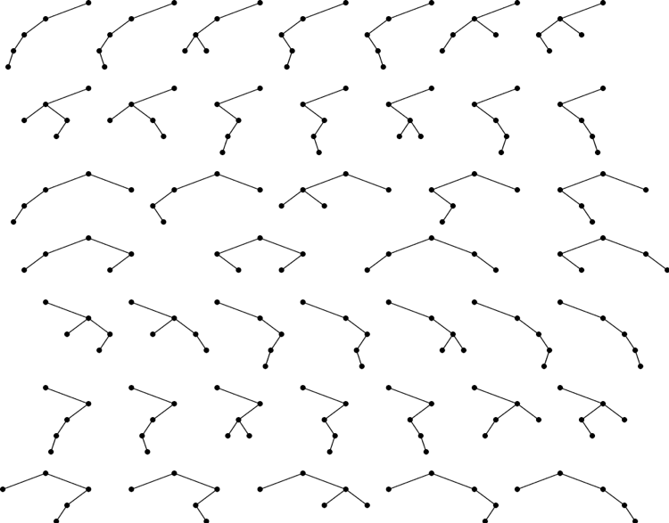
Figure 11.39 The 42 binary trees of size 5
23. These are called the Catalan numbers:
+
[cols="1a,1a,1a,1a,4a"]
|===
|stem:[n]
|stem:[\begin{pmatrix}2n\\n\end{pmatrix}]
|stem:[n+1]
|stem:[{\begin{pmatrix}2n\\n\end{pmatrix}} \over {(n+1)}]
|stem:[\sum {f(i-1) \cdot f(n-i)}]
|0|1|1|1|1
|1|2|2|1|stem:[1 \cdot 1 = 1]
|2|6|3|2|stem:[1 \cdot 1+1 \cdot 1 = 2]
|3|20|4|5|stem:[1 \cdot 2+1 \cdot 1+2 \cdot 1 = 5]
|4|70|5|14|stem:[1 \cdot 5+1 \cdot 2+2 \cdot 1+5 \cdot 1 = 14]
|5|252|6|42|stem:[1 \cdot 14+1 \cdot 5+2 \cdot 2+5 \cdot 1+14 \cdot 1 = 42]
|6|924|7|132|stem:[1 \cot 42+1 \cdot 14+2 \cdot 5+5 \cdot 2+14 \cdot 1+42 \cdot 1 = 132]
|7|3432|8|429|stem:[1 \cdot 132+1 \cdot 42+2 \cdot 14+5 \cdot 5+14 \cdot 2+42 \cdot 1+132 \cdot 1 = 429]
|===
**Table 11.1 Catalan numbers**

24. For a given height h > 0, the binary tree with the most nodes is the full binary tree. Corollary 11.1 on page 202 states that that number is n  2h+1 – 1. Therefore, in any binary tree of height h, the number n of nodes must satisfy n  2h+1 – 1. The binary tree with the fewest nodes for a given height h is the one in which every internal node has only one child; that linear tree has n = h + 1 nodes because every node except the single leaf has exactly one child. Therefore, in any binary tree of height h, the number n of nodes must satisfy n � h + 1. The second pair of inequalities follows from the first by solving for h.
25. Let T be any binary tree of height h and size n. Let T1 be the smallest complete binary tree that con- tains T. Let h1 be the height of T1 and let n1 be its size. Then h = h1 and n  n1. Then by Corollary 11.1 on page 202, n  n1  2h+1 – 1. The required inequalities follow from this result.
26. Figure 11.40 shows how the forest that produced the specified binary tree was obtained by reversing the natural map.
+
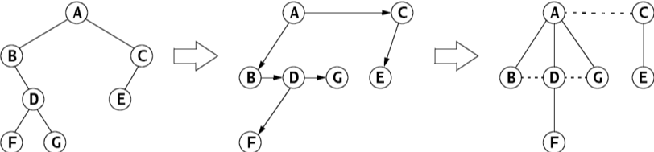
Figure 11.40 Mapping a forest into a binary tree
27. stem:[f(h) = h + 1]
28. stem:[f(h) = 1]
29.	_
a. _
+
[srouce, java]
----
public int leaves() {
	if (this == null) {
		return 0;
	}
	int leftLeaves = (left==null ? 0 : left.leaves());
	int rightLeaves = (right==null ? 0 : right.leaves());
	return leftLeaves + rightLeaves;
}
----
b. _
+
[source,java]
----
public int height() {
	if (this == null) {
		return -1;
	}
	int leftHeight = (left==null ? -1 : left.height());
	int rightHeight = (right==null ? -1 : right.height());
	return 1 + (leftHeight<rightHeight ? rightHeight : leftHeight);
}
----
c. _
+
[source,java]
----
public int level(Object object) {
	if (this == null) {
		return -1;
	} else if (object == root) {
		return 0;
	}
	int leftLevel = (left==null ? -1 : left.level(object));
	int rightLevel = (right==null ? -1 : right.level(object));
	if (leftLevel < 0 && rightLevel < 0) {
		return -1;
	}
	return 1 + (leftLevel<rightLevel ? rightLevel : leftLevel);
}
----
d. _
+
[source,java]
----
public void reflect() {
	if (this == null) {
		return;
	}
	if (left != null) {
		left.reflect();
	}
	if (right != null) {
		right.reflect();
	}
	BinaryTree temp=left;
	left = right;
	right = temp;
}
----
e._
[source,java]
----
public void defoliate() {
	if (this == null) {
		return;
	} else if (left == null && right == null) {
		root = null;
		return;
	}
	if (left != null && left.left==null && left.right==null) {
		left = null;
	} else {
		left.defoliate();
	}
	if (right != null && right.left==null && right.right==null) {
		right = null;
	} else {
		right.defoliate();
	}
}
----