:stem: latexmath

= Search Trees

Tree structures are used to store data because their organization renders more efficient access to the data. A search tree is a tree that maintains its data in some sorted order.

== MULTIWAY SEARCH TREES

Here is the recursive definition of a multiway search tree:
====
A _multiway search tree of order m_ is either the empty set or a pair (k , S), where the first component is a sequence stem:[k = (k_{1}, k_{2}, . . ., k_{n–1})] of n –1 keys and the second component is a sequence stem:[S = (S_{0}, S_{1}, S_{2}, . . ., S_{n–1})] of n multiway search trees of order m, with stem:[2 \le n \le m, and stem:[s_{0} \le k_{1} \le s_{1} \le cdots \le k_{n-1} \le s_{n-1}] for each stem:[s_{i} \in S_{i}].
====

This is similar to the recursive definition of a general tree on page 186. A multiway search tree of order m can be regarded as a tree of order m in which the elements are sequences of keys with the ordering property described above.

=== EXAMPLE 12.1 A Five-Way Search Tree

Here is an m-way search tree with m = 5. It has three internal nodes of degree 5 (each containing four keys), three internal nodes of degree 4 (each containing three keys), four internal nodes of degree 3 (each containing two keys), and one internal node of degree 2 (containing one key).

image::./images/figure12_1.png[A five-way search tree,align=center]
Figure 12.1 A five-way search tree

The root node has two keys and three children. All four keys in the first child are less than stem:[k_{1} = 57]. All three keys in the second child are between stem:[k_{1} = 57] and stem:[k_{2} = 72]. Both keys in the third child are greater than stem:[k_{2} = 72]. In fact, all thirteen keys in the first subtree are less than 57, all seven keys in the second subtree are between 57 and 72, and all eight keys in the third subtree are greater than 72.

An m-way search tree is called a search tree because it serves as a multilevel index for searching large lists. To search for a key value, begin at the root and proceed down the tree until the key is found or a leaf is reached. At each node, perform a binary search for the key. It it is not found in that node, the search will stop between two adjacent key values (with stem:[k_{0} = – \infty] and stem:[k_{n} = \infty]).
In that case, follow the link that is between those two keys to the next node. If we reach a leaf, then we know that the key is not in the tree.

For example, to search for key value 66, start at the root of the tree and then follow the middle link (because stem:[57 \le 66 \lt 72]) down to the middle three-key node. Then follow its third link (because stem:[60 \le 66 \lt 70]) down to the bottom four-key node. Then follow its third link (because stem:[65 \le 66 \lt 67]) down to that leaf node. Then conclude that the key 66 is not in the tree.

To insert a key into an m-way search tree, first apply the search algorithm. If the search ends at a leaf node, then the two bracketing keys of its parent node locate the correct position for the new key. So insert it in that internal node between those two bracketing keys. If that insertion gives the node m keys (thereby exceeding the limit of m–1 keys per node), then split the node into two nodes after moving its middle key up to its parent node. If that move gives the parent node m keys, repeat the splitting process. This process can iterate all the way back up to the root, if necessary. Splitting the root produces a new root, thereby increasing the height of the tree by one level.

=== EXAMPLE 12.2 Inserting into a Five-Way Tree

To insert 66 into the search tree of Example 12.1, first perform the search, as described above. This leads to the leaf node marked with an X in Figure 12.2:

image::./images/figure12_2.png[Inserting 66 into a five-way search tree,align=center]
Figure 12.2 Inserting 66 into a five-way search tree

Insert the new key 66 in that last parent node between the bracketing keys 65 and 67 as shown in Figure 12.3 on page 232.

Now that node contains five keys, which violates the four-key limit for a five-way tree. So the node gets split, shifting its middle key 65 up to its parent node as shown in Figure 12.4 on page 232.

Node splitting occurs relatively infrequently, especially if m is large. For example, if m = 50, then on average only 2 percent of the nodes would be full, so a bottom-level split would be

image::./images/figure12_3.png[Inserting 66 into a five-way search tree,align=center]
Figure 12.3 Inserting 66 into a five-way search tree

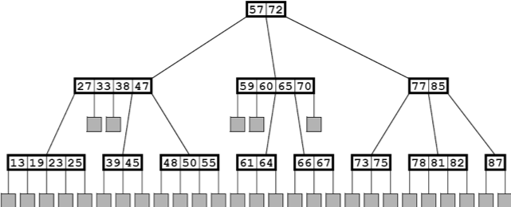
Figure 12.4 Inserting 66 into a five-way search tree

required for only about 2 percent of the insertions. Furthermore, a second-from-bottom-level split (i.e., a double split) would be required for only about 2 percent of 2 percent of the insertions, that is, with probability 0.0004. And the probability of a triple split would be 0.000008. So the chances of the root being split are very small. And since that is the only way that the tree can grow vertically, it tends to remain a very shallow, very broad tree, providing very fast search time.

== B-TREES

A B-tree of order m is an m-way search tree that satisfies the following extra conditions:

1.	The root has at least two children.
2.	All other internal nodes have at least   m/2  children.
3.	All leaf nodes are at the same level.

These conditions make the tree more balanced (and thus more efficient), and they simplify the insertion and deletion algorithms.

B-trees are used as indexes for large data sets stored on disk. In a relational database, data are organized in separate sequences of records called tables. Each table could be stored as a sequential data file in which the records are numbered like the elements of an array. Or the database system might access the records directly by their disk addresses. Either way, each record is directly accessible on disk via some addressing scheme. So once we have the record’s disk address, we can access it immediately (i.e., with a single disk read). So the “key” that is stored in the B-tree is actually a key/address pair containing the record’s actual key value (e.g., a U.S. Social Security number for personnel records, or an ISBN for books) together with its disk address. In the outline that follows, only the key value is shown, the accompanying disk address being understood to accompany it.

=== EXAMPLE 12.3 A B-Tree

Figure 12.5 shows a B-tree of order 5. Each of its internal nodes has 3, 4, or 5 children, and all the leaves are at level 3.

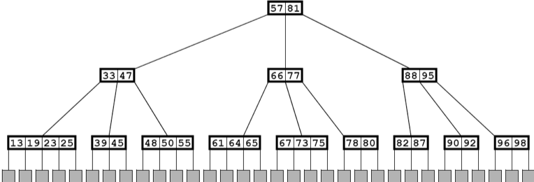
Figure 12.5 A B-tree of order 5

**Algorithm 12.1 Searching in a B-Tree**

To find a record with key k using a B-tree index of order m:
1.	If the tree is empty, return null.
2.	Let x be the root.
3.	Repeat steps 4–6 until x is a leaf node.
4.	Apply the binary search (page 31) to node x for the key stem:[k_{i}, where stem:[k_{i-1} \lt k \le k_{i}] (regarding stem:[k_{0} = -\infty] and stem:[k_{m} = \infty]).
5.	If stem:[k_{i} = k, retrieve the record from disk and return it.
6.	Let x be the root of subtree stem:[S_{i}]. Return null.
Note how similar this process is to looking up a topic in the index of a book. Each page of the index is labeled with a word or letter that represents the topics listed on that page. The page labels are analogous to the keys in the internal nodes of the search tree. The actual page number listed next to the topic in the book’s index is analogous to the disk address of file name that leads you to the actual data. The last step of the search process is searching through that page in the book, or through that file on the disk. This analogy is closer if the book’s index itself had an index. Each internal level of the multiway tree corresponds to another index level.

**Algorithm 12.2 Inserting into a B-Tree**

To insert a record with key stem:[k] using a B-tree index of order stem:[m]:
1.	If the tree is empty, create a root node with two dummy leaves, insert stem:[k] there, and return true (indicating that the insertion was successful).
2.	Let stem:[x] be the root.
3.	Repeat steps 4-6 until stem:[x] is a leaf node.
4.	Apply the binary search to node stem:[x] for the key stem:[k_{i}, where stem:[k_{i-1} \lt k \le k_{i}] (regarding stem:[k_{0} = -\infty \text { and } k_{m} = \infty]).
5.	If stem:[k_{i} = k, return false (indicating that the insertion was unsuccessful because a record with key stem:[k] already exists, and keys should be unique).
6.	Let stem:[x] be the root of subtree stem:[S_{i}].
7.	Add the record to disk.
8.	Insert stem:[k] (with the record’s disk address) into stem:[x] between stem:[k_{i-1}] and stem:[k_{i}] .
9.	Add a dummy leaf node to stem:[x].
10.	If stem:[degree(x) = m, repeat steps 11-13 until stem:[degree(x) < m].
11.	Let stem:[k_{j}] be the middle key in node stem:[x].
12.	Let stem:[u] and stem:[v] be the left and right halves of stem:[x] after removing stem:[k_{j}] from stem:[x].
13.	If stem:[x] is the root, create a new root node containing stem:[k_{j}] with subtrees stem:[u] and stem:[v].
14.	Otherwise, insert stem:[k_{j}] in stem:[x’s] parent node and attach subtrees stem:[u] and stem:[v].
15.	Return true.
This insertion process is illustrated in Figure 12.6.

image::./images/figure12_6.png[Inserting into a B-tree,align=center]
Figure 12.6 Inserting into a B-tree

The deletion algorithm for B-trees is similar to the insertion algorithm.
All three algorithms run in time proportional to the height of the tree. From Corollary 10.1 on page 188 it follows that that height is proportional to log m n. From Theorem A.2 on page 320, it follows that that is proportional to lgn. Thus we have:

**Theorem 12.1 In a B-tree, searching, inserting, and deleting all run in O(lgn) time.**

== BINARY SEARCH TREES

A binary search tree is a binary tree whose elements include a key field of some ordinal type and which has this property: If stem:[k] is the key value at any node, then stem:[k \ge x] for every key stem:[x] in the node’s left subtree and stem:[k \le y] for every key stem:[y] in the node’s right subtree. This property, called the BST property, guarantees that an inorder traversal of the binary search tree will produce the elements in increasing order.

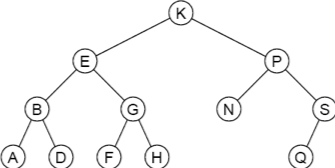
Figure 12.7 A binary search tree

The BST property is applied for each insertion into the tree:

**Algorithm 12.3 Inserting into a binary search Tree**

To insert an element with key value k into a binary search tree:

1.	If the tree is empty, insert the new element at the root. Then return.
2.	Let p locate the root.
3.	If stem:[k] is less than the key stored at stem:[p] and if the node at stem:[p] has no left child, insert the new element as the left child of stem:[p]. Then return.
4.	If stem:[k] is less than the key stored at stem:[p] and if the node at stem:[p] has a left child, let stem:[p] locate that left child of stem:[p]. Then go back to step 3.
5.	If the node at stem:[p] has no right child, insert the new element as the right child of stem:[p]. Then return.
6.	Let stem:[p] locate the right child of stem:[p]. Then go back to step 3.

=== EXAMPLE 12.4 Inserting into a Binary Search Tree

Apply Algorithm 12.3 to insert an element with key M into the binary search tree shown in Figure 12.7.

Step 1 starts the iterator p at the root K. Since M is greater than K (i.e., it follows it lexicographically) and node K has a right child, the algorithm proceeds to step 6, resetting the iterator p to node P, and then goes back to step 3. Next, since M is less than P (i.e., it precedes it lexicographically) and node P has a left child, the algorithm proceeds to step 4, resetting the iterator p to node N, and then goes back to step 3. Next, since M is also less than N but node N has no left child, the algorithm proceeds to step 5, inserts the new element as the left child of node N, and then returns.
This is illustrated in Figure 12.8.

image::./images/figure12_8.png[A binary search tree,align=center]
Figure 12.8 A binary search tree

=== EXAMPLE 12.5 Building a Binary Search Tree

Figure 12.9 on page 236 shows the binary search tree that is built by inserting the input sequence 44, 22, 77, 55, 99, 88, 33.

If a binary search tree is balanced, it allows for very efficient searching. As with the binary search, it takes stem:[O(\lg n)] steps to find an element in a balanced binary search tree. But without further restrictions, a binary search tree may grow to be very unbalanced. The worst case is when the elements are inserted in sorted order. In that case the tree degrades to a linear list, thereby making the search algorithm an stem:[O(n)] sequential search.

=== EXAMPLE 12.6 An Unbalanced Binary Search Tree

This is the same input data as in Example 12.5, but in a different order: 99, 22, 88, 33, 77, 55, 44. The resulting binary search tree is shown in Figure 12.10 on page 236.
This shows that the same input in different order produces a different tree. But more important, it shows that it is not unlikely for the binary search tree to be linear, or nearly linear.

image::./images/figure12_9.png[Inserting into a binary search tree,align=center]
Figure 12.9 Inserting into a binary search tree

== PERFORMANCE OF BINARY SEARCH TREES

Both the insert() and the search() functions begin at the root of the tree and proceed down toward the leaves, making one comparison at each level of the tree. Therefore the time required to execute either algorithm is proportional to stem:[h + 1, where stem:[h] is the height of the tree. The search() function may terminate before reaching a leaf, but stem:[h + 1] is still an upper bound on the number of comparisons that it can make.

Theorem 12.2 In a binary search tree of size n, the insert() and the search() functions each require stem:[O(\lg n)] comparisons in the best case.

In the best case, the binary tree is completely balanced and nearly full, so by Corollary 11.2 on page 202, stem:[h = \lg(n+1) - 1 = O(\lg n)].

Theorem 12.3 In a binary search tree of size n, the insert() and the search() functions each require stem:[O(n)] comparisons in the worst case.

In the worst case the tree is linear, so stem:[h + 1 = n = O(n)].

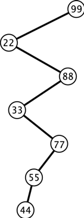
Figure 12.10 A BST

**Theorem 12.4 In a binary search tree of size n, the insert() and the search() functions each require stem:[O(2\ln n) \approx O(1.39\lg n)] comparisons in the average case.**

The proof of this result is beyond the scope of this outline.

== AVL TREES

The imbalance problem illustrated in Example 12.6 can be avoided by imposing balance constraints on the nodes of the binary search tree.

Define the _balance number_ at any node of a tree to be the difference between the height of its left subtree and the height of its right subtree. An AVL tree is a binary search tree where the balance number at each node is either –1, 0, or 1. The name comes from the two inventors of this method: G.M. Adel’son-Velskii and Y.M. Landis.

The tree in Figure 12.12 is not an AVL tree because it is imbalanced at node C. Its balance number there is 2, which is outside the allowable range. It is also imbalanced at node G. The tree in Figure 12.11 is an AVL tree: Every balance number is either –1, 0 or 1.

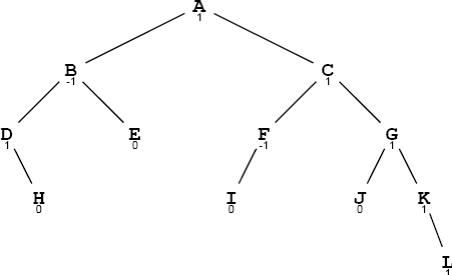
Figure 12.11 An AVL tree

Figure 12.12 Not an AVL tree

=== EXAMPLE 12.7 An AVLTree CLASS

This class for AVL trees extends the BinaryTree class defined in Example 11.20 on page 212:

[source,java]
----
1	public class AVLTree extends BinaryTree {
2	    protected AVLTree left, right;
3	    protected int balance;
4	    protected java.util.Comparator comp;
5
6	    public AVLTree(java.util.Comparator comp){
7	        this.comp = comp;
8	    }
9
10	    public AVLTree(Object root, java.util.Comparator	comp) {
11	        this.root = root;
12	        this.comp = comp;
13	    }
14
15	    public boolean add(Object object) {
16	        AVLTree temp = attach(object);
17	        if (temp != this) {
18	            left = temp.left;
19	            right = temp.right;
20	            balance = temp.balance;
21	        }
22	        return true;
23	    }
24
25	    public AVLTree attach(Object object) {
26	        if (root	== null) { // tree is empty
27	            root =	object;
28	            return	this;
29	        }
30	        if (comp.compare(object,root) < 0) { // insert into left subtree
31	            if (left == null) {
32	                left = new AVLTree(object,comp);
33	                ++size;
34	                --balance;
35	            } else {
36	                int lb = left.balance;
37	                left = left.attach(object);
38	                if (left.balance != lb && left.balance != 0) {
39	                    --balance;
40	                }
41	            }
42	            if (balance < -1) {
43	                if (left.balance > 0) {
44	                    left = left.rotateLeft();
45	                }
46	                return rotateRight();
47	            }
48	        } else { // insert into right subtree
49	            if (right == null) {
50	                right = new AVLTree(object,comp);
51	                ++size;
52	                ++balance;
53	            } else {
54	                int rb = right.balance;
55	                right = right.attach(object);
56	                if (right.balance != rb && right.balance != 0) {
57	                    ++balance;
58	                }
59	            }
60	            if (balance > 1) {
61	                if (right.balance < 0) {
62	                    right = right.rotateRight();
63	                }
64	                return rotateLeft();
65	            }
66	        }
67	        return this;
68	    }
69
70	    private AVLTree rotateRight() // see Problem 12.5 on page 240
71
72	    private AVLTree rotateLeft() {
73	        AVLTree x = this, y = right, z = y.left;
74	        x.right = z;
75	        y.left = x;
76	        int xb = x.balance, yb = y.balance;
77	        if (yb < 1) {
78	            --x.balance;
79	            y.balance = ( xb>0 ? yb-1 : xb+yb-2 );
80		    } else if (yb < xb) {
81		        x.balance -= yb+1; --y.balance;
82		    } else {
83		        y.balance = xb-2;
84		    }
85		    return y;
86	    }
87	}
----

=== EXAMPLE 12.8 Building an AVL Tree

Insertions of G, M, T, D, and P into an empty AVL tree are shown in Figure 12.13.

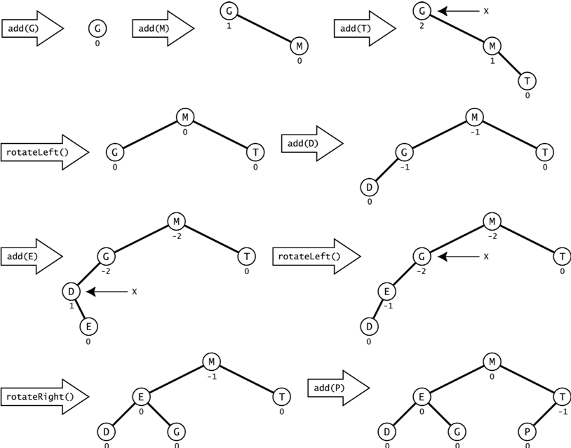
Figure 12.13 Inserting into an AVL tree

The first rotation occurs with the insertion of T. That increases the balance at the root to 2, which violates the AVL constraint. The left rotation about the root x makes M become the parent of its prior parent G.

The next rotation occurs after E in inserted. The right rotation at its parent D straightens out the dogleg G — D — E but leaves the balance at G at –2. That requires a second rotation in the opposite direction. Double rotations like this are required when the imbalance is at the top of a dogleg.

Note how efficient the rotations are. By making only local changes to references and balance numbers, they restore the tree to nearly perfect balance.

Figure 12.14 on page 240 shows a later insertion into the same AVL tree, inserting W after U, V, and Z have been inserted.

This illustrates a double rotation where a nontrivial subtree gets shifted. The subtree containing U is shifted from parent V to parent T. Note that the BST property is maintained.

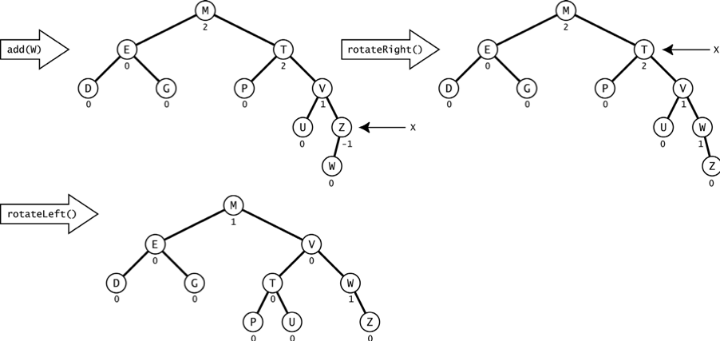
Figure 12.14 AVL tree rotations

Although a bit complicated, the insertion algorithm for AVL trees is very efficient. The rotations that keep it balanced make only local changes to a few references and balance numbers.

== Review Questions

1. What are the advantages and disadvantages of using a binary search tree?
2. What are the advantages and disadvantages of using an AVL tree?

== Problems

1. Describe what happens in the five-way tree shown in Example 12.1 on page 230 when a new record with key 16 is inserted.
2. Find two other orderings of the seven keys in Example 12.5 on page 235 that will produce the same binary search tree.
3. Describe a method for sorting arrays of objects using a binary search tree. Then determine the complexity of the algorithm.
4. Determine which of the binary trees shown in Figure 12.15 on page 241 is a binary search tree.
5. Write the rotateRight() method for the AVLTree class.
6. Prove that every subtree of a binary search tree is also a binary search tree.
7. Prove that every subtree of an AVL tree is also an AVL tree.
8. Here are the U.S. Postal Service abbreviations of the first 10 states, in the order that they ratified the U.S. Constitution: DE, PA, NJ, GA, CT, MA, MD, SC, NH, VA. Show the AVL tree after the insertion of each of these strings.

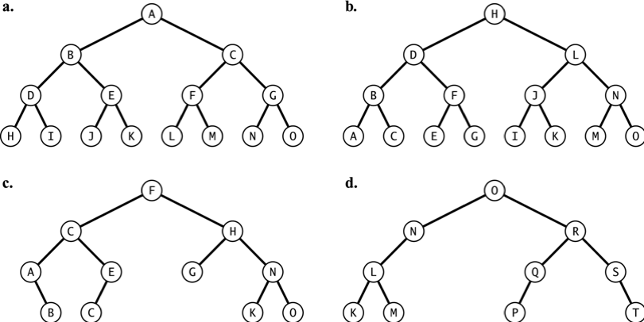
Figure 12.15 Binary trees

== Answers to Review Questions

1. The disadvantage of a binary search tree is that it may become very unbalanced, in which case searching degenerates into an stem:[O(n)] algorithm. The advantage is the efficiency that a binary tree provides for insertions and deletions.
2. The advantage of an AVL tree is that it is always balanced, guaranteeing the stem:[O(\lg n)] speed of the binary search algorithm. The disadvantages the complex rotations used by the insertion and removal algorithms needed to maintain the tree’s balance.

== Solutions to Problems

1. To insert a new record with key 16 into the tree shown in Figure 12.16, the initial search would lead to the first leaf node. Since that is a five-way search tree, that first leaf node has overflowed, causing it to be split into two leaf nodes and moving its middle key 19 up to its parent node, as shown in Figure 12.17. But now that parent node has overflowed. So it also gets split, moving its middle key up to its parent node, as shown in Figure 12.18.
2. Two other ordering of the seven keys in Example 12.5 on page 235 that will produce the same BST:
a.	44, 22, 33, 77, 55, 99, 88
b.	44, 22, 77, 33, 55, 99, 88
3. An array of objects could be sorted by inserting their objects into a binary search tree and then using an inorder traversal to copy them back into the array. The BST property guarantees that the inorder traversal will visit the elements in order.
If an AVL tree is used, then each insertion runs in stem:[O(\lg n)] time, so building the tree with n elements will require stem:[O(n \lg n)] time. The subsequent inorder traversal also has stem:[O(n \lg n)] complexity, so the entire algorithm sorts the array in stem:[O(n \lg n)] time.
4. All except a are binary search trees.
+
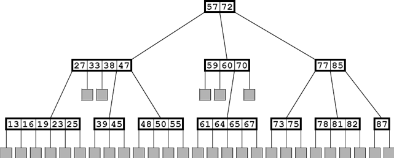
Figure 12.16 Inserting the key 16 in a five-way search tree
+
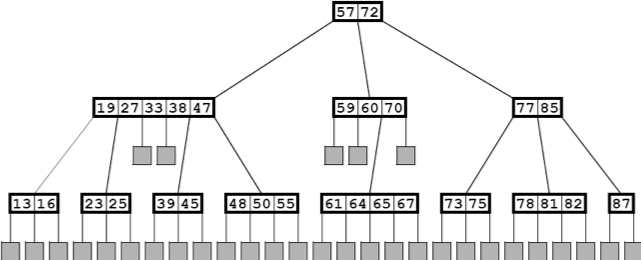
Figure 12.17 Inserting the key 16 in a five-way search tree
+
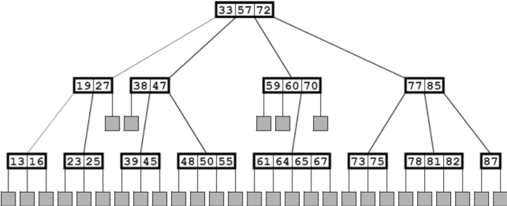
Figure 12.18 Inserting the key 16 in a five-way search tree
5. _
+
[source,java]
----
private AVLTree rotateRight() {
    AVLTree x = this, y = left, z = y.left;
    x.left = z;
    y.left = x;
    int xb = x.balance;
    int yb = y.balance;

    if (yb > 1) {
        ++x.balance;
        y.balance = ( xb<0 ? yb+1 : xb+yb+2 );
    } else if (yb > xb) { x.balance += yb-1;
        ++y.balance;
    } else {
        y.balance = xb+2;
    }
    return y;
}
----
6. Theorem. Every subtree of a binary search tree is a binary search tree.
Proof: Let stem:[T] be a binary search tree, and let stem:[S] be a subtree of stem:[T]. Let stem:[x] be any element in stem:[S], and let stem:[L] and stem:[R] be the left and right subtrees of stem:[x] in stem:[S]. Then, since stem:[S] is a subtree of stem:[T], stem:[x] is also an element of stem:[T], and stem:[L] and stem:[R] are the left and right subtrees of stem:[x] in stem:[T]. Therefore, stem:[y \le x \le z] for every stem:[y \in L] and every stem:[z \in R]
because T has the BST property. Thus, S also has the BST property.
7. Theorem. Every subtree of an AVL tree is an AVL tree.
Proof: The proof that every subtree of a binary search tree is a binary search tree is given in Problem 12.6. If a S is a subtree of an AVL tree T, then every node is S is also in T. Therefore, the balance number at every node in S is –1, 0, or 1.
8. The solution is shown in Figure 12.19.

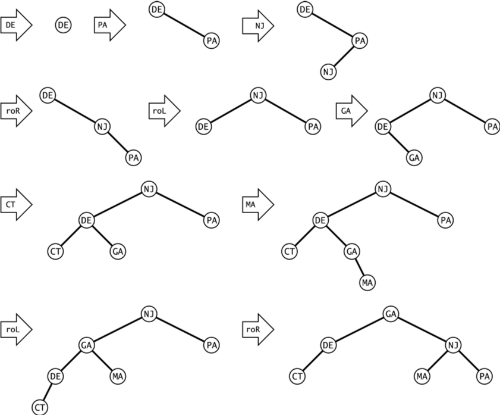
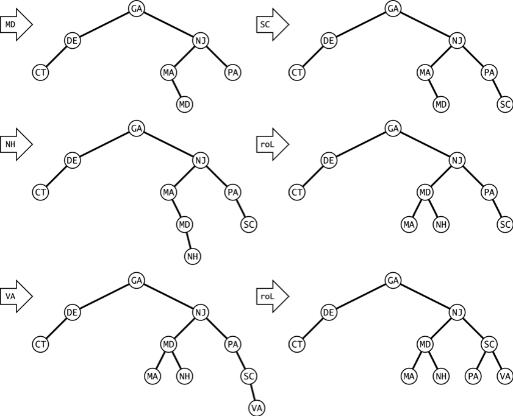
Figure 12.19 AVL tree insertions

