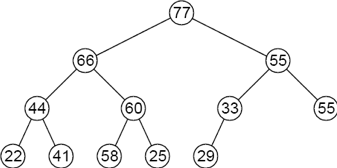
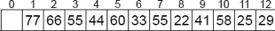
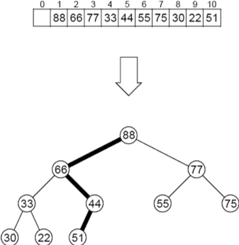
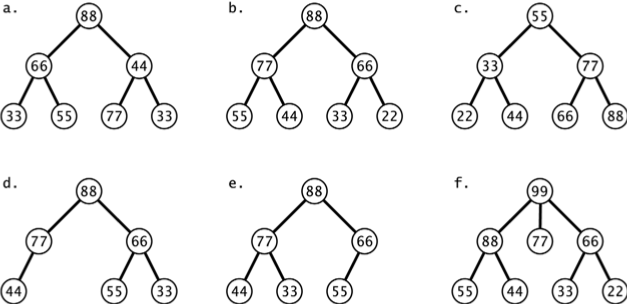
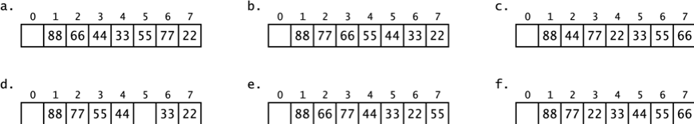
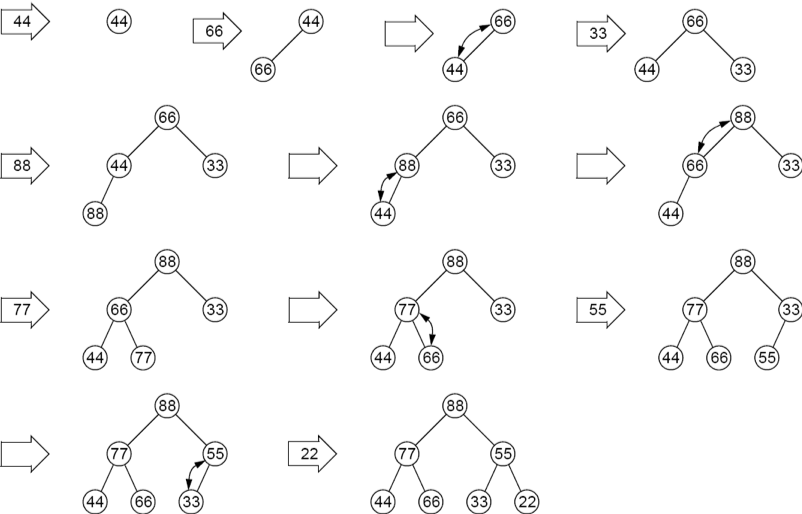
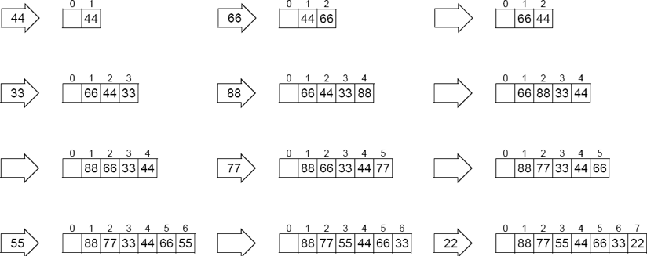
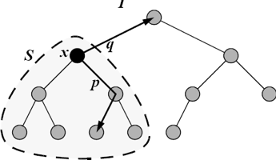
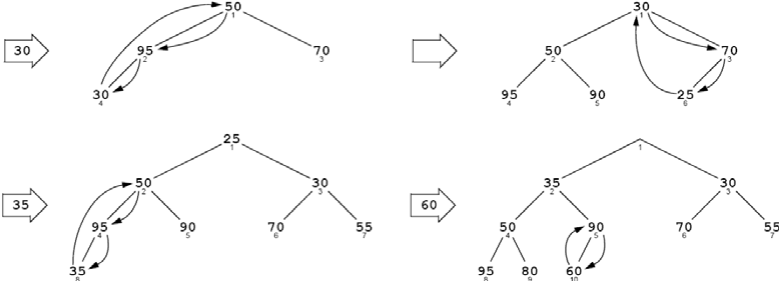
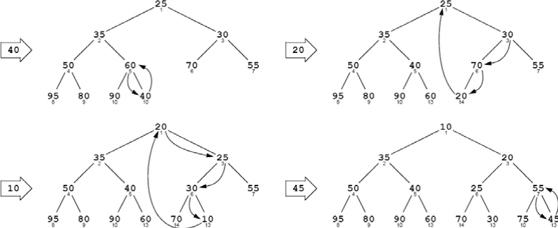

:stem: latexmath

= Heaps and Priority Queues

== HEAPS

A heap is a complete binary tree whose elements have keys that satisfy the following heap property: the keys along any path from root to leaf are descending (i.e., nonincreasing).

=== EXAMPLE 13.1 A Heap

Figure 13.1 shows a heap.  Note that the keys along each of its root-to-leaf paths are descending:

[cols="1a,1a",frame=none,grid=none,align=center]
|===
|
[stem,align=center]
++++
\begin{align*}
&77 \ge 66 \ge 44 \ge 22;\\
&77 \ge 66 \ge 44 \ge 41;\\
&77 \ge 66 \ge 60 \ge 58;\\
&77 \ge 66 \ge 60 \ge 25;\\
&77 \ge 55 \ge 33 \ge 29;\\
&77 \ge 55 \ge 55.
\end{align*}
++++
|

Figure 13.1 A heap
|===

Heaps could represent family descendant trees because the heap property means that every parent is older than its children.
Heaps are used to implement priority queues (page 247) and to the heap sort algorithm (page 266).

== THE NATURAL MAPPING

Every complete binary tree has a natural mapping into an array. (See Algorithm 11.1 on page 206.) The mapping is obtained from a level-order traversal of the tree. In the resulting array, the parent of the element at index i is at index i/2, and the children are at indexes 2i and 2i+1.

=== EXAMPLE 13.2 Storing a Heap in an Array

The heap shown in Figure 13.1 maps into the array shown Figure 13.2.
For example, element 60 is at index i = 5, its parent is element 66 at index i/2 = 2, and its children are elements 58 and 25 at indexes 2i = 10 and 2i + 1=11.

Figure 13.2 Array storage of a heap

The natural mapping between a complete binary tree and an array is a two-way correspondence. To map the array elements back into a complete binary tree, simply number the tree nodes consecutively in a level-order traversal beginning with number 1 at the root. Then copy the array element at index i into the tree node numbered i. The locations for those indexes are shown in Figure 13.3. If the resulting tree has the heap property, then we also say that the array has the heap property.

image::./images/figure13_3.png[Array indexes in a heap,align=center]
Figure 13.3 Array indexes in a heap

=== EXAMPLE 13.3 Determining Whether an Array Has the Heap Property

To determine whether this array has the heap property, we first map it into a binary tree, and then check each root-to-leaf path.
The root-to-leaf path {88, 66, 44, 51} shown in Figure 13.4 is not descending because 44 < 51. Hence, the tree does not have the heap property. Therefore, the array does not have the heap property.

Figure 13.4 Checking the heap property

An array with the heap property is partially ordered. That means that most of the larger keys come before most of the smaller keys. More precisely, it means that every heap-path subarray is sorted in descending order, where a heappath subarray is a subsequence of array elements in which each index number is half that of its successor. For example, {a[1], a[2], a[5], a[11], a[22], a[45], a[90], a[180]} would be a heap-path subarray of an array a[] of 200 elements. The heap sort algorithm (Algorithm 14.8 on page 266) exploits this fact to obtain a fast and efficient method for sorting arrays.

== INSERTION INTO A HEAP

Elements are inserted into a heap next to its right-most leaf at the bottom level. Then the heap property is restored by percolating the new element up the tree until it is no longer “older” (i.e., its key is greater) than its parent. On each iteration, the child is swapped with its parent.

=== EXAMPLE 13.4 Inserting into a Heap

Figure 13.5 on page 247 shows how the key 75 would be inserted into the heap shown in Figure 13.4. The element 75 is added to the tree as a new last leaf. Then it is swapped with its parent element 44 because 75 > 44. Then it is swapped with its parent element 66 because 75 > 66. Now the heap property has been restored because the new element 75 is less than its parent and greater than its children.

Note that the insertion affects only the nodes along a single root-to-leaf path.

image::./images/figure13_5_1.png[Inserting 75 into a heap,align=center]
image::./images/figure13_5_2.png[Inserting 75 into a heap,align=center]
Figure 13.5 Inserting 75 into a heap

== REMOVAL FROM A HEAP

The heap removal algorithm always removes the root element from the tree. This is done by moving the last leaf element into the root element and then restoring the heap property by percolating the new root element down the tree until it is no longer “younger” (i.e., its key is less) than its children. On each iteration, the parent is swapped with the older of its two children.

=== EXAMPLE 13.5 Removing from a Heap

Figure 13.6 shows how the root element (key 88) would be removed from a heap.

image::./images/figure13_6.png[Deleting 88 from heap,align=center]
Figure 13.6 Deleting 88 from a heap

The last leaf (key 44) is removed and copied into the root, replacing the previous root (key 88), which is removed. Then, to restore the heap property, the element 44 is swapped with the larger of its two children (77). That step is repeated until the element 44 is no longer smaller than any of its children. In this case, the result is that 44 ends up as a leaf again.

Note that the removal affects only the nodes along a single root-to-leaf path. That gives us this result from Corollary 11.2 on page 202:

**Theorem 13.1 Insertions into and removals from a heap run in stem:[O(\lg n)] time.**

== PRIORITY QUEUES

A stack is a LIFO container: The last one in comes out first. A queue is a “FIFO container: The first one in comes out first. A priority queue is a “BIFO container”: The best one in comes out first. That means that each element is assigned a priority number, and the element with the highest priority comes out first.

Priority queues are widely used in computer systems. For example, if a printer is shared by several computers on a local area network, the print jobs that are queued to it would normally be held temporarily in a priority queue wherein smaller jobs are given higher priority over larger jobs.

Priority queues are usually implemented as heaps since the heap data structure always keeps the element with the largest key at the root and its insertion and removal operations are so efficient. According to Theorem 13.1, those operations are guaranteed to run in in stem:[O(\lg n)] time.

== THE JCF PriorityQueue CLASS

The Java Collections Framework includes a PriorityQueue class. As Figure 4.1 on page 70 shows, that class extends the AbstractQueue and AbstractList classes, implementing the Queue and List interfaces.

=== EXAMPLE 13.6 The java.util.PriorityQueue Class

[source,java,align=center]
----
1	public class TestingPriorityQueues {
2	    public static void main(String[] args) {
3	        PriorityQueue<String> pq = new PriorityQueue<String>();
4	        pq.add("FR");
5	        pq.add("DE");
6	        pq.add("GB");
7		    pq.add("IT");
8		    pq.add("ES");
9		    while (!pq.isEmpty()) {
10		        System.out.printf("%s ", pq.remove());
11		    }
12	    }
13	}
----

The output is:

[source,console,align=center]
----
DE ES FR GB IT
----

The collection pq is a priority queue, so its elements are removed according to their priorities. The element type for this queue is String, which has its own natural ordering: alphabetical order. So regardless of the order in which they are inserted, they are removed in alphabetical order.

If the element type has no natural ordering, then PriorityQueue instances will apply the compareTo() method to determine priorities among the elements.

=== EXAMPLE 13.7 Using Elements that Explicitly Implement the Comparable Interface

[source,java,align=center]
----
1	public class TestingPriorityQueues {
2	    public static void main(String[] args) {
3	        PriorityQueue<Student> pq = new PriorityQueue<Student>();
4	        pq.add(new Student("Ann",44));
5	        pq.add(new Student("Bob",99));
6	        pq.add(new Student("Cal",33));
7	        pq.add(new Student("Don",66));
8	        while (!pq.isEmpty()) {
9	            System.out.printf("%s ", pq.remove());
10	        }
11	    }
12	}
13
14	class Student implements Comparable{
15	    private String name;
16	    private int credits;
17
18	    public Student(String name, int credits) {
19	        this.name = name;
20	        this.credits = credits;
21	    }
22
23	    public int compareTo(Object object) {
24	        if (object == this) {
25	            return 0;
26	        } else if (!(object instanceof Student)) {
27	            throw new IllegalArgumentException("comparing apples and oranges!");
28	        }
29	        Student that = (Student)object;
30	        return this.credits - that.credits;
31	    }
32	    public String toString() {
33	        return String.format("%s(%d)", name, credits);
34	    }
35	}
----

The output is:

[source,console,align=center]
----
Cal(33) Ann(44) Don(66) Bob(99)
----

The priority queue pq defined at line 3 stores instances of the Student class that is defined at line 14. That class is declared to implement the Comparable interface, which obliges it to define a compareTo() method. That method, defined at line 23, uses the credits field of the Student objects to compare them. Students with more credits have higher priority.

The print loop at line 8 is the same as the one in Example 13.6: It applies the priority queue’s remove() method to remove and print the elements according to their ascending priority levels, independently of their insertion order (except for equal priorities).

== Review Questions

1.What are the two main applications of heaps?
2.How efficient are insertions into and removals from a heap?
3.Why is a priority queue called a BIFO container?
4.What is the difference between a queue and a priority queue?
5.Why are heaps used to implement priority queues?
6.In the natural mapping of a binary tree into an array a[], why do we start at a[1] instead of at a[0]?
7.If it takes an average of 3ms to remove an element from a priority queue with 1,000 elements, how long would you expect it to take to remove an element from a priority queue with 1,000,000 elements?
8.Suppose a method is devised to sort an array by storing its element in a priority queue and then removing them back into the array. What is the run time for such an algorithm?

== Problems

1. Determine which of the binary trees in Figure 13.7 is a heap.
+

Figure 13.7 Binary trees
2. Determine which of the arrays in Figure 13.8 on page 251 has the heap property.
3. Show the heap after inserting each of these keys in this order: 44, 66, 33, 88, 77, 77, 22.
4. Show the array obtained from the natural map of each of the heaps obtained in Problem 13.3.
+

Figure 13.8 Arrays
5. Write and test this method
+
[source,java,align=center]
----
boolean isHeap(int[] a)
// returns true if and only if the specified array
// has the heap property
----
6. Prove that every subtree of a heap is a heap.
7. Show the heap after inserting each of these keys in this order: 50, 95, 70, 30, 90, 25, 35, 80, 60, 40, 20, 10, 75, 45, 35.

== Answers to Review Questions

1. Heaps are used to implement priority queues and the heap sort. (See page 266.)
2. Insertions into and removals from a heap are very efficient; they run in O(lgn).
3. A priority queue is a “best-in-first-out” container, that is, the element with the highest priority comes out first.
4. Elements are removed from a queue in the same order in which they are inserted: first-in-first-out. Elements in a priority queue must have an ordinal key field which determines the priority order in which they are to be removed.
5. Heaps are used to implement priority queues because they allow O(lgn) insertions and removals. This is because both the add() and the remove() methods are implemented by traversing a root-to-leaf path through the heap. Such paths are no longer than the height of the tree which is at most lgn.
6. The natural mapping starts at a[1] instead of a[0] to facilitate navigation up and down the heap tree. By numbering the root 1 and continuing sequentially with a level order traversal, the number of the parent of any node numbered k will be k/2, and the numbers of its child nodes will be 2k and 2k+1.
7. If it takes an average of 3ms to remove an element from a priority queue with 1,000 elements, then it should take about 6ms to remove an element from a priority queue with 1,000,000 elements.
8. The run time for a method that uses a priority queue to sort an array would be O(2n lgn) because it will make n insertions and n removals, each running in O(lgn) time.

== Solutions to Problems

1. _
a.  This is not a heap because the root-to-leaf path {88, 44, 77} is not descending (44 < 77).
b.	This is a heap.
c.	This is not a heap because the root-to-leaf path {55, 33, 44} is not descending (33 < 44) and the root-to-leaf path {55, 77, 88} is not descending (55 < 77 < 88).
d.	This is not a heap because the binary tree is not complete.
e.	This is a heap.
f.	This is not a heap because the tree is not binary.
2. _
a.  This array does not have the heap property because the root-to-leaf path {a[1], a[3], a[6]} = {88, 44, 77} is not descending (44 < 77).
b.	This array does have the heap property.
c.	This array does have the heap property.
d.	This array does not have the heap property because its data elements are not contiguous: It does not represent a complete binary tree.
e.	This array does have the heap property.
f.	This array does not have the heap property because the root-to-leaf path {a[1], a[3], a[6]} = {88, 22, 55} is not descending (22 < 55) and the root-to-leaf path {a[1], a[3], a[7]} = {88, 22, 66} is not descending (22 < 66).
3. Figure 13.9 shows a trace of the insertion of the keys 44, 66, 33, 88, 77, 55, 22 into a heap.
+

Figure 13.9 Trace of insertions into a heap
4. Figure 13.10 on page 253 shows the arrays for the heaps in Problem 13.3.
5. _
+
[source,java,align=center]
----
boolean isHeap(int[] a) {
    // returns true if and only if the specified array
    // has the heap property int n = a.length;
    for (int i = n/2; i < n; i++) {
        for (int j = i; j > 1; j /=2) {
            if (a[j/2] < a[j]) {
                return false;
            }
        }
    }
    return true;
}
----
+

Figure 13.10 Trace of heap insertions into an array
6._
Theorem. Every subtree of a heap is also a heap.
Proof: Let T be a heap, and let S be a subtree of T. (See Figure 13.11.) By definition, T is a complete binary tree with the heap property. Thus, by the theorem in the solution, S is also a complete binary tree. Let x be the root of S, and let p be any root-to-leaf path in S. Then x is an element of T since S is a subtree of T, and there is a unique path q in T from x to the root of T. Also, p is a path in T that connects x to a leaf of T since S is a subtree of T. Let q–1 represent the reverse of the path q, and let q–1p represent the concatenation of
+

Figure 13.11 Subtree of a heap
+
q–1 with p in T. Then q–1p is a root-to-leaf path in T. Hence the elements along q–1p must be descending because T has the heap property. Therefore the elements along p are descending. Thus S also has the heap property.
7. Figure 13.12 shows a trace of the insertion of the keys 50, 95, 70, 30, 90, 25, 35, 80, 60, 40, 20, 10, 75, 45, 35 into a heap.
+

Figure 13.12 Insertion into a heap
