= 연결 데이터 구조

배열은 순서가 없는 시퀀스에 대해 잘 작동하며, 순서가 거의 변하지 않는 경우에는 순서가 있는 시퀀스에 대해서도 잘 작동합니다. 그러나 빠른 삽입과 삭제를 허용하는 정렬된 목록을 유지하려면 연결 데이터 구조를 사용해야 합니다. 이 장에서는 그 방법을 보여줍니다.

== 정렬된 배열 유지하기

2장에서 이진 검색이 정렬된 배열에서 요소를 매우 빠르게 찾을 수 있다는 것을 설명했습니다. 이는 우리가 배열을 정렬된 상태로 유지해야 한다는 것을 시사합니다. 그러나 정렬된 배열에 새로운 요소를 삽입하는 것은 어렵습니다. 주된 문제는 새 요소를 올바른 순서로 배치하기 위해 모든 더 큰 요소를 앞으로 이동시켜야 한다는 것입니다. 이는 예제 3.1에 나와 있는 insert() 메서드로 수행할 수 있습니다.

=== 예제 3.1 정렬된 배열에 삽입하기

[source,java]
----
1	void insert(int[] a, int n, int x) {
2	    // preconditions: a[0] <= ... <= a[n-1], and n < a.length;
3	    // postconditions: a[0] <= ... <= a[n], and x is among them;
4	    int i = 0;
5	    while (i < n && a[i] <= x) {
6	        ++i;
7	    }
8	    System.arraycopy(a, i, a, i+1, n-i); // copies a[i..n) into a[i+1..n+1)
9	    a[i] = x;
10	}
----

insert() 메서드는 세 가지 인수를 받습니다: 배열 a[], 이미 배열에서 정렬된 요소의 수인 n, 그리고 그 사이에 삽입될 새 요소 x입니다. 2번 줄의 사전조건은 배열의 처음 n개 요소가 오름차순으로 정렬되어 있고, 배열에 최소한 하나의 요소가 더 들어갈 수 있다는 것을 명시합니다. 3번 줄의 사후조건은 배열이 여전히 오름차순으로 유지되고, x가 성공적으로 그 사이에 삽입되었다는 것을 명시합니다.

4~7번 줄의 코드는 x가 삽입될 올바른 위치를 배열에서 검색합니다. x가 삽입되어야 하는 가장 작은 인덱스 i는 a[i] > x인 경우입니다. 예를 들어, x = 50이고 Figure 3.1에 표시된 배열이라면, x의 올바른 위치는 인덱스 i = 1입니다. 왜냐하면 a[0] <= x < a[1]이기 때문입니다.

x의 올바른 위치 i를 찾은 후, insert() 메서드는 x보다 큰 요소들을 한 칸씩 오른쪽으로 이동합니다. 이는 다음 호출로 수행됩니다.

[source,java]
----
System.arraycopy(a, i, a, i+1, n-i);
----

image::./images/figure3_1.png[Making room for the new element]
Figure 3.1 Making room for the new element

arraycopy() 메서드는 System 클래스의 정적 메서드입니다. 이 메서드는 배열 간 또는 단일 배열 내에서 요소를 복사하는 가장 효율적인 방법으로 자주 사용됩니다. 이 메서드의 다섯 가지 인자는 다음과 같습니다: 소스 배열, 소스 배열에서 복사할 첫 번째 요소의 인덱스, 목적지 배열, 첫 번째 요소가 복사될 목적지 배열의 인덱스, 그리고 복사할 요소의 개수입니다. 그림 3.1에서 n = 4이고 i = 1인 경우, 호출은 다음과 같습니다.

[source,java]
----
System.arraycopy(a, 1, a, 2, 3);
----

이렇게 하면 요소들 {a[1], a[2], a[3]} = {66, 88, 99}이 요소들 {a[2], a[3], a[4]}로 이동합니다.
마지막으로, x가 Figure 3.2에 나와 있는 것처럼 a[i]에 삽입됩니다.

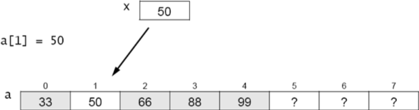
Figure 3.2 Copying x into its correct position

insert() 메서드는 많은 데이터를 이동해야 할 수 있습니다. 예를 들어, n = 1000이고 x가 그 모든 요소보다 작은 경우, 메서드는 모든 1000개의 요소를 이동해야 합니다. 평균적으로, n개의 요소가 있는 정렬된 배열에 삽입하는 것은 n/2개의 요소를 이동하게 됩니다. 따라서 이는 O(n) 작업입니다.

요소를 삭제하는 것은 단순히 삽입 과정의 역순입니다. 평균적으로 역시 n/2개의 요소를 이동해야 합니다. 그러므로 삭제도 O(n) 작업입니다.

== 간접 참조

동적으로 정렬된 배열에 내재된 데이터 이동 문제에 대한 하나의 해결책은 요소들이 실제로 어디에 있는지 추적하기 위해 보조 인덱스 배열을 사용하는 것입니다. 이 해결책은 더 많은 공간(두 번째 배열)을 필요로 하며, 코드를 약간 더 복잡하게 만듭니다. 그러나 요소들을 이동할 필요를 없애줍니다. 보조 인덱스 배열을 사용하여 요소들을 순서대로 접근할 수 있게 해줍니다.

주된 아이디어는 Figure 3.3에서 보여줍니다. 요소들 {22, 33, 44, 55, 66}은 배열 a[]의 임의의 위치에 유지되고, 그 순서는 어떤 보조 메커니즘에 의해 결정됩니다.

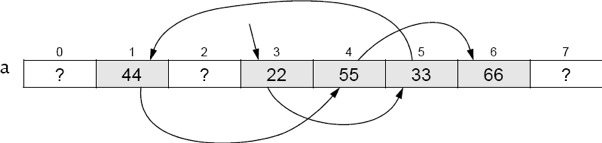
[.text-center]
Figure 3.3 Referring to the order of the array elements

각 요소는 번호가 매겨진 구성요소에 유지됩니다: 22는 구성요소 3에 있고, 33은 구성요소 5에 있으며, 44는 구성요소 1에 있습니다. 따라서 인덱스 숫자의 순서(3, 5, 1, 4, 6)를 저장한다면, 요소에 순서대로 접근할 수 있습니다: a[3] 뒤에 a[5]가 따라옵니다. a[1]이 따라옵니다, 등등.

인덱스 배열은 다른 배열의 인덱스 값인 배열입니다. Figure 3.4에 나와 있는 것처럼 인덱스 번호 3, 5, 1, 4, 6을 인덱스 배열 k[]에 저장함으로써, 우리는 순서대로 데이터 요소 22, 33, 44, 55, 66에 접근할 수 있습니다.

image::./images/figure3_4.png[Using an index array,align=center]
[.text-center]
**Figure 3.4 Using an index array**

이 방법은 개선이 될 수 있지만 최적은 아닙니다. 처음에 요소를 임의의 위치에 저장하도록 허용한 이유는 삽입 및 삭제 작업을 단순화하고자 했기 때문입니다. 우리는 a[]의 세그먼트를 왔다갔다 이동시키는 것을 피하고 싶었습니다. 그러나 Figure 3.4에 나와 있는 해결책은 그 의무를 a[]에서 k[]로 그냥 옮기는 것뿐입니다. 우리가 요소 50을 삽입해야 한다면, 이를 a[0]이나 a[2] 또는 a[6] 이후의 임의의 위치에 넣을 수 있지만, 그럼 그 요소의 인덱스를 요소 순서를 추적하기 위해 k[2]와 k[3] 사이에 k[] 배열에 삽입해야 합니다.

더 나은 해결책은 데이터 배열 a[]에서 사용하는 것과 동일한 배열 위치를 인덱스 배열 k[]에서 사용하는 것입니다. 인덱스 배열이 데이터 요소의 인덱스 번호의 올바른 순서를 추적하고 있기 때문에, 이것은 인덱스 번호 자체에도 동일한 작업을 할 수 있습니다.

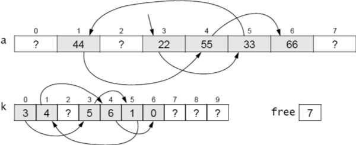
[.text-center]
**Figure 3.5 Using an index array**

Figure 3.5에서 인덱스 배열 k[]는 배열 a[]의 요소 순서를 추적합니다. 시작 인덱스 3은 k[0]에 저장됩니다. 그것은 인덱스 체인을 시작합니다: k[0] = 3, k[3] = 5, k[5] = 1, k[1] = 4, k[4] = 6, k[6] = 0. 인덱스 0은 정렬된 순서의 끝을 나타냅니다. 인덱스 순서 0, 3, 5, 1, 4, 6은 데이터 요소를 순서대로 제공합니다: a[3] = 22, a[5] = 33, a[1] = 44, a[4] = 55, a[6] = 66.

Figure 3.5에 나와 있는 추가 변수 free는 인덱스 배열 k[]와 데이터 배열 a[]의 빈 위치의 인덱스를 저장합니다. 값 7은 k[7]과 a[7]이 다음에 사용되어야 함을 의미합니다.

인덱스 배열을 구현하는 것은 삭제 및 삽입 중에 배열 요소의 세그먼트를 왔다갔다 이동할 필요가 없게 하는 문제를 해결합니다. 예를 들어, Figure 3.5에서 x = 50을 삽입하기 위해, 먼저 순서를 통해 x보다 작은 가장 큰 요소의 인덱스 i를 찾습니다: i = 1. 그런 다음 다음 세 단계를 따릅니다:

[source,java]
----
a[free] = x;	// put x into the next free position
k[free] = k[i]; // store the next index in that position in k[]
k[i] = free++;	// store the index of x in k[] and increment free
----

결과는 Figure 3.6과 같습니다.

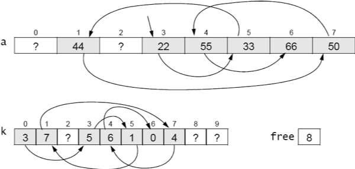
[.text-center]
**Figure 3.6 Inserting an element**

이 알고리즘의 자바 코드는 예제 3.2에 나와 있습니다. 이는 예제 3.2에 표시된 insert() 메서드를 개선합니다. 왜냐하면 이 메서드의 유일한 데이터 이동은 실제로 x를 배열 a[]의 5번 라인에 삽입하는 것입니다.

=== 예제 3.2 간접적으로 정렬된 배열에 삽입하기
[source,java]
----
1	void insert(int x) {
2	    int i=0;
3	    while (k[i] != 0 && a[k[i]] < x) {
4	        i = k[i];
5	    }
6	    a[free] = x;
7	    k[free] = k[i];
8	    k[i] = free++;
9	}
----

3-5번 라인의 while 루프는 페이지 46의 예제 3.1의 5-7번 라인의 while 루프와 유사합니다: a[k[i]] > x를 만족하는 첫 번째 인덱스 i를 찾습니다. 6번 라인에서 x는 배열 a[]의 다음 빈 위치에 삽입됩니다. 7번 라인에서 x 다음 위치의 인덱스가 k[free]에 저장됩니다. 8번 라인에서 x의 인덱스가 k[i]로 복사되고, 그 다음 빈 위치의 인덱스로 free가 증가합니다.
이 코드는 배열이 삽입될 수 있는 모든 요소를 수용할 수 있는 충분한 크기인 것으로 가정합니다. 실제로는 resize() 메서드를 포함할 것입니다.

== 링크드 노드

그림 3.6의 인덱스 배열 k[]의 값은 실제 데이터 배열 a[]을 주소 지정하는 로케이터로 사용됩니다. 우리는 실제로 그들을 위한 별도의 배열이 필요하지 않습니다. 인덱스 배열에서의 그들의 상대적인 위치는 해당 데이터 요소의 위치와 일치합니다. 따라서 그들을 데이터-주소 쌍의 단일 배열로 결합할 수 있습니다. 3.7의 그림에서 보여진 것처럼:

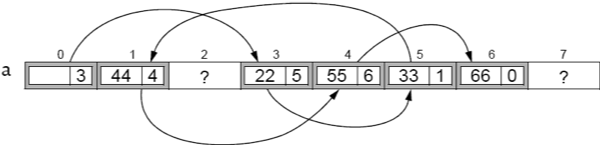
[.text-center]
**Figure 3.7 Storing the indexes with their elements in the same array**

이 버전에서 배열 a[]는 예제 3.7에 표시된대로 정의됩니다.

[source,java]
----
Node[] a = new Node[size];
----

Node는 이제 별도의 클래스로 정의될 것입니다. 아래와 같이 정의됩니다:

[source,java]
----
class Node {
    int data;
    int next;
}
----

이는 배열 a[]를 약간 복잡하게 만들지만, 보조 배열이 필요 없어집니다.

다행히도, 자바는 더 나은 해결책을 허용합니다. 이는 두 배열을 모두 없앨 수 있는 방법입니다! 객체지향적인 관점에서 볼 때, 그림 3.8에서 Node 객체의 시퀀스를 볼 수 있습니다. 각 객체는 데이터 요소와 시퀀스 내의 다음 객체의 주소를 포함합니다. 자바에서는 객체가 직접 그들의 주소에 의해 접근됩니다. 그것이 객체 참조가 하는 일입니다: 객체가 메모리에 저장된 위치의 주소입니다. 그래서 "주소"의 의미를 배열 인덱스가 아닌 메모리 주소(즉, 객체 참조)로 재해석함으로써 구조를 그림 3.8에 표시된 것으로 간소화할 수 있습니다. 여기서 화살표는 객체 참조(즉, 메모리 주소)를 나타냅니다.

image::./images/figure3_8.png[Using objects for the elemtns and their references,align=center]
[.text-center]
**Figure 3.8 Using objects for the elements and their references**

이제 배열 a[] 대신에 단일 시작 참조만 추적하면 됩니다. 자바 런타임 시스템이 모든 기록 작업을 수행합니다. 코드는 예제 3.3에 제공됩니다.

== 예제 3.3 노드 클래스

[source,java]
----
1	class Node {
2	    int data;
3	    Node next;
4
5	    Node(int data) {
6	        this.data = data;
7	    }
8	}
----

image::./images/figure3_9.png[A Node object,align=center]
[.text-center]
**Figure 3.9 A Node object**

노드 클래스는 이제 _자기 참조적(self-referential)_입니다: 그의 next 필드는 Node 타입으로 선언됩니다. 각 Node 객체는 Node 객체를 참조하는 필드를 포함합니다.

노드 클래스의 다른 필드는 여기서 int로 선언된 데이터 필드입니다. 일반적으로 이 필드는 우리가 리스트에 저장할 값의 모든 타입이 될 수 있습니다.

예제 3.3의 노드 클래스에는 한 개의 인수를 받는 생성자도 포함되어 있습니다(5번 라인). 적어도 하나의 인수를 받는 생성자를 명시적으로 정의했기 때문에 컴파일러는 암시적으로 인수가 없는 생성자를 정의하지 않습니다. 따라서 우리가 명시적으로 인수가 없는 생성자를 정의하지 않았기 때문에 생성자가 존재하지 않습니다. 이는 새로운 Node 객체를 생성하는 유일한 방법은 하나의 인수를 받는 생성자(5번 라인)를 사용하는 것입니다. 즉, 우리는 만들려는 각 새로운 Node 객체에 데이터 값을 제공해야 합니다.

그림 3.9는 전형적인 Node 객체를 보여줍니다. 그의 데이터 필드에는 정수 22가 포함되어 있으며, 그의 next 필드에는 다른 Node 객체를 참조하는 참조가 포함되어 있습니다(표시되지 않음). 객체 참조를 나타내기 위해 이런 식으로 화살표를 사용하는 것은 흔하지만, 실제 참조 값은 그 참조가 가리키는 객체의 메모리 주소임을 염두에 두는 것이 좋습니다. 다른 프로그래밍 언어에서는 이러한 변수를 포인터라고 부르며, 그들이 화살표로 표시되는 것이 흔합니다.

자바에서 각 참조 변수는 객체를 찾거나 null을 가리킵니다. null 값은 변수가 어떠한 객체도 참조하지 않음을 의미합니다. null 참조 변수에 저장된 메모리 주소는 0x0(16진수 값 0)입니다; 그 주소에는 어떠한 객체도 저장되어 있지 않습니다. 그림 3.10은 그의 next 필드가 null인 Node 객체를 보여줍니다.

예제 3.4는 다섯 개의 요소로 이루어진 리스트를 구축하는 방법을 보여줍니다.

=== 예제 3.4 연결 리스트 구축하기

[source,java]
----
1	Node start = new Node(22);
2	start.next = new Node(33);
3	start.next.next = new Node(44);
4	start.next.next.next = new Node(55);
5	start.next.next.next.next = new Node(66);
----

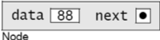
[.text-center]
**Figure 3.10 Another Node object**

image::./images/figure3_11.png[Initializing start,align=center]
[.text-center]
**Figure 3.11 Initializing start**

1번 라인에서는 데이터 값 22를 포함하는 노드를 생성하고 start 변수를 이 노드로 초기화합니다. 결과는 그림 3.11에 표시됩니다. start 변수는 단순히 Node 객체를 참조하는 것에 불과합니다. 또한 Node 객체의 next 참조가 null임을 나타내는데, 이는 아무 화살표도 나오지 않은 검은 점으로 표시됩니다. 노드의 next 필드는 생성자(페이지 50의 예제 3.3의 5번 라인에서 정의됨)에서 초기화되지 않았기 때문에 null입니다. 자바에서는 클래스 필드 중에서 객체 참조인 것(즉, 그 타입이 클래스나 인터페이스인 것)은 생성자에서 기존 객체로 초기화되지 않는 한 자동으로 null로 초기화됩니다.

이어지는 그림들에서 각 Node 객체는 두 부분을 가진 상자로 표시됩니다: 왼쪽에는 정수 데이터가 포함되고, 오른쪽에는 다음 참조가 포함됩니다. 이것은 그림 3.9에 표시된 버전을 간결하게 표시한 것입니다.

예제 3.4의 코드를 계속하면, 2번 라인에서 start 노드의 next 필드가 데이터 33을 포함하는 새로운 Node 객체로 할당됩니다.

이제 리스트에는 두 개의 노드가 있습니다. 이는 그림 3.12에 표시됩니다.

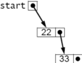
[.text-center]
**Figure 3.12 Adding a node**

3번 라인에서는 리스트의 끝에 다음 노드를 추가합니다. 이를 위해, 우리는 33을 포함하는 노드의 next 필드에 할당해야 합니다. 그러나 우리가 외부에서 액세스할 수 있는 유일한 노드(즉, 변수 이름이 있는 유일한 노드)는 첫 번째 노드입니다. 그 이름은 start입니다. 따라서 33을 포함하는 노드의 next 필드를 참조하기 위해 start.next.next 표현을 사용해야 합니다.

비슷하게, 네 번째 노드는 start.next.next.next를 사용하여 4번 라인에서 추가되고, 다섯 번째 노드는 start.next.next.next.next 표현을 사용하여 5번 라인에서 추가됩니다. 이로써 우리는 마침내 그림 3.13에 표시된 다섯 개의 노드 리스트를 얻게 됩니다.

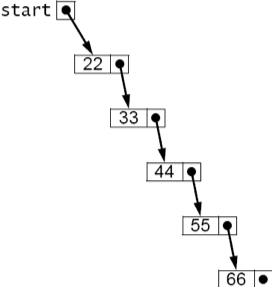
[.text-center]
**Figure 3.13 The five-node list**

예제 3.4의 코드는 서툴러서 일반화하기에 적합하지 않습니다. 분명히, 50개의 노드로 구성된 연결 리스트를 구축하려면 이 방법은 적용할 수 없을 것입니다. 해결책은 "걸어다니며" 리스트를 탐색하고 이를 통해 노드에 지역 액세스를 제공할 수 있는 지역 참조 변수를 사용하는 것입니다.

전통적으로 변수 p("포인터"의 약자)가 이 목적으로 사용됩니다. 개별 노드를 참조할 것이므로 이는 Node 참조로 선언되어야 합니다. 이렇게 선언됩니다:

[source,java]
----
Node p;
----

시작 노드로부터 노드에 대한 유일한 접근 방법이므로 p를 다음과 같이 초기화해야 합니다:

[source,java]
----
Node p=start;
----

Figure 3.14에 표시되어 있습니다. 그런 다음, 과제가 있습니다.

[source,java]
----
p = p.next;
----

그러면 할당문은 위치 변수 p를 다음 노드로 이동시킵니다. 이것은 Figure 3.15에 나와 있습니다. 따라서 연결 리스트를 통해 진행하기 위해 필요한 만큼 이 같은 할당이 여러 번 실행될 수 있습니다.

[cols="1a,1a", frame=none, grid=none]
|===
|
|
|Figure 3.14 Initializing p at the start node
|Figure 3.15 Advancing p to the second node
|===

예제 3.5는 처음에 연결 리스트를 구축하는 데 이 기술을 사용할 수 있는 방법을 보여줍니다.

=== 예제 3.5 연결 리스트 구축

[source,java]
----
1	start = new Node(22);
2	Node p=start;
3	p.next = new Node(33);
4	p = p.next;
5	p.next = new Node(44);
6	p = p.next;
7	p.next = new Node(55);
8	p = p.next;
9	p.next = new Node(66);
----

이 코드는 예제 3.4의 다른 버전보다 훨씬 나아 보이지 않을 수 있습니다. 하지만 큰 장점 중 하나는 루프 내에서 쉽게 관리할 수 있다는 것입니다. 예를 들어, 동일한 리스트를 예제 3.6의 세 줄의 코드로 구축할 수 있습니다.

=== 예제 3.6 for 루프 사용

[source,java]
----
1	Node start = new Node(22), p = start;
2	for (int i=0; i<4; i++) {
3	    p = p.next = new Node(33+11*i);
4	}
----

이 형태는 분명히 50개의 노드로 구성된 연결 리스트를 쉽게 만들어낼 수 있습니다. 이 코드의 실행 단계는 모두 Figure 3.16에 표시되어 있습니다. 참조 변수 p는 배열 인덱스 i와 유사합니다: 배열 요소를 통해 i가 진행되듯이 연결 리스트의 노드를 통해 p가 진행됩니다. 따라서 배열 인덱스 i를 사용하는 것과 마찬가지로 for 루프에서 p를 사용하는 것이 자연스럽습니다. 예를 들어, 예제 3.7과 예제 3.8을 비교해 보세요.

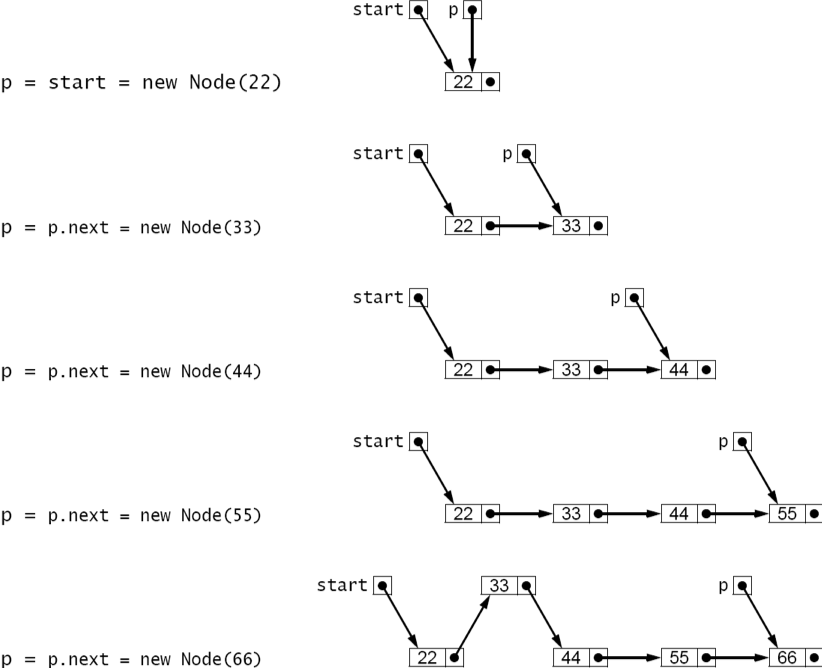
[.text-center]
**Figure 3.16 Trace of Example 3.6**

=== EXAMPLE 3.7 Using a for Loop to Print a Linked List

[source,java]
----
1	for (Node p = start; p != null; p = p.next) {
2	    System.out.println(p.data);
3	}
----

=== EXAMPLE 3.8 Using a for Loop to Print an Array

[source,java]
----
1	for (int i=0; i < n; i++) {
2	    System.out.println(a[i]);
3	}
----

두 목록 모두, for 루프는 각 반복마다 하나의 요소를 출력합니다. for 문은 세 부분의 제어 메커니즘을 갖고 있습니다. 첫 번째 부분은 제어 변수를 선언하고 (리스트의 경우 p, 배열의 경우 i) 첫 번째 요소로 초기화합니다.

[source,java]
----
Node p=start int i=0
----

두 번째 부분은 계속 조건을 지정하며, 더 많은 요소가 있는지 확인합니다.

[source,java]
----
p != null i < n
----

세 번째 부분은 업데이트 식을 제공하여 제어 변수를 다음 요소로 진행합니다.

[source,java]
----
p = p.next
i++
----

이러한 부분마다 두 버전은 유사합니다.

예시 3.9는 간단한 외부 노드 클래스를 위한 테스트 드라이버를 보여줍니다.

=== 예시 3.9 노드 클래스 테스트

[source,java]
----
1	public class TestNode {
2	    public static void main(String[] args) {
3	        Node start = new Node(22);
4	        Node p = start;
5	        for (int i = 1; i < 5; i++) {
6	            p = p.next = new Node(22 + 11*i);
7	        }
8	        for (p = start; p != null; p = p.next)	{
9	            System.out.println(p.data);
10	        }
11	        for (p = start; p != null; p = p.next)	{
12	            System.out.println(p);
13	        }
14	    }
15	}
16
17	class Node {
18	    int data;
19	    Node next;
20	    Node(int data) {
21	        this.data = data;
22	    }
23	}
----

출력은 아래와 같습니다.

[source,console]
----
22
33
44
55
66
Node@7182c1
Node@3f5d07
Node@f4a24a
Node@cac268
Node@a16869
----

첫 번째 노드는 3번 줄에서 생성됩니다. 그런 다음 5번째 줄부터 7번째 줄까지의 for 루프가 나머지 네 개의 노드를 생성합니다.

8번째 줄부터 10번째 줄까지의 두 번째 for 루프는 출력의 첫 다섯 줄에서 노드 데이터를 출력합니다. 11번째 줄부터 13번째 줄까지의 세 번째 for 루프는 다섯 개의 Node 객체의 실제 메모리 주소를 제공합니다.

p와 같은 객체 참조를 문자열 표현식에서 사용할 때

[source,java]
----
System.out.println(p);
----

시스템은 해당 객체의 toString() 메서드를 자동으로 호출합니다. 이 메서드가 오버라이드되지 않은 경우, Object 클래스에 정의된 toString() 메서드의 버전이 실행됩니다. 이는 예시 3.9 프로그램에서와 같이 작동합니다. 그 버전에 의해 반환된 문자열은 단순히 객체의 유형(Node) 다음에 @ 기호와 객체의 메모리 주소(7182c1)가 옵니다. 따라서 출력의 마지막 다섯 줄은 다섯 개의 Node 객체가 0x7182c1, 0x3f5d07, 0xf4a24a, 0xcac268 및 0xa16869 (16진수)과 같은 메모리 주소에 저장되어 있다고 보고합니다. 따라서 이들은 참조 변수 start, start.next, start.next.next, start.next.next.next 및 start.next.next.next.next에 저장된 실제 값입니다.

그림 3.17에서 연결 리스트를 화살표로 표시하는 이유를 알 수 있습니다. 실제 메모리 주소 값을 표시하는 것은 어떤 노드가 어떤 것을 참조하는지 확인하기 위해 더 많은 노력이 필요합니다. 게다가, 이러한 메모리 주소 값은 실행 시간에 의존적입니다. 다른 컴퓨터에서는 다르고, 심지어 같은 컴퓨터에서도 서로 다른 시간에는 다를 수 있습니다.

마지막으로 주목해야 할 점은 6번째 줄에서 연쇄 할당을 사용합니다.

[source,java]
----
p = p.next = new Node(22+11*i);
----
이러한 문장에서 연산의 순서를 기억하는 것이 중요합니다. 여기서 첫 번째로 발생하는 일은 표현식 22 + 11*i의 평가입니다. i가 1일 때, 그것은 33으로 평가되고, i가 4일 때, 66으로 평가됩니다. 값을 얻은 후에는, 이것이 Example 3.3의 50페이지의 5번째 줄에 있는 Node 클래스 생성자에 전달됩니다. 그 생성자는 그 값을 데이터 필드에, 그리고 null을 다음 필드에 가진 노드를 생성합니다. 생성자는 Node 객체에 대한 참조를 반환합니다. 그 참조가 먼저 p.next에 할당되고, 그 다음에 p에 할당됩니다. 중요한 점은 할당이 오른쪽에서 왼쪽으로 이루어진다는 것입니다. 따라서 우리는 p가 그의 next 필드가 갱신되기 전까지 업데이트되지 않음을 알 수 있습니다. 그래서 먼저 다음 필드가 새로운 노드를 가리키도록 설정되고, 그 다음에 루프 제어 변수 p가 해당 다음 노드로 전진됩니다.

== 연결 리스트에 요소 삽입

image::./images/figure3_17.png[The five Node objects,align=center]
[.text-center]
**Figure 3.17 The five Node objects**

그림 3.16에서 구축된 연결 리스트에 새로운 요소를 삽입하는 방법을 상기해보세요. 이 과정을 간소화하기 위해, 우리의 Node 클래스에 두 개의 인수를 받는 생성자를 추가합니다. 이는 예시 3.10에서 보여지는 것과 같습니다. 이를 통해 한 번에 노드를 생성하고 삽입할 수 있습니다.

그림 3.18은 두 개의 인수를 받는 Node 생성자의 호출을 설명합니다. 이는 next가 Node 객체를 가리키는 참조이고, x가 값이 50인 int로 표시됩니다. 이러한 두 인수를 생성자에 전달하면, 주어진 next 포인터가 가리키는 객체와 같은 객체를 가리키는 next 필드를 가지고 50을 포함하는 새로운 Node 객체가 생성됩니다. 그런 다음 생성자는 새로운 Node 객체에 대한 참조를 반환하고, 이것은 q에 할당됩니다.

비어 있지 않은 연결 리스트에 요소를 삽입하는 코드는 예시 3.11에 나와 있습니다. 그 간결함을 감상하기 위해서는, 이것을 49페이지의 예시 3.2의 동등한 방법과 비교하십시오.

=== 예시 3.10 두 개의 생성자를 가진 Node 클래스

[source,java]
----
1	class Node {
2	    int data;
3	    Node next;
4
5	    Node(int data) {
6	        this.data = data;
7	    }
8
9	    Node(int data, Node next) {
10	        this.data = data;
11	        this.next = next;
12	    }
13	}
----

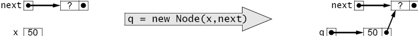
[.text-center]
**Figure 3.18 Invoking the two-argument Node constructor**

삽입은 두 단계로 이루어집니다: (1) 새로운 노드 앞에 올 위치를 결정하는 리스트 노드 p를 찾기; (2) 새로운 노드를 생성하고 연결하기.

=== 예시 3.11 정수로 이루어진 비어 있지 않은 정렬된 연결 리스트에 삽입하기

[source,java]
----
1	void insert(Node start, int x) {
2	    // PRECONDITIONS: the list is in ascending order, and x > start.data;
3	    // POSTCONDITIONS: the list is in ascending order, and it contains x;
4	    Node p = start;
5	    while (p.next != null) {
6	        if (p.next.data > x) break;
7	        p = p.next;
8	    }
9	    p.next = new Node(x,p.next);
10	}
----

첫 번째 단계는 5번부터 8번까지의 루프에 의해 수행됩니다. 변수 p는 Node 객체에 대한 참조로 선언되며, 4번 줄에서 초기화됩니다. 그것은 그림 3.19에서 22를 포함하는 시작 노드를 가리키도록 초기화됩니다. 5번 줄의 루프 제어 조건 (p.next != null)은 p가 리스트의 마지막 요소를 가리킬 때까지 루프를 반복할 수 있도록 합니다. 그 때, p.next는 null이 되어 루프가 중지됩니다. 그러나 루프 내부에서, 6번 줄에서의 조건 (p.next.data > x)는 p가 새로운 노드 뒤에 나와야 하는 어떤 노드에 도달하기 전에 루프를 일찍 중지시킵니다. 이것이 리스트가 오름차순으로 유지되는 방법입니다: 새로운 요소는 항상 해당 요소보다 작은 요소와 그보다 큰 요소 사이에 삽입됩니다.

7번 줄의 할당문 p = p.next는 연결 리스트를 순회하는 표준 메커니즘입니다. while 루프의 각 반복에서, 이 할당은 p를 리스트에서 다음 노드를 가리키도록 이동시킵니다.

실제 삽입은 9번 줄의 문장에 의해 수행됩니다. 표현식 new Node(x,p.next)은 새로운 노드를 생성하고 그 두 필드를 초기화합니다. 이전에 그림 3.18에서 본 것과 같습니다. 그 버전에서는 새로운 노드의 참조를 q에 할당했습니다. 7번 줄의 문장에서는 대신에 p.next에 할당됩니다. 이것은 p 노드의 다음 포인터(44를 포함하는 노드)를 변경합니다. 이전에는 이 포인터가 55를 포함하는 노드를 가리켰으나, 이제는 50을 포함하는 새로운 노드를 가리킵니다.

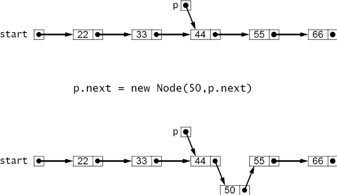
[.text-center]
**Figure 3.19 Inserting into a nonempty sorted linked list**

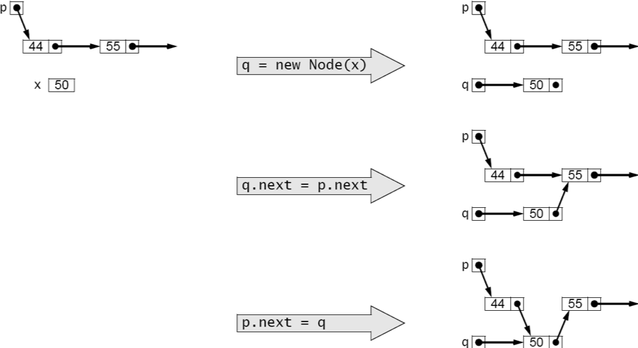
[.text-center]
**Figure 3.20 Inserting the new node in three steps**

삽입의 두 번째 단계는 다음과 같이 여러 개의 별도 문장으로 수행될 수 있습니다.

[source,java]
----
Node q = new Node(x); q.next = p.next; p.next = q;
----

이러한 별도 단계는 그림 3.20에서 설명되어 있습니다. 이 프로세스를 이해한 후에는 Java의 기능을 활용하여 단일 문장으로 작성할 수 있습니다.

[source,java]
----
p.next = new Node(x, p.next);
----
변수 q를 사용하지 않고도 추가 변수의 혼란 없이 작성할 수 있습니다.

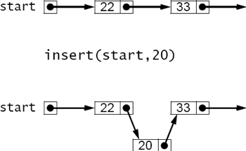
[.text-center]
**Figure 3.21 Inserting 20 incorrectly**

== 리스트의 맨 앞에 삽입하기

예시 3.11의 insert() 메서드에는 추가 사전조건이 포함되어 있습니다. 즉, x가 리스트의 첫 번째 요소(start.data)보다 커야 합니다. 이 사전조건이 필요한 이유를 알아보려면, x가 50이 아닌 20인 경우를 살펴보세요. 이 경우, while 루프의 첫 번째 반복에서 6번 줄의 중단 조건이 참이 될 것이므로, 새로운 노드가 9번 줄에서 삽입될 때 p는 시작 노드를 가리키게 됩니다. 결과적으로, 그림 3.21에 나와 있는 것처럼, 20이 리스트의 맨 앞이 아닌 22와 33 사이에 삽입됩니다. 문제는 새로운 노드 앞에 오는 노드가 없기 때문입니다.

image::./images/figure3_22.png[Inserting 20 correctly,align=center]
[.text-center]
**Figure 3.22 Inserting 20 correctly**

이 문제를 해결하는 한 가지 방법은 연결 리스트 자체를 다시 구성하여 실제 데이터 노드 앞에 "더미" 헤드 노드를 유지하는 것입니다. 이는 약간의 추가 공간을 사용하지만, 예시 3.11의 insert() 메서드를 모든 경우에 대해 작동하게 만듭니다.

다른 해결책은 예시 3.11의 insert() 메서드를 수정하여 이 특수한 경우를 별도로 처리하는 것입니다. 이것은 예시 3.12에서 수행되고, 그림 3.22에서 설명되어 있습니다. 삽입이 리스트의 맨 앞에서 이루어져야 하는 두 가지 상황이 있습니다: 리스트가 비어 있는 경우 또는 새 요소가 리스트의 첫 번째 요소보다 작은 경우입니다. 이 두 조건은 4번 줄에서 처리됩니다. 첫 번째 경우에는, 우리는 간단히 start를 x를 포함하는 새 노드로 재설정할 수 있습니다. 이렇게 하면:

[source,java]
----
start = new Node(x);
----

단일인자 생성자를 사용하는 경우입니다. 두 번째 경우에는 새 노드를 start에 할당해야하지만, 또한 리스트의 나머지 부분에 연결해야합니다. 그러나 리스트의 시작 부분에 대한 유일한 참조는 start 자체이므로 새 노드에 start를 다시 할당하기 전에 해당 참조를 임시 변수에 보관해야합니다.

=== EXAMPLE 3.12 Linked List Insertion

[source,java]
----
1	Node insert(Node start, int x) {
2	    // precondition: the list is in ascending order;
3	    // postconditions: the list is in ascending order, and it contains x;
4	    if (start == null || start.data > x) {
5	        start = new Node(x,start);
6	        return start;
7	    }
8	    Node p=start;
9	    while (p.next != null) {
10	        if (p.next.data > x) break;
11	        p = p.next;
12	    }
13	    p.next = new Node(x,p.next);
14	    return start;
15	}
----

두개의 인자 생성자를 사용하면 그 추가적인 임시 할당이 필요하지 않아집니다.

[source,java]
----
start = new Node(x,start);
----

게다가, 리스트가 비어있는 첫 번째 경우도 처리합니다. 왜냐하면 그 경우에는 start가 null이고, 두 번째 매개변수에 null을 전달하는 것은 1인자 생성자를 사용하는 것과 동일합니다.

[source,java]
----
start = new Node(x, null); // equivalent
start = new Node(x);	// equivalent
----

그러므로 다시 한 번, 두 인자 생성자가 가장 좋은 해결책을 제공합니다.
예제 3.11의 더 단순한 버전과는 달리, 예제 3.12의 완전한 insert() 메서드는 줄 5에서 해당 참조가 변경될 수 있으므로 start 노드 참조를 반환해야합니다.

정렬된 연결 목록을 연결 구조로 구현하면 삽입이 훨씬 효율적으로 이루어지기 때문에 요소를 이동할 필요가 없습니다. 삭제에 대해서도 마찬가지입니다.

insert() 메서드와 마찬가지로 delete() 메서드에는 두 가지 주요 부분이 있습니다:
(1) 요소 찾기;
(2) 삭제하기. 또한 목록의 앞부분에 있는 특별한 경우를 따로 처리합니다. 예제 3.13은 delete() 메서드를 보여줍니다.

=== EXAMPLE 3.13 Linked List Deletion

[source,java]
----
1	Node delete(Node start, int x) {
2	    // precondition: the list is in ascending order;
3	    // postconditions: the list is in ascending order, and if it did
4	    // contains x, then the first occurrence of x has been deleted;
5	    if (start == null || start.data > x) { // x is not in the list
6	        return start;
7	    } else if (start.data == x) {	// x is the first element in the list
8	        return start.next;
9	    }
10	    for (Node p = start; p.next != null; p = p.next) {
11	        if (p.next.data > x) {
12	            break;	// x is not in the list
13	        } else if (p.next.data == x) {	// x is in the p.next node
14	            p.next = p.next.next;	// delete it
15	            break;
16	        }
17	    }
18	    return start;
19	}
----

만약 리스트가 비어있으면, start == null이고 아무것도 할 필요가 없습니다. 또한, 첫 번째 요소가 x보다 크면, 정렬되어 있기 때문에 모든 요소는 x보다 커야하므로 x가 목록에 없습니다. 이 두 가지 경우는 줄 5에서 먼저 처리됩니다.

만약 목록의 첫 번째 요소가 x와 같다면, 줄 8에서 삭제됩니다. 이 작업은 Figure 3.23에 나와 있듯이 start.next를 start로 반환함으로써 수행됩니다. 원래의 start 노드를 가리키는 다른 참조가 없다면, Java "garbage collector"에 의해 삭제될 것입니다.

만약 목록의 첫 번째 요소가 x보다 작다면, 줄 10의 for 루프는 x보다 크거나 같은 첫 번째 요소를 찾습니다. 더 큰 요소를 찾으면, 메서드는 줄 12에서 중단되고 목록을 변경하지 않고 반환합니다. x와 같은 요소를 찾으면, 줄 14에서 삭제됩니다. 이는 Figure 3.24에서 설명되어 있습니다.

== 중첩 클래스

Java에서 클래스 멤버는 필드, 생성자, 메서드, 인터페이스 또는 다른 클래스일 수 있습니다. 다른 클래스의 멤버인 클래스를 중첩 클래스라고합니다.

image::./images/figure3_23.png[Deleting the first element from a sorted linked list,align=center]
[.text-center]
**Figure 3.23 Deleting the first element from a sorted linked list**

image::./images/figure3_24.png[Deleting any other element from a sorted linked list,align=center]
[.text-center]
**Figure 3.24 Deleting any other element from a sorted linked list**

만약 클래스 Y가 다른 클래스 X 내에서만 사용될 경우, 클래스 Y는 클래스 X 내에 중첩되어야 합니다. 이는 우리가 다른 맥락에서 적용한 정보 은닉 원칙의 중요한 예입니다.

만약 X가 어떤 타입(클래스 또는 인터페이스)이고, Y가 X 내에 중첩된 다른 타입이라면, X의 모든 멤버는 Y에서 접근할 수 있고, Y의 모든 멤버는 X에서 접근할 수 있습니다. 이는 예제 3.14에서 설명되어 있습니다.

예제 3.14의 Main 클래스에는 Nested라는 private 중첩 클래스가 있습니다. 두 클래스 모두 private int 필드를 가지고 있습니다. Main은 줄 2에서 m을 선언하고 초기화합니다. Nested는 줄 15에서 n을 선언하고 초기화합니다. Nested 클래스는 또한 줄 17에서 private 메서드 f()를 정의합니다.

=== EXAMPLE 3.14 Accessibility from Nested Classes

[source,java]
----
1	public class Main {
2	private int m = 22;
3
4	public Main() {
5	Nested nested = new Nested();
6	System.out.println("Outside of Nested; nested.n = " + nested.n);
7	nested.f();
8	}
9
10	public static void main(String[] args) {
11	new Main();
12	}
13
14	private class Nested {
15	private int n = 44;
16
17	private void f() {
18	System.out.println("Inside of Nested; m = " + m);
19	}
20	}
21	}
----

출력은 아래와 같습니다.

[source,console]
----
Outside of Nested; nested.n = 44
Inside of Nested; m = 22
----

main() 메서드는 줄 11에서 Main() 생성자를 호출합니다. 그것은 줄 5에서 Nested 클래스를 인스턴스화합니다. Nested 클래스의 private 필드 n은 줄 6에서 접근되고, Nested 클래스의 private 메서드 f()는 줄 7에서 접근됩니다. 이는 중첩 클래스의 private 멤버가 해당 외부 클래스에서 접근 가능하다는 것을 보여줍니다. 대칭적으로, 외부 클래스의 private 멤버는 중첩된 클래스 내에서 접근 가능합니다. 이것은 줄 18에서 보여지는 것처럼 입증됩니다.

한 클래스가 다른 클래스 안에 중첩되는 것에 대한 UML 심볼은 화살표 머리 대신 내부에 플러스 기호가 있는 원을 사용합니다. Figure 3.25에 나와 있는 것처럼요.

image::./images/figure3_25.png[UML diagram for a nested class,align=center]
[.text-center]
**Figure 3.25 UML diagram for a nested class**

중첩된 클래스의 모든 멤버는 외부 클래스의 어느 곳에서나 접근할 수 있기 때문에, 그러한 멤버는 일반적으로 접근 제어자(private, protected, 또는 public) 없이 선언됩니다. 이렇게 함으로써 간단하게 유지할 수 있습니다.

보통 중첩된 클래스는 그 인스턴스가 외부 클래스의 정적이지 않은 멤버에 접근해야 할 필요가 없는 경우에는 정적으로 선언해야 합니다. (정적이지 않은 중첩 클래스를 내부 클래스라고 합니다.)

예를 들어, 페이지 56의 예제 3.10에서 정의된 Node 클래스는 구현되는 연결된 목록의 맥락 내에서만 사용됩니다. 따라서 이 클래스는 List 클래스 내에 중첩되어야 합니다. 게다가, 노드는 List 메서드나 필드에 접근할 필요가 없으므로, Node 클래스는 정적 중첩 클래스로 선언되어야 합니다. 이는 예제 3.15의 줄 12에서 수행되며, Figure 3.26에서 설명되어 있습니다.

=== EXAMPLE 3.15 Nesting the Node Class within a LinkedList Class

[source,java]
----
1	public class LinkedList {
2	private Node start;
3
4	public void insert(int x)	{
5	// Insert lines 2-14 of	Example	3.12	on	page	58
6	}
7
8	public void delete(int x)	{
9	// Insert lines 2-18 of	Example	3.13	on	page	59
10	}
11
12	private static class Node	{
13	// Insert lines 2-12 of	Example	3.10	on	page	56
14	}
15	}
----

Node 클래스를 LinkedList 클래스 내에 숨기면 LinkedList 클래스를 캡슐화하여 자체 포함되고 구현 세부 사항을 숨깁니다. 개발자는 다른 코드를 수정하지 않고도 구현을 변경할 수 있습니다.

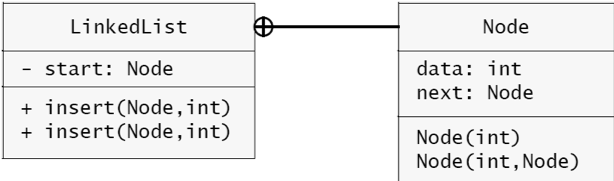
[.text-center]
**Figure 3.26 A Node class nested within a LinkedList class**

== 복습 문제

1. 배열이 동적으로 정렬된 리스트에 대해 효율적이지 않은 데이터 구조인 이유는 무엇인가요?
2. 인덱스 배열이 무엇인가요?
3. 배열보다 링크드 리스트가 훨씬 더 좋은데, 왜 여전히 배열이 사용될까요?
4. 링크드 리스트의 앞에 삽입하는 것은 다른 곳에 삽입하는 것과는 다르게 처리되어야 하는 이유는 무엇인가요?
5. BigInt 클래스에서 리스트가 역순인 이유는 무엇인가요?

Here are the translated descriptions and examples for the methods described in AsciiDoc format:

== 문제

=== 1. 다음과 같은 메서드를 작성하고 테스트하세요.

이 메서드는 Example 3.1 6의 insert() 메서드와 비슷합니다

[source,java]
----
void delete(int[] a, int n, int x)
// 전제조건: 0 <= n < a.length;
// 후제조건: a[0], ..., a[n-1] 중 첫 번째로 나타나는 x가 삭제되었습니다;
----

* 배열 a[]가 {33, 55, 77, 99, 77, 55, 33, 0}이라면, delete(a, 6, 55)는 a[]를 {33, 77, 99, 77, 55, 33, 0, 0}으로 변경

=== 2. 다음과 같은 메서드를 작성하고 테스트하세요

[source,java]
----
int size(Node list)
// 반환값: 지정된 리스트의 노드 수;
----

* 리스트가 {33, 55, 77, 99}인 경우, size(list)는 4 반환

=== 3. 다음과 같은 메서드를 작성하고 테스트하세요:

[source,java]
----
int sum(Node list)
// 반환값: 지정된 리스트의 정수들의 합;
----

* 리스트가 {25, 45, 65, 85}인 경우, sum(list)는 220 반환

=== 4. 다음과 같은 메서드를 작성하고 테스트하세요

[source,java]
----
void removeLast(Node list)
// 전제조건: 지정된 리스트에는 적어도 두 개의 노드가 있어야 함;
// 후제조건: 리스트의 마지막 노드가 삭제되었습니다;
----

* 리스트가 {22, 44, 66, 88}인 경우, removeLast(list)는 리스트를 {22, 44, 66}으로 변경

=== 5. 다음과 같은 메서드를 작성하고 테스트하세요

[source,java]
----
Node copy(Node list)
// 반환값: 지정된 리스트의 복제본인 새로운 리스트;
----

* 새 리스트는 반드시 원본 리스트와 완전히 독립적이어야 합니다.
* 한 리스트를 변경해도 다른 리스트에는 영향을 미치지 않아야 합니다.

=== 6. 다음과 같은 메서드를 작성하고 테스트하세요

[source,java]
----
Node sublist(Node list, int p, int q)
// 반환값: 지정된 리스트에서 p부터 q까지의 노드들을 복사한 새로운 리스트;
// 노트: 두 리스트는 완전히 독립적이어야 합니다. 한 리스트를 변경해도 다른 리스트에는 영향을 미치지 않아야 합니다.
----

* 리스트가 {22, 33, 44, 55, 66, 77, 88, 99}인 경우, sublist(list, 2, 7)는 새 리스트 {44, 55, 66, 77, 88} 반환

=== 7. 다음과 같은 메서드를 작성하고 테스트하세요

[source,java]
----
void append(Node list1, Node list2)
// 전제조건: list1은 적어도 하나의 노드를 가지고 있어야 함;
// 후제조건: list2가 list1에 추가되었습니다;
----

예를 들어, list1이 {22, 33, 44, 55}이고, list2가 {66, 77, 88, 99}인 경우, append(list1, list2)는 list1을 {22, 33, 44, 55, 44, 55, 66, 77, 88}으로 변경합니다.

=== 8. 다음과 같은 메서드를 작성하고 테스트하세요

[source,java]
----
Node concat(Node list1, Node list2)
// 반환값: list1의 복사본 다음에 list2의 복사본이 이어진 새로운 리스트;
----

* list1이 {22, 33, 44, 55}이고, list2가 {66, 77, 88, 99}인 경우, concat(list1, list2)는 새 리스트 {22, 33, 44, 55, 44, 55, 66, 77, 88} 반환

=== 9. 다음과 같은 메서드를 작성하고 테스트하세요:

[source,java]
----
void set(Node list, int i, int x)
// i번째 원소의 값을 x로 대체합니다;
----

* 리스트가 {22, 33, 44, 55, 66, 77, 88, 99}인 경우, set(list, 2, 50)는 리스트를 {22, 33, 50, 55, 66, 44, 88, 99}로 변경

=== 10. 다음과 같은 메서드를 작성하고 테스트하세요:

[source,java]
----
int get(Node list, int i)
// i번째 원소의 값을 반환합니다;
----

* 리스트가 {22, 33, 44, 55, 66, 77, 88, 99}인 경우, get(list, 2)는 44 반환

=== 11. 다음과 같은 메서드를 작성하고 테스트하세요:

[source,java]
----
void put(Node list, int i, int x)
// x를 i번째 원소로 삽입합니다;
----

* 리스트가 {22, 33, 44, 55, 66, 77, 88, 99}인 경우, put(list, 3, 50)는 리스트를 {22, 33, 44, 50, 55, 66, 44, 88, 99}로 변경
* i가 0이면 첫 번째 노드의 값을 x로 바꾸고, 그 다음 새로운 노드를 삽입합니다.

=== 12. 다음과 같은 메서드를 작성하고 테스트하세요:

[source,java]
----
void swap(Node list, int i, int j)
// i번째 원소와 j번째 원소를 교환합니다;
----

* 리스트가 {22, 33, 44, 55, 66, 77, 88, 99}인 경우, swap(list, 2, 5)는 리스트를 {22, 33, 77, 55, 66, 44, 88, 99}로 변경

13. 다음과 같은 메서드를 작성하고 테스트하세요:
[source,java]
----
Node merged(Node list1, Node list2)
// 전제조건: list1과 list2 모두 오름차순으로 정렬되어 있어야 함;
// 반환값: list1과 list2의 모든 원소를 오름차순으로 포함한 새로운 리스트;
----

* list1이 {22, 33, 55, 88}이고, list2가 {44, 66, 77, 99}인 경우, merged(list1, list2)는 새 리스트 {22, 33, 44, 55, 66, 77, 88, 99} 반환

=== 14. 다음과 같은 메서드를 작성하고 테스트하세요:

[source,java]
----
void rotateLeft(Node list)
// 지정된 리스트의 첫 번째 원소를 마지막으로 이동합니다;
----

* 리스트가 {22, 33, 44, 55, 66, 77, 88, 99}인 경우, rotateLeft(list)는 리스트를 {33, 44, 55, 66, 77, 88, 99, 22}로 변경합니다.
* 새로운 노드는 생성되지 않습니다.