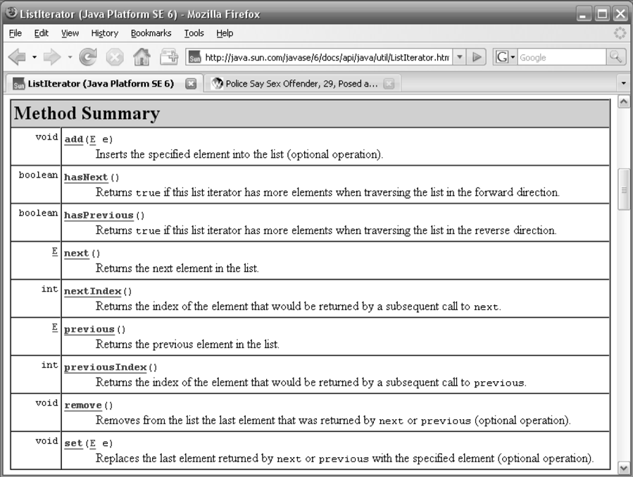
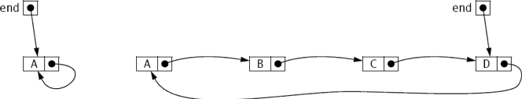
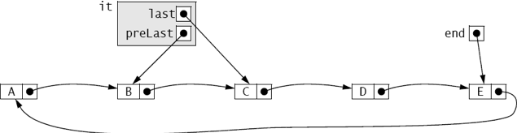

:stem: latexmath

= 리스트

리스트는 순차적으로 접근 가능한 요소들의 모음입니다. 첫 번째 요소, 그 다음 두 번째 요소, 그 다음 세 번째 요소, 이런 식으로 접근합니다. 이것을 순차 접근 또는 연결 접근이라고 합니다 (직접 접근 또는 인덱스 접근과는 다릅니다). 좋은 예로는 철로 위의 기차 칸들이 있습니다. 첫 번째 칸에서 네 번째 칸으로 가려면 두 번째 칸과 세 번째 칸을 순서대로 지나야 합니다. 이 예는 또한 리스트에서 삽입과 삭제가 어떻게 관리되는지를 보여줍니다. 필요한 변경은 삽입 또는 삭제가 이루어지는 위치에 인접한 두 칸에만 영향을 미치며, 다른 칸들은 영향을 받지 않습니다.

== JCF 리스트 인터페이스

Java Collections Framework에서 지정한 List 인터페이스는 페이지 85에 나와 있습니다. 이 인터페이스는 Collection 인터페이스가 지정한 15개의 메소드에 10개의 메소드를 추가합니다.

페이지 70의 그림 4.1에 나와 있는 JCF 상속 계층에서 Queue, Deque, Set 인터페이스 모두가 List 인터페이스를 확장하는 것을 볼 수 있습니다. 따라서 모든 List, Queue, Deque, Set 클래스는 List 인터페이스를 구현합니다. 여기에는 4장에서 설명한 ArrayList, Vector, LinkedList, PriorityQueue, ArrayDeque, EnumSet, HashSet, LinkedHashSet, TreeSet 같은 구체적인 클래스들이 포함됩니다.

페이지 70의 표 4.1에서 볼 수 있듯이, JCF는 List 인터페이스의 연결된 구현과 인덱스된 구현을 모두 제공합니다: LinkedList 클래스는 순차 접근을 사용하고, ArrayList 클래스는 직접 접근을 제공합니다.

=== 예제 7.1 리스트 클래스 테스트

이 프로그램은 List 인터페이스에서 지정한 몇 가지 메소드를 설명합니다:

[source,java]
----
1	public class TestStringList {
2	    public static void main(String[] args) {
3	        List<String> list = new ArrayList<String>();
4	        Collections.addAll(list, "GB", "DE", "FR", "ES");
5	        System.out.println(list);
6	        list.add(3, "DE");
7	        System.out.println(list);
8	        System.out.println("list.get(3): " + list.get(3));
9	        System.out.println("list.indexOf(\"DE\"): " + list.indexOf("DE"));
10	        System.out.println("list.indexOf(\"IE\"): " + list.indexOf("IE"));
11	        System.out.println("list.subList(1, 5): " + list.subList(1, 5));
12	        list.remove("DE");
13	        System.out.println(list);
14	    }
15	}
----

출력은 다음과 같습니다:

[source,console]
----
[GB, DE, FR, ES]
[GB, DE, FR, DE, ES]
list.get(3): DE
list.indexOf("DE"): 1
list.indexOf("IE"): -1
list.subList(1, 5): [DE, FR, DE, ES]
[GB, FR, DE, ES]
----

리스트 객체는 3번째 줄에서 String 객체의 ArrayList로 생성됩니다. 4번째 줄에서 Collections 클래스의 static addAll() 메소드를 사용하여 네 개의 문자열을 로드합니다. 6번째 줄에서 두 개의 인수를 받는 add() 메소드를 테스트하여 "DE" 문자열을 두 번째 요소로 삽입합니다. 집합과 달리 리스트는 중복 요소를 허용합니다.

8번째 줄에서는 get() 메소드를 사용하여 세 번째 요소를 얻습니다. 9-10번째 줄은 indexOf() 메소드를 설명하며, 지정된 요소의 인덱스 번호를 반환합니다. 첫 번째로 나타나는 요소의 인덱스를 반환하는데, DE는 1번과 3번 인덱스에 모두 존재합니다.

11번째 줄에서 list.subList(1, 5)는 1부터 5까지(5는 포함하지 않음) 요소의 서브리스트를 반환합니다. 두 인덱스가 범위 내에 있는 한, 서브리스트의 크기는 항상 그 차이와 동일합니다. 이 경우 5 – 1 = 4 요소입니다.

12번째 줄에서는 list.remove("DE")가 DE의 첫 번째 발생을 제거합니다.

== 범위 뷰 연산 sublist()

예제 7.1에서 설명한 sublist() 메소드는 그 예제가 암시하는 것보다 훨씬 강력합니다. 이 메소드는 리스트에 대한 "뷰"를 제공하여 다른 List 메소드들을 적용할 수 있게 합니다. 다음과 같이 체인 호출 모드로 사용할 때

[source,java]
----
list.sublist(1, 5).get(2)
----
연결된 메소드를 리스트 자체에 적용하면서 서브리스트의 컨텍스트로 제한할 수 있습니다. 따라서 이 호출은 서브리스트의 두 번째 요소를 반환하며, 이는 실제로 리스트의 세 번째 요소입니다.

=== 예제 7.2 범위 뷰 연산으로서의 sublist() 메소드 사용

[source,java]
----
1	public class TestSubList {
2	    public static void main(String[] args) {
3	        List<String> list = new ArrayList<String>();
4	        Collections.addAll(list,  "A","B","C","D","E","F","G","H","I","J");
5	        System.out.println(list);
6	        System.out.println("list.subList(3,8): " + list.subList(3,8));
7	        System.out.println("list.subList(3,8).get(2): "
8	                + list.subList(3,8).get(2));
9	        System.out.println("list.subList(3,8).set(2,\"B\"):");
10	        list.subList(3,8).set(2, "B");
11	        System.out.println(list);
12	        System.out.println("list.indexOf(\"B\"): " + list.indexOf("B"));
13	        System.out.println("list.subList(3,8).indexOf(\"B\"): "
14	                + list.subList(3,8).indexOf("B"));
15	        System.out.println(list);
16	        System.out.println("Collections.reverse(list.subList(3,8)):");
17	        Collections.reverse(list.subList(3,8));
18	        System.out.println(list);
19	        System.out.println("Collections.rotate(list.subList(3,8), 2):");
20	        Collections.rotate(list.subList(3,8), 2);
21	        System.out.println(list);
22	        System.out.println("Collections.fill(list.subList(3,8), \"X\"):");
23	        Collections.fill(list.subList(3,8), "X");
24	        System.out.println(list);
25	        list.subList(3,8).clear();
26	        System.out.println(list);
27	    }
28	}
----

출력은 다음과 같습니다:

[source,console]
----
[A, B, C, D, E, F, G, H, I, J]
list.subList(3,8): [D, E, F, G, H]
list.subList(3,8).get(2): F
list.subList(3,8).set(2,"B"):
[A, B, C, D, E, B, G, H, I, J]
list.indexOf("B"): 1
list.subList(3,8).indexOf("B"): 2
[A, B, C, D, E, B, G, H, I, J]
Collections.reverse(list.subList(3,8)):
[A, B, C, H, G, B, E, D, I, J]
Collections.rotate(list.subList(3,8), 2):
[A, B, C, E, D, H, G, B, I, J]
Collections.fill(list.subList(3,8), "X"):
[A, B, C, X, X, X, X, X, I, J]
[A, B, C, I, J]
----

6번째 줄에서 list.subList(3,8) 호출은 서브리스트 [D, E, F, G, H]를 반환합니다.

8번째 줄에서 list.subList(3,8).get(2) 호출은 서브리스트의 두 번째 요소인 F를 반환합니다. 10번째 줄에서 list.subList(3,8).set(2,"B") 호출은 리스트에서 그 요소를 B로 교체합니다.

12번째 줄에서 list.indexOf("B") 호출은 리스트에서 첫 번째 B가 있는 위치인 1을 반환합니다.

14번째 줄에서 list.subList(3,8).indexOf("B") 호출은 서브리스트에서 첫 번째 B가 있는 위치인 2를 반환합니다.

17번째 줄에서 Collections.reverse(list.subList(3,8)) 호출은 원래 리스트 내의 다섯 개 요소 서브리스트 [D,E,B,G,H]를 반전시켜 [A,B,C,D,E,B,G,H,I,J]를 [A,B,C,H,G,B,E,D,I,J]로 변경합니다.

20번째 줄에서 Collections.rotate(list.subList(3,8),2) 호출은 다섯 개 요소 서브리스트 [H,G,B,E,D]를 [E,D,H,G,B]로 회전시켜 전체 리스트를 [A,B,C,E

,D,H,G,B,I,J]로 변경합니다.

23번째 줄에서 Collections.fill(list.subList(3,8),"X") 호출은 다섯 개 요소 서브리스트 [E,D,H,G,B]를 [X,X,X,X,X]로 대체하여 전체 리스트를 [A,B,C,X,X,X,X,X,I,J]로 변경합니다.

25번째 줄에서 list.subList(3,8).clear() 호출은 리스트에서 다섯 개 요소 서브리스트 [X,X,X,X,X]를 삭제하여 [A,B,C,I,J]로 변경합니다.

== 리스트 반복자

컬렉션 반복자는 페이지 77에 설명되어 있습니다. JCF는 Iterator 인터페이스를 확장하여 ListIterator 인터페이스를 정의합니다. 이 인터페이스는 리스트 반복자의 양방향 특성을 반영한 여섯 개의 추가 메소드를 지정합니다. 모든 아홉 개의 메소드는 페이지 135의 그림 7.1에 나와 있습니다.

리스트 반복자를 얻는 표준 방법은 리스트의 listIterator() 메소드를 호출하는 것입니다. 이는 iterator() 메소드를 호출하여 일반적인 (단방향) 반복자를 반환하는 것과 같습니다.

=== 예제 7.3 범위 뷰 연산으로서의 sublist() 메소드 사용

[source,java]
----
1	public class TestSubList {
2	    public static void main(String[] args) {
3	        List<String> list = new ArrayList<String>();
4	        Collections.addAll(list,  "A","B","C","D","E","F","G","H");
5	        System.out.println(list);
6		    ListIterator<String> it = list.listIterator();
7		    System.out.println("it.nextIndex(): " + it.nextIndex());
8		    System.out.println("it.next(): " + it.next());
9		    System.out.println("it.previousIndex(): " + it.previousIndex());
10		    System.out.println("it.nextIndex(): " + it.nextIndex());
11		    System.out.println("it.next(): " + it.next());
12		    System.out.println("it.next(): " + it.next());
13		    System.out.println("it.previous(): " + it.previous());
14		    System.out.println("it.previousIndex(): " + it.previousIndex());
15		    System.out.println("it.nextIndex(): " + it.nextIndex());
16		    System.out.println("it.previous(): " + it.previous());
17		    System.out.println("it.next(): " + it.next());
18		    System.out.println("it.next(): " + it.next());
19		    System.out.println("it.next(): " + it.next());
20		    System.out.println("it.add(\"X\"):");
21		    it.add("X");
22		    System.out.println(list);
23		    System.out.println("it.next(): " + it.next());
24		    System.out.println("it.set(\"Y\"):");
25		    it.set("Y");
26		    System.out.println(list);
27		    System.out.println("it.next(): " + it.next());
28		    System.out.println("it.remove():");
29		    it.remove();
30		    System.out.println("it.next(): " + it.next());
31		    System.out.println(list);
32	    }
33	}
----

출력은

[source,console]
----
[A, B, C, D, E, F, G, H]
it.nextIndex(): 0
it.next(): A
it.previousIndex(): 0
it.nextIndex(): 1
it.next(): B
it.next(): C
it.previous(): C
it.previousIndex(): 1
it.nextIndex(): 2
it.previous(): B
it.next(): B
it.next(): C
it.next(): D
it.add("X"):
[A, B, C, D, X, E, F, G, H]
it.next(): E
it.set("Y"):
[A, B, C, D, X, Y, F, G, H]
it.next(): F
it.remove():
it.next(): G
[A, B, C, D, X, Y, G, H]
----

[.text-center]
**Figure 7.1 Methods specified by the java.util.ListIterator interface**

출력은 아홉 개의 ListIterator 메서드의 효과를 보여줍니다. 7번째 줄과 10번째 줄에서 nextIndex() 메서드는 이터레이터의 현재 요소의 인덱스 번호를 반환합니다: 처음에는 0, 그리고 다음으로는 1입니다. 비슷하게, previousIndex() 메서드는 이터레이터의 이전 요소의 인덱스 번호를 반환합니다. next()와 previous() 메서드는 이터레이터를 리스트를 따라 위아래로 이동시킵니다. 21번째 줄에서 add() 메서드는 next() 메서드에 의해 참조된 마지막 요소인 D 바로 다음에 새 요소 X를 삽입합니다. 25번째 줄에서 set() 메서드는 next() 메서드에 의해 참조된 마지막 요소인 E를 Y로 변경합니다. 29번째 줄에서 remove() 메서드는 next() 메서드에 의해 참조된 마지막 요소인 F를 삭제합니다.

일종의 손가락이 텍스트를 따라 이동하는 것처럼, 이터레이터는 컬렉션에 바운드된 객체로, 동일한 컬렉션에서 다른 이터레이터와 독립적으로 움직입니다.

=== 예제 7.4 같은 List 객체에서 여러 ListIterator 객체를 사용하여 반복하는 방법

이 프로그램은 ArrayList 클래스에 특정한 몇 가지 메서드를 보여줍니다:

[source,java]
----
1	public class TestingSeveralIterators {
2	     public static void main(String[] args) {
3	        List<String> list = new ArrayList<String>();
4	        Collections.addAll(list, "A", "B", "C", "D");
5	        System.out.println(list);
6	        ListIterator<String> it1 = list.listIterator();
7	        System.out.println("it1.next(): " + it1.next());
8	        System.out.println("it1.next(): " + it1.next());
9	        System.out.println("it1.next(): " + it1.next());
10	        System.out.println("it1.add(\"X\"):");
11	        it1.add("X");
12	        System.out.println(list);
13		    ListIterator<String> it2 = list.listIterator();
14		    System.out.println("it2.next(): " + it2.next());
15		System.out.println("it2.next(): " + it2.next());
16		System.out.println("it2.set(\"Y\"):");
17		it2.set("Y");
18		System.out.println(list);
19		ListIterator<String> it3 = list.listIterator();
20		System.out.println("it3.next(): " + it3.next());
21		System.out.println("it3.next(): " + it3.next());
22		System.out.println("it3.next(): " + it3.next());
23		System.out.println("it3.next(): " + it3.next());
24		System.out.println("it1.previous(): " + it1.previous());
25		System.out.println("it1.previous(): " + it1.previous());
26		System.out.println("it1.previous(): " + it1.previous());
27	}
28	}
----

The output is:

[source,java]
----
[A, B, C, D]
it1.next(): A
it1.next(): B
it1.next(): C
it1.add("X"):
[A, B, C, X, D]
it2.next(): A
it2.next(): B
it2.set("Y"):
[A, Y, C, X, D]
it3.next(): A
it3.next(): Y
it3.next(): C
it3.next(): X
it1.previous(): X
it1.previous(): C
it1.previous(): Y
----

첫 번째 이터레이터 it1은 처음 세 요소를 건너뛴 다음 11번 줄에서 C와 D 사이에 X를 삽입합니다. 두 번째 이터레이터 it2는 처음 두 요소를 건너뛴 다음 17번 줄에서 B와 Y를 변경합니다. 세 번째 이터레이터 it3는 변경된 요소 Y와 삽입된 요소 X를 포함하여 처음 네 요소를 건너뛰어 진행합니다. 마지막으로, 첫 번째 이터레이터 it1은 삽입된 요소 X와 변경된 요소 Y를 포함하여 이전 세 요소로 되돌아갑니다.

=== 기타 리스트 유형

JCF는 구체적인 LinkedList 클래스를 정의합니다. (86페이지 참조) 하지만 특정 응용 프로그램에 정확히 필요한 것이 아닐 수 있습니다. 이러한 경우에는 AbstractList 클래스를 확장하여 JCF와 일관된 사용자 지정 리스트 클래스를 얻을 수 있습니다.

=== 예제 7.5 Ring class

이는 원형의 단일 연결 리스트를 사용하는 리스트 클래스를 정의합니다. LinkedList 클래스와 유사하지만 next() 메서드가 리스트의 끝에서 시작으로 감싸서 원형 또는 "Ring"을 형성할 수 있습니다.

[source,java]
----
1	public class Ring<E> extends AbstractList<E> implements List<E> {
2	    private Node<E> end;
3	    private int size;
4
5	    public boolean add(E element) {
6	        if (size == 0) {
7	            end = new Node<E>(element, null);
8	            end.next = end;
9	        } else {
10	            end = end.next = new Node<E>(element, end.next);
11	        }
12	        ++size;
13	        return true;
14	    }
15
16	    public E get(int index) {
17	        if (index < 0 || index >= size) {
18	            throw new IndexOutOfBoundsException();
19	        }
20	        Node<E> p = end.next;
21	        for (int i=0; i<index; i++) {
22	            p = p.next;
23	        }
24	        return p.element;
25	    }
26
27	    public Iterator<E> iterator() {
28	        return new RingIterator();
29	    }
30
31	    public String toString() {
32	        Node<E> p = end.next;
33	        StringBuilder buf = new StringBuilder("[" + p.element);
34	        while (p != end) {
35	            p = p.next;
36	            buf.append(", " + p.element);
37	        }
38	        buf.append("]");
39	        return buf.toString();
40	    }
41
42	    public int size() {
43	        return size;
44	    }
45
46	    private class RingIterator implements Iterator<E> {
47	        private Node<E> last;
48	        private Node<E> preLast = end;
49
50	        public boolean hasNext() {
51	            return size > 0;
52	        }
53
54	        public E next() {
55	            if (last == null) {
56	                last = preLast.next;
57	            } else {
58	                preLast = last;
59	                last = last.next;
60	            }
61	            return last.element;
62	        }
63
64	        public void remove() {
65	            if (last == null) {
66	                throw new IllegalStateException();
67	            }
68	            if (size == 1) {
69	                end = preLast = null;
70	            } else {
71	                preLast.next = last.next;
72	            }
73	            if (last == end) {
74	                end = preLast;
75	            }
76	            last = null;
77	            --size;
78	        }
79	    }
80
81	    private static class Node<E> {
82	        E element;
83	        Node<E> next;
84
85	        Node(E element, Node<E> next) {
86	            this.element = element;
87	            this.next = next;
88	        }
89	    }
90	}
----

클래스는 아홉 개의 멤버를 정의합니다: 두 개의 필드(end와 size), 다섯 개의 메서드(add(), get(), iterator(), size(), 그리고 toString()), 그리고 두 개의 클래스(RingIterator와 Node). RingIterator 클래스는 iterator() 메서드를 지원하기 위해 Iterator 클래스를 확장합니다. Node 클래스의 인스턴스는 리스트의 데이터를 보유하고 그들의 링크를 유지하는 데 사용됩니다.

이 Ring 클래스가 확장하는 AbstractList 클래스는 get()와 size() 메서드만 재정의해야 합니다. 특정 목적에 맞게 우리는 add(), iterator(), 그리고 toString() 메서드도 재정의합니다. 우리는 이 클래스를 Josephus 문제를 해결하기 위해 사용할 계획이며, 이를 위해서는 링에 요소를 추가하고, 링을 순환하며, 링을 출력해야 합니다.

end 필드는 리스트에서 "시작" 노드를 참조하는 노드를 참조합니다. 즉, 리스트의 시작 지점을 가리킵니다. 각 노드 당 하나의 링크("단일 연결 리스트")만 사용하므로, 삭제할 수 있는 노드의 이전 노드에 직접 접근해야 합니다. 리스트가 비어 있을 때 end 참조는 null입니다.

size 필드는 리스트에 있는 요소의 수를 계산합니다. 처음에는 0이며, add() 메서드(12번 줄), iterator의 remove() 메서드(77번 줄)에서 감소되고, size() 메서드(43번 줄)에서 반환됩니다.

add() 메서드는 지정된 요소를 위한 새로운 노드를 생성하기 위해 Node 클래스의 생성자(7번 줄과 10번 줄)를 호출합니다. 리스트가 비어 있는 경우, end 필드를 자신을 가리키는 단일 노드로 설정합니다. 그렇지 않으면, 새로운 노드가 end 노드 바로 다음에 삽입되고, 그 후 새로운 참조가 해당 새로운 노드로 설정됩니다. 이렇게 하면 새로운 요소가 항상 링의 "끝"에 추가됩니다. (그림 7.2 참조)

get() 메서드는 AbstractList 클래스에서 필요합니다. 특정한 개수의 노드를 계산하기 위해 참조 포인터 p(20번 줄)를 사용하여 지정된 인덱스 번호의 요소에 액세스를 반환합니다.

[.text-center]
**Figure 7.2 Ring 클래스의 end 참조**

iterator() 메서드는 링에 대한 이터레이터를 반환하기 위해 28번 줄에서 RingIterator 생성자를 사용합니다. RingIterator 클래스에는 두 개의 필드가 있으며, 둘 다 Node 참조입니다. 마지막 필드는 이터레이터의 next() 메서드가 액세스한 마지막 노드를 가리킵니다. 초기에는 null이며, 이터레이터의 remove() 메서드를 호출한 후에도 즉시 null입니다. preLast 필드는 마지막 노드를 가리키는 노드를 가리킵니다. 이는 remove() 메서드에서 사용됩니다.

iterator의 hasNext() 메서드는 리스트가 비어 있지 않은 경우에는 true(51번 줄)를 반환합니다. 원형 리스트에서 모든 요소는 다음 요소가 있습니다.

next() 메서드는 두 가지 목적을 가집니다. 만약 remove() 메서드를 호출한 직후에 호출되면, 마지막 필드를 재설정합니다(56번 줄), remove() 메서드가 null로 남겨 둡니다. 그렇지 않으면, preLast 및 last 포인터를 간단히 전진시킵니다(58~59번 줄).

64번 줄의 remove() 메서드의 목적은 next() 메서드가 액세스한 마지막 요소를 삭제하는 것입니다. 일반적으로, 하나의 링크를 재설정하여 삭제될 요소의 이전 노드의 next 필드(71번 줄)를 재설정합니다. 그러나 처리해야 할 여러 특수 경우가 있습니다. 호출이 바로 next()에 따라 오지 않은 경우, 잘못된 상태에 있으므로 66번 줄에서 IllegalStateException을 throw합니다. 리스트에 요소가 하나만 있는 경우, 해당 요소를 삭제하면 preLast 필드를 null로 설정하여 원래 비어 있던 상태로 남겨야 합니다(69번 줄). 이 경우, Ring 클래스의 end 필드도 null로 설정됩니다. 삭제되는 요소가 Ring 클래스의 end 필드에서 참조하는 요소인 경우, 해당 필드가 74번 줄에서 요소의 이전 요소로 재설정됩니다. 마지막으로, 이터레이터에서 호출된 next() 메서드가 마지막으로 호출된 메서드가 아니라는 사실을 나타내기 위해 76번 줄에서 last를 null로 설정합니다.

[.text-center]
**Figure 7.3 RingIterator 클래스의 last 및 preLast 참조**

그림 7.3은 링 리스트의 이터레이터에서 마지막과 preLast 포인터가 작동하는 방식을 보여줍니다. 이 그림은 next() 호출이 요소 C를 반환한 직후의 리스트 상태를 보여줍니다. 즉시 remove()를 호출하면 B 노드의 next 참조가 D 노드를 가리키도록 재설정되어 C 노드가 삭제됩니다. 이는 그림 7.4에 나와 있습니다.

image::./images/figure7_4.png[After a call to it.remove]
[.text-center]
**Figure 7.4 After a call to it.remove()**

이 작업의 효율성에 유의하세요: C를 삭제하기 위해 리셋해야 할 링크는 하나뿐이며, 하나의 링크가 무효화됩니다.

== 적용: 요셉 문제

이 문제는 역사학자 요셉 벤 매티아스(Josephus)가 67년 로마군에게 포위당한 상황에서 자신과 40명의 병사들 간에 만든 자살 계약에 기반합니다. 요셉 벤 매티아스는 각 사람이 이웃을 죽이도록 제안했습니다. 이 계획은 필연적으로 한 사람이 자살하도록 남게됩니다. 요셉 벤 매티아스는 그 한 사람이 되어 이야기를 전하며 살아남았습니다.

이 문제의 해결책은 136쪽의 예제 7.5의 Ring 클래스를 사용하는 예제 7.6의 요셉 프로그램에 의해 생성됩니다.

=== EXAMPLE 7.6 The Josephus Problem

[source,java]
----
1	public class Josephus {
2	    public static final int SOLDIERS = 8;
3	    public static final String ALPHA = "ABCDEFGHIJKLMNOPQRSTUVWXYZ";
4
5	    public static void main(String[] args) {
6	        Ring<String> ring = new Ring<String>();
7	        for (int i=0; i<SOLDIERS; i++) {
8	            ring.add(ALPHA.substring(i, i+1));
9	        }
10	        System.out.println(ring);
11	        Iterator<String> it = ring.iterator();
12	        String killer = it.next();
13	        while (ring.size() > 1) {
14	            String victim = it.next();
15	            System.out.println(killer + " killed " + victim);
16	            it.remove();
17	            killer = it.next();
18	        }
19	        System.out.println("The lone survivor is " + it.next());
20	    }
21	}
----

[cols="1a,1a", frame=none,grid=none]
|===
|
Here is the output from a run for 11 soldiers:

[source,console]
----
[A, B, C, D, E, F, G, H, I, J, K]
A killed B
C killed D
E killed F
G killed H
I killed J
K killed A
C killed E
G killed I
K killed C
G killed K
The lone survivor is G
----
|
image::./images/figure7_5.png[The solution to the Josephus problem,align=center]
[.text-center]
**Figure 7.5 The solution to the Josephus problem**
|===

이 출력은 Figure 7.5에서 설명된 해결책을 보여줍니다.
Ring 리스트는 6번 줄에서 인스턴스화되고 7~9번 줄에서 로드됩니다. 이터레이터 it는 11번 줄에서 iterator() 메서드로부터 얻어집니다. 12번 줄에서 A를 건너뛰고, 14번 줄에서 B를 건너뛴 다음, 16번 줄에서 B를 삭제하고, 17번 줄에서 C를 건너뛰게 됩니다. while 루프는 하나의 병사만 남을 때까지 계속됩니다. 각 반복에서 it는 killer와 victim이라는 두 요소를 건너뛰고, victim 노드를 삭제합니다.

== 적용: 다항식 클래스(Polynomial class)

다항식은 다음과 같은 형식의 수학 함수입니다:
[stem]
++++
p(x) = a_{0} x^{n} + a_{1} x^{n-1} + a_{2} x^{n-2} + • • • + a_{n-1} x + a_{n}
++++

가장 큰 지수인 n을 다항식의 차수라고 합니다. 예를 들어, 다항식 stem:[p(x) = 7x^{4} - 2]는 4차 다항식입니다. 가장 간단한 다항식은 _상수 다항식_으로 stem:[p(x) = 6] (차수 0)과 같은 것이며, _선형 다항식_으로 stem:[p(x) = 9x + 6] (차수 1)와 같은 것입니다. 유일한 _제로 다항식_ stem:[p(x) = 0]은 차수 -1로 정의됩니다. 이 섹션에서는 수학적 다항식을 나타내는 Polynomial 클래스를 소개하고, 다항식에 대한 일반적인 대수 연산을 지원합니다.

다항식은 서로 다른 항들의 합으로 간주할 수 있습니다. 항은 stem:[t(x) = cx^e] 형식의 수학 함수이며, 여기서 c는 어떤 실수이고 e는 음이 아닌 정수입니다. 숫자 c를 계수라고 하며, 숫자 e를 지수라고 합니다.

다항식을 나타내는 객체의 클래스를 정의하기 위해 우리는 Term 객체의 연결 리스트를 사용합니다. 예를 들어, 다항식 stem:[p(x) = 3x^{2} - 2x + 5]는 세 요소의 리스트로 표현될 수 있으며, 첫 번째 요소는 stem:[3x^{2}]를 나타내고, 두 번째 요소는 stem:[-2x]를 나타내고, 세 번째 요소는 (상수) 항 5를 나타냅니다.

=== 예제 7.7 다항식 클래스

[source,java]
----
1	public class Polynomial {
2	    private List<Term> list = new LinkedList<Term>();
3	    public static final Polynomial ZERO = new Polynomial();
4
5	    private Polynomial() { // default constructor
6	    }
7
8	    public Polynomial(double coef, int exp) {
9	        if (coef != 0.0) {
10	            list.add(new Term(coef, exp));
11	        }
12	    }
13
14	    public Polynomial(Polynomial p) { // copy constructor
15	        for (Term term : p.list) {
16	            this.list.add(new Term(term));
17	        }
18	    }
19
20	    public Polynomial(double... a) {
21	        for (int i=0; i<a.length; i++) {
22	            if (a[i] != 0.0) {
23	                list.add(new Term(a[i], i));
24	            }
25	        }
26	    }
27
28	    public int degree() {
29	        if (list.isEmpty()) {
30	            return -1;
31	        } else {
32	            return list.get(list.size()-1).exp;
33	        }
34	    }
35
36	    public boolean isZero() {
37	        return list.isEmpty();
38	    }
39
40	    public Polynomial plus(Polynomial p) {
41	        if (this.isZero()) {
42	            return new Polynomial(p);
43	        }
44	        if (p.isZero()) {
45	            return new Polynomial(this);
46	        }
47	        Polynomial q = new Polynomial();
48	        ListIterator<Term> it = list.listIterator();
49	        ListIterator<Term> itp = p.list.listIterator();
50	        while (it.hasNext() && itp.hasNext()) {
51	            Term term = it.next();
52	            Term pTerm = itp.next();
53	            if (term.exp < pTerm.exp) {
54	                q.list.add(new Term(term));
55	                itp.previous();
56	            } else if (term.exp == pTerm.exp) {
57	                q.list.add(new Term(term.coef + pTerm.coef, term.exp));
58	            } else { // (term.exp > pTerm.exp)
59	                q.list.add(new Term(pTerm));
60	                it.previous();
61	            }
62	        }
63	        while (it.hasNext()) {
64	            q.list.add(new Term(it.next()));
65	        }
66	        while (itp.hasNext()) {
67	            q.list.add(new Term(itp.next()));
68	        }
69	        return q;
70	    }
71
72	    public String toString() {
73	        if (this.isZero()) {
74	            return "0";
75	        }
76	        Iterator<Term> it = list.iterator();
77	        StringBuilder buf = new StringBuilder();
78	        boolean isFirstTerm = true;
79	        while (it.hasNext()) {
80	            Term term = it.next();
81	            double c = term.coef;
82	            int e = term.exp;
83	            if (isFirstTerm) {
84	                buf.append(String.format("%.2f", c));
85	                isFirstTerm = false;
86	            } else {
87	                if (term.coef < 0) {
88	                    buf.append(String.format(" - %.2f", -c));
89	                } else {
90	                    buf.append(String.format(" + %.2f", c));
91	                }
92		        }
93		        if (e == 1) {
94		            buf.append("x");
95		        } else if (e > 1) {
96		            buf.append("x^" + e);
97		        }
98		    }
99		    return buf.toString();
100		}
101
102		private static class Term {
103		    private double coef;
104		    private int exp;
105
106		    public Term(double coef, int exp) {
107		        if (coef == 0.0 || exp < 0) {
108		            throw new IllegalArgumentException();
109		        }
110		        this.coef = coef;
111		        this.exp = exp;
112		    }
113
114		    public Term(Term that) { // copy constructor
115		        this(that.coef, that.exp);
116		    }
117		}
118	}
----

이 Polynomial 클래스는 List 클래스를 확장하는 _상속_ 대신에 합성을 사용하여, 2번 줄에서 리스트 필드를 선언합니다. 이 설계는 클래스에서 실제로 정의된 메서드만을 제한함으로써 사용자에게 더 많은 제어를 제공합니다. 물론, 이러한 메서드는 대부분 List 메서드를 통해 구현됩니다. 리스트 백업 구조는 LinkedList<Term> 컬렉션으로 선언됩니다. 따라서 리스트의 각 요소는 Term 객체입니다. 리스트는 다항식의 지수를 증가하는 순서로 비어 있지 않은 항들을 저장합니다.

Term 클래스는 내부 클래스로 선언됩니다(102~117줄), 즉, 정적 멤버 클래스입니다. coef와 exp(항의 계수 및 지수에 대한) 두 개의 필드와 두 개의 생성자가 있습니다. 두 번째 생성자(114번 줄)는 복사 생성자로, 전달된 항의 복사본을 생성합니다. 이는 106번 줄에서 정의된 두 인자 생성자를 호출하기 위해 this 키워드를 사용합니다.

Polynomial 클래스에는 네 개의 생성자와 네 개의 메서드가 있습니다. 8번 줄에서 정의된 기본 생성자(또는 "no-arg 생성자")는 private으로 선언됩니다. 이로써 클래스 외부에서 사용되는 것을 방지합니다. 그 목적은 제로 다항식을 나타내는 Polynomial 객체를 생성하는 것이며, 이를 위해 3번 줄에서 호출됩니다. 해당 객체가 고유하도록 하기 위해 어디서든 생성되지 않도록 합니다.

8번 줄의 생성자는 하나의 항을 나타내는 Polynomial 객체를 생성합니다, 예를 들어 stem:[88.8x^{44}]와 같은 것입니다.

14번 줄의 생성자는 전달된 객체를 복제하는 복사 생성자입니다. 20번 줄의 생성자는 Java의 "var-args" 구문을 사용하여 변수 개수의 인수(이 경우 double 형식)를 허용합니다. 이는 double[] 형식의 단일 인수와 동일합니다. 해당 생성자는 배열에서 0이 아닌 값들의 계수로 구성된 다항식을 생성합니다. 각 값은 cnxn 형식의 항을 생성하며, 여기서 stem:[c_{n} = a[n]]입니다. 예를 들어, 배열 {4, 0, 7, 0, 0, 0, 3}은 stem:[4 + 7x^{2} + 3x^{6}]를 나타내는 Polynomial 객체를 생성합니다.

28번 줄의 degree() 메서드는 다항식의 최고 차수를 반환합니다. 항들은 지수가 증가하는 순서로 리스트에 유지되므로, 다항식의 차수는 리스트의 마지막 요소의 exp 필드입니다. 해당 요소의 인덱스는 list.size()-1이므로, 32번 줄의 표현식이 작업을 수행합니다.

40번 줄의 plus() 메서드는 암시적 인수(this)와 명시적 인수(p)의 합을 나타내는 새로운 객체를 반환합니다. 그 결과물은 44번 줄에서 q로 인스턴스화되며, 50~68번 줄에서 세 while 루프를 통해 구축됩니다. 첫 번째 루프는 반복적으로 각 다항식(this 및 p)에서 항의 지수를 비교하고, 지수가 더 작은 항을 복제하고, 그것을 q에 추가합니다. 두 항이 동일한 경우, 그들의 계수가 합쳐집니다(57번 줄에서) 새로운 항을 형성합니다. 루프는 두 리스트를 트래버스하기 위해 반복자를 사용합니다. 계수가 아직 사용되지 않은 항을 다음 반복에서 다시 액세스해야 하므로, 그 반복자를 뒤로 이동해야 합니다(55번 줄과 60번 줄에서). 결과적으로, listIterator() 메서드가 제공하는 양방향 반복자가 필요합니다.

toString() 메서드는 다항식 객체의 문자열 표현을 생성하기 위해 80번 줄에서 리스트를 트래버스하기 위해 단방향 반복자를 사용합니다.

=== 예제 7.8 다항식 클래스 테스트

[source,java]
----
1	public class TestPolynomial {
2	    public static void main(String[] args) {
3	        Polynomial p = new Polynomial(3, -8, 0, 0, 2, 1);
4	        Polynomial q = new Polynomial(0, 5, 6, 9);
5	        System.out.println("p: " + p);
6	        System.out.println("p.degree(): " + p.degree());
7	        System.out.println("q: " + q);
8	        System.out.println("q.degree(): " + q.degree());
9		    System.out.println("p.plus(q): " + p.plus(q));
10		    System.out.println("q.plus(p): " + q.plus(p));
11		    System.out.println("p.plus(q).degree(): " + p.plus(q).degree());
12		    Polynomial z = new Polynomial(0);
13		    System.out.println("z: " + z);
14		    System.out.println("z.degree(): " + z.degree());
15		    System.out.println("p.plus(z): " + p.plus(z));
16		    System.out.println("z.plus(p): " + z.plus(p));
17		    System.out.println("p:	" + p);
18		    Polynomial t = new Polynomial(8.88, 44);
19		    System.out.println("t: " + t);
20		    System.out.println("t.degree(): " + t.degree());
21	    }
22	}
----

출력은

[source,console]
----
p: 3.00 - 8.00x + 2.00x^4 + 1.00x^5
p.degree(): 5
q: 5.00x + 6.00x^2 + 9.00x^3
q.degree(): 3
p.plus(q): 3.00 - 3.00x + 6.00x^2 + 9.00x^3 + 2.00x^4 + 1.00x^5
q.plus(p): 3.00 - 3.00x + 6.00x^2 + 9.00x^3 + 2.00x^4 + 1.00x^5
p.plus(q).degree(): 5
z: 0
z.degree(): -1
p.plus(z): 3.00 - 8.00x + 2.00x^4 + 1.00x^5
z.plus(p): 3.00 - 8.00x + 2.00x^4 + 1.00x^5
p:    3.00 - 8.00x + 2.00x^4 + 1.00x^5
t: 8.88x^44
t.degree(): 44
----

가변 인수 생성자는 3~4번 줄에서 테스트되고, 두 개의 인수를 받는 생성자는 18번 줄에서 테스트됩니다. 다른 테스트에는 (9~10번 줄에서) plus() 메서드가 교환법칙을 따르는지 확인하는 것이 포함되며: p + q = q + p, 그리고 (14~16번 줄에서) 제로 다항식 z가 정의 조건을 만족하는지 확인합니다: p + z = z + p = p.
