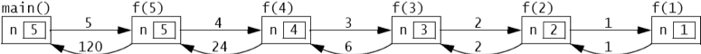
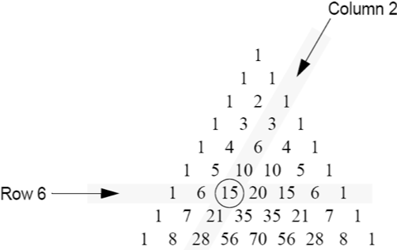
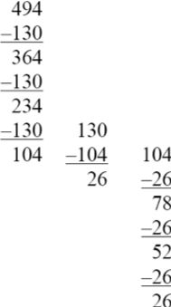

:stem: latexmath

= Recursion

재귀 함수는 스스로를 호출하는 함수입니다. 이 강력한 기법은 반복문(예: while 문이나 for 문)을 사용하지 않고도 반복을 만들어냅니다. 따라서 매우 적은 코드로도 상당한 결과를 만들어낼 수 있습니다. 재귀는 어려운 문제에 대해 우아하고 간단한 해결책을 제공합니다. 하지만 잘못 사용되면 비효율적인 코드를 만들어낼 수도 있습니다. 재귀 코드는 보통 재귀 알고리즘에서 만들어집니다.

== 간단한 재귀 함수들

=== 예제 9.1 팩토리얼 함수(Factorial Function)

[cols="3a,1a",frame=none,grid=none]
|===
|
팩토리얼 함수는 수학적으로 다음과 같이 정의됩니다.

[stem]
++++
n!=
\begin{cases}
1, & \mbox{if }n = 0 \\
n(n-1)!, & \mbox{if }n \gt 0
\end{cases}
++++

이것은 재귀적 정의인데, 팩토리얼이 방정식의 오른쪽에서 "재귀"되기 때문입니다. 함수는 자기 자신을 기준으로 정의됩니다.
팩토리얼 함수의 처음 10개 값은 표 9.1에 나와 있습니다. 첫 번째 값인 0!은 정의의 윗부분에 의해 정의됩니다: 0! = 1 (n = 0일 때). 나머지 모든 값은 정의의 아랫부분에 의해 정의됩니다.

For n = 1, 1! = n! = n(n - 1)! = 1(1 - 1)! = 1(0)! = 1(1) = 1.

For n = 2, 2! = n! = n(n - 1)! = 2(2 - 1)! = 2(1)! = 2(1) = 2.

For n = 3, 3! = n! = n(n - 1)! = 3(3 - 1)! = 3(2)! = 3(2) = 6.

For n = 4, 4! = n! = n(n - 1)! = 4(4 - 1)! = 4(3)! = 4(6) = 24.

For n = 5, 5! = n! = n(n - 1)! = 5(5 - 1)! = 5(4)! = 5(24) = 120.

이 함수가 얼마나 빠르게 증가하는지 주목하세요.
|
[cols="1a,3a"]
!===
^!n ^!n\!
>!0 >!1
>!1 >!1
>!2 >!2
>!3 >!6
>!4 >!24
>!5 >!120
>!6 >!720
>!7 >!5,040
>!8 >!40,310
>!9 >!362,880
!===
[.text-center]
**표 9.1 Factorials**
|===

=== 예제 9.2 팩토리얼 함수의 재귀적 구현

함수가 재귀적으로 정의될 때, 그 구현은 보통 재귀적 정의를 직접 사용한 것입니다. 팩토리얼 함수의 재귀적 정의의 두 부분은 두 개의 Java 문장으로 직접 변환됩니다:

[source,java]
----
1	public static int f(int n) {
2	if (n==0) {
3	return 1;	// basis
4	}
5	return n*f(n-1); // recursive part
6	}
----

다음은 팩토리얼 함수를 테스트하기 위한 코드입니다.

[source,java]
----
1	public static void main(String[] args) {
2	    for (int n=0; n<10; n++) {
3	        System.out.println("f("+n+") = "+f(n));
4	    }
5	}
----

출력은 표 9.1과 같습니다.

== 예제 9.3 팩토리얼 함수의 반복적 구현

팩토리얼 함수는 반복적으로 구현하기도 쉽습니다:

[source,java]
----
1	public static int f(int n) {
2	int f = 1;
3	for (int i = 2; i <= n; i++) {
4	f *= i;
5	}
6	return f;
7	}
----

함수 헤더는 예제 9.2에서 사용된 것과 동일합니다. 단지 본문만 다릅니다. 이는 두 구현 모두에 동일한 테스트 드라이버를 사용할 수 있게 합니다. 출력도 동일해야 합니다.

== 기초 부분과 재귀 부분

올바르게 작동하려면 모든 재귀 함수는 기초 부분과 재귀 부분을 가져야 합니다. 기초 부분은 재귀를 멈추는 역할을 합니다. 재귀 부분은 함수가 자기 자신을 호출하는 부분입니다.

=== 예제 9.4 팩토리얼 함수의 기초 부분과 재귀 부분

예제 9.2에서 팩토리얼 함수를 구현한 Java 메서드에서 기초 부분과 재귀 부분은 주석으로 표시되어 있습니다. 재귀 부분은 함수의 인자로 더 작은 값을 전달하여 메서드를 호출합니다. 따라서 5와 같은 양의 값으로 시작하면, 연속적인 호출에서 전달되는 값은 4, 3, 2, 1, 0이 됩니다. 0이 전달되면 기초 부분이 실행되어 재귀가 멈추고 반환 체인이 시작되어 차례로 1, 1, 2, 6, 24, 마지막으로 120을 반환합니다.

=== 예제 9.5 피보나치 수열(Fibonacci Numbers)

[cols="3a,1a", frame=none,grid=node]
|===
|
The Fibonacci numbers are 1, 1, 2, 3, 5, 8, 13, 21, 34, 55, …. Each number after the second is the sum of the two preceding numbers. This is a naturally recursive definition:

[stem]
++++
F_{n}=
\begin{cases}
0, & \mbox{if }n=0 \\
1, & \mbox{if }n=1 \\
F_{n-1} + F_{n-2}, & \mbox{if }n \gt 1
\end{cases}
++++

피보나치 수열의 처음 15개 값은 표 9.2에 나와 있습니다.

첫 두 값인 F0와 F1은 정의의 첫 두 부분에 의해 정의됩니다: F0 = 0 (n = 0일 때)와 F1 = 1 (n = 1일 때). 이 두 부분이 재귀의 기초를 형성합니다. 나머지 모든 값은 정의의 재귀 부분에 의해 정의됩니다:

For n = 2, F2 = Fn = Fn –1 + Fn –2 = F(2) –1 + F(2) –2 = F1 + F0 = 1 + 0 = 1.

For n = 3, F3 = Fn = Fn –1 + Fn –2 = F(3) –1 + F(3) –2 = F2 + F1 = 1 + 1 = 2.

For n = 4, F4 = Fn = Fn –1 + Fn –2 = F(4) –1 + F(4) –2 = F3 + F2 = 2 + 1 = 3.

For n = 5, F5 = Fn = Fn –1 + Fn –2 = F(5) –1 + F(5) –2 = F4 + F3 = 3 + 2 = 5.

For n = 6, F6 = Fn = Fn –1 + Fn –2 = F(6) –1 + F(6) –2 = F5 + F4 = 5 + 3 = 8.

For n = 7, F7 = Fn = Fn –1 + Fn –2 = F(7) –1 + F(7) –2 = F6 + F5 = 8 + 5 = 13.
|
[cols="1a,1a"]
!===
^!n ^!stem:[F_{n}]
>!0 >! 0
>!1 >! 1
>!2 >! 1
>!3 >! 2
>!4 >! 3
>!5 >! 5
>!6 >! 8
>!7 >! 13
>!8 >! 21
>!9 >! 34
>!10 >! 55
>!11 >! 89
>!12 >! 144
>!13 >! 233
>!14 >! 377
!===

[.text-center]
**표 9.2 피보나치 수열**
|===

=== 예제 9.6 피보나치 함수의 재귀적 구현

[source,java]
----
1	public static int fib(int n) {
2	if (n < 2) {
3	return n;	// basis
4	}
5	return fib(n-1) + fib(n-2); // recursive part
6	}
----

다음은 피보나치 수열을 테스트하기 위한 코드입니다.

[source,java]
----
1	public static void main(String[] args) {
2		for (int n = 0; n < 16; n++) {
3		    System.out.println("fib(" + n + ") = " + fib(n));
4		}
5	}
----

재귀적 호출을 추적하는 것은 보통 그것을 명확히 설명하는 데 도움이 됩니다.

=== 예제 9.7 재귀적 팩토리얼 함수의 추적

다음은 예제 9.2에서 정의된 재귀적 팩토리얼 함수에 대한 호출 f(5)의 추적입니다:

[.text-center]
**Figure 9.1 재귀적 팩토리얼 함수의 추적**

호출은 main() 함수에서 시작되어 5를 f() 함수에 전달합니다. 거기서 매개변수 n의 값은 5이므로 f(4)를 호출하여 4를 f() 함수에 전달합니다. 거기서 매개변수 n의 값은 4이므로 f(3)을 호출하여 3을 f() 함수에 전달합니다. 이 과정은 (재귀적으로) 계속됩니다. f(2) 내부에서 f(1) 호출이 이루어질 때까지 이어집니다. 거기서 매개변수 n의 값은 1이므로 더 이상의 호출 없이 즉시 1을 반환합니다. 그런 다음 호출 f(2)는 호출 f(3)에 2*1 = 2를 반환합니다. 호출 f(3)은 호출 f(4)에 3*2 = 6을 반환합니다. 호출 f(4)은 호출 f(5)에 4*6 = 24를 반환합니다. 마지막으로 호출 f(5)는 값 120을 main()에 반환합니다.

예제 9.7의 추적은 재귀적 팩토리얼 함수의 호출 f(n)이 n - 1개의 재귀적 호출을 생성한다는 것을 보여줍니다. 이는 예제 9.3에 나온 반복적인 구현과 비교하여 명백히 매우 비효율적입니다.

=== 예제 9.8 재귀적 피보나치 함수의 추적

피보나치 함수(예제 9.6)는 팩토리얼 함수(예제 9.2)보다 재귀적 호출이 더 많습니다. 이는 호출 fib(5)의 추적에서 볼 수 있습니다. 이 호출은 main() 함수에서 시작되어 5를 fib() 함수에 전달합니다. 거기서 매개변수 n의 값은 5이므로 각각 4와 3을 전달하여 fib(4)와 fib(3)을 호출합니다. 각 호출은 두 번의 재귀 호출을 더 만들어 f(1)과 f(0)을 기초 호출로 이어집니다. 이러한 기초 호출 각각은 1을 반환합니다. 재귀 호출은 그들에게 반환된 두 값의 합을 반환하고, 결국 값 8이 main()에 반환됩니다.

image::./images/figure9_2.png[재귀적 피보나치 함수의 추적, align=center]
[.text-center]
**Figure 9.2 재귀적 피보나치 함수의 추적**

== 재귀적 이진 검색

비재귀적 이진 검색 알고리즘은 페이지 31에 나와 있습니다. 이는 분할 정복 전략을 사용하며, 매번 시퀀스를 절반으로 나누고 한쪽 절반에서 검색을 계속합니다. 이는 자연스럽게 재귀적입니다.

=== 예제 9.9 재귀적 이진 검색

다음은 재귀적 이진 검색 알고리즘입니다:

(선행조건: stem:[s = \{ s_{0}, s_{1}, \cdots , s_{n-1}\}]은 x와 동일한 타입의 n개의 서수 값으로 구성된 정렬된 시퀀스입니다.)

(후행조건: stem:[s_{i} = x]인 i가 반환되거나 -1이 반환됩니다.)

1.	시퀀스가 비어 있다면 -1을 반환합니다.
2.	stem:[s_i]를 시퀀스의 중간 요소로 둡니다.
3.	stem:[s_{i} = x]이면 인덱스 i를 반환합니다.
4.	stem:[s_{i} < x]이면 stem:[s_i] 위의 하위 시퀀스에 대해 알고리즘을 적용합니다.
5.	stem:[s_i] 아래의 하위 시퀀스에 대해 알고리즘을 적용합니다. 이것은 예제 9.10에 구현되어 있습니다.

**재귀적 이진 검색의 실행 시간은 stem:[O(\lg n)]입니다**. 실행 시간은 재귀 호출 수에 비례합니다. 각 호출은 이전 것의 절반 크기의 하위 시퀀스를 처리합니다. 따라서 재귀 호출 수는 stem:[n]이 두 개로 나눌 수 있는 횟수와 같습니다. 즉 stem:[\lg n]입니다.

=== 예제 9.10 재귀 이진 탐색 시험

[source,java]
----
1	public class TestBinarySearch {
2	public static void main(String[] args) {
3	int[] a = {22, 33, 44, 55, 66, 77, 88, 99};
4	print(a);
5	System.out.println("search(a, 44): " + search(a, 44));
6	System.out.println("search(a, 50): " + search(a, 50));
7	System.out.println("search(a, 77): " + search(a, 77));
8	System.out.println("search(a, 100): " + search(a, 100));
9	}
10
11	public static void print(int[] a) {
12	System.out.printf("{%d", a[0]);
13	for (int i = 1; i < a.length; i++) {
14	System.out.printf(", %d", a[i]);
15	}
16	System.out.println("}");
17	}
18
19	public static int search(int[] a, int x) {
20	return search(a, 0, a.length-1, x);
21	}
22
23	public static int search(int[] a, int lo, int hi, int x) {
24	// PRECONDITION:	a[0] <= a[1] <= ... <= a[a.length-1];
25	// POSTCONDITIONS: returns i;
26	//	if i >= 0, then a[i] == x; otherwise i == -1;
27	if (lo > hi) {
28	return -1; // basis
29	}
30	int i = (lo + hi)/2;
31	if (a[i] == x) {
32	return i;
33	} else if (a[i] < x) {
34	return search(a, i+1, hi, x);
35	} else {
36	return search(a, lo, i-1, x);
37	}
38	}
39	}
----

출력은 다음과 같습니다.

[source,console]
----
{22, 33, 44, 55, 66, 77, 88, 99}
search(a, 44): 2
search(a, 50): -1
search(a, 77): 5
search(a, 100): -1
----

search() 메서드는 대상 x의 인덱스를 반환합니다: search(a, 44)는 a[2] = 44이므로 2를 반환하고, search(a, 77)는 a[5] = 77이므로 5를 반환합니다. 대상이 배열에 없는 경우 메서드는 -1을 반환합니다: search(a, 50)는 50이 배열에 없으므로 -1을 반환합니다.

== 이항 계수

이항 계수는 (x + 1)n 형식의 이항식 확장에서 결과로 나오는 계수입니다. 예를 들어,

[stem]
++++
{(x + 1)}^{6} = x^{6} + 6x^{5} + 15x^{4} + 20x^{3} + 15x^{2} + 6 x + 1
++++

여기서 생성된 일곱 개의 계수는 1, 6, 15, 20, 15, 6, 1입니다.

프랑스 수학자 블레즈 파스칼(1623-1662)은 이항 계수들 사이에 재귀적인 관계를 발견했습니다. 그는 이항 계수들을 삼각형으로 배열하여, 각 내부 숫자가 바로 위의 두 숫자의 합임을 발견했습니다. (도 9.3 참조) 예를 들어, 15 = 5 + 10입니다.

stem:[c(n,k)]가 n번째 행과 k번째 열의 계수를 나타내도록 합시다(0부터 카운팅). 예를 들어, c(6,2) = 15입니다. 그러면 파스칼의 재귀 관계는 다음과 같이 표현될 수 있습니다.

[stem]
++++
c(n, k) = c(n–1, k–1) + c(n–1, k), for 0 < k < n
++++

예를 들어, n = 6이고 k = 2일 때, c(6,2) = c(5,1) + c(5,2)입니다.

=== 예제 9.11 이항 계수 함수의 재귀적 구현

[source,java]
----
1	public static	int c(int n, int k) {
2	    if (k==0 ||	k==n) {
3	        return 1;	// basis
4	    }
5	    return c(n-1,k-1) + c(n-1,k); // recursion
6	}
----

재귀의 기초는 삼각형의 왼쪽과 오른쪽 측면을 다룹니다. 여기서 k = 0이고, k = n입니다.

[.text-center]
**Figure 9.3 파스칼의 삼각형**

이항 계수는 조합론에서 사용되는 조합 숫자와 동일하며, 명시적으로 아래 공식으로 계산됩니다.

[stem]
++++
c(n,k) = {{n!} \over {k!(n-k)!}} = \left({n \over 1} \right)\left({{n-1} \over 2} \right)\left({{n-2} \over 3}\right)\cdots \left({{n-k+1} \over k}\right)
++++

이 맥락에서 조합은 stem:[c(n,k) = {n \choose k}]로 표기되며 "n choose k"로 발음됩니다.

예를 들어, "8 choose 3"은 stem:[{8 \choose 3} = (8/1)(7/2)(6/3) = 56]입니다.

=== 예제 9.12 이항 계수 함수의 반복적 구현

이 버전은 위에서 주어진 명시적인 공식을 구현합니다. 오른쪽 표현식은 k개의 요소로 이루어져 있으므로, k번 반복하는 루프에 의해 계산됩니다:

[source,java]
----
1	public static int c(int n, int k) {
2	    if (n < 2 || k == 0 || k == n) {
3	        return 1;
4	    }
5	    int c = 1;
6	    for (int j = 1; j <= k; j++) {
7	        c = c*(n-j+1)/j;
8	    }
9	    return c;
10	}
----

== 유클리드 알고리즘

[cols="2a,1a", frame=none, grid=none]
|===
|
_유클리드 알고리즘_은 두 양의 정수의 최대공약수를 계산합니다. 유클리드의 원리집(기원전 약 300년) 제7권 제2 명제로 나타납니다. 아마도 가장 오래된 재귀 알고리즘일 것입니다. 유클리드가 처음 제시한 것처럼, 더 큰 수 m에서 작은 수 n을 반복해서 뺀 다음 결과 차이 d가 n보다 작아질 때까지 계속합니다. 그런 다음 n 대신 d를, m 대신 n을 넣고 같은 단계를 반복합니다. 두 숫자가 같아질 때까지 계속합니다. 그러면 해당 숫자가 원래 두 숫자의 최대공약수가 됩니다. 도 9.4는 이 알고리즘을 사용하여 494와 130의 최대공약수를 찾는 데 적용합니다. 그 결과 26이 최대공약수임을 보여줍니다. 이는 stem:[494 = 26 \cdot 19]이고 stem:[130 = 26 \cdot 5]이기 때문입니다.
|

[.text-center]
**Figure 9.4 유클리드 알고리즘**
|===

=== 예제 9.13 유클리드 알고리즘의 재귀적 구현

알고리즘의 각 단계는 단순히 더 큰 수에서 더 작은 수를 빼는 것입니다. 이는 gcd(m,n-m) 또는 gcd(m-n,n)을 호출하여 재귀적으로 수행됩니다.

[source,java]
----
1	public static int gcd(int m, int n) {
2	    if (m==n) {
3	        return n;	// basis
4	    } else if (m<n) {
5	        return gcd(m,n-m);	// recursion
6	    } else {
7	        return gcd(m-n,n);	// recursion
8	    }
9	}
----

예를 들어, 호출 gcd(494,130)은 재귀 호출 gcd(364,130)을 만듭니다. 이는 재귀 호출 gcd(234,130)을 만들고, 이는 재귀 호출 gcd(104,130)을 만듭니다. 이는 재귀 호출 gcd(104,26)을 만들고, 이는 재귀 호출 gcd(78,26)을 만듭니다. 이는 재귀 호출 gcd(52,26)을 만들고, 이는 재귀 호출 gcd(26,26)을 만듭니다. 이는 26을 반환합니다. 그런 다음 값 26이 이를 호출한 원래 호출 gcd(494,130)에 반환되어 호출자에게 반환됩니다.

== 정확성의 귀납적 증명

재귀적 함수는 보통 _수학적 귀납법_의 원리에 의해 올바름이 증명됩니다. 이 원리는 (i) 첫 번째 명제가 참임을 확인하고, (ii) 시퀀스의 모든 다른 명제의 참임이 그 앞선 명제들이 참임을 가정함으로써 유도될 수 있음을 검증함으로써 무한한 명제들의 참임을 증명할 수 있다는 것을 명시합니다. (i) 부분을 기초 단계(basis step)라고 하고, (ii) 부분을 _귀납 단계_(inductive step)라고 합니다. 앞선 명제들이 참임을 가정하는 것을 _귀납적 가설_(inductive hypothesis)이라고 합니다.

**재귀적 팩토리얼 함수는 정확합니다**. 이 사실을 증명하기 위해 먼저 기초를 확인합니다. 호출 f(0)은 첫 번째 부분 때문에 올바른 값 1을 반환합니다:

[source,java]
----
if (n < 2) {
    return 1;
}
----

그 다음에는 함수가 어떤 n > 0보다 작은 모든 정수에 대해 올바른 값을 반환한다고 가정합니다.

그런 다음 두 번째 부분을 고려합니다.

[source,java]
----
return n*f(n-1);
----

그것은 올바른 값을 반환할 것입니다. 왜냐하면 (귀납적 가설에 의해) 호출 f(n-1)은 (n - 1)!을 반환하고, n! = n•(n - 1)입니다.

여기서 "강한" 수학적 귀납법(또는 _두 번째 수학적 귀납법_이라고도 함)을 사용하고 있음을 유의하세요. 이 버전에서는 귀납적 가설을 사용하여 이전의 모든 명제가 참이라고 가정할 수 있습니다. "약한" (또는 "첫 번째") 귀납법에서는 하나의 직전 명제만이 참이라고 가정할 수 있습니다. 그러나 이 두 가지 원리는 동치이므로(즉, 그들은 증명의 유효한 방법입니다), 일반적으로 강한 귀납법을 적용하는 것이 더 나은 방법입니다.

**유클리드 알고리즘은 올바릅니다**. 이 사실을 증명하기 위해 (강한) 귀납법을 사용할 수 있습니다. (페이지 322 참조) 만약 m과 n이 같다면, 그 수가 최대공약수입니다. 따라서 함수는 그 경우 올바른 값을 반환합니다.

[source,java]
----
if (m == n) {
    return n;
}
----

만약 m과 n이 같지 않다면, 함수는 gcd(m,n-m) 또는 gcd(m-n,n)을 반환합니다. 이 또한 올바른 값임을 확인하기 위해서는, (m,n), (m,n-m), (m-n,n) 세 쌍의 모든 경우가 항상 동일한 최대공약수를 가짐을 깨닫기만 하면 됩니다. 이 사실은 수론의 정리입니다.

== 복잡성 분석

재귀 알고리즘의 복잡성 분석은 재귀식의 해결 가능성에 따라 달라집니다. 일반적인 기술은 stem:[T(n)]을 크기가 n인 문제를 처리하는 데 필요한 단계 수로 둡니다. 알고리즘의 재귀 부분은 stem:[T(n)]에 대한 재귀식으로 변환됩니다. 그것의 해결책은 알고리즘의 복잡성 함수입니다.

**재귀적 팩토리얼 함수는 stem:[O(n)] 시간에 실행됩니다**. 페이지 165의 예제 9.2에서 초기 호출 f(n)에서 함수로의 재귀 호출 수를 stem:[T(n)]이라고 합시다. 그런 다음 T(0) = T(1) = 0인데, 이는 n < 2이면 재귀 호출이 없기 때문입니다. 만약 n > 1이라면, 줄

[source,java]
----
return n*f(n-1);
----

실행되어, 재귀 호출 f(n-1)을 만듭니다. 따라서 재귀 호출의 총 횟수는 1이고 f(n-1)에서 수행되는 호출의 수입니다. 이것은 재귀식으로 변환됩니다.

[source,java]
----
T(n) = 1 + T(n – 1)
----
이 재귀식의 해결책은

[source,java]
----
T(n) = n – 1, for n > 0
----

이 결론은 두 단계로 얻어집니다. 우선 해결책을 _찾은_ 다음, 그것이 올바름을 _증명하기 위해_ 귀납법을 사용합니다. 재귀식의 해결책을 찾는 가장 간단한 기술은 값 테이블을 만들고 패턴을 찾는 것입니다. 이 재귀식은 각 T(n) 값이 이전 값보다 1 더 많다고 말합니다. 따라서 해결책 f(n) = n - 1은 상당히 명백합니다.

이제 모든 n > 0에 대해 stem:[T(n) = n - 1]임을 증명하려면, f(n) = n - 1을 둔 다음 (약한) 수학적 귀납법을 적용하면 됩니다. 기초 단계는 n = 1인 경우입니다. 이 경우, T(n) = T(1) = 0이고 f(n) = f(1) = (1) - 1 = 0입니다. 귀납 단계에서는, 어떤 n > 0에 대해 T(n) = f(n)이라고 가정한 다음, 그 가정으로부터 T(n +1) = f(n +1)임을 추론합니다:

[stem]
++++
T(n +1) = 1 + T(n) = 1 + f (n) = 1 + (n – 1) = n
f(n +1) = (n +1) – 1 = n
++++

그것으로 증명이 완료됩니다.

이 재귀적 구현의 복잡성 함수가 T(n) = n - 1임을 결정했으므로, 이 구현은 "O(n) 시간에 실행될 것"이라고 결론짓을 수 있습니다. 이는 실행 시간이 인수 n의 크기에 비례할 것이라는 것을 의미합니다. 만약 8!을 계산하는 데 3밀리초가 걸린다면, 16!을 계산하는 데는 약 6밀리초가 걸릴 것입니다.

== 동적 프로그래밍

대부분의 경우, 재귀는 자주 함수 호출 때문에 매우 비효율적입니다. 그래서 너무 복잡하지 않다면 반복적인 구현이 더 나을 수 있습니다. 다른 대안은 이전에 계산된 값을 재귀 함수 호출로 다시 계산하는 대신 배열에 저장하여 재귀식을 구현하는 것입니다. 이 방법을 _동적 프로그래밍_이라고 합니다.

=== 예제 9.14 피보나치 함수의 동적 프로그래밍 구현

[source,java]
----
1	public static int fib(int n) {
2	    if (n < 2) {
3	        return n;
4	    }
5	    int[] f = new int[n];
6	    f[0] = 0;
7	    f[1] = 1;
8	    for (int i=2; i<n; i++) {	// store the Fibonacci numbers
9	        f[i] = f[i-1] + f[i-2];
10	    }
11	    return f[n-1] + f[n-2];
12	}
----

이 구현은 처음 n개의 피보나치 수를 저장하기 위한 n개의 정수 동적 배열 f[]을 사용합니다.

== 하노이의 탑

우리는 재귀를 사용하여 더 자연스럽고 이해하기 쉬운 함수의 중요한 예를 보았습니다. 어떤 문제는 재귀가 유일한 합리적인 해결 방법일 수도 있습니다.

image::./images/figure9_5.png[하노이의 탑 퍼즐, align=center]
[.text-center]
**Figure 9.5 하노이의 탑 퍼즐**

하노이의 탑 퍼즐은 해결이 재귀를 요구하는 문제의 고전적인 예입니다. 이 게임은 세 개의 세로 기둥인 A, B, C로 라벨이 지정된 보드와 중앙에 구멍이있는 n개의 디스크 순서로 구성됩니다. (그림 9.5 참조) 디스크의 반지름은 등차수열입니다 (예: 5cm, 6cm, 7cm, 8cm, ...), 그리고 A 기둥에 장착되어 있습니다. 규칙은 동일한 기둥의 작은 디스크 위에 디스크를 놓을 수 없다는 것입니다. 게임의 목적은 룰을 어기지 않고 한 번에 한 개의 디스크씩 모든 디스크를 A 기둥에서 C 기둥으로 이동하는 것입니다.

하노이의 탑 게임의 일반적인 해결책은 자연스럽게 재귀적입니다:

• 부분 I: A 기둥에서 B 기둥으로 작은 n-1개의 디스크를 이동합니다.
• 부분 II: 남은 디스크를 A 기둥에서 C 기둥으로 이동합니다.
• 부분 III: B 기둥에서 C 기둥으로 작은 n-1개의 디스크를 이동합니다.

첫 번째와 세 번째 단계는 재귀적입니다: n-1개의 디스크에 대해 완전한 해결책을 적용합니다. 이 재귀적 해결책의 기초는 n = 0인 경우입니다. 이 경우, 아무것도 하지 않습니다.

n = 1 디스크에 대한 해결책은 다음과 같습니다:

1. 디스크를 막대 A에서 막대 C로 옮깁니다.

n = 2 디스크에 대한 해결책은 다음과 같습니다:
1. 첫 번째 디스크를 막대 A에서 막대 B로 옮깁니다.
2. 두 번째 디스크를 막대 A에서 막대 C로 옮깁니다.
3. 첫 번째 디스크를 막대 B에서 막대 C로 옮깁니다.

n = 3 디스크에 대한 해결책은 다음과 같습니다:
1. 첫 번째 디스크를 막대 A에서 막대 C로 옮깁니다.
2. 두 번째 디스크를 막대 A에서 막대 B로 옮깁니다.
3. 첫 번째 디스크를 막대 C에서 막대 B로 옮깁니다.
4. 남은 디스크를 막대 A에서 막대 C로 옮깁니다.
5. 첫 번째 디스크를 막대 B에서 막대 A로 옮깁니다.
6. 두 번째 디스크를 막대 B에서 막대 C로 옮깁니다.
7. 첫 번째 디스크를 막대 A에서 막대 C로 옮깁니다.

여기서, 단계 1-3은 일반 해결책의 1부를 구성하고, 단계 4는 2부를 구성하며, 단계 5-7은 3부를 구성합니다.

일반적인 재귀적 해결책은 다른 막대 이름의 치환을 필요로 하므로, 변수를 사용하는 것이 좋습니다. 그런 다음, 이 세 단계 알고리즘을 hanoi(n, x, y, z)로 명명하면 다음과 같습니다:

• 1부: 더 작은 n-1 디스크를 막대 x에서 막대 z로 옮깁니다.
• 2부: 남은 디스크를 막대 x에서 막대 y로 옮깁니다.
• 3부: 더 작은 n-1 디스크를 막대 z에서 막대 y로 옮깁니다. 일반적인 해결책은 예제 9.15에 구현되어 있습니다.

=== 예제 9.15 하노이의 탑

이 프로그램은 세 개의 디스크를 막대 A에서 막대 B를 거쳐 막대 C로 옮기는 하노이의 탑 문제의 해결책을 출력합니다:

[source,java]
----
1	public class TestHanoiTowers {
2	public static void main(String[] args) {
3	HanoiTowers(3, 'A', 'B', 'C');
4	}
5
6	public static void HanoiTowers(int n, char x, char y, char z) {
7	if (n==1) {	// basis
8	System.out.printf("Move top disk from peg %c to peg %c.%n", x, z);
9			} else {
10			HanoiTowers(n-1, x, z, y);	//	recursion
11			HanoiTowers(1, x, y, z);	//	recursion
12			HanoiTowers(n-1, y, x, z);	//	recursion
13			}
14		}
15	}
----

출력은 아래와 같습니다.

[source,console]
----
Move top disk from peg A to peg C.
Move top disk from peg A to peg B.
Move top disk from peg C to peg B.
Move top disk from peg A to peg C.
Move top disk from peg B to peg A.
Move top disk from peg B to peg C.
Move top disk from peg A to peg C.
----

세 개의 디스크 문제를 해결하기 위해, 3번 줄의 호출은 3을 n에, 'A'를 x에, 'B'를 y에, 그리고 'C'를 z에 전달합니다.

n > 1이므로 10번 줄이 다음에 실행되어, 2를 n에, 'A'를 x에, 'B'를 z에, 그리고 'C'를 y에 전달합니다. 다시 n > 1이므로 10번 줄이 다음에 실행되어, 1을 n에, 'A'를 x에, 'B'를 y에, 그리고 'C'를 z에 전달합니다. 이 호출에서 n = 1이므로 8번 줄이 실행되어 첫 번째 출력 줄을 인쇄합니다:

[source,console]
----
Move top disk from peg A to peg C.
[source,console]
----

그 호출은 이전 호출이 10번 줄에서 중단된 위치로 돌아가서 11번 줄로 진행합니다. 여기서 n = 2, x = 'A', y = 'C', z = 'B'입니다. 두 번째 출력 줄을 인쇄합니다:

[source,console]
----
Move top disk from peg A to peg B.
----

그런 다음 12번 줄이 실행되어 이번에는 1을 n에, 'C'를 x에, 'A'를 y에, 그리고 'B'를 z에 전달합니다. 이 호출에서 n = 1이므로 8번 줄이 실행되어 세 번째 출력 줄을 인쇄합니다:

[source,console]
----
Move top disk from peg C to peg B.
----

그 호출은 두 번째 재귀 호출이 12번 줄에서 중단된 위치로 돌아갑니다. 해당 메서드의 마지막 실행 가능한 문장이므로, 첫 번째 재귀 호출이 10번 줄에서 중단된 위치로 돌아갑니다. 그러므로 11번 줄로 진행되어 n = 3, x = 'A', y = 'B', z = 'C'입니다. 네 번째 출력 줄을 인쇄합니다:

[source,console]
----
Move top disk from peg A to peg C.
----

그런 다음 12번 줄이 실행되어 2를 n에, 'B'를 x에, 'A'를 y에, 그리고 'C'를 z에 전달합니다. 이 호출, HanoiTowers(2, 'B', 'A', 'C')는 두 개의 디스크 스택을 막대 B에서 막대 C로 막대 A를 거쳐 재귀적으로 옮기고 마지막 세 개의 출력 줄을 생성합니다:

[source,console]
----
Move top disk from peg B to peg A.
Move top disk from peg B to peg C.
Move top disk from peg A to peg C.
----

이전 네 번의 이동으로 이미 가장 큰 디스크를 막대 A에서 막대 C로 옮겼으므로, 이것으로 작업이 완료됩니다.

== 상호 재귀

함수가 자기 자신을 호출할 때, 이를 _직접 재귀_라고 합니다. 또 다른 형태의 재귀는 함수가 다른 함수들을 호출하고, 그 함수들이 다시 원래 함수를 호출하는 경우입니다. 이를 _간접 재귀_라고 합니다. 가장 일반적인 형태는 두 함수가 서로를 호출하는 경우입니다. 이를 _상호 재귀_라고 합니다. (그림 9.6 참조)

image::./images/figure9_6.png[재귀의 종류]
그림 9.6 재귀의 종류

=== 예제 9.16 상호 재귀로 계산된 사인과 코사인 함수

삼각법에서 사인과 코사인 함수는 여러 가지 다른 방식으로 정의될 수 있으며, 그 값을 계산하는 여러 알고리즘이 있습니다. 가장 간단한 방법(가장 효율적인 방법은 아니지만)은 상호 재귀를 사용하는 것입니다. 이것은 다음과 같은 항등식에 기반합니다:

[stem]
++++
sin2\theta = 2sin\theta cos\theta
cos2\theta = 1 - 2{(sin\theta )}^{2}
++++

그리고, 다음은 두개의 테일러 다항식:

[stem]
++++
sin x \approx x - x^{3}/6
cos x \approx 1 – x^{2}/2
++++

x의 작은 값에 대해 근사값이 되는 것들입니다.

[source,java]
----
1	public class TestMutualRecursion {
2	    public static void main(String[] args) {
3	        String fmt1 = "%18s%18s%18s%n";
4	        String fmt2 = "%18.13f%18.13f%18.13f%n";
5	        System.out.printf(fmt1, "s(x)	", "Math.sin(x) ", "error	");
6	        for (double x = 0.0; x < 1.0; x += 0.1) {
7	            System.out.printf(fmt2, s(x), Math.sin(x), Math.sin(x) - s(x));
8	        }
9	        System.out.printf(fmt1, "c(x)	", "Math.cos(x) ", "error	");
10	        for (double x = 0.0; x < 1.0; x += 0.1) {
11	            System.out.printf(fmt2, c(x), Math.cos(x), c(x) - Math.cos(x));
12	        }
13	    }
14
15	    public static double s(double x) {
16	        if (-0.005 < x && x < 0.005) {
17	            return x - x*x*x/6;	// basis
18	        }
19	        return 2*s(x/2)*c(x/2); // recursion
20	    }
21
22	    public static double c(double x) {
23	        if (-0.005 < x && x < 0.005) {
24	            return 1.0 - x*x/2;	// basis
25	        }
26	        return 1 - 2*s(x/2)*s(x/2); // recursion
27	    }
28	}
----

출력은 다음과 같습니다.

[source,console]
----
s(x)	Math.sin(x)	error
0.0000000000000	0.0000000000000	0.0000000000000
0.0998334166464	0.0998334166468	0.0000000000005
0.1986693307941	0.1986693307951	0.0000000000009
0.2955202066544	0.2955202066613	0.0000000000069
0.3894183423069	0.3894183423087	0.0000000000018
0.4794255385991	0.4794255386042	0.0000000000051
0.5646424733831	0.5646424733950	0.0000000000120
0.6442176872362	0.6442176872377	0.0000000000015
0.7173560908969	0.7173560908995	0.0000000000027
0.7833269096232	0.7833269096275	0.0000000000043
0.8414709848016	0.8414709848079	0.0000000000063
c(x)	Math.cos(x)	error
1.0000000000000	1.0000000000000	0.0000000000000
0.9950041652781	0.9950041652780	0.0000000000000
0.9800665778414	0.9800665778412	0.0000000000002
0.9553364891277	0.9553364891256	0.0000000000021
0.9210609940036	0.9210609940029	0.0000000000007
0.8775825618932	0.8775825618904	0.0000000000028
0.8253356149179	0.8253356149097	0.0000000000082
0.7648421872857	0.7648421872845	0.0000000000013
0.6967067093499	0.6967067093472	0.0000000000027
0.6216099682760	0.6216099682707	0.0000000000054
0.5403023058779	0.5403023058681	0.0000000000098
----

이 방법이 작동하는 이유는 각 재귀 호출마다 x가 2로 나누어지고, 결국 기준 조건(-0.005 < x && x < 0.005)에 도달하여 재귀가 중단되기 때문입니다.

== 문제 복습

1. 재귀 함수는 두 부분으로 구성되어야 합니다: 기초 부분과 재귀 부분입니다. 각각이 무엇이며 재귀에 필수적인 이유를 설명하세요.
2. 재귀 팩토리얼 함수(165페이지의 예제 9.2)에 대한 f(10) 호출은 몇 번의 재귀 호출을 생성합니까?
3. 재귀 피보나치 함수(167페이지의 예제 9.6)에 대한 fib(6) 호출은 몇 번의 재귀 호출을 생성합니까?
4. 반복적인 해결책 대신 재귀적인 해결책을 구현하는 장점과 단점은 무엇인가요?
5. 직접적 재귀와 간접적 재귀의 차이점은 무엇인가요?

== 문제

1. 처음 n개의 양의 정수의 제곱의 합을 반환하는 재귀 함수를 작성하고 테스트하세요.
2. 기저 b의 처음 n개의 거듭제곱의 합을 반환하는 재귀 함수를 작성하고 테스트하세요.
3. 배열의 처음 n개 요소의 합을 반환하는 재귀 함수를 작성하고 테스트하세요.
4. 배열의 처음 n개 요소 중 최대값을 반환하는 재귀 함수를 작성하고 테스트하세요.
5. 최대 n개 요소 중 최대값을 반환하는 재귀 함수를 작성하고 테스트하세요. 재귀 호출은 최대 lg n번 사용하세요.
6. x의 n제곱을 반환하는 재귀 함수를 작성하고 테스트하세요.
7. x의 n제곱을 반환하는 재귀 함수를 작성하고 테스트하세요. 재귀 호출은 최대 2lg n번 사용하세요.
8. 정수 n의 이진 로그를 반환하는 재귀 함수를 작성하고 테스트하세요 (즉, n을 2로 몇 번 나눌 수 있는지).
9. 주어진 문자열이 회문인지 여부를 결정하는 재귀 부울 함수를 작성하고 테스트하세요. (회문은 그 문자열을 뒤집어도 같은 문자열인 것입니다.)
10. 양의 정수의 이진 표현을 포함하는 문자열을 반환하는 재귀 함수를 작성하고 테스트하세요.
11. 양의 정수의 16진수 표현을 포함하는 문자열을 반환하는 재귀 함수를 작성하고 테스트하세요.
12. 문자열의 처음 n개 문자의 모든 순열을 출력하는 재귀 함수를 작성하고 테스트하세요. 예를 들어, print("ABC",3) 호출은 다음과 같이 출력할 것입니다.
ABC ACB BAC BCA CBA CAB
13. 배열을 사용하지 않고 반복적으로 피보나치 함수를 구현하세요.
14. 재귀적인 Ackermann 함수를 구현하세요:
A(0, n) = n + 1
A(m, 0) = A(m – 1, 1), m > 0일 때
A(m, n) = A(m – 1, A(m, n – 1)), m > 0이고 n > 0일 때
15. Pascal의 반복식(170쪽)을 증명하세요.
16. Euclidean 알고리즘의 재귀적인 구현(171쪽의 예제 9.13)에서 gcd(385, 231) 호출에 대한 재귀 호출 트리를 추적하세요.
17. Euclidean 알고리즘(171쪽)을 반복적으로 구현하세요.
18. 반복적인 뺄셈 대신 정수 나머지 연산자 %를 사용하여 재귀적인 유클리드 알고리즘을 구현하세요.
19. 반복적인 뺄셈 대신 정수 나머지 연산자 %를 사용하여 Euclidean 알고리즘을 반복적으로 구현하세요.
20. 피보나치 함수의 재귀적인 구현(167쪽의 예제 9.6)이 올바른지 수학적 귀납법을 사용하여 증명하세요.
21. 9.4 문제의 재귀 함수가 올바른지 수학적 귀납법을 사용하여 증명하세요.
22. 9.5 문제의 재귀 함수가 올바른지 수학적 귀납법을 사용하여 증명하세요.
23. 9.8 문제의 재귀 함수가 올바른지 수학적 귀납법을 사용하여 증명하세요.
24. 9.12 문제의 재귀 함수가 올바른지 수학적 귀납법을 사용하여 증명하세요.
25. 함수의 계산 가능한 도메인은 함수가 올바른 결과를 생성할 수 있는 입력의 집합입니다. 페이지 165의 예제 9.2에서 구현된 팩토리얼 함수의 계산 가능한 도메인을 경험적으로 결정하세요.
26. 페이지 177의 문제 9.2에서 b = 2를 사용하여 구현된 sum(b,n) 함수의 계산 가능한 도메인을 경험적으로 결정하세요.
27. 페이지 166의 예제 9.3에서 구현된 피보나치 함수의 계산 가능한 도메인을 경험적으로 결정하세요.
28. 페이지 170의 예제 9.11에서 구현된 재귀 이항 계수 함수의 계산 가능한 도메인을 경험적으로 결정하세요.
29. 하노이 탑 프로그램은 3개의 디스크에 대해 7개의 디스크 이동을 수행합니다. 다음에 대해 몇 개의 디스크 이동이 수행됩니까?
a. 5개 디스크?
b. 6개 디스크?
c. n개 디스크?
30. 이전 문제에서 유도한 공식을 증명하세요.
31. 9.14 문제의 Ackermann 함수의 계산 가능한 도메인을 경험적으로 결정하세요.
32. 페이지 174의 예제 9.15에서 hanoi(4,'A','B','C') 호출에 대한 재귀 호출 트리를 보여주세요.
33. 페이지 175의 예제 9.16에서 결과가 보다 정확해지도록 프로그램을 수정하여 재귀가 | x | < 0.00005가 될 때까지 범위를 좁히세요.
34. 페이지 175의 예제 9.16의 프로그램을 수정하여 결과가 더 정확한 테일러 근사값을 사용하여 적은 반복으로 얻어지도록 수정하세요.
+
[stem]
++++
\sin x \approx x - x^{3}/6 + x^{5}/120\\
\cos x \approx 1 - x^{2}/2 + x^{4}/24
++++
35. 이 공식들을 사용하여 쌍곡사인과 쌍곡코사인 함수를 재귀적으로 구현하세요:
+
[stem]
++++
sinh2x = 2sinhx cosh x \\
cosh2x = 1 + 2(sinhx)^{2}\\
sin x \approx x + x^{3}/6\\
cos x \approx 1 + x^{2}/2
++++
결과를 Math.sinh() 및 Math.cosh() 메서드의 해당 값과 비교하세요.
36. 이 삼각함수 공식들을 사용하여 탄젠트 함수를 재귀적으로 구현하세요:
+
[stem]
++++
tan2 \theta = 2tan \theta /(1 - tan^{2}\theta )
tan x \approx x + x^{3}/3
++++

결과를 Math.tan() 메서드의 해당 값과 비교하세요.
37. 다항식 stem:[a_{0} + a_{1} x + a_{2} x^{2} + • • • + a_{3} x^{3}]을 재귀함수로 구현합니다. 단,
여기서 n+1개의 계수 stem:[a_{i}]는 차수 stem:[n]과 함께 함수에 배열 형태로 전달됩니다.
