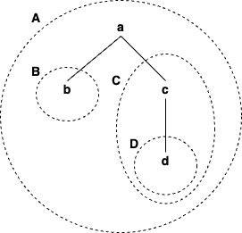
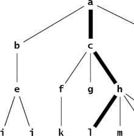
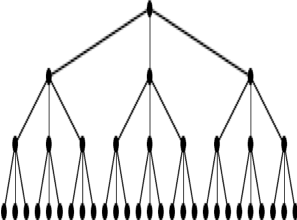
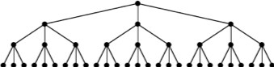
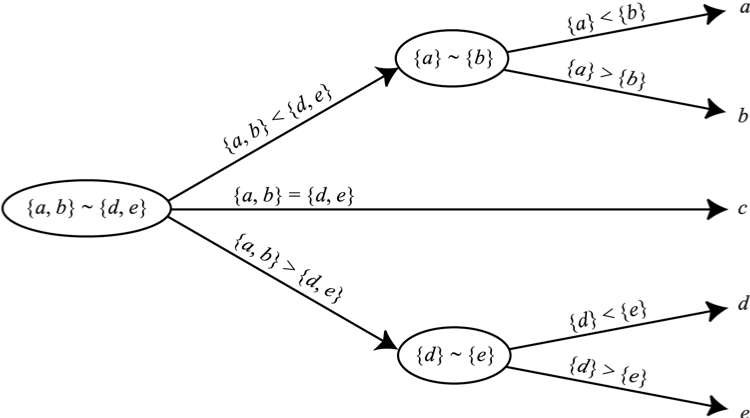
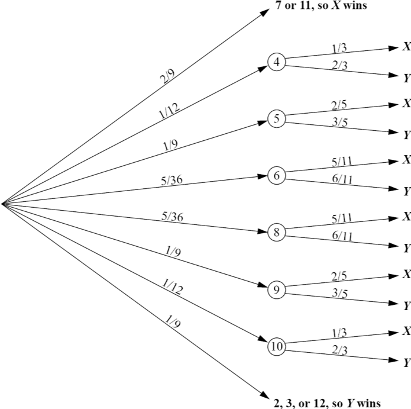
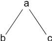
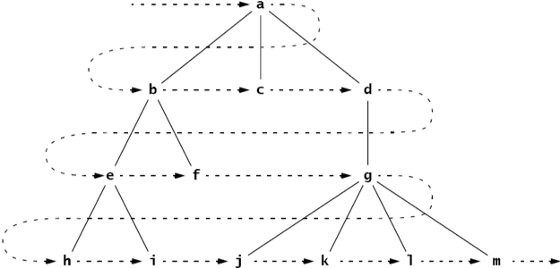
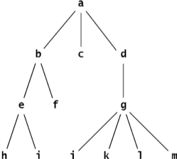

:stem: latexmath

= 트리

트리는 계층적 구조를 모델링하는 비선형 데이터 구조입니다. 각 요소는 여러 후속 요소(자식이라고 함)를 가질 수 있으며, 하나를 제외한 모든 요소(루트라고 함)는 고유한 선행자(부모라고 함)를 가집니다. 트리는 컴퓨터 과학에서 흔히 볼 수 있습니다: 컴퓨터 파일 시스템은 트리입니다, Java 클래스의 상속 구조는 트리입니다, Java 프로그램 실행 중에 메서드 호출의 실행 시스템은 트리입니다, Java 유형의 분류는 트리입니다, 그리고 Java 프로그래밍 언어 자체의 신택스 정의는 트리를 형성합니다.

== 트리 정의

여기서 (비순서) 트리의 재귀적 정의가 있습니다:

====
**트리는 (r, S)라는 쌍으로, r은 노드이고 S는 상호 배타적인 트리의 집합입니다. 이 중 어느 것도 r을 포함하지 않습니다.**
====

노드 r을 트리 T의 루트라고 하고, 집합 S의 요소는 그 하위 트리라고 합니다. 물론 집합 S는 비어 있을 수 있습니다. 하위 트리가 루트를 포함하지 않는 제약은 재귀적으로 적용됩니다: r은 어떤 하위 트리나 어떤 하위 트리의 하위 트리에도 들어 있을 수 없습니다.
이 정의는 트리의 두 번째 구성 요소가 하위 트리의 집합이어야 함을 명시합니다. 따라서 하위 트리의 순서는 중요하지 않습니다. 또한 집합은 비어 있을 수 있으므로 (r, )가 트리로 취급됩니다. 이를 단일 트리(singleton tree)라고 합니다. 그러나 빈 집합 자체는 비순서 트리로 간주되지 않습니다.

== 예제 10.1 동일한 비순서 트리

그림 10.1에 표시된 두 트리는 동일합니다. 왼쪽의 트리는 루트 a와 두 개의 하위 트리 B 및 C를 가지며, stem:[B= (b, 0)], stem:[C = (c, {D})], 그리고 D는 하위 트리 stem:[D = (d, 0)]입니다. 오른쪽의 트리는 동일한 루트 a와 동일한 하위 트리 stem:[{B, C} = {C, B}]를 가지므로 stem:[(a, {B, C}) = (a, {C, B})]입니다.

Figure 10.1 Equal trees

트리의 요소를 그 _노드_라고합니다. 기술적으로 각 노드는 자신이 루트인 트리의 요소입니다. 그러나 간접적으로 트리는 중첩된 하위 트리로 구성되며, 각 노드는 중첩된 트리의 모든 트리의 요소로 간주됩니다. 따라서 a, b, c 및 d는 그림 10.2에 나와 있는 트리 A의 모든 노드로 간주됩니다. 마찬가지로 c와 d는 트리 C의 노드입니다.

트리의 크기는 그에 포함된 노드의 수입니다. 따라서 그림 10.2에 나와 있는 트리 A의 크기는 4이고, C의 크기는 2입니다. 크기가 1인 트리를 _싱글톤_이라고합니다. 여기에 나와 있는 트리 B와 D는 싱글톤입니다.
stem:[T = (x, S) ]라는 트리가있는 경우, x는 T의 루트이고 S는 하위 트리의 집합입니다. stem:[S = {T_{1}, T_{2}, \cdots, T_{n}}]각 하위 트리 stem:[T_j]는 자체 루트 stem:[r_j]를 가진 트리입니다. 이 경우, 노드 r를 각 노드의 _부모_로 호출하고 stem:[r_j]를 r의 _자식_이라고합니다. 일반적으로 두 노드가 서로 인접하다고 말합니다.
자식이 없는 노드를 _잎_이라고합니다. 적어도 하나의 자식이있는 노드를 _내부 노드_라고합니다.

Figure 10.2 Subtrees

트리에서의 경로는 각 쌍의 노드가 서로 인접한 노드인 일련의 노드 stem:[(x_{0}, x_{1}, x_{2}, \cdots, x_{m})]입니다. 예를 들어, (a, b, c, d)는 위에 표시된 트리에서의 경로입니다. 그러나 (a, d, b, c)는 아닙니다. 경로의 _길이_는 인접한 쌍의 수인 m입니다.
정의에서 알 수 있듯이 트리는 _비순환적_입니다. 즉, 어떤 경로도 동일한 노드를 두 번 이상 포함 할 수 없습니다.
트리에서 노드 stem:[x_{0}]의 _루트 경로_는 xm이 트리의 루트인 경로 stem:[(x_{0}, x_{1}, x_{2}, \cdots, x_{m})]입니다. 잎 노드의 루트 경로는 잎에서 루트로의 경로라고합니다.

== 정리 10.1 트리의 모든 노드에는 고유한 루트 경로가 있습니다.

증명은 194쪽의 문제 10.1을 참조하십시오.

트리에서 노드의 깊이는 그 루트 경로의 길이입니다. 물론 모든 트리에서 루트의 깊이는 0입니다. 우리는 또한 트리의 하위 트리의 깊이를 참조합니다. 트리의 한 레벨은 특정 깊이의 모든 노드로 구성됩니다.
트리의 높이는 모든 노드 중에서 가장 큰 깊이입니다. 정의에 따라 싱글톤의 높이는 0이며, 빈 트리의 높이는 -1입니다. 예를 들어, 그림 10.2에 나와 있는 트리 A의 높이는 2입니다. 그 하위 트리 C의 높이는 1이고, 그 두 개의 하위 트리 B와 D의 각각의 높이는 0입니다.
노드 y가 다른 노드 x의 조상이라고하는 경우 x의 루트 경로에 있는 노드입니다. 트리의 루트는 트리의 다른 모든 노드의 조상입니다.
노드 x가 다른 노드 y의 자손이라고합니다. y가 x의 조상이라면 모든 노드 y에 대해 y와 그 모든 자손으로 구성된 집합이 y를 루트로 하는 하위 트리를 형성합니다. S가 T의 하위 트리인 경우 T를 S의 상위 트리라고합니다.
트리의 경로 길이는 루트에서부터의 모든 경로의 길이의 합입니다. 이것은 가중치가 부여된 합계로, 각 레벨에 노드 수를 곱한 값입니다. 여기에 표시된 트리의 경로 길이는 1-3 + 2-4 + 3-8 = 35입니다.

=== 예제 10.2 트리의 속성

그림 10.3에 나와 있는 트리의 루트는 노드 a입니다. 여섯 개의 노드 a, b, c, e, f 및 h는 모두 내부 노드입니다. 나머지 아홉 개의 노드는 잎입니다. (l, h, c, a)는 잎에서 루트로의 경로입니다. 그 길이는 3입니다. 노드 b의 깊이는 1이고, 노드 m의 깊이는 3입니다. 레벨 2는 노드 e, f, g 및 h로 구성됩니다. 트리의 높이는 3입니다. 노드 a, c 및 h는 모두 노드 l의 조상입니다. 노드 k는 노드 c의 후손이지만 노드 b의 후손은 아닙니다. b를 루트로 하는 하위 트리는 노드 b, e, i 및 j로 구성됩니다.

Figure 10.3 A leaf-to-root path

노드의 차수는 해당하는 자식의 수입니다. 예제 10.2에서 b의 차수는 1이고, d의 차수는 0이며, h의 차수는 5입니다.
트리의 차수는 그 노드 중에서의 최대 차수입니다.
트리가 모든 내부 노드가 동일한 차수를 가지고 모든 잎이 동일한 레벨에 있는 경우, 해당 트리는 가득 찬 것으로 간주됩니다. 그림 10.4에 표시된 트리는 차수가 3인 가득 찬 트리입니다. 이 트리는 총 40개의 노드가 있음에 유의하십시오.

Figure 10.4 A full tree

**정리 10.2** 차수가 d이고 높이가 h인 가득 찬 트리는 stem:[{d^{h+1} - 1} \over {d-1}] 개의 노드를 가지고 있습니다.

증명은 194쪽의 문제 10.1을 참조하십시오.

**따름정리 10.1** 차수가 d이고 크기가 n인 가득 찬 트리의 높이는 stem:[h = \log_{d} (nd - n + 1) - 1] 입니다.

**따름정리 10.2** 높이가 h인 트리의 노드 수는 해당 트리의 최대 차수인 d에 대해 stem:[ {d^{h + 1} – 1} \over {d-1}] 이하입니다.

== 결정 트리

_결정 트리_는 문제를 해결하기 위한 일련의 결정 과정을 요약하는 트리 다이어그램입니다. 각 내부 노드는 질문으로 레이블이 지정되며, 각 활주로는 해당 질문에 대한 답변이 표시되며, 각 잎 노드는 문제에 대한 해결책이 표시됩니다.

=== 예제 10.3 가짜 동전 찾기

외관상 동일한 다섯 개의 동전 중에서 어느 것이 가짜인지를 결정하기 위해 테스트를 수행해야합니다. 가짜 동전을 구별하는 유일한 특징은 정품 동전보다 가벼운 것입니다. 유일하게 사용 가능한 테스트는 동전의 하위 집합을 다른 집합과 비교하는 것입니다. 가짜를 찾기 위해 어떻게 하위 집합을 선택해야합니까?

결정 트리에서 그림 10.5에 표시된 심볼 ~은 두 피연산자의 무게를 비교하는 것을 의미합니다. 따라서 예를 들어, stem:[{a, b} ~ {d, e}]는 동전 stem:[a] 및 stem:[b]를 동전 stem:[d] 및 stem:[e]와 비교하는 것을 의미합니다.

== 전이 다이어그램

_전이 다이어그램_은 다단계 프로세스 중에 발생할 수 있는 서로 다른 상태나 상황을 나타내는 트리나 그래프(15장 참조)입니다. 결정 트리와 마찬가지로 각 잎은 프로세스의 다른 결과를 나타냅니다. 각 가지는 부모 이벤트가 발생했을 때 결과적으로 발생하는 자식 이벤트가 발생할 조건부 확률로 표시됩니다.

=== 예제 10.4 크랩스 게임

크랩스 게임은 두 명의 플레이어 X와 Y가 참여하는 주사위 게임입니다. 먼저 X가 주사위 쌍을 던집니다. 주사위의 합이 7 또는 11이면 X가 게임에 이깁니다. 합이 2, 3 또는 12이면 Y가 이깁니다. 그렇지 않으면 합은 "포인트"로 지정되어 다른 던지기에서 매칭됩니다. 따라서 첫 번째 던지기에서 어느 쪽도 승리하지 못한 경우 포인트가 나오거나 7이 나올 때까지 주사위를 반복적으로 던집니다. 7이 먼저 나오면 Y가 이깁니다. 그렇지 않으면 포인트가 나오면 X가 이깁니다.
그림 10.6에 표시된 전이 다이어그램은 크랩스 게임을 모델링합니다.

Figure 10.6 A decision tree for the game of craps

주사위 한 쌍을 던질 때, 가능한 결과는 36가지가 있습니다(첫 번째 주사위에는 6가지 결과가 있고, 두 번째 주사위에는 첫 번째 주사위의 각 결과에 대해 6가지 결과가 있습니다). 이 36가지 결과 중 1가지는 합이 2가 되고(1 + 1), 2가지는 합이 3이 되며(1 + 2 또는 2 + 1), 1가지는 합이 12가 됩니다(6 + 6). 그러므로 "2, 3 또는 12" 이벤트가 발생할 확률은 36가지 중 4가지입니다. 이는 4/36 = 1/9의 확률을 의미합니다. 비슷하게, 합이 7이 되는 방법은 6가지이고, 합이 11이 되는 방법은 2가지입니다. 따라서 "7 또는 11" 이벤트의 확률은 36가지 중 8가지이며, 이는 8/36 = 2/9의 확률입니다. 나무의 첫 번째 단계의 다른 확률은 비슷한 방식으로 계산됩니다.

나무의 두 번째 단계의 확률이 어떻게 계산되는지 알아보려면, 포인트가 4인 경우를 고려해보세요. 다음 던지기가 4라면, X가 이깁니다. 7이 나온다면, Y가 이깁니다. 그렇지 않으면, 그 단계는 반복됩니다. Figure 10.7에 나와 있는 전이 다이어그램은 이 세 가지 가능성을 요약합니다. Figure 10.7의 전이 다이어그램에 나와 있는 것처럼, 1/12, 1/6 및 3/4의 확률이 계산됩니다.

[stem]
++++
\begin{align*}
&P(4) = 3/36 = 1/12\\
&P(7) = 6/36 = 1/3\\
&P(2,3,5,6,8,9,10,11, or 12) = 27/36 = 3/4\
\end{align*}
++++

image::./images/figure10_7.png[The game of craps,align=center]
Figure 10.7 The game of craps

따라서 첫 번째 토스에서 점 4가 성립하면 X는 두 번째 토스에서 이길 확률은 1/12이고, 세 번째 토스에서 이길 확률은 3/4이다. 따라서 첫 번째 토스에서 점 4가 성립하면 X는 세 번째 토스에서 이길 확률은 (3/4)(1/12)이고, 네 번째 토스에서 이길 확률은 (3/4)이다. 마찬가지로, 첫 번째 토스에서 점 4가 성립하면 X는 네 번째 토스에서 이길 확률은 (3/4)(1/12) + (3/4)(3/4)(1/12) 등이다. 이 부분 확률들을 합하면, 우리는 첫 번째 토스에서 점 4가 성립하면 그 후 X가 임의의 토스에서 이길 확률은
[stem]
++++
\begin{align*}
P_4 &= {1 \over 2} + ({3 \over 4}){1 \over 12}
+ {{({3 \over 4})}^2}{1 \over 12}
+ {{({3 \over 4})}^3}{1 \over 12}
+ {{({3 \over 4})}^4}{1 \over 12}
+ {{({3 \over 4})}^5}{1 \over 12}
+ \cdots\\
&= {{1 \over 12} \over {1 - {3 \over 4}}}\\
&= {{1 \over 12} \over {1 \over 4}}\\
&= {1 \over 3}
\end{align*}
++++

이 계산은 등비급수의 공식을 적용한 것입니다. (323페이지를 참조하세요.)
만약 첫 번째 던짐에서 포인트 4가 설정된 후에 X가 이길 확률이 1/3이라면, 그 시점에서 Y가 이길 확률은 2/3이어야 합니다. 나머지 두 번째 단계의 확률도 유사하게 계산됩니다.
이제 주요 전이 다이어그램에서 X가 게임을 이길 확률을 계산할 수 있습니다:

그러므로 X가 이길 확률은 49.29%이고, Y가 이길 확률은 50.71%입니다.

[stem]
++++
\begin{align*}
P &= {2 \over 9} + {1 \over 12}{(P_{4})}
+ {1 \over 9}{(P_{5})}
+ {5 \over 36}{(P_{6})}
+ {5 \over 36}{(P_{8})}
+ {1 \over 9}{(P_{9})}
+ {1 \over 12}{(P_{10})}\\
&= {2 \over 9} + {1 \over 12}{({1 \over 3})}
+ {1 \over 9}{({2 \over 5})}
+ {5 \over 36}{({5 \over 11})}
+ {5 \over 36}{({5 \over 11})}
+ {1 \over 9}{({2 \over 5})}
+ {1 \over 12}{({1 \over 3})}\\
&= {244 \over 495}
\end{align*}
++++

확률 과정은 전이 다이어그램에 의해 분석될 수 있는 과정으로, 즉 조건부 확률을 계산할 수 있는 이벤트의 일련의 순서로 분해될 수 있는 과정입니다. 크랩스 게임은 사실 무한한 확률 과정입니다. 왜냐하면 발생할 수 있는 이벤트의 수에 제한이 없기 때문입니다. 예제 10.4에서의 분석과 마찬가지로, 대부분의 무한한 확률 과정은 (유한한) 컴퓨터에 적합한 동등한 유한한 확률 과정으로 재정립될 수 있습니다.
다른 트리 모델과 달리, 의사결정 트리와 전이 트리는 보통 왼쪽에서 오른쪽으로 그려지며, 다음 노드로의 시간에 따른 이동을 시사합니다.

== 정렬된 트리

여기 정렬된 트리의 재귀적 정의가 있습니다:
====
**정렬된 트리는 빈 집합이거나 T = (r, S)와 같은 쌍이며, 여기서 r은 노드이고 S는 서로소인 정렬된 트리의 일련의 순서입니다. 그 중 어느 하나도 r을 포함하지 않습니다.**
====

노드 r을 트리 T의 루트라고 하고, 순서 S의 요소는 그 하위 트리입니다. 당연히 순서 S는 비어 있을 수 있으며, 이 경우 T는 싱글톤입니다. 하위 트리 중 어떤 것도 루트를 포함하지 않는다는 제한은 재귀적으로 적용됩니다: x는 어떤 하위 트리에도 없거나, 어떤 하위 트리의 하위 트리에도 없으며, 이와 같은 식입니다.
이 정의는 하위 트리가 집합 대신에 순서로 되어 있다는 사실을 제외하고는 정렬되지 않은 트리에 대한 정의와 같습니다. 따라서 두 정렬되지 않은 트리가 동일한 부분집합을 가진 경우, 그들은 동일하게 됩니다. 그러나 정렬된 트리로서는, 동일한 하위 트리가 동일한 순서로 있지 않는 한 같지 않을 것입니다. 또한 정렬된 집합의 하위 트리는 비어 있을 수 있습니다.

=== 예제 10.5 서로 다른 정렬된 트리

Figure 10.8에 나와 있는 두 트리는 정렬된 트리로서 같지 않습니다.

image::./images/figure10_8.png[Unequal ordered trees]
Figure 10.8 Unequal ordered trees

왼쪽에 있는 정렬된 트리는 루트 노드가 'a'이고 하위 트리 순서가 [( (b, 0), (c, (d, 0) ) )]입니다. 오른쪽에 있는 정렬된 트리는 루트 노드가 'a'이고 하위 트리 순서가 [( (c, (d, 0) ), (b, 0) )]입니다. 이 두 하위 트리 순서는 같은 요소를 가지고 있지만, 같은 순서로 정렬되어 있지 않습니다. 따라서 이 두 정렬된 트리는 같지 않습니다.
정의에 엄격히 따르면 종종 놓치는 세심함이 나타날 수 있습니다. 이는 다음 예제로 설명되어 있습니다.

=== 예제 10.6 서로 다른 정렬된 트리

트리 stem:[T1 = (a, (B, C))]와 stem:[T2 = (a, (B, \phi, C))]는 같은 정렬된 트리가 아닙니다. Figure 10.9에 나와 있는 것처럼, 두 트리는 아마도 같은 모습으로 그려질 것입니다.

Figure 10.9 A tree

비정렬된 트리에 대한 모든 용어는 정렬된 트리에도 동일하게 적용됩니다. 더불어, 정렬된 트리에서 노드의 첫 번째 자식과 마지막 자식에도 참조할 수 있습니다. 가끔은 자녀들이 나이 순으로 정렬된 사람의 가계도를 생각하는 것이 유용할 수 있습니다: 가장 나이 많은 자녀가 첫 번째이고 가장 어린 자녀가 마지막입니다.

== 순회 알고리즘

순회 알고리즘은 주어진 작업을 구조체의 각 요소에 적용하는 방법입니다. 예를 들어, 작업이 요소의 내용을 출력하는 것이라면 순회는 구조체의 모든 요소를 출력할 것입니다. 요소에 작업을 적용하는 과정을 요소를 방문한다고 합니다. 따라서 순회 알고리즘을 실행하면 구조체의 각 요소가 방문됩니다. 요소가 방문되는 순서는 사용된 순회 알고리즘에 따라 달라집니다. 일반 트리를 순회하는 세 가지 일반적인 알고리즘이 있습니다.
레벨 순회 순서 알고리즘은 루트를 방문한 다음 첫 번째 수준의 각 요소를 방문하고, 두 번째 수준의 각 요소를 방문하고, 이러한 과정을 반복합니다. 다음 수준으로 이동하기 전에 항상 한 수준의 모든 요소를 방문합니다. 트리가 루트가 맨 위에 있고 잎사귀가 맨 아래에 가까운 일반적인 방식으로 그려져 있다면, 레벨 순회 패턴은 영어 텍스트를 읽는 것처럼 왼쪽에서 오른쪽으로 위에서 아래로 동일합니다.

=== 예제 10.7 레벨 순회 순서

Figure 10.10에 나와 있는 트리의 레벨 순회 순서는 다음과 같은 순서로 노드를 방문할 것입니다: **a, b, c, d, e, f, g, h, i, j, k, l, m**.

Figure 10.10 A level order traversal

=== 알고리즘 10.1 정렬된 트리의 레벨 순회

비어 있지 않은 정렬된 트리를 순회하려면:
1. 큐를 초기화합니다.
2. 루트를 큐에 넣습니다.
3. 큐가 비어 있을 때까지 단계 4-7을 반복합니다.
4. 큐에서 노드 x를 빼냅니다.
5. x를 방문합니다.
6. x의 모든 자식을 순서대로 큐에 넣습니다.

_전위 순회_ 알고리즘은 먼저 루트를 방문하고, 그 다음에는 각 하위 트리에 대해 순서대로 전위 순회를 재귀적으로 수행합니다.

=== 예제 10.8 전위 순회

Figure 10.11에 나와 있는 트리의 전위 순회는 다음과 같은 순서로 노드를 방문할 것입니다: **a, b, e, h, i, f, c, d, g, j, k, l, m**.

image::./images/figure10_11.png[A preorder traversal,align=center]
Figure 10.11 A preorder traversal

참고로 트리의 전위 순회는 트리를 순환하면서 얻을 수 있습니다. 루트에서 시작하여 각 노드를 처음으로 만날 때 왼쪽에서 순회하는 것입니다.

=== 알고리즘 10.2 정렬된 트리의 전위 순회

비어 있지 않은 정렬된 트리를 순회하려면:

1. 루트를 방문합니다.
2. 각 하위 트리에 대해 순서대로 재귀적으로 전위 순회를 수행합니다.

후위 순회 알고리즘은 루트를 방문하기 전에 각 하위 트리에 대해 후위 순회를 재귀적으로 수행합니다.

=== 예제 10.9 후위 순회

Figure 10.12에 나와 있는 트리의 후위 순회는 다음과 같은 순서로 노드를 방문할 것입니다: **h, i, e, f, b, c, j, k, l, m, g, d, a**.

=== 알고리즘 10.3 정렬된 트리의 후위 순회

비어 있지 않은 정렬된 트리를 순회하려면:

1. 각 하위 트리에 대해 순서대로 재귀적으로 전위 순회를 수행합니다.
2. 루트를 방문합니다.

Figure 10.12 A tree

레벨 순회와 전위 순회 순회는 항상 각 하위 트리의 루트를 방문한 후에 다른 노드를 방문합니다. 후위 순회는 항상 다른 모든 노드를 방문한 후에 각 하위 트리의 루트를 마지막으로 방문합니다. 또한, 전위 순회는 항상 가장 오른쪽 노드를 마지막에 방문하고, 후위 순회는 항상 가장 왼쪽 노드를 먼저 방문합니다.
전위 순회와 후위 순회는 재귀적입니다. 또한 스택을 사용하여 반복적으로 구현할 수도 있습니다. 레벨 순회 순회는 큐를 사용하여 반복적으로 구현됩니다.

== Review Questions

1. Java의 모든 클래스는 Java 상속 트리라는 단일 트리를 형성합니다.
   a. Java 1.3에서 Java 상속 트리의 크기는 무엇인가요?
   b. 트리의 루트는 무엇인가요?
   c. Java 상속 트리에서 final 클래스는 어떤 종류의 노드인가요?
2. 참이거나 거짓입니다.
   a. 트리의 노드의 깊이는 그 조상의 수와 동일합니다.
   b. 하위 트리의 크기는 하위 트리의 루트의 후손 수와 동일합니다.
   c. x가 y의 자손이면, x의 깊이는 y의 깊이보다 큽니다.
   d. x의 깊이가 y의 깊이보다 크면, x는 y의 자손입니다.
   e. 트리가 싱글톤인 경우에만 그 루트가 잎사귀입니다.
   f. 하위 트리의 모든 잎사귀는 상위 트리의 잎사귀이기도 합니다.
   g. 하위 트리의 루트는 상위 트리의 루트이기도 합니다.
   h. 노드의 조상 수는 그 깊이와 같습니다.
   i. R이 S의 하위 트리이고 S가 T의 하위 트리이면, R은 T의 하위 트리입니다.
   j. 노드가 잎사귀인 경우는 그 노드의 차수가 0일 때입니다.
   k. 어떤 트리에서도 내부 노드의 수는 잎사귀 노드의 수보다 작아야 합니다.
   l. 트리가 가득 찬 경우는 모든 잎사귀가 동일한 수준에 있을 때입니다.
   m. 가득 찬 이진 트리의 모든 하위 트리는 가득 찹니다.
   n. 완전 이진 트리의 모든 하위 트리는 완전합니다.
3. Figure 10.13에 나와 있는 트리에서 다음을 찾으세요.
   a. 노드 F의 모든 조상
   b. 노드 F의 모든 자손
   c. 루트가 F인 하위 트리의 모든 노드
   d. 모든 잎사귀 노드
4. Figure 10.14에 나와 있는 다섯 개의 트리 각각에 대해, 잎사귀 노드, 노드 C의 자식, 노드 F의 깊이, 레벨 3의 모든 노드, 높이, 트리의 순서를 나열하세요.
5. 전체 트리에는 몇 개의 노드가 있나요?
   a. 순서가 3이고 높이가 4인 풀 트리?
   b. 순서가 4이고 높이가 3인 풀 트리?
   c. 순서가 10이고 높이가 4인 풀 트리?
   d. 순서가 4이고 높이가 10인 풀 트리?
6. 페이지 187의 예제 10.2에 나와 있는 트리의 방문 순서를 다음으로 제공하세요.
   a. 레벨 순회 순서
   b. 전위 순회 순서
   c. 후위 순회 순서
7. 어떤 순회는 항상 다음을 방문합니까?
   a. 루트 먼저?
   b. 가장 왼쪽 노드 먼저?
   c. 루트 마지막?
   d. 가장 오른쪽 노드 마지막?
8. 레벨 순회는 영어 텍스트의 페이지를 읽는 패턴을 따릅니다: 왼쪽에서 오른쪽으로, 행별로. 어떤 순회 알고리즘은 왼쪽에서 오른쪽으로 세로 열을 읽는 패턴을 따릅니까?
9. 문제 9.32의 해결책에 사용된 순회 알고리즘은 무엇입니까?

