:stem: latexmath

= 탐색 트리

트리 구조는 데이터를 저장하는 데 사용됩니다. 그 이유는 데이터에 대한 효율적인 접근을 가능하게 하기 때문입니다. 탐색 트리는 데이터를 정렬된 순서로 유지하는 트리입니다.

== 다항 탐색 트리

다음은 다항 탐색 트리의 재귀적 정의입니다:

*_차수_ _m_ 의 _다항 탐색 트리_ 는 공집합이거나 쌍 (k, S)입니다. 여기서 첫 번째 요소는 n-1개의 키의 순서 stem:[k = (k_{1}, k_{2}, . . ., k_{n–1})]이고 두 번째 요소는 차수 m의 n개의 다항 탐색 트리의 순서 stem:[S = (S_{0}, S_{1}, S_{2}, . . ., S_{n–1})]이며, stem:[2 \le n \le m], 각 stem:[s_{i} \in S_{i}]에 대해 stem:[s_{0} \le k_{1} \le s_{1} \le cdots \le k_{n-1} \le s_{n-1}]을 만족합니다.*

이는 일반 트리의 재귀적 정의와 유사합니다. 차수 m의 다항 탐색 트리는 위의 정렬 속성을 가진 키의 순서로 구성된 트리로 간주될 수 있습니다.

=== 예제 12.1: 5차 탐색 트리

다음은 차수 m = 5인 다항 탐색 트리입니다. 이 트리는 차수 5인 내부 노드 3개(각각 4개의 키 포함), 차수 4인 내부 노드 3개(각각 3개의 키 포함), 차수 3인 내부 노드 4개(각각 2개의 키 포함), 차수 2인 내부 노드 1개(1개의 키 포함)로 구성되어 있습니다.

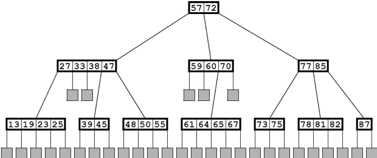
그림 12.1: 5차 탐색 트리

루트 노드는 두 개의 키와 세 개의 자식을 가지고 있습니다. 첫 번째 자식의 네 개의 키는 모두 stem:[k_{1} = 57]보다 작습니다. 두 번째 자식의 세 개의 키는 모두 stem:[k_{1} = 57]과 stem:[k_{2} = 72] 사이에 있습니다. 세 번째 자식의 두 개의 키는 모두 stem:[k_{2} = 72]보다 큽니다. 사실, 첫 번째 서브트리의 13개의 키는 모두 57보다 작고, 두 번째 서브트리의 7개의 키는 모두 57과 72 사이에 있으며, 세 번째 서브트리의 8개의 키는 모두 72보다 큽니다.

m-차 탐색 트리는 대규모 목록을 검색하기 위한 다단계 인덱스로 작동하기 때문에 탐색 트리라고 불립니다. 키 값을 검색하려면 루트에서 시작하여 키를 찾거나 잎 노드에 도달할 때까지 트리를 내려갑니다. 각 노드에서 키에 대해 이진 검색을 수행합니다. 그 노드에서 키를 찾지 못하면 검색은 두 인접한 키 값 사이에서 멈춥니다(여기서 stem:[k_{0} = - \infty]와 stem:[k_{n} = \infty]). 이 경우 두 키 사이의 링크를 따라 다음 노드로 이동합니다. 잎 노드에 도달하면 키가 트리에 없음을 알 수 있습니다.

예를 들어, 키 값 66을 검색하려면 트리의 루트에서 시작하여 가운데 링크(왜냐하면 stem:[57 \le 66 \lt 72])를 따라 가운데 세 개의 키 노드로 내려갑니다. 그런 다음 세 번째 링크(왜냐하면 stem:[60 \le 66 \lt 70])를 따라 아래쪽 네 개의 키 노드로 내려갑니다. 그런 다음 세 번째 링크(왜냐하면 stem:[65 le 66 \lt 67])를 따라 그 잎 노드로 내려갑니다. 그런 다음 키 66이 트리에 없음을 결론지을 수 있습니다.

m-차 탐색 트리에 키를 삽입하려면 먼저 검색 알고리즘을 적용합니다. 검색이 잎 노드에서 끝나면 부모 노드의 두 개의 키 사이에서 새로운 키의 올바른 위치를 찾습니다. 따라서 그 두 키 사이의 내부 노드에 새로운 키를 삽입합니다. 그 삽입으로 인해 노드에 m개의 키가 생기면(즉, 노드당 m-1개의 키 한도를 초과하면) 중간 키를 부모 노드로 옮긴 후 노드를 두 개의 노드로 분할합니다. 부모 노드에 m개의 키가 생기면 분할 과정을 반복합니다. 이 과정은 필요한 경우 루트까지 반복될 수 있습니다. 루트를 분할하면 새로운 루트가 생성되어 트리의 높이가 한 단계 증가합니다.

=== 예제 12.2: 5차 트리에 삽입하기

예제 12.1의 탐색 트리에 66을 삽입하려면 먼저 위에서 설명한 대로 검색을 수행합니다. 이는 그림 12.2에 표시된 X로 표시된 잎 노드로 이어집니다:

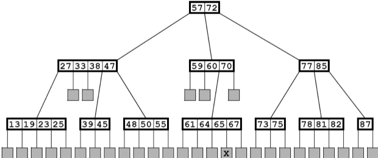
그림 12.2: 5차 탐색 트리에 66 삽입하기

새로운 키 66을 마지막 부모 노드에서 65와 67 사이에 삽입합니다. 이는 그림 12.3에 나와 있습니다.

이제 노드에는 다섯 개의 키가 포함되어 있어 5차 트리의 네 개의 키 제한을 위반합니다. 따라서 그림 12.4에 나와 있는 것처럼 중간 키 65를 부모 노드로 이동시켜 노드를 분할합니다.

노드 분할은 특히 m이 큰 경우 상대적으로 드뭅니다. 예를 들어, m = 50인 경우 평균적으로 노드의 2%만이 가득 차므로 하위 수준의 분할이 삽입의 약 2%에만 필요합니다. 또한 하위에서 두 번째 수준의 분할(즉, 이중 분할)은 삽입의 약 2%의 2%, 즉 확률 0.0004로 필요합니다. 그리고 삼중 분할의 확률은 0.000008입니다. 따라서 루트가 분할될 가능성은 매우 적습니다. 그리고 이것이 트리가 수직으로 성장할 수 있는 유일한 방법이기 때문에 트리는 매우 얕고 매우 넓은 상태를 유지하여 매우 빠른 검색 시간을 제공합니다.

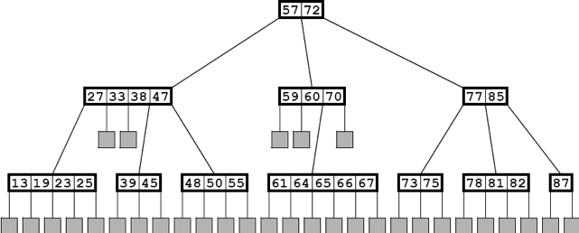
그림 12.3: 5차 탐색 트리에 66 삽입하기

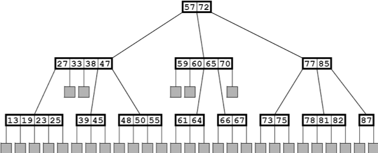
그림 12.4: 5차 탐색 트리에 66 삽입하기

삽입의 약 2%만이 하위 수준의 분할이 필요합니다. 더욱이, 하위에서 두 번째 수준의 분할(즉, 이중 분할)은 삽입의 약 2% 중 2%만 필요합니다. 이는 확률 0.0004에 해당합니다. 삼중 분할의 확률은 0.000008입니다. 따라서 루트가 분할될 가능성은 매우 적습니다. 그리고 이것이 트리가 수직으로 성장할 수 있는 유일한 방법이기 때문에 트리는 매우 얕고 매우 넓은 상태를 유지하여 매우 빠른 검색 시간을 제공합니다.

== B-트리

차수 m의 B-트리는 다음과 같은 추가 조건을 만족하는 m-차 탐색 트리입니다:

1. 루트는 최소 두 개의 자식을 가져야 합니다.
2. 모든 다른 내부 노드는 최소 stem:[\lfloor m/2 \rfloor] 개의 자식을 가져야 합니다.
3. 모든 잎 노드는 동일한 레벨에 있어야 합니다.

이 조건들은 트리를 더 균형 잡히게 만들어 (따라서 더 효율적으로 만들고) 삽입 및 삭제 알고리즘을 단순화합니다.

B-트리는 디스크에 저장된 대규모 데이터 세트의 인덱스로 사용됩니다. 관계형 데이터베이스에서는 데이터가 테이블이라고 불리는 별도의 레코드 시퀀스로 구성됩니다. 각 테이블은 배열의 요소처럼 레코드가 번호가 매겨진 순차 데이터 파일로 저장될 수 있습니다. 또는 데이터베이스 시스템이 레코드를 디스크 주소로 직접 접근할 수도 있습니다. 어느 경우이든, 각 레코드는 어떤 주소 지정 체계를 통해 디스크에서 직접 접근할 수 있습니다. 따라서 레코드의 디스크 주소를 알고 있다면 즉시 접근할 수 있습니다(즉, 단일 디스크 읽기로). 따라서 B-트리에 저장된 "키"는 실제 키 값(예: 인사 기록의 미국 사회 보장 번호, 책의 ISBN)과 함께 디스크 주소를 포함하는 키/주소 쌍입니다. 다음에 나오는 개요에서는 키 값만 표시되며, 그와 동반하는 디스크 주소는 생략됩니다.

=== 예제 12.3: B-트리

그림 12.5는 차수 5의 B-트리를 보여줍니다. 각 내부 노드는 3, 4, 또는 5개의 자식을 가지며, 모든 잎은 레벨 3에 있습니다.

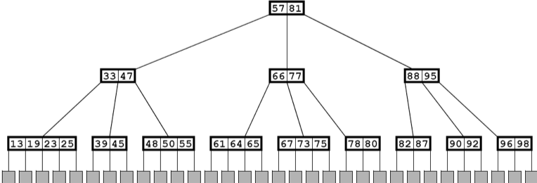
그림 12.5: 차수 5의 B-트리

**알고리즘 12.1: B-트리에서 검색하기**

차수 m의 B-트리 인덱스를 사용하여 키 k를 가진 레코드를 찾으려면:

1. 트리가 비어 있으면 null을 반환합니다.
2. x를 루트로 설정합니다.
3. x가 잎 노드가 될 때까지 4~6단계를 반복합니다.
4. 이진 검색을 노드 x에 대해 키 stem:[k_{i}]에 적용합니다. 여기서 stem:[k_{i-1} \lt k \le k_{i}]입니다(여기서 stem:[k_{0} = -\infty]와 stem:[k_{m} = \infty]).
5. stem:[k_{i} = k]이면, 디스크에서 레코드를 검색하여 반환합니다.
6. x를 서브트리 stem:[S_{i}]의 루트로 설정합니다. null을 반환합니다.

이 과정이 책의 색인에서 주제를 찾아보는 것과 얼마나 유사한지 주목하세요. 색인의 각 페이지는 해당 페이지에 나열된 주제를 나타내는 단어 또는 문자로 표시됩니다. 페이지 레이블은 탐색 트리의 내부 노드에 있는 키와 유사합니다. 책 색인에 있는 주제 옆에 나열된 실제 페이지 번호는 실제 데이터로 연결되는 파일 이름의 디스크 주소와 유사합니다. 검색 과정의 마지막 단계는 책에서 해당 페이지를 검색하거나 디스크에서 해당 파일을 검색하는 것입니다. 책 색인 자체에 색인이 있다면 이 비유는 더 가까워집니다. 다항 트리의 각 내부 레벨은 또 다른 색인 레벨에 해당합니다.

**알고리즘 12.2: B-트리에 삽입하기**

차수 stem:[m]의 B-트리 인덱스를 사용하여 키 stem:[k]를 가진 레코드를 삽입하려면:

1. 트리가 비어 있으면 두 개의 더미 잎이 있는 루트 노드를 생성하고 그곳에 stem:[k]를 삽입한 후 true를 반환합니다(삽입이 성공적이었음을 나타냄).
2. stem:[x]를 루트로 설정합니다.
3. stem:[x]가 잎 노드가 될 때까지 4-6단계를 반복합니다.
4. 노드 stem:[x]에 대해 이진 검색을 적용하여 키 stem:[k_{i}]를 찾습니다. 여기서 stem:[k_{i-1} < k \le k_{i}]입니다(여기서 stem:[k_{0} = -\infty] 및 stem:[k_{m} = \infty]).
5. stem:[k_{i} = k]이면 false를 반환합니다(삽입이 실패했음을 나타내며, 이미 해당 키 stem:[k]를 가진 레코드가 존재하고, 키는 고유해야 함).
6. stem:[x]를 서브트리 stem:[S_{i}]의 루트로 설정합니다.
7. 디스크에 레코드를 추가합니다.
8. stem:[x]에 stem:[k]를 (레코드의 디스크 주소와 함께) stem:[k_{i-1}]와 stem:[k_{i}] 사이에 삽입합니다.
9. stem:[x]에 더미 잎 노드를 추가합니다.
10. stem:[\text{degree}(x) = m]이면, stem:[\text{degree}(x) < m]이 될 때까지 11-13단계를 반복합니다.
11. stem:[k_{j}]를 노드 stem:[x]의 중간 키로 설정합니다.
12. stem:[k_{j}]를 stem:[x]에서 제거한 후 stem:[x]의 왼쪽과 오른쪽 절반을 각각 stem:[u]와 stem:[v]로 설정합니다.
13. stem:[x]가 루트이면, stem:[k_{j}]를 포함하는 새로운 루트 노드를 생성하고 서브트리 stem:[u]와 stem:[v]를 첨부합니다.
14. 그렇지 않으면, stem:[k_{j}]를 stem:[x]의 부모 노드에 삽입하고 서브트리 stem:[u]와 stem:[v]를 첨부합니다.
15. true를 반환합니다.

이 삽입 과정은 그림 12.6에 나와 있습니다.

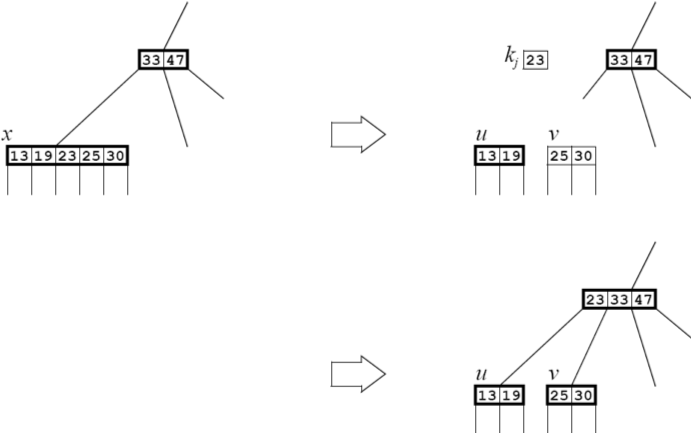
그림 12.6: B-트리에 삽입하기

B-트리의 삭제 알고리즘도 삽입 알고리즘과 유사합니다.
이 세 가지 알고리즘 모두 트리의 높이에 비례하는 시간 내에 실행됩니다. 페이지 188의 보조정리 10.1에서 트리의 높이는 stem:[\log_{m} n]에 비례함을 알 수 있습니다. 페이지 320의 정리 A.2에서 이는 stem:[\log n]에 비례함을 알 수 있습니다. 따라서 우리는 다음과 같은 결론을 얻습니다:

**정리 12.1 B-트리에서 검색, 삽입, 삭제는 모두 stem:[O(\log n)] 시간에 실행됩니다.**

== 이진 탐색 트리

이진 탐색 트리(BST)는 요소에 일부 순서형 타입의 키 필드를 포함하고 있으며 다음과 같은 속성을 가진 이진 트리입니다: 어떤 노드에서 키 값이 stem:[k]일 때, stem:[k]는 그 노드의 왼쪽 서브트리에 있는 모든 키 stem:[x]보다 크거나 같고, 오른쪽 서브트리에 있는 모든 키 stem:[y]보다 작거나 같습니다. 이 속성을 BST 속성이라고 하며, 이진 탐색 트리를 중위 순회하면 요소가 증가하는 순서로 생성됨을 보장합니다.

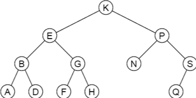
그림 12.7: 이진 탐색 트리

BST 속성은 트리에 삽입할 때마다 적용됩니다:

**알고리즘 12.3: 이진 탐색 트리에 삽입하기**

키 값 stem:[k]를 가진 요소를 이진 탐색 트리에 삽입하려면:

1. 트리가 비어 있으면 새 요소를 루트에 삽입한 후 종료합니다.
2. stem:[p]를 루트에 위치시킵니다.
3. stem:[k]가 stem:[p]에 저장된 키보다 작고 stem:[p] 노드에 왼쪽 자식이 없다면, 새 요소를 stem:[p]의 왼쪽 자식으로 삽입한 후 종료합니다.
4. stem:[k]가 stem:[p]에 저장된 키보다 작고 stem:[p] 노드에 왼쪽 자식이 있다면, stem:[p]를 stem:[p]의 왼쪽 자식에 위치시킵니다. 그런 다음 3단계로 돌아갑니다.
5. stem:[p] 노드에 오른쪽 자식이 없다면, 새 요소를 stem:[p]의 오른쪽 자식으로 삽입한 후 종료합니다.
6. stem:[p]를 stem:[p]의 오른쪽 자식에 위치시킵니다. 그런 다음 3단계로 돌아갑니다.

### 예제 12.4: 이진 탐색 트리에 삽입하기

알고리즘 12.3을 적용하여 그림 12.7에 표시된 이진 탐색 트리에 키 M을 가진 요소를 삽입해 봅시다.

1단계에서는 반복자 stem:[p]가 루트 K에 위치합니다. M이 K보다 크므로(즉, 사전 순서상 K 다음에 옴) 노드 K에 오른쪽 자식이 있는 경우 알고리즘은 6단계로 진행하여 반복자 stem:[p]를 노드 P로 재설정하고 다시 3단계로 돌아갑니다. 다음으로, M이 P보다 작으므로(즉, 사전 순서상 P 이전에 옴) 노드 P에 왼쪽 자식이 있는 경우 알고리즘은 4단계로 진행하여 반복자 stem:[p]를 노드 N으로 재설정하고 다시 3단계로 돌아갑니다. 마지막으로, M이 N보다 작지만 노드 N에 왼쪽 자식이 없으므로 알고리즘은 5단계로 진행하여 새 요소를 노드 N의 왼쪽 자식으로 삽입하고 종료합니다.

이 과정은 그림 12.8에 나와 있습니다.

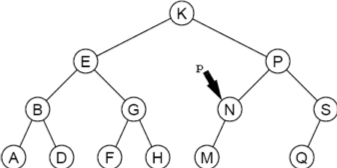
그림 12.8: 이진 탐색 트리에 삽입하기

### 예제 12.5: 이진 탐색 트리 구축하기

그림 12.9는 입력 시퀀스 44, 22, 77, 55, 99, 88, 33을 삽입하여 구축된 이진 탐색 트리를 보여줍니다.

이진 탐색 트리가 균형을 이루면 매우 효율적인 검색이 가능합니다. 이진 탐색과 마찬가지로, 균형 잡힌 이진 탐색 트리에서 요소를 찾는 데에는 stem:[O(\lg n)] 단계가 소요됩니다. 그러나 추가적인 제약이 없다면, 이진 탐색 트리는 매우 불균형하게 성장할 수 있습니다. 최악의 경우는 요소가 정렬된 순서로 삽입될 때입니다. 이 경우 트리는 선형 목록으로 변환되어 검색 알고리즘이 stem:[O(n)] 순차 검색이 됩니다.

=== 예제 12.6 불균형 이진 탐색 트리

이 데이터는 예제 12.5와 동일한 입력 데이터이지만 다른 순서로 제공됩니다: 99, 22, 88, 33, 77, 55, 44. 생성된 이진 탐색 트리는 236페이지의 그림 12.10에 나와 있습니다. 이것은 동일한 입력이 다른 순서로 제공될 경우 다른 트리를 생성할 수 있음을 보여줍니다. 더 중요한 것은, 이진 탐색 트리가 선형 또는 거의 선형이 되는 것이 드문 일이 아님을 보여줍니다.

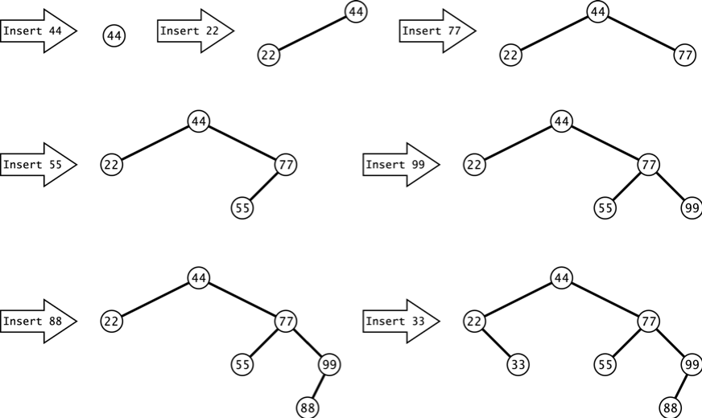
그림 12.9 이진 탐색 트리에 삽입

== 이진 탐색 트리의 성능

insert()와 search() 함수는 모두 트리의 루트에서 시작하여 잎 방향으로 진행하며, 트리의 각 레벨에서 한 번의 비교를 수행합니다. 따라서 두 알고리즘을 실행하는 데 필요한 시간은 트리의 높이를 stem:[h + 1]로 두었을 때, 비례합니다. search() 함수는 잎에 도달하기 전에 종료될 수 있지만, stem:[h + 1]은 여전히 비교할 수 있는 횟수의 상한입니다.

정리 12.2 크기 n의 이진 탐색 트리에서 insert()와 search() 함수는 각각 최선의 경우 stem:[O(\lg n)]의 비교가 필요합니다.

최선의 경우, 이진 트리는 완전히 균형 잡히고 거의 가득 차 있기 때문에, 202페이지의 추론 11.2에 의해 stem:[h = \lg(n+1) - 1 = O(\lg n)]입니다.

정리 12.3 크기 n의 이진 탐색 트리에서 insert()와 search() 함수는 각각 최악의 경우 stem:[O(n)]의 비교가 필요합니다.

최악의 경우 트리는 선형이므로 stem:[h + 1 = n = O(n)]입니다.

image::./images/figure12_10.png[이진 탐색 트리, align=center]
그림 12.10 이진 탐색 트리

**정리 12.4 크기 n의 이진 탐색 트리에서 insert()와 search() 함수는 각각 평균적인 경우 stem:[O(2\ln n) \approx O(1.39\lg n)]의 비교가 필요합니다.**

이 결과의 증명은 이 개요의 범위를 벗어납니다.

== AVL 트리

예제 12.6에서 보여준 불균형 문제는 이진 탐색 트리의 노드에 균형 제약을 가함으로써 피할 수 있습니다.

트리의 어느 노드에서나 _균형 수_를 그 노드의 왼쪽 서브트리 높이와 오른쪽 서브트리 높이의 차이로 정의합니다. AVL 트리는 각 노드의 균형 수가 -1, 0 또는 1인 이진 탐색 트리입니다. 이 이름은 이 방법을 발명한 두 사람 G.M. 아델손-벨스키와 Y.M. 랜디스에서 유래했습니다.

그림 12.12의 트리는 C 노드에서 불균형 상태이기 때문에 AVL 트리가 아닙니다. 그곳의 균형 수는 2로 허용 범위를 벗어납니다. 또한 G 노드에서도 불균형 상태입니다. 그림 12.11의 트리는 AVL 트리입니다: 모든 균형 수가 -1, 0 또는 1입니다.

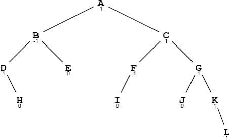
그림 12.11 AVL 트리

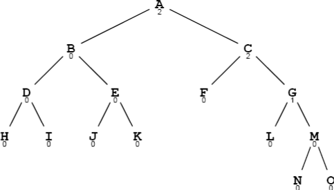
그림 12.12 AVL 트리가 아님

=== 예제 12.7 AVLTree 클래스

이 AVL 트리 클래스를 예제 11.20에서 정의된 BinaryTree 클래스를 확장합니다 (212페이지):

[source,java]
----
1	public class AVLTree extends BinaryTree {
2	    protected AVLTree left, right;
3	    protected int balance;
4	    protected java.util.Comparator comp;
5
6	    public AVLTree(java.util.Comparator comp){
7	        this.comp = comp;
8	    }
9
10	    public AVLTree(Object root, java.util.Comparator	comp) {
11	        this.root = root;
12	        this.comp = comp;
13	    }
14
15	    public boolean add(Object object) {
16	        AVLTree temp = attach(object);
17	        if (temp != this) {
18	            left = temp.left;
19	            right = temp.right;
20	            balance = temp.balance;
21	        }
22	        return true;
23	    }
24
25	    public AVLTree attach(Object object) {
26	        if (root	== null) { // tree is empty
27	            root =	object;
28	            return	this;
29	        }
30	        if (comp.compare(object,root) < 0) { // insert into left subtree
31	            if (left == null) {
32	                left = new AVLTree(object,comp);
33	                ++size;
34	                --balance;
35	            } else {
36	                int lb = left.balance;
37	                left = left.attach(object);
38	                if (left.balance != lb && left.balance != 0) {
39	                    --balance;
40	                }
41	            }
42	            if (balance < -1) {
43	                if (left.balance > 0) {
44	                    left = left.rotateLeft();
45	                }
46	                return rotateRight();
47	            }
48	        } else { // insert into right subtree
49	            if (right == null) {
50	                right = new AVLTree(object,comp);
51	                ++size;
52	                ++balance;
53	            } else {
54	                int rb = right.balance;
55	                right = right.attach(object);
56	                if (right.balance != rb && right.balance != 0) {
57	                    ++balance;
58	                }
59	            }
60	            if (balance > 1) {
61	                if (right.balance < 0) {
62	                    right = right.rotateRight();
63	                }
64	                return rotateLeft();
65	            }
66	        }
67	        return this;
68	    }
69
70	    private AVLTree rotateRight() // see Problem 12.5 on page 240
71
72	    private AVLTree rotateLeft() {
73	        AVLTree x = this, y = right, z = y.left;
74	        x.right = z;
75	        y.left = x;
76	        int xb = x.balance, yb = y.balance;
77	        if (yb < 1) {
78	            --x.balance;
79	            y.balance = ( xb>0 ? yb-1 : xb+yb-2 );
80		    } else if (yb < xb) {
81		        x.balance -= yb+1; --y.balance;
82		    } else {
83		        y.balance = xb-2;
84		    }
85		    return y;
86	    }
87	}
----

== 복습 질문

1. 이진 탐색 트리를 사용하는 장점과 단점은 무엇입니까?
2. AVL 트리를 사용하는 장점과 단점은 무엇입니까?

== 문제

1. 예제 12.1에 나오는 다섯 갈래 트리에 키 16을 가진 새로운 레코드가 삽입될 때 어떤 일이 발생하는지 설명하십시오.
2. 예제 12.5에 나오는 7개의 키로 동일한 이진 탐색 트리를 생성할 수 있는 다른 두 가지 순서를 찾으십시오.
3. 이진 탐색 트리를 사용하여 객체 배열을 정렬하는 방법을 설명하십시오. 그런 다음 알고리즘의 복잡성을 결정하십시오.
4. 12.15에 나오는 이진 트리 중 어느 것이 이진 탐색 트리인지 결정하십시오.
5. AVLTree 클래스에 대한 rotateRight() 메서드를 작성하십시오.
6. 이진 탐색 트리의 모든 서브트리도 이진 탐색 트리임을 증명하십시오.
7. AVL 트리의 모든 서브트리도 AVL 트리임을 증명하십시오.
8. 미국 우편 서비스 약어로 표시된 미국 헌법을 비준한 첫 10개 주(DE, PA, NJ, GA, CT, MA, MD, SC, NH, VA)를 차례대로 삽입한 후의 AVL 트리를 보여주십시오.

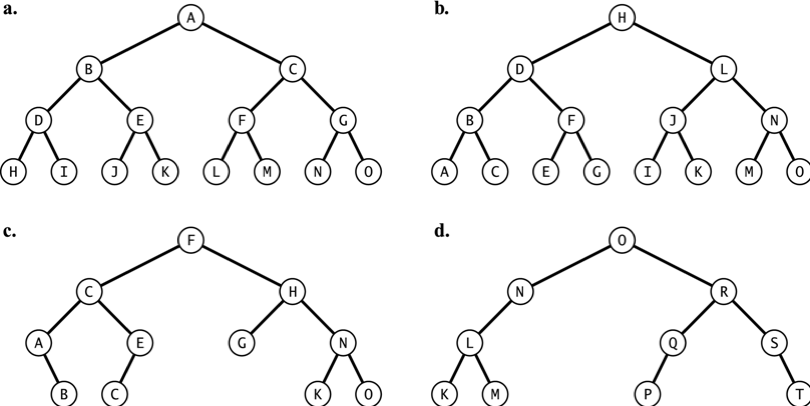
그림 12.15 이진 트리