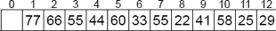
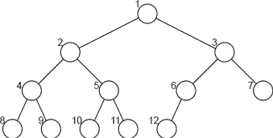
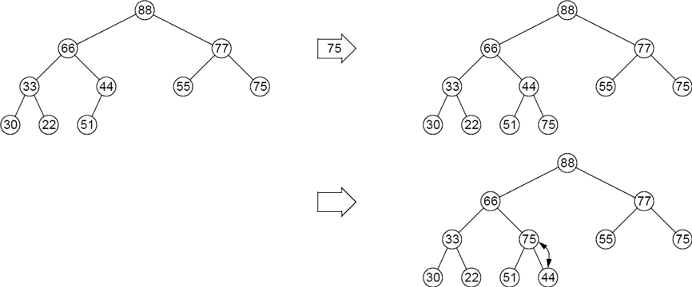
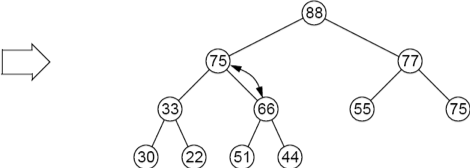
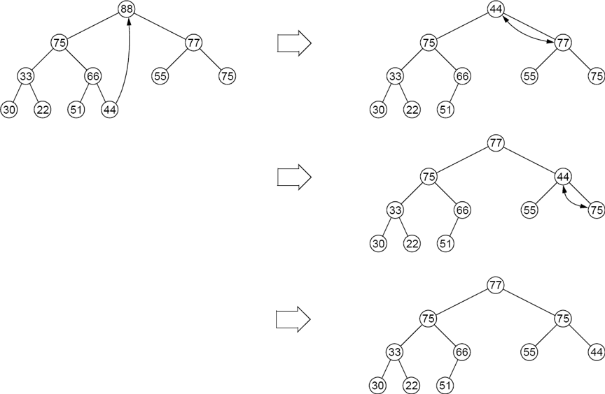
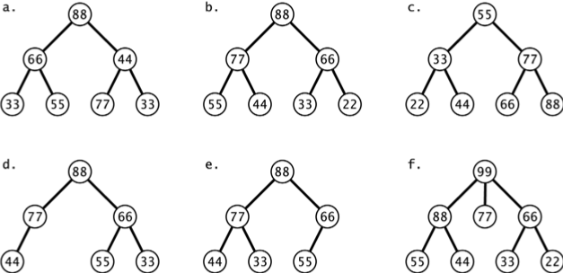

:stem: latexmath

= Heap(힙)과 Priority Queue(우선 순위 큐)

== 힙

힙은 완전 이진 트리로, 그 요소의 키가 다음과 같은 힙 속성을 만족합니다: 루트에서 잎사귀로 가는 경로를 따라 키가 내림차순(즉, 비증가)입니다.

=== 예제 13.1 힙

그림 13.1은 힙을 보여줍니다. 각 루트에서 잎사귀로 가는 경로를 따라 키가 내림차순임을 주목하세요:

[cols="1a,1a",frame=none,grid=none,align=center]
|===
|
[stem,align=center]
++++
\begin{align*}
&77 \ge 66 \ge 44 \ge 22;\\
&77 \ge 66 \ge 44 \ge 41;\\
&77 \ge 66 \ge 60 \ge 58;\\
&77 \ge 66 \ge 60 \ge 25;\\
&77 \ge 55 \ge 33 \ge 29;\\
&77 \ge 55 \ge 55.
\end{align*}
++++
|
image::./images/figure13_1.png[A heap,align=center]
Figure 13.1 A heap
|===

힙은 힙 속성 때문에 모든 부모가 자식보다 나이가 많다는 의미에서 가족의 후손 트리를 나타낼 수 있습니다.
힙은 우선 순위 큐를 구현하는 데 사용됩니다(247 페이지) 및 힙 정렬 알고리즘에도 사용됩니다(266 페이지).

== 자연스러운 매핑

모든 완전 이진 트리는 배열로 자연스럽게 매핑할 수 있습니다. (206 페이지의 알고리즘 11.1 참조.) 이 매핑은 트리의 레벨 순서 순회를 통해 얻어집니다. 결과 배열에서 인덱스 i에 있는 원소의 부모는 인덱스 i/2에 있고, 자식들은 인덱스 2i와 2i+1에 있습니다.

=== 예제 13.2 배열에 힙 저장하기

그림 13.1에 표시된 힙은 그림 13.2에 표시된 배열로 매핑됩니다.
예를 들어, 원소 60은 인덱스 i = 5에 있고, 그 부모는 원소 66으로 인덱스 i/2 = 2에 있으며, 그 자식들은 인덱스 2i = 10과 2i + 1=11에 있는 원소 58과 25입니다.

Figure 13.2 Array storage of a heap

완전 이진 트리와 배열 사이의 자연스러운 매핑은 양방향 대응 관계입니다. 배열 요소를 완전 이진 트리로 다시 매핑하기 위해서는 레벨 순서 순회를 통해 트리 노드에 1부터 시작하는 번호를 연속적으로 부여하면 됩니다. 그런 다음 인덱스 i에 있는 배열 요소를 i 번호가 매겨진 트리 노드로 복사합니다. 이러한 인덱스의 위치는 그림 13.3에서 보여집니다. 결과 트리가 힙 속성을 가지면 해당 배열도 힙 속성을 가진다고 합니다.

그림 13.3 힙의 배열 인덱스

=== 예제 13.3 배열이 힙 속성을 가지고 있는지 확인하기

이 배열이 힙 속성을 가지고 있는지 결정하기 위해, 먼저 배열을 이진 트리로 매핑한 다음 각 루트에서 잎사귀까지의 경로를 검사합니다.
그림 13.4에 나타난 루트에서 잎사귀까지의 경로 {88, 66, 44, 51}은 44 < 51이기 때문에 내림차순이 아닙니다. 따라서 트리는 힙 속성을 가지고 있지 않습니다. 따라서 배열도 힙 속성을 가지고 있지 않습니다.

image::./images/figure13_4.png[힙 속성 확인, align=center]
그림 13.4 힙 속성 확인

힙 속성을 가진 배열은 부분적으로 정렬되어 있습니다. 이는 대부분의 큰 키가 대부분의 작은 키보다 앞에 온다는 것을 의미합니다. 보다 정확하게는, 모든 힙-경로 부분 배열이 내림차순으로 정렬되어 있다는 것을 의미합니다. 여기서 힙-경로 부분 배열은 각 인덱스 번호가 그 후속자의 절반인 배열 요소의 부분 수열입니다. 예를 들어, {a[1], a[2], a[5], a[11], a[22], a[45], a[90], a[180]}은 200개 요소를 가진 배열 a[]의 힙-경로 부분 배열이 될 것입니다. 힙 정렬 알고리즘(266 페이지의 알고리즘 14.8)은 이 사실을 이용하여 배열을 빠르고 효율적으로 정렬하는 방법을 제공합니다.

== 힙에 요소 삽입하기

요소는 힙의 가장 오른쪽 아래 잎사귀 옆에 삽입됩니다. 그런 다음 새 요소를 트리 위로 이동시키면서(즉, 그 키가 부모보다 크지 않을 때까지) 힙 속성이 복원됩니다. 각 반복에서 자식은 부모와 교환됩니다.

=== 예제 13.4 힙에 삽입하기

247페이지의 그림 13.5는 키 75가 그림 13.4에 나타난 힙에 어떻게 삽입되는지를 보여줍니다. 요소 75는 새 마지막 잎사귀로 트리에 추가됩니다. 그런 다음 75 > 44이므로 부모 요소 44와 교환됩니다. 그 다음 75 > 66이므로 부모 요소 66과 교환됩니다. 이제 새 요소 75가 부모보다 작고 자식들보다 크므로 힙 속성이 복원되었습니다.

삽입은 루트에서 잎사귀로 가는 단일 경로에 있는 노드에만 영향을 미친다는 점에 주목하세요.

그림 13.5 힙에 75 삽입하기

== 힙에서 제거하기

힙 제거 알고리즘은 항상 트리에서 루트 요소를 제거합니다. 이는 마지막 잎사귀 요소를 루트 요소로 이동시키고 새 루트 요소를 트리 아래로 이동시켜 더 이상 자식들보다 작지 않을 때까지 힙 속성을 복원함으로써 이루어집니다. 각 반복에서 부모는 두 자식 중 더 큰 자식과 교환됩니다.

=== 예제 13.5 힙에서 제거하기

그림 13.6은 루트 요소(키 88)가 힙에서 어떻게 제거되는지를 보여줍니다.

그림 13.6 힙에서 88 제거하기

마지막 잎사귀(키 44)가 제거되고 루트로 복사되어 이전 루트(키 88)를 대체합니다. 그런 다음 힙 속성을 복원하기 위해 요소 44는 두 자식 중 더 큰 자식(77)과 교환됩니다. 이 단계는 요소 44가 더 이상 자식들보다 작지 않을 때까지 반복됩니다. 이 경우, 결과적으로 44는 다시 잎사귀가 됩니다.

제거는 루트에서 잎사귀로 가는 단일 경로에 있는 노드에만 영향을 미친다는 점에 주목하세요. 이는 202페이지의 추론 11.2에서 다음과 같은 결과를 도출합니다:

**정리 13.1 힙에 요소를 삽입하거나 힙에서 제거하는 작업은 O(\lg n) 시간 안에 실행됩니다.**

== 우선 순위 큐

스택은 LIFO(Last In, First Out) 컨테이너입니다: 마지막에 들어온 것이 먼저 나옵니다. 큐는 FIFO(First In, First Out) 컨테이너입니다: 먼저 들어온 것이 먼저 나옵니다. 우선 순위 큐는 BIFO(Best In, First Out) 컨테이너입니다: 가장 좋은 것이 먼저 나옵니다. 이는 각 요소에 우선 순위 번호가 할당되며, 우선 순위가 가장 높은 요소가 먼저 나온다는 것을 의미합니다.

우선 순위 큐는 컴퓨터 시스템에서 널리 사용됩니다. 예를 들어, 여러 컴퓨터가 로컬 영역 네트워크에서 프린터를 공유할 때, 프린터에 대기 중인 인쇄 작업은 일반적으로 우선 순위 큐에 일시적으로 저장되며, 작은 작업이 큰 작업보다 높은 우선 순위를 부여받습니다.

우선 순위 큐는 보통 힙으로 구현됩니다. 힙 데이터 구조는 항상 가장 큰 키를 가진 요소를 루트에 유지하며, 삽입 및 제거 작업이 매우 효율적이기 때문입니다. 정리 13.1에 따르면, 이러한 작업은 O(\lg n) 시간 안에 실행되는 것이 보장됩니다.

== JCF PriorityQueue 클래스

Java Collections Framework에는 PriorityQueue 클래스가 포함되어 있습니다. 70페이지의 그림 4.1에 나타난 것처럼, 이 클래스는 AbstractQueue와 AbstractList 클래스를 확장하여 Queue 및 List 인터페이스를 구현합니다.

=== 예제 13.6 java.util.PriorityQueue 클래스

[source,java,align=center]
----
1	public class TestingPriorityQueues {
2	    public static void main(String[] args) {
3	        PriorityQueue<String> pq = new PriorityQueue<String>();
4	        pq.add("FR");
5	        pq.add("DE");
6	        pq.add("GB");
7		    pq.add("IT");
8		    pq.add("ES");
9		    while (!pq.isEmpty()) {
10		        System.out.printf("%s ", pq.remove());
11		    }
12	    }
13	}
----

The output is:

[source,console,align=center]
----
DE ES FR GB IT
----

이 컬렉션 pq는 우선 순위 큐이므로 요소가 우선 순위에 따라 제거됩니다. 이 큐의 요소 타입은 String이며, 이는 자체 자연 순서(알파벳 순서)를 가지고 있습니다. 따라서 삽입된 순서와 상관없이 요소는 알파벳 순서로 제거됩니다.

요소 타입에 자연 순서가 없는 경우, PriorityQueue 인스턴스는 요소 간의 우선 순위를 결정하기 위해 compareTo() 메서드를 적용합니다.

=== 예제 13.7 Comparable 인터페이스를 명시적으로 구현하는 요소 사용하기

[source,java,align=center]
----
1	public class TestingPriorityQueues {
2	    public static void main(String[] args) {
3	        PriorityQueue<Student> pq = new PriorityQueue<Student>();
4	        pq.add(new Student("Ann",44));
5	        pq.add(new Student("Bob",99));
6	        pq.add(new Student("Cal",33));
7	        pq.add(new Student("Don",66));
8	        while (!pq.isEmpty()) {
9	            System.out.printf("%s ", pq.remove());
10	        }
11	    }
12	}
13
14	class Student implements Comparable{
15	    private String name;
16	    private int credits;
17
18	    public Student(String name, int credits) {
19	        this.name = name;
20	        this.credits = credits;
21	    }
22
23	    public int compareTo(Object object) {
24	        if (object == this) {
25	            return 0;
26	        } else if (!(object instanceof Student)) {
27	            throw new IllegalArgumentException("comparing apples and oranges!");
28	        }
29	        Student that = (Student)object;
30	        return this.credits - that.credits;
31	    }
32	    public String toString() {
33	        return String.format("%s(%d)", name, credits);
34	    }
35	}
----

3번째 줄에 정의된 우선순위 큐 pq는 14번째 줄에 정의된 Student 클래스의 인스턴스를 저장합니다. 이 클래스는 Comparable 인터페이스를 구현하도록 선언되어 있으며, 이는 compareTo() 메서드를 정의해야 함을 의미합니다. 23번째 줄에 정의된 이 메서드는 Student 객체의 학점 필드를 사용하여 이들을 비교합니다. 학점이 더 많은 학생이 더 높은 우선순위를 갖습니다.

8번째 줄의 출력 루프는 예제 13.6의 것과 동일합니다. 이 루프는 우선순위 큐의 remove() 메서드를 사용하여 요소를 제거하고 우선순위 레벨에 따라 오름차순으로 요소를 출력합니다. 삽입 순서와는 무관하게 (동일한 우선순위를 가진 경우 제외) 요소를 출력합니다.

== 복습 질문

1. 힙의 두 가지 주요 응용 분야는 무엇인가요?
2. 힙에 대한 삽입과 제거는 얼마나 효율적인가요?
3. 우선순위 큐는 왜 BIFO 컨테이너라고 불리나요?
4. 큐와 우선순위 큐의 차이점은 무엇인가요?
5. 우선순위 큐를 구현하는 데 왜 힙이 사용되나요?
6. 이진 트리를 배열 a[]에 자연스럽게 매핑할 때 왜 a[0]이 아닌 a[1]부터 시작하나요?
7. 1,000개의 요소가 있는 우선순위 큐에서 요소를 제거하는 데 평균 3ms가 걸린다면, 1,000,000개의 요소가 있는 우선순위 큐에서 요소를 제거하는 데는 얼마나 걸릴 것으로 예상되나요?
8. 배열의 요소를 우선순위 큐에 저장한 다음 다시 배열로 제거하여 정렬하는 방법이 고안되었다고 가정해봅시다. 그러한 알고리즘의 실행 시간은 얼마일까요?

== 문제

1. Figure 13.7의 이진 트리 중 어느 것이 힙인지 결정하십시오.
+

Figure 13.7 이진 트리
2. 페이지 251의 Figure 13.8에서 어느 배열이 힙 속성을 갖는지 결정하십시오.
3. 다음 키를 이 순서대로 삽입한 후의 힙을 보여주십시오: 44, 66, 33, 88, 77, 77, 22.
4. 문제 13.3에서 얻은 각 힙의 자연스러운 배열 맵을 보여주십시오.
+
image::./images/figure13_8.png[Arrays,align=center]
Figure 13.8 배열
5. 다음 메서드를 작성하고 테스트하십시오.
+
[source,java,align=center]
----
boolean isHeap(int[] a)
// 지정된 배열이 힙 속성을 갖는 경우에만 true를 반환합니다.
----
6. 힙의 모든 서브트리가 힙임을 증명하십시오.
7. 다음 키를 이 순서대로 삽입한 후의 힙을 보여주십시오: 50, 95, 70, 30, 90, 25, 35, 80, 60, 40, 20, 10, 75, 45, 35.
