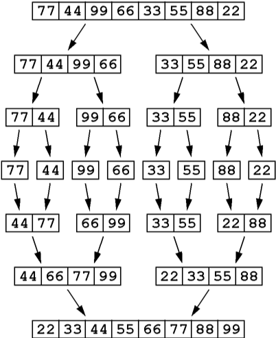
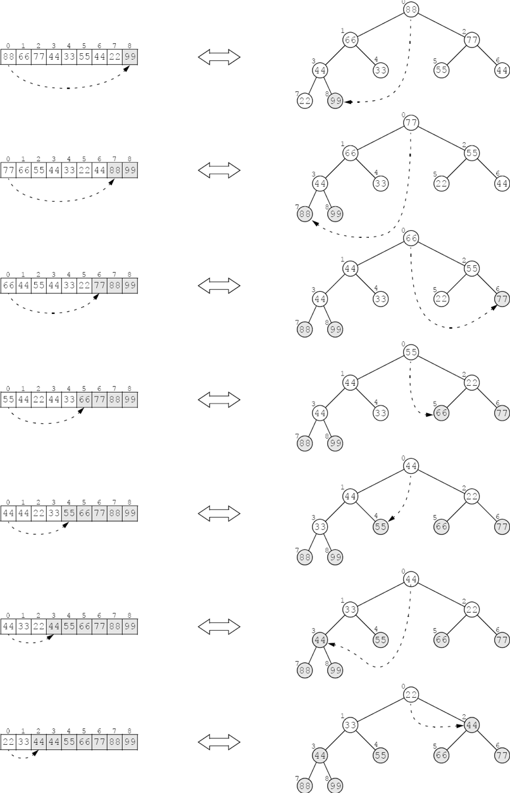
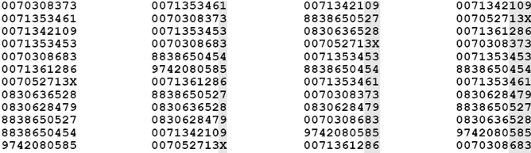
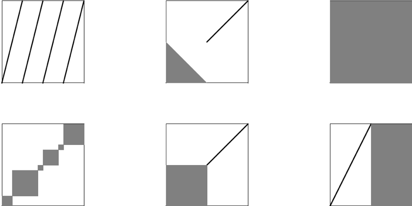

:stem: latexmath

= 정렬

2장에서 배열을 먼저 정렬하면 검색이 훨씬 효율적이라는 사실을 확인했습니다. 전화번호부에서 번호를 찾거나 사전에서 단어를 찾아본 적이 있는 사람이라면 누구나 이 사실을 알고 있습니다. 이 장에서는 배열이나 리스트와 같은 선형 데이터 구조를 정렬하는 가장 일반적인 알고리즘 아홉 가지를 설명합니다.

== 코드 준비

이 장의 모든 정렬 알고리즘은 동일한 Java signature(시그니처)를 사용하여 구현됩니다.

[source,java]
----
    public static void sort(int[] a)
----

이는 정수 배열을 정렬하기 위한 것입니다. 이를 통해 다른 기본 타입의 배열이나 Comparable 인터페이스를 구현하는 객체 배열을 쉽게 정렬할 수 있습니다.

의사 코드와 Java 코드는 전제 조건, 후제 조건, 그리고 루프 불변식을 포함합니다. 이러한 조건들은 알고리즘의 정확성을 증명하고 복잡성을 분석하는 데 사용됩니다.

위에서 언급된 의사 코드에서는 n개의 요소 시퀀스를 나타내기 위해 stem:[s = \lbrace s_{0}, s_{1}, \ldots, s_{n-1} \rbrace] 표기법을 사용합니다. 표기법 stem:[\lbrace s_{p} \cdots s_{q-1} \rbrace]는 stem:[s_{p}]에서 stem:[s_{q–1}]까지의 요소로 구성된 부분 시퀀스 stem:[\lbrace s_{p}, s_{p+1}, \cdots, s_{q-1} \rbrace]를 나타냅니다. Java 코드 주석에서는 이 부분 시퀀스를 stem:[s[p..q)]로 나타냅니다. 예를 들어, stem:[\lbrace s_{3} \cdots s_{7} \rbrace]와 stem:[s[3..8)]는 모두 부분 시퀀스 stem:[\lbrace s_{3}, s_{4}, s_{5}, s_{6}, s_{7}\rbrace]를 나타냅니다.

특별히 언급되지 않는 한, "정렬됨"은 시퀀스의 요소가 오름차순으로 정렬되어 있다는 것을 의미합니다: stem:[s_0 \le s_1 \le s_2 \le \ldots \le s_{n-1}].

모든 교환 정렬은 이 swap() 메서드를 사용합니다:

=== 예시 14.1 배열을 위한 swap() 메서드

[source,java]
----
private static void swap(int[] a, int i, int j) {
    // PRECONDITIONS: 0 <= i < a.length; 0 <= j < a.length;
    // POSTCONDITION: a[i] and a[j] are interchanged;
    if (i == j) {
        return;
    }
    int temp=a[j];
    a[j] = a[i];
    a[i] = temp;
}
----

이 메서드는 배열의 stem:[i]번째와 stem:[j]번째 요소를 단순히 교환합니다.

예제 14.1의 2번째와 3번째 줄에 있는 주석으로 포함된 선행 조건과 후행 조건의 사용에 주목하세요.
선행 조건은 메서드가 호출되기 전에 참이라고 가정되는 조건입니다.
후행 조건은 선행 조건이 참이었다면 메서드가 호출된 후에 반드시 참이 되는 조건입니다.
선행 조건과 후행 조건은 메서드에 대한 조건을 정의합니다: 메서드를 정의하는 "소비자 보증"입니다. 이들은 논리적으로 메서드가 항상 예상대로 "작동"할 것임을 증명하는 데 사용될 수 있습니다. (예를 들어, 262페이지의 정리 14.10을 참조하세요.)

모든 배열 예제는 이 print() 메서드를 사용합니다:

=== EXAMPLE14.2 Aprint() Method for Arrays

[source,java]
----
private static void print(int[] a) {
    for (int ai : a) {
        System.out.printf("%s ", ai);
    }
    System.out.println();
}
----

2번째 줄에서 자바의 향상된 for 루프 구문 사용을 주목하세요. 변수 ai는 인덱스 i가 0부터 a.length - 1까지 전체 범위를 순회함에 따라 배열 요소 a[i]를 나타냅니다.

=== 자바 Arrays.sort() 메서드

표준 자바 클래스 라이브러리는 java.util.Arrays 클래스에서 sort() 메서드를 정의합니다. 실제로 이 메서드는 다양하게 오버로드된 스무 개의 버전을 포함합니다: 객체 배열용 네 개, boolean을 제외한 각 원시 타입 배열용 두 개, 일반 타입용 두 개입니다. (95페이지 참조.)

int 배열용 sort() 메서드의 두 가지 시그니처는 다음과 같습니다.

[source,java]
----
public static void sort(int[] a)
public static void sort(int[] a, int p, int q)
----
이 중 첫 번째는 전체 배열을 정렬합니다. 두 번째는 부분 배열 a[p..q)를 정렬합니다.

==== 예시 14.3 Arrays.sort() 메서드 사용하기

[source,java]
----
public static void main(String[] args) {
    int[]a={77,44,99,66,33,55,88,22};
    print(a);
    java.util.Arrays.sort(a);
    print(a);
}
----

출력 결과:
[source,console]
----
77 44 99 66 33 55 88 22
22 33 44 55 66 77 88 99
----

원시 타입 요소의 배열에 대해서는 Arrays.sort() 메서드가 퀵 정렬을 구현합니다. (263페이지의 알고리즘 14.6 참조). 참조 타입 요소의 배열에 대해서는 병합 정렬을 구현합니다. (261페이지의 알고리즘 14.5 참조).

== 버블 정렬

버블 정렬은 n개의 요소가 있는 수열에서 n-1회의 패스를 수행합니다. 각 패스는 배열을 왼쪽에서 오른쪽으로 이동하면서 인접한 요소들을 비교하고, 순서가 잘못된 쌍을 교환합니다. 이 과정은 점차적으로 큰 요소들을 오른쪽으로 이동시킵니다. 버블 정렬이라는 이름은 요소들을 세로 열로 시각화할 때, 각 패스가 탄산 음료의 상승하는 거품처럼 작은 요소들을 튕겨내면서 다음으로 큰 요소를 “거품 내듯이” 올려보내는 것처럼 보이기 때문에 붙여졌습니다.

=== 알고리즘 14.1 버블 정렬

(선행 조건: s = {s0 . . . sn–1}는 n개의 순서 값을 갖는 수열입니다.) +
(후행 조건: 전체 수열 s가 정렬됩니다.)

1. stem:[i=n-1]부터 1까지 stem:[2-4] 단계를 수행합니다.
2. stem:[j=0]부터 stem:[i-1]까지 3단계를 수행합니다.
3. 연속된 두 요소 sj와 sj+1이 순서에 맞지 않으면, 그들을 교환합니다.
4. (불변 조건: 부분 수열 stem:[\{s_{i} \dots s_{n–1}\}]가 정렬되어 있으며, stem:[s_i = max\{s_{0} \dots s_{i}\}].)

=== 예시 14.4 버블 정렬

[source,java]
----
public static void sort(int[] a) {
// POSTCONDITION: a[0] <= a[1] <= ... <= a[a.length-1];
    for (int i = a.length-1; i > 0; i--) {  // step 1
        for (int j = 0; j < i; j++) {       // step 2
            if (a[j] > a[j+1]) {
                swap(a, j, j+1);            // step 3
            }
        }
    }
    // INVARIANTS: a[i] <= a[i+1] <= ... <= a[a.length-1];
    //             a[j] <= a[i] for all j < i;
}
----

=== 정리 14.1 버블 정렬은 정확합니다.

이 정리의 증명은 276페이지의 문제 14.14의 해답을 참조하세요.

=== 정리 14.2 버블 정렬은 stem:[O(n^{2})] 시간에 실행됩니다.

이 정리의 증명은 276페이지의 문제 14.15의 해답을 참조하세요.

== 선택 정렬

선택 정렬은 버블 정렬과 유사합니다. 이는 n-1번의 패스를 통해 n개의 요소로 이루어진 수열을 순회하며, 매번 남은 정렬되지 않은 요소 중 가장 큰 값을 올바른 위치로 이동시킵니다. 그러나 이는 가장 큰 값을 찾는 과정에서 어떤 요소도 이동시키지 않기 때문에 버블 정렬보다 효율적입니다. 가장 큰 값을 찾은 후에는 각 패스마다 딱 한 번의 요소 교환이 이루어집니다. 이는 선택 정렬이라고 불립니다. 각 패스에서 선택 정렬은 남은 정렬되지 않은 요소 중 가장 큰 값을 선택하여 올바른 위치에 놓습니다.

=== 알고리즘 14.2 선택 정렬

(선행 조건: s = {s0 . . . sn–1}는 n개의 순서 값을 갖는 수열입니다.) +
(후행 조건: 전체 수열 s가 정렬됩니다.)

1. stem:[i=n-1]부터 1까지 stem:[2-4] 단계를 수행합니다.
2. stem:[\{s_{0} \dots s_{i}\}] 중 가장 큰 요소의 인덱스 stem:[m]를 찾습니다.
3. stem:[s_{i}]와 stem:[s_{m}]을 교환합니다.
4. (불변 조건: 부분 수열 stem:[\{s_{i} \dots s_{n-1}\}]는 정렬되어 있으며, stem:[s_{i} = max\{s_{0} \dots s_{i}\}].)

=== 예시 14.5 선택 정렬

[source,java]
----
public static void sort(int[] a) {
// POSTCONDITION: a[0] <= a[1] <= ... <= a[a.length-1];
    for(int i = a.length - 1; i > 0; i--) { // step 1
        int m = 0;                          // step 2
        for(int j = 1; j <= i; j++) {
            if (a[j] > a[m]) {
                m = j;
            }
        }
        // INVARIANT: a[m] >= a[j] for all j <= i;
        swap(a, i, m);                      // step 3
        // INVARIANTS: a[j] <= a[i] for all j <= i;
        // a[i] <= a[i+1] <= ... <= a[a.length-1];
    }
}
----

=== 정리 14.3 선택 정렬은 정확합니다.

이 정리의 증명은 276페이지의 문제 14.19의 해답을 참조하세요.

=== 정리 14.4 선택 정렬은 stem:[O(n^{2})] 시간에 실행됩니다.

이 정리의 증명은 276페이지의 문제 14.20의 해답을 참조하세요.

버블 정렬과 선택 정렬이 같은 복잡도 함수를 갖는다고 해도, 후자가 훨씬 빠르게 실행됩니다. 이 사실은 두 추적 결과에서 나타납니다: 버블 정렬은 18번의 교환이 이루어졌지만, 선택 정렬은 단 7번의 교환이 이루어졌습니다. 선택 정렬은 멀리 떨어진 요소를 교환할 수 있는 장점이 있으므로, 버블 정렬이 여러 번의 교환을 필요로 할 수 있는 곳에서 한 번의 교환만으로 작업을 수행할 수 있습니다. (Exercise 11.8을 참조하세요.)

== 삽입 정렬

이전 두 알고리즘과 마찬가지로, 삽입 정렬은 n-1번의 패스를 수행합니다. 각 패스에서는 다음 요소를 왼쪽의 부분 배열에 삽입하여 해당 부분 배열을 정렬된 상태로 유지합니다. 마지막 요소가 이러한 방식으로 "삽입"될 때, 전체 배열이 정렬됩니다.

=== 알고리즘 14.3 삽입 정렬

(선행 조건: stem:[s = \{s_{0} \dots s_{n–1}\}]은 stem:[n]개의 순서 값을 갖는 수열입니다.) +
(후행 조건: 전체 수열 stem:[s]가 정렬됩니다.)

1. stem:[i=1]에서 시작하여 stem:[2-4] 단계를 stem:[n–1]까지 수행합니다.
2. 요소 stem:[s_i]를 임시 공간에 보관합니다.
3. stem:[s_{j} \ge s_{i}]를 만족하는 가장 작은 인덱스 stem:[j]를 찾습니다.
4. 부분 수열 stem:[\{s_{j} \dots s_{i-1}\}] 을 stem:[\{s_{j+1} \dots s_{i}\}]으로 한 칸씩 이동합니다.
5. 보관된 stem:[s_i] 값을 stem:[s_j]로 복사합니다.
6. (불변 조건: 부분 수열 stem:[\{s_{0} \dots s_{i}\}]은 정렬되어 있습니다.)

=== 예시 14.6 삽입 정렬

[source,java]
----
public static void sort(int[] a) {
// POSTCONDITION: a[0] <= a[1] <= ... <= a[a.length-1];
    for (int i = 1; i < a.length; i++) {    // step 1
        int ai = a[i], j;                   // step 2
        for(j = i; j > 0 && a[j-1] > ai;j--){        // step 3
            a[j] = a[j-i];                      // step 4
        }
        a[j] = ai;                      // step 4
        // INVARIANT: a[0] <= a[1] <= ... <= a[i];
    }
}
----

=== 정리 14.5 삽입 정렬은 정확합니다.
이 정리의 증명은 277페이지의 문제 14.23의 해답을 참조하세요.

=== 정리 14.6 삽입 정렬은 stem:[O(n^{2})] 시간에 실행됩니다.
이 정리의 증명은 277페이지의 문제 14.24의 해답을 참조하세요.

=== 정리 14.7 정렬된 수열에 대해서는 삽입 정렬이 stem:[O(n)] 시간에 실행됩니다.
이 정리의 증명은 283페이지의 문제 14.25의 해답을 참조하세요.

== 셸 정렬

정리 14.7은 수열이 거의 정렬되어 있다면 삽입 정렬이 거의 stem:[O(n)] 시간에 실행될 것이라고 제안합니다.
이는 사실입니다.

셸 정렬은 이 사실을 활용하여 일반적으로 stem:[O(n^{1.5})] 시간보다 빠르게 실행되는 알고리즘을 얻습니다.

셸 정렬은 삽입 정렬을 stem:[\{s_{0}, s_{3}, s_{6}, s_{9}, \dots , s_{n-2}\}]와 stem:[\{s_{1}, s_{4}, s_{7}, s_{10}, \dots , s_{n-1}\}]과 같은 스킵 부분 수열에 반복적으로 적용합니다.

이들은 세 개의 스킵-3-부분 수열 중 두 개입니다.

=== 알고리즘 14.4 셸 정렬

(선행 조건: s = {s0 . . . sn–1}은 n개의 순서 값을 갖는 수열입니다.) +
(후행 조건: 전체 수열 s가 정렬됩니다.)

1. d=1로 설정합니다.
2. stem:[9d > n]이 될 때까지 단계 3을 반복합니다.
3. stem:[d=3d+1]로 설정합니다.
4. stem:[d = 0]이 될 때까지 단계 5-6을 반복합니다.
5. stem:[s]의 각 스킵-d-부분 수열에 삽입 정렬을 적용합니다.
6. stem:[d = d/3]으로 설정합니다.

예를 들어 stem:[s]가 stem:[n = 200]개의 요소를 갖고 있다고 가정합니다. 그러면 단계 2의 루프는 stem:[d]를 1에서 stem:[d = 4, 13], 그리고 40으로 증가시킵니다. +
단계 4의 루프의 첫 번째 반복에서는 삽입 정렬이 각각 40개의 스킵-40-부분 수열인 stem:[\{s_{0}, s_{40}, s_{80}, s_{120}, s_{160}\}],stem:[\{s_{1}, s_{41}, s_{81}, s_{121}, s_{161}\}], stem:[\{s_{2}, s_{42}, s_{82}, s_{122}, s_{162}\}], stem:[\dots], stem:[\{s_{39}, s_{79}, s_{119}, s_{159}, s_{199}\}]에 적용됩니다. +
그런 다음 단계 6에서 d가 13으로 줄어들고, 단계 4의 루프의 두 번째 반복에서는 삽입 정렬이 각각 13개의 스킵-13-부분 수열인 stem:[\{s_{0}, s_{13}, s_{26}, s_{39}, s_{52}, s_{65}, \dots , s_{194}\}], stem:[\{s_{1}, s_{14}, s_{27}, s_{40}, s_{53}, s_{66}, \dots , s_{195}\}], stem:[\dots], stem:[\{s_{12}, s_{25}, s_{38}, s_{51}, s_{64}, s_{77}, \dots , s_{193}\}]에 적용됩니다. +
그런 다음 단계 6에서 stem:[d]가 4로 줄어들고, 단계 4의 루프의 세 번째 반복에서는 삽입 정렬이 각각 4개의 스킵-4-부분 수열인 stem:[\{s_{0}, s_{4}, s_{8}, s_{12}, \dots, s_{196}\}, \{s_{1}, s_{5}, s_{9}, s_{13}, \dots , s_{197}\}, \{s_{2}, s_{6}, s_{10}, s_{14}, \dots , s_{198}\}], 그리고 stem:[\{s_{3}, s_{7}, s_{11}, s_{15}, \dots , s_{199}\}]에 적용됩니다.
그런 다음 단계 6에서 stem:[d]가 1로 줄어들고, 단계 4의 루프의 네 번째 반복에서는 삽입 정렬이 전체 시퀀스에 적용됩니다. 이러한 과정 전체에서는 삽입 정렬이 총 58번 적용됩니다: +
크기가 stem:[n_1 = 5]인 부분 수열에 40번, 크기가 stem:[n_2 = 15]인 부분 수열에 13번, 크기가 stem:[n_3 = 50]인 부분 수열에 4번, 그리고 크기가 stem:[n_4 = n = 200]인 전체 시퀀스에 1번입니다. +
첫 번째 루프 이후에는 연속하는 부분 수열이 거의 정렬되어 있습니다. 따라서 거기서 필요한 실제 비교 횟수는 n에 가깝습니다. 따라서 실제 비교 횟수는 다음과 같습니다.

[stem]
++++
40(n_{1}^{2}) + 13(n_{2}) + 4(n_{3}) + 1(n_{4}) = 40(5^{2}) + 13(15) + 4(50) + 1(200) = 1,595
++++

이는 40,000보다 훨씬 좋습니다.

=== 정리 14.8 셸 정렬은 O(n1.5) 시간에 실행됩니다.

stem:[n = 200]인 경우, stem:[n^{1.5} = 200^{1.5} = 2,829]로, 이는 stem:[n^{2} = 200^{2} = 40,000]보다 훨씬 좋은 성능입니다.

=== 예시 14.7 셸 정렬

[source,java]
----
public static void sort(int[] a) {
    // POSTCONDITION: a[0] <= a[1] <= ... <= a[a.length-1];
    int d = 1, j, n = a.length;         // step 1
    while (9*d < n) {                   // step 2
        d = 3*d + 1;                    // step 3
    }
    while (d > 0) {                     // step 4
        for (int i = d; i < n; i++) {   // step 5
            int ai = a[i];
            j = i;
            while (j >= d && a[j-d] > ai) {
                a[j] = a[j-d];
                j -= d;
            }
            [aj] = ai;
        }
        d /= 3;                         // step 6
    }
}
----

== 병합 정렬

병합 정렬은 분할 정복 전략을 사용하여 순서를 정렬합니다. 먼저 시퀀스를 단일 요소의 부분 수열로 분할합니다. +
그런 다음 이를 이어붙여 하나의 시퀀스가 재구성될 때까지 부분 수열을 쌍으로 순차적으로 병합합니다. +
각 병합은 순서를 보존하므로 각 병합된 부분 수열은 정렬됩니다. 마지막 병합이 완료되면 전체 시퀀스가 정렬됩니다. +
병합 정렬은 반복적으로 구현할 수 있지만, 자연스럽게 재귀적입니다: 시퀀스를 두 개로 나누고, 각 절반을 정렬한 다음, 그들을 다시 순서를 보존하면서 병합합니다. 부분 수열이 단일 요소만 포함할 때 기초가 됩니다.

=== 알고리즘 14.5 병합 정렬

(선행 조건: s = {sp . . . sq–1}은 q – p개의 순서 값을 갖는 수열입니다.) +
(후행 조건: 전체 시퀀스 s가 정렬됩니다.)

1. 만약 q-p > 1이면, 단계 2-5를 수행합니다.
2. s를 두 개의 부분 수열 stem:[a = \{s_{p} \dots s_{m-1}\}]과 stem:[b = \{s_{m} \dots s_{q-1}\}]으로 나눕니다. 여기서 stem:[m = (q - p)/2] 입니다.
3. 부분 수열 a를 정렬합니다.
4. 부분 수열 b를 정렬합니다.
5. a와 b를 순서를 보존하며 다시 s로 병합합니다.

=== 예시 14.8 병합 정렬

[source,java]
----
public static void sort(int[] a) {
    // POSTCONDITION: a[0] <= a[1] <= ... <= a[a.length -1];
    sort(a, 0, a.length);
}

private static void sort(int[] a, int p, int m, int q) {
    // PRECONDITIONS: 0 <= p <= q <= a.length;
    // POSTCONDITION: a[p..q) is sorted;
    if (q - p < 2) {        // step 1
        return;
    }
    int m = (p + q)/2;      // step 2
    sort(a, p, m);          // step 3
    sort(a, m, q);          // step 4
    merge(a, p, m, q);      // step 5
}

private static void merge(int[] a, int p, int m, int q) {
    // PRECONDITIONS: 0 <= p <= q <= a.length;
    //                a[p...m) is sorted;
    //                a[m...q) is sorted;
    // POSTCONDITION: a[p...q) is sorted;
    if (a[m-1] <= a[m]) {
        return 0;
    }

    int i = p, j = m, k = 0;
    int[] tmp = new int[q-p];
    while(i < m && j < q) {
        // INVARIANT: temp[0 ... K) is sorted
        tmp[k++] = (a)[i] <= a[j] ? a[i++] : a[j++];
    }

    System.arraycopy(a, i, a, p+k, m-1);
    System.Arraycopy()tmp, 0, a, p, k);
}
----

주요한 sort() 메서드는 전체 배열을 정렬하는데, 하위 배열의 시작 인덱스 k와 길이 n을 매개변수로 하여 오버로드된 sort() 메서드를 호출합니다. 이 세 개의 매개변수를 받는 메서드는 하위 배열을 왼쪽 절반과 오른쪽 절반을 따로 정렬한 다음 병합합니다.

merge() 메서드는 두 절반인 a[p..m)과 a[m..q)을 임시 배열에 병합합니다. 여기서 m은 중간 인덱스로 m = p + n/2입니다. while 루프는 각 반복마다 하나의 요소를 복사합니다. 이 때 a[i]와 a[j] 중 작은 요소를 복사합니다. 후위 증가 연산자는 복사된 요소의 인덱스를 자동으로 증가시킵니다. 한쪽 절반의 모든 요소가 복사되면 while 루프가 멈추고, 그 후 모든 요소가 다시 a[]로 복사됩니다.

**정리 14.9 병합 정렬은 stem:[O(n \lg n)] 시간에 실행됩니다.**

일반적으로, 병합 정렬은 배열을 계속 반으로 나누어서 각 조각이 하나의 원소가 될 때까지 반복합니다. 그리고 나서 각 조각을 쌍으로 병합하여 마지막에 하나의 조각이 남게 됩니다. 이는 Figure 14.1의 다이어그램에서 설명되어 있습니다. 첫 번째 부분에서의 반복 횟수는 n이 몇 번 반으로 나눠질 수 있는지를 나타냅니다. 즉, stem:[\lg n - 1]입니다. 조각의 개수와 크기에 따라서 두 번째 부분은 첫 번째 부분을 뒤집습니다. 그래서 두 번째 부분도 lg n - 1단계를 가집니다. 그러므로 전체 알고리즘의 단계 수는 stem:[O(\lg n)]입니다. 각 단계는 모든 n개의 요소를 비교합니다. 그러므로 총 비교 횟수는 stem:[O(n \lg n)]입니다.

Figure 14.1 병합 정렬

**정리 14.10 병합 정렬은 정확합니다.**

코드에서 제공된 사전 조건과 사후 조건으로부터 이를 증명할 수 있습니다. 주요 sort() 메서드에서는 배열의 길이가 0이거나 1인 경우 이미 정렬되어 있습니다. 그렇지 않은 경우, 세 개의 매개변수를 가진 sort() 메서드의 사후 조건은 그 메서드가 반환된 후에 배열이 정렬될 것을 보장합니다. 왜냐하면 전체 배열이 해당 메서드에 전달되기 때문입니다. 그 사후 조건은 마지막으로 호출되는 merge() 메서드의 사후 조건과 동일하므로 merge() 메서드의 사후 조건이 참임을 확인해야 합니다.

merge() 메서드의 사후 조건은 루프 불변식에서 따라오므로, 해당 루프가 종료되면 tmp[] 배열이 정렬되고 그것이 동일한 순서로 다시 a[]로 복사됩니다. 그러므로 모든 k < q - p에 대한 루프 불변식을 확인해야 합니다.

어떤 k에 대해 불변식이 거짓이라고 가정해 봅시다. 즉, tmp[0..k)가 정렬되어 있지 않습니다. 그러면 tmp[0..k)에서 x와 y가 있어야 하는데, x가 y보다 먼저 tmp[]로 복사되었지만 x > y입니다. x가 a[]의 왼쪽 절반에서 복사되었고 y가 오른쪽 절반에서 복사되었다고 가정할 수 있습니다. 따라서 x = a[r]이고 y = a[s]인 인덱스 r과 s가 있습니다.

image::./imags/figure14_2.png[병합 정렬]
Figure 14.2 병합 정렬

여기서 p :: r < i이고 m :: s < j입니다. 이제 a[]의 두 절반이 이미 각각 정렬되어 있습니다. 따라서 a[m..s]의 모든 요소 z에 대해 z :: a[s]입니다. 그러나 a[s] = y < x입니다. 따라서 a[m..s]의 모든 요소 z는 더 작은 요소를 먼저 복사하기 때문에 x가 복사되기 전에 tmp[]로 복사되어야 합니다.

[source,java]
----
tmp[k++] = ( a[i]<=a[j] ? a[i++] : a[j++] );
----

그러나 이것은 a[s]가 x보다 먼저 tmp[]로 복사되었음을 의미합니다. 그러나 a[s] = y는 tmp[]로 x 이후에 복사되었다고 가정되었습니다. 이 모순은 불변식이 참임을 증명합니다.

_분할 정복(divide-and-conquer)_ 전략을 사용하여 병합 정렬은 이전 정렬 알고리즘에서 소요된 stem:[O(n^{2})] 시간보다 상당히 개선된 stem:[O(n \lg n)] 실행 시간을 얻습니다. 이 전략은 다음과 같습니다.

1. 시퀀스를 두 하위 시퀀스로 분할합니다.
2. 각 하위 시퀀스를 개별적으로 정렬합니다.
3. 두 하위 시퀀스를 다시 병합합니다.

병합 정렬은 첫 번째 단계를 가장 간단하고 균형 잡힌 방법으로 수행합니다: 시퀀스를 중간에서 나눕니다. 첫 번째 단계를 다른 방법으로 수행하면 다른 정렬 알고리즘을 얻을 수 있습니다. 분할 정복 전략은 이진 탐색(page 31)에서도 사용됩니다.

시퀀스를 분할하는 가장 간단한 비균형 방법은 모든 요소를 첫 번째 하위 시퀀스에 넣고, 마지막 요소만을 두 번째 하위 시퀀스에 남기는 것입니다. 이는 삽입 정렬의 재귀 버전을 생성합니다. (page 277의 문제 14.22 참조)

시퀀스를 분할하는 다른 비균형 방법은 가장 큰 요소를 두 번째 하위 시퀀스에 혼자 두고, 다른 모든 요소를 첫 번째 하위 시퀀스에 남기는 것입니다. 이는 선택 정렬의 재귀 버전을 생성합니다. (page 276의 문제 14.18 참조) 이렇게 하면 병합 단계 3이 간단해집니다: 가장 큰 요소를 첫 번째 하위 시퀀스의 끝에 추가하기만 하면 됩니다.

시퀀스를 분할하는 네 번째 방법은 첫 번째 하위 시퀀스의 모든 요소가 두 번째 하위 시퀀스의 모든 요소보다 작도록 파티션을 나누는 것입니다. 물론 이 조건은 재귀적 선택 정렬로 이어진 이전 경우에 참입니다. 그러나 이러한 속성을 두 하위 시퀀스가 동일한 크기를 가지도록 얻을 수 있다면, 새로운 O(n \lg n) 알고리즘인 퀵 정렬을 얻을 수 있습니다.

== 퀵 정렬

퀵 정렬은 병합 정렬과 유사합니다: 재귀적이며, 여러 루프를 포함하는 보조 함수가 필요하며, stem:[O(n \lg n)] 시간에 실행됩니다. 그러나 대부분의 경우에는 병합 정렬보다 빠릅니다.

퀵 정렬은 배열을 단일 요소 x에 의해 분리된 두 조각으로 나누는 방식으로 작동합니다. 이때 x는 왼쪽 조각의 모든 요소보다 크거나 같고, 오른쪽 조각의 모든 요소보다 작거나 같습니다. 이는 단일 요소 x인 피벗 요소라고 하며, 이 요소가 올바른 위치에 있는 것을 보장합니다. 그런 다음 알고리즘은 두 조각에 대해 동일한 방법을 적용하여 진행됩니다. 이는 당연히 재귀적이며 매우 빠릅니다.

**알고리즘 14.6 퀵 정렬**
(사전 조건: stem:[s = \{s_{p} . . . s_{q-1}\}]은 stem:[q - p] 개의 서열 값입니다.)
(사후 조건: 전체 시퀀스 s가 정렬됩니다.)

1. 만약 q – p > 1이면, 단계 2-5를 수행합니다.
2. 알고리즘 14.7을 s에 적용하여 피벗 인덱스 m을 얻습니다.
3. (불변식: 피벗 요소 sm은 올바른 정렬된 위치에 있습니다.)
4. 퀵 정렬을 {s0, s1, . . . , sm–1}에 적용합니다.
5. 퀵 정렬을 {sm+1, si+2, . . . , sn–1}에 적용합니다.

**알고리즘 14.7 파티션**
(사전 조건: stem:[s = \{s_{p} \cdots s_{q-1}\}]은 stem:[q - p] 개의 서열 값입니다.)
(사후 조건: stem:[m]을 반환합니다. 여기서 stem:[p \le m \lt q]이고 stem:[s_{i} \le s_{m} \le s_{j}]이며 stem:[p \le i \le m \le j \lt q]입니다.)

1. stem:[x = s_{p}] (피벗 요소)를 설정합니다.
2. stem:[i = p] 및 stem:[j = q]를 설정합니다.
3. stem:[i < j]인 동안 단계 4-7을 반복합니다.
4. stem:[s_{j} < x] 또는 stem:[j = i]가 될 때까지 stem:[j]를 감소합니다.
5. stem:[j > i]이면 stem:[s_{j}]를 stem:[s_{i}]로 복사합니다.
6. stem:[s_{i}] > x] 또는 stem:[i = j]가 될 때까지 stem:[i]를 증가시킵니다.
7. stem:[j > i]이면 stem:[s_{j}]를 stem:[s_{i}]로 복사합니다.
8. stem:[x]를 stem:[s_{j}]로 복사합니다.

=== 예제 14.9 퀵 정렬

[source,java]
----
1	public static void sort(int[] a) {
2	    // POSTCONDITION: a[0] <= a[1] <= ... <= a[a.length-1];
3	    sort(a, 0, a.length);
4	}
5
6	private static void sort(int[] a, int p, int q) {
7	    // PRECONDITION: 0 <= p <= q <= a.length
8	    // POSTCONDITION: a[p..q) is sorted;
9	    if (q - p < 2) {
10	        return;
11	    }
12	    int m = partition(a, p, q); // step 2
13	    sort(a, p, m);	// step 4
14	    sort(a, m+1, q);	// step 5
15	}
16
17	private static int partition(int[] a, int p, int q) {
18	    // RETURNS: index m of pivot element a[m];
19	    // POSTCONDITION: a[i] <= a[m] <= a[j] for p <= i <= m <= j < q;
20	    int pivot = a[p], i = p, j = q;	// steps 1-2
21	    while (i < j) {	// step 3
22	        while (i < j && a[--j] >= pivot) ; // step 4
23	        if (i < j) {
24	            a[i] = a[j];	// step 5
25	        }
26	        while (i < j && a[++i] <= pivot) ; // step 6
27	        if (i < j) {
28	            a[j] = a[i];	// step 7
29	        }
30	    }
31	    a[j] = pivot;	// step 8
32	    return j;
33	}
----

참고로 라인 22와 라인 26에 있는 _빈 루프_를 주목하세요. 모든 작업은 루프 조건 내에서 처리되므로 명령문이 루프 본문에 없습니다.

알고리즘 14.7은 피벗 요소를 시퀀스의 마지막 요소로 선택합니다. 이 알고리즘은 피벗을 첫 번째 요소 또는 중간 요소로 선택하더라도 잘 작동합니다. 이 세 요소의 중간값을 선택하는 것이 약간 더 나은 성능을 제공합니다.

자바의 Arrays.sort() 메서드는 퀵 정렬을 구현하며, 피벗을 stem:[\{s_{0}, s_{n/2}, s_{n-1}\}]의 중앙값으로 선택합니다(단, stem:[n \le 40]일 때), 그리고 stem:[n \gt 40]일 때는 9개의 균일하게 분포된 요소의 중앙값으로 선택합니다. 또한 stem:[n \lt 7]일 때 삽입 정렬(알고리즘 14.3, page 258)로 전환합니다.

**정리 14.11 최선의 경우 퀵 정렬은 stem:[O(n \lg n)] 시간에 실행됩니다.**

최선의 경우는 시퀀스 값이 균일하게 무작위로 분포되어 있어서 퀵 파티션 알고리즘을 호출할 때마다 시퀀스가 균형 잡힌 분할이 이루어집니다. 이 경우 퀵 정렬 알고리즘의 재귀 호출마다 거의 동일한 길이의 두 하위 시퀀스로 시퀀스를 나눕니다. 이진 탐색과 병합 정렬과 마찬가지로 이 반복적인 분할은 크기가 1인 하위 시퀀스에 이르기까지 lgn 단계가 걸립니다. 이는 Figure 14.2의 다이어그램(page 262)에서 설명되어 있습니다. 따라서 퀵 파티션 알고리즘에 대해 stem:[O(\lg n)] 호출이 수행되고, 이는 O(n) 시간에 실행되므로 퀵 정렬 알고리즘의 총 실행 시간은 stem:[O(n \lg n)]입니다.

**정리 14.12 최악의 경우 퀵 정렬은 stem:[O(n^{2})] 시간에 실행됩니다.**

최악의 경우는 시퀀스가 이미 정렬되어 있거나 역순으로 정렬되어 있는 경우입니다. 이 경우 퀵 파티션 알고리즘은 항상 마지막 요소(또는 시퀀스가 역순으로 정렬된 경우 첫 번째 요소)를 선택하므로 가장 불균형한 분할이 발생합니다. 한 조각에는 n-2개의 요소가 있고, 다른 조각에는 1개의 요소만 있습니다. 이러한 유형의 반복된 분할이 하위 시퀀스가 모두 크기 1이 될 때까지 O(n)번 발생합니다. 따라서 퀵 파티션 알고리즘에 대해 stem:[O(n)] 호출이 수행되고, 이는 stem:[O(n)] 시간에 실행되므로 퀵 정렬 알고리즘의 총 실행 시간은 stem:[O(n^{2})]입니다.

최악의 경우 퀵 정렬은 실제로 선택 정렬(알고리즘 14.2, page 257)으로 전환되는데, 이는 퀵 파티션마다 하위 시퀀스에서 가장 큰 요소를 선택하기 때문입니다. 따라서 정리 14.12는 사실 정리 14.4(page 258)의 여분 결과입니다.

**정리 14.13 평균 경우 퀵 정렬은 O(n \lg n) 시간에 실행됩니다.**

이 사실의 증명은 이 개요의 범위를 벗어납니다.

**정리 14.14 퀵 정렬은 올바릅니다.**

while 루프 내의 불변식 증명은 a[i]의 왼쪽에 있는 모든 요소가 피벗 요소보다 작거나 같으며, a[j]의 오른쪽에 있는 모든 요소가 피벗보다 크거나 같다고 주장합니다. 이는 a[i]의 왼쪽에 있는 모든 요소 중 피벗보다 큰 요소는 피벗보다 작은 a[j]의 오른쪽에 있는 요소와 교환되었으며, 그 반대도 마찬가지임을 의미합니다. 그 루프가 종료되면, stem:[j \le i]이므로 그 시점에서 피벗보다 큰 모든 요소는 a[i]의 오른쪽으로 이동되었고, 피벗보다 작은 모든 요소는 a[i]의 왼쪽으로 이동되었습니다. 이것은 퀵 파티션 알고리즘의 단계 7의 불변식입니다. 따라서 단계 8에서의 교환 후에는 a[i]보다 큰 모든 요소가 a[i]의 오른쪽에 있고, a[i]보다 작은 모든 요소가 a[i]의 왼쪽에 있습니다. 이것은 퀵 정렬 알고리즘의 단계 3의 불변식과 동일합니다. 따라서 왼쪽 세그먼트와 오른쪽 세그먼트를 독립적으로 정렬하면 전체 시퀀스가 정렬됩니다.

== 힙 정렬

힙은 정의상 부분적으로 정렬되어 있습니다. 왜냐하면 루트부터 리프까지의 선형 문자열이 정렬되어 있기 때문입니다. (Chapter 13 참조) 이것은 _힙 정렬_이라고 불리는 효율적인 일반적인 정렬 알고리즘으로 이어집니다. 모든 정렬 알고리즘과 마찬가지로 이는 배열(또는 벡터)에 적용됩니다. 그러나 배열이 나타내는 기본 힙 구조(이진 트리)가 이 알고리즘을 정의하는 데 사용됩니다.

병합 정렬과 퀵 정렬과 마찬가지로 힙 정렬도 sort() 함수에서 호출되는 보조 함수를 사용합니다. 그리고 병합 정렬과 퀵 정렬과 마찬가지로 힙 정렬도 stem:[O(n \lg n)] 복잡도를 갖습니다. 그러나 병합 정렬과 퀵 정렬과 달리 힙 정렬은 재귀적이지 않습니다.

힙 정렬은 본질적으로 n개의 요소를 힙에 로드한 다음 언로드합니다. 페이지 247의 정리 13.1에 따르면 각 요소를 로드하는 데 stem:[O(\lg n)] 시간이 걸리고 언로드하는 데도 stem:[O(\lg n)] 시간이 걸리므로 stem:[n] 요소에 대한 전체 프로세스는 stem:[O(n \lg n)] 시간에 실행됩니다.

**알고리즘 14.8 힙 정렬**

(사전 조건: stem:[s = \{ s_{0} \cdots s_{n-1} \}]은 n개의 서열 값입니다.) +
(사후 조건: 전체 시퀀스 s가 정렬됩니다.)
+
1. i를 n/2 - 1부터 0까지 수행하도록 단계 2-3을 수행합니다.
2. 힙 정렬 알고리즘을 subsequence stem:[\{s_{i} . . . s_{n-1}\}]에 적용합니다.
3. (불변식: s의 모든 루트에서 리프까지의 경로는 비감소입니다.)
4. i를 n - 1부터 1까지 수행하도록 단계 5-7을 수행합니다.
5. si를 s0과 교환합니다.
6. (불변식: subsequence stem:[\{s_{i} . . . s_{n-1}\}]가 정렬되어 있습니다.)
7. 힙 정렬 알고리즘을 subsequence stem:[\{s_{0} . . . s_{i-1}\}]에 적용합니다.

**알고리즘 14.9 힙 정렬**
(사전 조건: stem:[ss = \{s_{i} \cdots s_{j-1} \}]은 j-i 개의 서열 값의 subsequence이며, 두 개의 subsequence stem:[\{ s_{i+1} \cdots s_{j-1} \}] 및 stem:[\{ s_{i+2} \cdots s_{j-1} \}]가 힙 속성을 갖습니다.) +
(사후 조건: ss 자체가 힙 속성을 갖습니다.)

1. t를 stem:[s_{2i+1}]로 설정합니다.
2. sk를 stem:[max \{s_{2i+1}, s_{2i+2} \}]로 설정합니다. 따라서 stem:[k = 2i+}] 또는 stem:[2i+}]로, 큰 자식의 인덱스입니다.
3. 만약 stem:[t \lt s_{k}]이면 단계 4-6을 수행합니다.
4. stem:[s_{i}]를 stem:[s_{k}]로 설정합니다.
5. i를 k로 설정합니다.
6. 만약 i < n/2이고 stem:[s_{i} < max \{s_{2i+1}, s_{2i+2} \}]이면 단계 1-4를 반복합니다.
7. stem:[s_{k}]를 t로 설정합니다.

이 알고리즘들의 두 가지 측면은 Chapter 12의 방법들과 구분됩니다. 여기서의 힙은 반대 순서로 정렬되어 있으므로 각 루트에서 리프까지의 경로가 내림차순입니다. 또한 이 알고리즘들은 0 기반 색인을 사용합니다. 반대 순서는 heapify가 항상 subsequence의 루트에 가장 큰 요소를 남길 것을 보장합니다. 1 기반 색인 대신 0 기반 색인을 사용함으로써 sort() 메서드가 모든 다른 sort() 메서드와 일관되게 만들지만 코드가 약간 복잡해집니다.

**EXAMPLE 14.10 The Heap Sort**

[source,java]
----
34	public static void sort(int[] a) {
35	    // POSTCONDITION: a[0] <= a[1] <= ... <= a[a.length-1];
36	    int n = a.length;
37	    for (int i = n/2 - 1; i >= 0; i--) {// step 1
38	        heapify(a, i, n);	            // step 2
39	    }
40	    for (int i = n - 1; i > 0; i--) {	// step 4
41	        swap(a, 0, i);	                // step 5
42	        heapify(a, 0, i);	            // step 7
43	    }
44	}
45
46	private static void	heapify(int[] a, int	i, int j)	{
47	    int ai = a[i];	                    //	step	1
48	    while (2*i+1 < j) {
49	        int k = 2*i + 1;
50          if (k + 1 < j && a[k+1] > a[k]) {
51              ++k; // a[k] is the larger child
52	        }
53	        if (ai >= a[k])	{
54	            break;		                //	step	3
55	        }
56	        a[i] = a[k];		            //	step	4
57	        i = k;		                    //	step	5
58	    }
59      a[i] = ai;
60  }	                                    //	step	7
----

The `sort()` 함수는 먼저 배열을 변환하여 그 기본 완전 이진 트리가 힙으로 변환됩니다. 이는 각 비자잘구조에 heapify() 함수를 적용하여 수행됩니다. 비자잘구조(즉, 하나 이상의 요소를 가진 서브트리)는 리프 레벨 위에 뿌리를 둔 서브트리입니다. 배열에서 리프는 위치 a[n/2]부터 a[n]까지에 저장됩니다. 따라서 sort() 함수의 첫 번째 for 루프는 a[n/2-1]부터 a[0] (기본 트리의 루트)까지의 요소에 heapify() 함수를 적용합니다. 결과적으로 해당 트리의 힙 속성을 갖는 배열이 생성됩니다. Figure 14.3에 설명된 것처럼.

image::./images/figure14_3.png[힙 정렬을 위한 자연 매핑]
Figure 14.3 힙 정렬을 위한 자연 매핑

이제 주요 (두 번째) for 루프는 n-1 반복을 거칩니다. 각 반복에서는 두 가지를 수행합니다. 루트 요소를 a[i]와 교환하고, 그런 다음 요소 a[0..i)의 서브트리에 heapify() 함수를 적용합니다. 이 서브트리는 아직 정렬되지 않은 배열의 일부입니다. 각 반복에서 swap()이 실행되기 전에 하위 배열 a[0..i]은 힙 속성을 갖습니다. 따라서 a[i]는 해당 하위 배열에서 가장 큰 요소입니다. 이것은 swap()이 요소 a[i]를 올바른 위치에 놓는다는 것을 의미합니다.

주요 for 루프의 처음 일곱 반복은 페이지 268의 Figure 14.4의 일곱 개의 그림에서 보여지는 효과를 갖습니다. 배열(및 해당 가상 이진 트리)은 두 부분으로 분할됩니다. 첫 번째 부분은 힙 속성을 갖는 서브배열 a[0..i]이고, 두 번째 부분은 나머지 a[i..n)로 그 요소들이 올바른 위치에 있습니다. 두 번째 부분은 Figure 14.4의 일곱 개의 그림 중 각각에 음영 처리되어 있습니다. 주요 for 루프의 각 반복은 첫 번째 부분의 크기를 감소시키고 두 번째 부분의 크기를 증가시킵니다. 따라서 루프가 완료되면 첫 번째 부분은 비어 있고 두 번째 (정렬된) 부분이 전체 배열을 구성합니다. 이 분석은 다음 정리를 확인합니다.

Figure 14.4 Tracing the heap sort

**정리 14.15 힙 정렬은 정확합니다.**
페이지 277의 문제 14.31을 참조하십시오.

**정리 14.16 힙 정렬은 stem:[O(n \lg n)] 시간에 실행됩니다.**
heapify() 함수 호출은 최대 stem:[\lg n] 단계까지 걸립니다. 왜냐하면 현재 요소에서 리프까지의 경로를 따라만 반복하기 때문입니다. n 요소의 완전 이진 트리에 대한 가장 긴 이러한 경로는 stem:[\lg n]입니다. 첫 번째 for 루프에서 heapify() 함수가 n/2번 호출되고 두 번째 for 루프에서는 n - 1번 호출됩니다. 이것은 stem:[(3n/2) \lg n]보다 작으며 이것은 stem:[n \lg n]에 비례합니다.

정렬 알고리즘을 요소가 무작위로 배열에 스트리밍되고 그런 다음 정렬된 순서로 스트리밍되는 과정에서의 스트림 프로세스로 간주한다면 힙 정렬은 선택 정렬과 삽입 정렬의 극단 사이의 효율적인 중간 지점으로 간주할 수 있습니다. 선택 정렬은 프로세스의 제거 단계에서 모든 정렬을 수행하여 도착한 순서대로 정렬되지 않은 순서로 요소를 저장합니다. 삽입 정렬은 요소가 저장된 정렬된 순서로 배열에서 스트리밍되도록 프로세스의 삽입 단계에서 모든 정렬을 수행합니다. 그러나 힙 정렬은 요소를 힙에 삽입하여 일부 정렬을 수행한 다음 힙에서 요소가 제거됨에 따라 정렬을 마칩니다. 극단 사이의 이 평균에서의 이득은 더 큰 효율성입니다: O(n lg n) 대신에 stem:[O(n^{2})].

**정리 14.17: 비교 정렬의 속도 한계**

**정리 14.17에 의하면, 배열의 요소를 비교하여 배열을 재배열하는 모든 정렬 알고리즘의 최악의 경우 복잡성 함수는 stem:[O(n \lg n)]보다 좋을 수 없습니다**.

크기 n의 배열에 대한 알고리즘의 모든 가능한 결과를 커버하는 결정 트리를 고려해 봅시다. 알고리즘이 배열을 요소별로 비교하여 재배열하기 때문에, 결정 트리의 각 노드는 (a[i] < a[j]) 형태의 조건을 나타냅니다. 이러한 조건마다 두 가지 가능한 결과 (참 또는 거짓)가 있으므로, 결정 트리는 이진 트리입니다. 그리고 트리가 모든 가능한 배열을 커버해야 하기 때문에, 적어도 n!개의 잎이 있어야 합니다. 따라서 페이지 203의 Corollary 11.3에 의하면, 결정 트리의 높이는 적어도 lg(n!)이어야 합니다. 최악의 경우, 알고리즘이 수행하는 비교 횟수는 결정 트리의 높이와 동일합니다. 따라서 알고리즘의 최악의 경우 복잡성 함수는 stem:[O(\lg(n!))]여야 합니다.

이제 Stirling의 공식을 사용하여,

[stem]
++++
n! \approx \sqrt{2n \pi} {\left( {n \over e} \right)}^{n}
++++

또는

[stem]
++++
\log (n!) \approx \log \left( \sqrt {2n \pi} {\left( {n \over e}\right)}^{n} \right) \approx \log (n^{n}) = n \log n
++++

여기서 "log"는 이진 로그 stem:[\log_{2}]를 의미합니다. 따라서 알고리즘의 최악의 경우 복잡성 함수는 stem:[O(n \log n)]이어야 합니다.

정리 14.17은 비교 정렬에만 적용됩니다. _비교 정렬_은 요소의 값을 비교하여 그들의 상대적 위치를 변경하고 그 결과에 따라 요소를 재배열하는 알고리즘입니다. 이전에 설명한 모든 정렬 알고리즘은 비교 정렬입니다. 대조적으로, 다음의 정렬 알고리즘들은 비교 정렬이 아닙니다.

== RADIX 정렬

RADIX 정렬은 시퀀스의 요소 유형이 상수 크기의 사전순 배열인 것으로 가정합니다. 즉, 문자열 유형이거나 정수 유형입니다. 배열 요소의 기수를 r이라고 하고 (예: ASCII 문자열의 경우 r = 26, 십진수 정수의 경우 r = 10, 비트 문자열의 경우 r = 2), w를 사전순 배열의 상수 폭이라고 합시다. 예를 들어, 미국 사회 보장 번호의 경우 d = 10이고 w = 9입니다.

=== 예제 14.11 ISBN에 따라 책 정렬하기

1970년대 이후 출판된 모든 책에는 고유한 국제 표준 도서 번호(ISBN)가 할당되었습니다. 이들은 보통 책의 뒷면 하단에 인쇄됩니다. 예를 들어, 이 책의 ISBN은 0071476989입니다. (ISBN은 일반적으로 0-07-147698-9와 같이 하이픈으로 구분됩니다. 이렇게 하면 코드를 구성하는 네 개의 별도 필드를 구분할 수 있습니다.) 마지막 숫자는 다른 아홉 숫자에서 계산된 체크 숫자입니다. 이 숫자는 10 개의 숫자 중 하나 또는 문자 X가 될 수 있으므로, 기수 r = 11이고 숫자 d = 10입니다.

**알고리즘 14.10 RADIX 정렬**

(사전 조건: stem:[s = \{ s_{0} \cdots s_{n–1} \}]은 r 기수 및 폭 w를 가진 n 개의 정수 또는 문자열 시퀀스입니다.) +
(사후 조건: 시퀀스 s는 숫자적으로 또는 사전적으로 정렬됩니다.)

1. d = 0부터 w - 1까지 단계 2를 반복합니다.
2. 시퀀스 s에 안정적인 정렬 알고리즘을 적용하되, d번째 숫자에 대해서만 정렬합니다.

정렬 알고리즘이 안정적이라면, 동일한 키를 가진 요소들의 상대적인 순서를 보존합니다. 예를 들어, 삽입 정렬은 안정적이지만 힙 정렬은 그렇지 않습니다.

=== 예제 14.12 ISBN을 사용하여 RADIX 정렬하기

Figure 14.5는 12개의 ISBN과 해당 ISBN에 적용된 RADIX 정렬의 처음 네 번의 반복을 보여줍니다.

Figure 14.5 RADIX 정렬 추적

앞서 처리된 열은 그림자 처리되었습니다. 그러므로 세 번째 반복 이후에는 가장 오른쪽의 3자리 부분 시퀀스가 정렬됩니다: 109 < 13X < 373 < 453. (X는 값 10을 나타냅니다. 따라서 13X는 수치적으로 130 + 10 = 140을 의미합니다.)

=== 예제 14.13 RADIX 정렬

이 방법은 상수 RADIX 및 WIDTH가 정의되어 있다고 가정합니다. 예를 들어, int 배열의 경우:

[source,java]
----
1	public static void sort(int[] a) {
2	    // POSTCONDITION: a[0] <= a[1] <= ... <= a[a.length-1];
3	    for (int d = 0; d < WIDTH; d++) { // step 1
4	        sort(a, d);	// step 2
5	    }
6	}
7
8	private static void sort(int[] a, int d) {
9	    // POSTCONDITION: a[] is sorted stably on digit d;
10	    int n = a.length;
11	    int[] c = new int[RADIX];
12	    for (int ai : a) {
13	        ++c[digit(d,ai)]; // tally the values in a[]
14	    }
15	    for (int j = 1; j < RADIX; j++) {
16	        c[j] += c[j-1]; // c[j] == num elts in a[] that are <= j
17	    }
18	    int[] tmp = new int[n];
19	    for (int i = n - 1; i >= 0; i--) {
20	        tmp[--c[digit(d, a[i])]] = a[i];
21	    }
22	    for (int i = 0; i < n; i++)
23	        a[i] = tmp[i];
24	}
25
26	private static int digit(int d, int x) {
27	    // returns digit number d of integer x
28	    // e.g., digit(2, 1234567890) returns 8;
29	    return x/(int)Math.pow(10,d)%RADIX;
30	}
----
8번 라인의 보조 정렬 방법은 카운팅 정렬 또는 계산 정렬이라고 합니다.

**정리 14.18 라딕스 정렬은 O(n) 시간에 수행됩니다.**

이 알고리즘은 WIDTH 번의 반복을 가지며 각 반복마다 모든 n 개의 요소를 세 번 처리합니다. 따라서 실행 시간은 WIDTH*n에 비례하며 상수입니다.

stem:[O(n)]이론적으로는 stem:[O(n \lg n)]보다 우수하지만, 라딕스 정렬은 숫자를 추출하고 배열을 복사하는 오버헤드가 많기 때문에 stem:[O(n \lg n)] 정렬 알고리즘 (병합 정렬, 퀵 정렬 및 힙 정렬)보다 드물게 빠릅니다.

== 버킷 정렬

버킷 정렬은 다른 분배 정렬입니다. 요소를 어떤 근본적인 기준에 따라 "버킷"으로 분배 한 다음 각 버킷에 다른 정렬 알고리즘을 적용합니다. 이는 모든 버킷 i의 요소가 버킷 i-1의 모든 요소보다 크거나 같고 버킷 i+1의 모든 요소보다 작거나 같다는 점에서 퀵 정렬과 유사합니다. 퀵 정렬은 시퀀스를 두 개의 버킷으로 분할하는 반면, 버킷 정렬은 시퀀스를 n개의 버킷으로 분할합니다.

**알고리즘 14.11 버킷 정렬**

(사전 조건: stem:[s = \{ s_{0} \cdots  s_{n-1} \}]은 알려진 최소값 min과 최대값 max를 가진 n개의 서수 값 시퀀스입니다.) +
(사후 조건: 시퀀스 s는 정렬됩니다.)

1. n 개의 버킷 (컬렉션) 배열을 초기화합니다.
2. 각 stem:[s_{i}]에 대해 단계 3을 반복합니다.
3. stem:[s_{i}]를 버킷 j에 삽입합니다. 여기서 stem:[j = \lfloor rn \rfloor , r = (s_{i} - min)/(max + 1 – min)]입니다.
4. 각 버킷을 정렬합니다.
5. j를 0부터 n - 1까지 반복합니다.
6. 버킷 j의 요소를 s에 순차적으로 다시 추가합니다.

=== 예제 14.14 버킷 정렬을 사용하여 미국 사회 보장 번호 정렬하기

1000 개의 아홉 자리 식별 번호가 있다고 가정합니다. int 형식의 1000 개의 배열을 설정하고 그런 다음 식별 번호를 다음과 같은 공식을 사용하여 분배합니다. stem:[j =  \lfloor rn \rfloor], stem:[r = (s_{i} - min)/(max + 1 - min) = (s_{i} - 0)/(10^{9} + 1 - 0) \cong s_{i}/10^{9}]. 예를 들어, 식별 번호 666666666은 버킷 번호 stem:[j = \lfloor rn \rfloor =  (666666666/10^{9})(10^{3})   =  666.666666  = 666]에 삽입됩니다. 비슷하게, 식별 번호 123456789는 버킷 번호 123에 삽입되고, 식별 번호 666543210은 버킷 666에 삽입됩니다. (그림 14.6 참조.)

그런 다음 각 버킷을 정렬합니다. 각 버킷의 요소 수는 평균적으로 1이므로 정렬 알고리즘의 선택은 실행 시간에 영향을 미치지 않습니다.

마지막으로 요소는 버킷 번호 0부터 순차적으로 s로 복사됩니다.

image::./images/figure14_6.png[버킷 정렬 추적]
그림 14.6 버킷 정렬 추적

=== 예제 14.15 버킷 정렬

[source,java]
----
1	public static void sort(int[] a) {
2	    // POSTCONDITION: a[0] <= a[1] <= ... <= a[a.length-1];
3	    int min = min(a);
4	    int max = max(a);
5	    int n = a.length;
6	    Bucket[] bucket = new Bucket[n];	// step 1
7	    for (int j=0; j<n; j++) {
8	        bucket[j] = new Bucket();
9	    }
10	    for (int i=0; i<n; i++) {	// step 2
11	        int j = n*(a[i] - min)/(max + 1 - min);
12	        bucket[j].add(a[i]);	// step 3
13	    }
14	    int i=0;
15	    for (int j=0; j<n; j++) {
16	        Bucket bj=bucket[j];
17	        bj.sort();	// step 4
18	        for (int k=0; k<bj.size(); k++) {	// step 5
19	            a[i++] = bj.get(k);
20	        }
21	    }
22	}
23
24	private static int min(int[] a) {
25	    int min = a[0];
26	    for (int ai: a) {
27	        if (ai < min) {
28	            min = ai;
29	        }
30	    }
31	    return min;
32	}
33
34	private static int max(int[] a) {
35	    int max = a[0];
36	    for (int ai: a) {
37	        if (ai > max) {
38	            max = ai;
39	        }
40	    }
41	    return max;
42	}
----

이 프로그램은 이 인터페이스의 구현을 요구합니다.

[source,java]
----
public interface Bucket {
    public void add(int x);	// appends x to end of bucket
    public int get(int k);	// returns element k from bucket
    public int size();	// returns the number of elements
}
----

For example:

[source,java]
----
43	private static class Bucket extends java.util.ArrayList<Integer> {
44	    void sort() {
45	        java.util.Arrays.sort(this.toArray());
46	    }
47	}

----

**정리 14.19 버킷 정렬은 O(n) 시간에 실행됩니다.**

알고리즘에는 세 개의 병렬 루프가 있으며, 각각은 n번 반복됩니다. 마지막 루프에는 내부 루프가 있지만, 평균적으로 한 번의 반복만 이루어집니다. minimum() 및 maximum() 메소드는 각각 n단계가 필요합니다. 따라서 실행된 단계 수는 stem:[5n]에 비례합니다.

기수 정렬과 마찬가지로 stem:[O(n)] 버킷 정렬은 실제로는 상당한 오버헤드 비용 때문에 stem:[O(n \lg n)] 정렬 알고리즘보다 훨씬 느립니다.

== 문제 검토

1. 왜 버블 정렬이 이렇게 느린가요?
2. 버블 정렬은 n(n – 1)/2 비교를 통해 n 요소를 정렬합니다. 이로부터 그 복잡도 함수가 O(n2)인 이유는 무엇인가요?
3. 왜 O(n) 정렬 알고리즘들 (기수 정렬과 버킷 정렬)은 stem:[O(n \lg n)] 정렬 알고리즘들 (병합 정렬, 퀵 정렬 및 힙 정렬)보다 느린가요?
4. 병합 정렬은 배열을 정렬하기 위해 분할 정복이라고 알려진 일반적인 방법을 적용합니다. 배열을 조각내고 각 조각에 재귀적으로 적용합니다. 이와 같은 방법을 사용하는 다른 정렬 알고리즘은 무엇인가요?
5. 어떤 정렬 알고리즘들이 배열과 같이 연결된 목록에서도 잘 작동하나요?
6. 어떤 정렬 알고리즘들은 최악의 경우 복잡도가 평균 경우와 다른가요?
7. 어떤 정렬 알고리즘들은 최선의 경우 복잡도가 평균 경우와 다른가요?
8. 재귀적 정렬 알고리즘의 비재귀 버전이 보통 더 효율적인 이유는 무엇인가요?
9. 퀵 정렬이 병합 정렬과 어떻게 비슷한가요?
10. 어떤 상황에서 병합 정렬이 다른 두 개의 stem:[O(n \lg n)] 정렬 알고리즘보다 선호될까요?
11. 어떤 상황에서 퀵 정렬은 선택 정렬과 비슷한가요?
12. 어떤 상황에서 퀵 정렬이 다른 두 개의 stem:[O(n \lg n)] 정렬 알고리즘보다 선호될까요?
13. 힙 정렬은 선택 정렬과 삽입 정렬과 어떻게 비슷한가요?
14. Java API는 java.util.Arrays.sort() 메서드를 구현하기 위해 어떤 알고리즘을 사용하나요?
15. 동일한 요소의 순서를 보존하는 정렬 알고리즘을 안정적이라고 합니다. 여기에 속하지 않는 정렬 알고리즘은 어떤 것이 있나요?
16. 이 장에서 개요한 아홉 가지 정렬 알고리즘 중 추가 배열 공간이 필요한 것은 무엇인가요?
17. 이 장에서 개요한 아홉 가지 정렬 알고리즘 중 외부 파일의 레코드에 가장 적합한 것은 무엇인가요?
18. 병합 정렬은 병렬화할 수 있습니다. 이것은 배열의 여러 부분이 병렬로 실행될 수 있고, 다른 부분과 독립적으로 동작할 수 있다는 의미입니다. 여기에 설명된 다른 정렬 알고리즘 중에서 병렬화할 수 있는 것은 무엇인가요?
19. 각 정렬 알고리즘에 대한 Java 애플릿을 가진 웹 사이트를 상상해보세요. 이 애플릿은 배열 a[]의 256개의 임의의 숫자(범위 0.0에서 1.0)에 대한 테스트 실행의 애니메이션을 표시하여 알고리즘의 작동 방식을 보여줍니다. 애니메이션은 알고리즘의 주 루프 각 반복에서 배열의 각 요소에 대한 두 차원 플롯 (x, y)를 표시합니다. 여기서 x = i+1이고 y = a[i]입니다. 다음 여섯 가지 알고리즘 중 하나로 인한 정렬의 절반 정도 진행 상황을 보여주는 Figure 14.7의 각 플롯을 해당하는 정렬 알고리즘과 매칭하십시오:
+
 selection sort
 insertion sort
 merge sort
 quick sort
 heap sort
 radix sort

Figure 14.7 동작하는 정렬 알고리즘

== 문제

1. stem:[O(n^{2})] 알고리즘 (예: 버블 정렬, 선택 정렬 또는 삽입 정렬)이 200개의 요소가 있는 배열에서 실행하는 데 3.1 밀리초가 걸린다면, 비슷한 크기의 배열에서 실행되는 데 예상되는 시간은 다음과 같을까요?
   a. 400 개의 요소?
   b. 40,000 개의 요소?
2. stem:[O(n \lg n)] 알고리즘 (예: 병합 정렬, 퀵 정렬 또는 힙 정렬)이 200개의 요소가 있는 배열에서 실행하는 데 3.1 밀리초가 걸린다면, 비슷한 크기의 배열에서 실행되는 데 예상되는 시간은 어떻게 될까요? 40,000 개의 요소가 있는 배열?
3. 삽입 정렬은 이미 정렬된 배열에서 선형 시간에 실행됩니다. 반대로 정렬된 배열에서는 어떻게 실행되나요?
4. 버블 정렬은 다음과 같이 실행됩니다.
   a. 이미 정렬된 배열에서는 어떻게 실행되나요?
   b. 배열을 반대로 정렬한 경우에는 어떻게 실행되나요?
5. 선택 정렬은 다음과 같이 실행됩니다.
   a. 이미 정렬된 배열에서는 어떻게 실행되나요?
   b. 배열을 반대로 정렬한 경우에는 어떻게 실행되나요?
6. 병합 정렬은 다음과 같이 실행됩니다.
   a. 이미 정렬된 배열에서는 어떻게 실행되나요?
   b. 배열을 반대로 정렬한 경우에는 어떻게 실행되나요?
7. 퀵 정렬은 다음과 같이 실행됩니다.
   a. 이미 정렬된 배열에서는 어떻게 실행되나요?
   b. 배열을 반대로 정렬한 경우에는 어떻게 실행되나요?
8. 힙 정렬은 다음과 같이 실행됩니다.
   a. 이미 정렬된 배열에서는 어떻게 실행되나요?
   b. 배열을 반대로 정렬한 경우에는 어떻게 실행되나요?
9. 버블 정렬, 선택 정렬 및 삽입 정렬은 모두 stem:[O(n^{2})] 알고리즘입니다. 이 중 가장 빠르고 가장 느린 것은 각각 무엇인가요?
10. 병합 정렬, 퀵 정렬 및 힙 정렬은 모두 stem:[O(n \lg n)] 알고리즘입니다. 이 중 가장 빠르고 가장 느린 것은 각각 무엇인가요?
11. 다음 배열을 각각의 정렬 알고리즘으로 정렬하십시오.
    int a[] = { 44, 88, 55, 99, 66, 33, 22, 88, 77 }
    a. 퀵 정렬
    b. 힙 정렬
    c. 버블 정렬
    d. 선택 정렬
    e. 삽입 정렬
    f. 병합 정렬
12. 버블 정렬을 수정하여 배열을 내림차순으로 정렬하십시오.
13. 버블 정렬을 수정하여 배열이 정렬되자마자 종료되도록 "스마트"하게 만드십시오.
14. 페이지 257의 정리 14.1을 증명하십시오.
15. 페이지 257의 정리 14.2를 증명하십시오.
16. 셰이커 정렬은 버블 정렬과 동일하지만 배열을 위로 올리고 내리는 것을 번갈아 수행합니다. 셰이커 정렬을 구현하고 직접 삽입 정렬보다 효율적인지 결정하십시오.
17. 선택 정렬 (페이지 257의 알고리즘 14.2)을 수정하여 단계 2에서 stem:[\left{s_{i} \cdots s_{n-1}\right}]의 가장 작은 요소를 사용하도록 만드십시오.
18. 선택 정렬을 재귀적으로 다시 작성하십시오.
19. 페이지 258의 정리 14.3을 증명하십시오.
20. 페이지 258의 정리 14.4를 증명하십시오.
21. 삽입 정렬을 수정하여 배열을 간접적으로 정렬하도록 만듭니다. 이를 위해 실제 데이터 요소의 인덱스인 별도의 인덱스 배열이 필요합니다. 간접 정렬은 데이터 배열을 변경하지 않고 인덱스 배열을 재배열합니다.
22. 삽입 정렬을 재귀적으로 다시 작성하십시오.
23. 페이지 259의 정리 14.5를 증명하십시오.
24. 페이지 259의 정리 14.6를 증명하십시오.
25. 페이지 259의 정리 14.7을 증명하십시오.
26. 퀵 정렬을 수정하여 서브시퀀스의 첫 번째 요소 대신 마지막 요소를 피벗으로 선택하십시오.
27. 퀵 소트를 수정하여 피벗을 첫 번째, 중간, 마지막 요소의 중간값으로 선택하도록 합니다.
28. 퀵 소트를 수정하여 배열 크기가 8 미만인 경우 삽입 정렬로 되돌아가도록 합니다.
29. 힙 소트는 O(n log n) 시간에 실행되지만, 최악의 경우 O(n^2) 시간에 실행되는 퀵 소트보다 항상 선호되지 않는 이유는 무엇일까요?
30. 힙 소트는 O(n log n) 시간에 실행되며 추가 배열 공간이 필요하지 않지만, 중복된 배열 공간이 필요한 병합 정렬보다 항상 선호되지 않는 이유는 무엇일까요?
31. 269페이지의 정리 14.15를 증명하세요.
32. 다음은 카드 덱을 정렬하는 라스베가스 정렬입니다:
   - 카드를 무작위로 섞습니다.
   - 덱이 정렬되지 않은 경우 단계 1을 반복합니다.

   이 정렬 알고리즘의 복잡성 함수를 유도하세요.